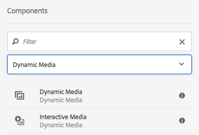
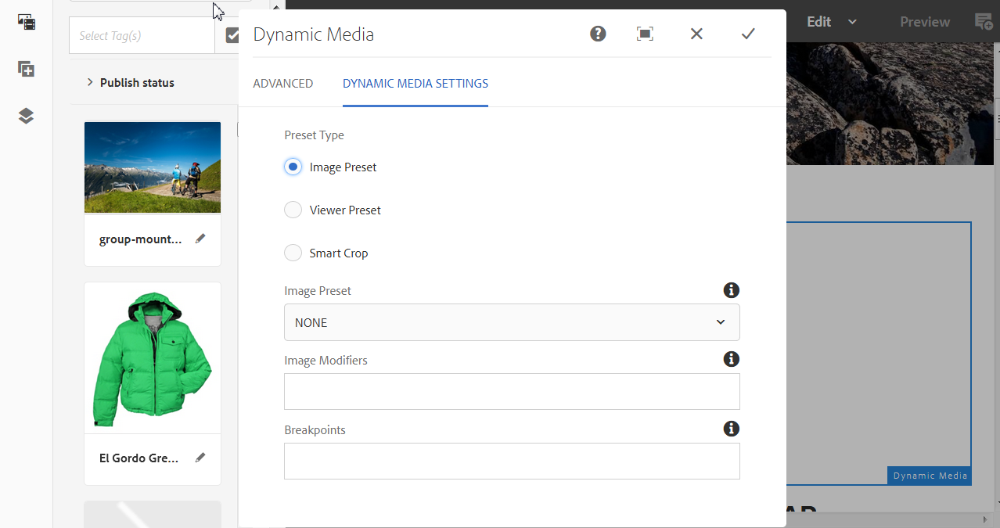
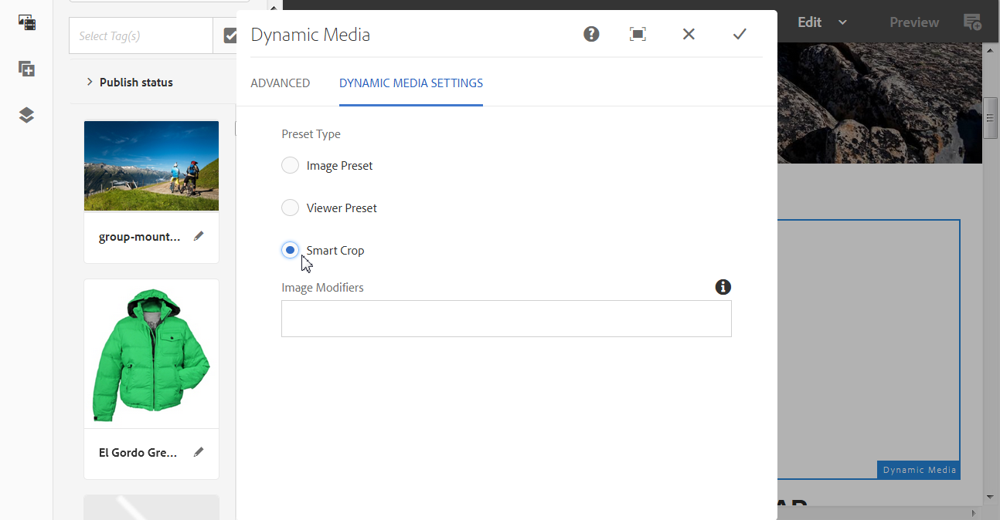
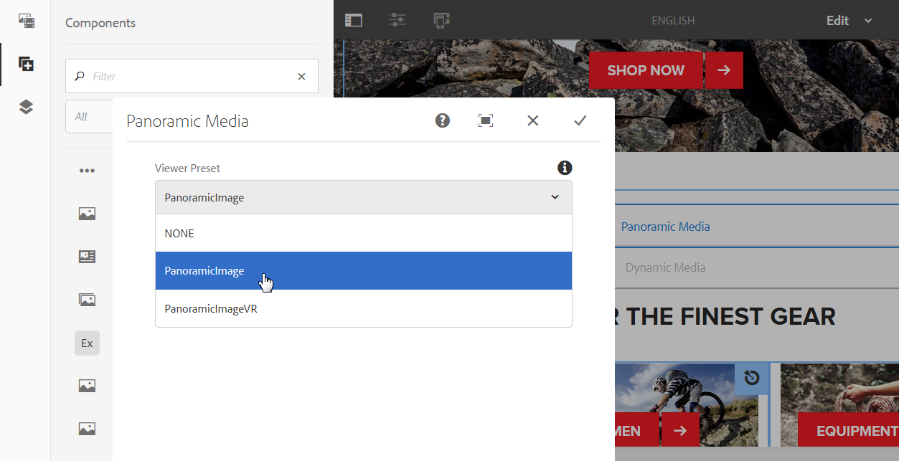

# Lägga till Dynamic Media-resurser på sidor {#adding-dynamic-media-assets-to-pages}

To add the dynamic media functionality to assets you use on your websites, you can add the **Dynamic Media** or **Interactive Media** component directly on the page. Det gör du genom att öppna layoutläget och aktivera de dynamiska mediekomponenterna. Sedan kan du lägga till komponenterna på sidan och lägga till resurser i komponenterna. Komponenterna för dynamiska media och interaktiva media är smarta - de vet om du lägger till en bild eller en video och de tillgängliga alternativen ändras i enlighet med detta.

Du lägger till dynamiska medieresurser direkt på sidan om du använder AEM som WCM. Om ni använder en annan leverantör för innehållshanteringssystemet kan ni antingen [länka](linking-urls-to-yourwebapplication.md) eller [bädda in](embed-code.md) resurserna. Om du har en responsiv webbplats hos en extern leverantör läser du [Leverera optimerade bilder till en responsiv webbplats](responsive-site.md).

>[!NOTE]
>
>Du måste publicera resurser innan du lägger till dem på sidor i AEM. See [Publishing Dynamic Media Assets](publishing-dynamicmedia-assets.md).

## Lägga till en Dynamic Media-komponent på en sida {#adding-a-dynamic-media-component-to-a-page}

Att lägga till en Dynamic Media-komponent på en sida är detsamma som att lägga till en komponent på en sida. Komponenterna för dynamiska media beskrivs i detalj i följande avsnitt.

>[!NOTE]
>
>Om det finns en Dynamic Media-komponent på en webbsida som en användare med skrivskyddad behörighet kommer åt, bryts sidan och komponenterna återges inte korrekt. Orsaken är att sidan har rekonstruerats för att komponenterna ska bli bra och att alla refererade resurser och konfigurationer är tillgängliga. Sidan återges sedan igen så att komponenterna bryts. respektive komponentkod på sidan kan inte återges på nytt på grund av användarens skrivskyddade åtkomst.
>  
>Undvik problemet genom att se till att AEM Sites-användare har de behörigheter som krävs för att få tillgång till resurserna.

1. Öppna sidan där du vill lägga till komponenten Dynamic Media i AEM.
1. Klicka på **[!UICONTROL Components]** ikonen i panelen till vänster på sidan (du kan behöva växla visningen av sidopanelen).
1. Välj under rubriken **[!UICONTROL Components]** i listrutan **[!UICONTROL Dynamic Media]**. Om det inte finns någon lista över dynamiska mediakomponenter behöver du troligen aktivera de dynamiska mediakomponenter som du vill använda. Se [Aktivera komponenter](#enabling-dynamic-media-components)för dynamiska media.

   

1. Dra en Dynamic Media-komponent som du vill använda till sidan på önskad plats.
1. Håll muspekaren direkt på komponenten. När komponenten är omgiven av en blå ruta trycker du en gång för att visa komponentens verktygsfält. Tryck på ikonen **[!UICONTROL Configuration]** (skiftnyckel).
1. [Redigera komponenterna](#dynamic-media-components) efter behov och klicka på bockmarkeringen för att spara ändringarna.
1. 

### Aktivera komponenter för dynamiska media {#enabling-dynamic-media-components}

Om det inte finns några tillgängliga Dynamic Media-komponenter att lägga till på en sida betyder det troligen att du först måste aktivera de komponenter som du vill använda.

1. Öppna sidan där du vill lägga till komponenten Dynamic Media i AEM.
1. Tryck på ikonen Sidinformation till vänster i verktygsfältet längst upp på sidan och tryck sedan på **[!UICONTROL Edit Template]** listrutan.

   

1. Tryck på i listrutan till höger om verktygsfältet uppe på sidan **[!UICONTROL Structure]**.

   

1. Långt ned på sidan: tryck **[!UICONTROL Layout Container]** för att öppna verktygsfältet och sedan på ikonen Policy.
1. Kontrollera att fliken är markerad under rubriken på **[!UICONTROL Layout Container]** sidan, under **[!UICONTROL Properties]** rubriken **[!UICONTROL Allowed Components]** .

   

1. Rulla tills du ser **[!UICONTROL Dynamic Media]**.
1. Tryck på ikonen > till vänster om för **[!UICONTROL Dynamic Media]** att utöka listan och välj de dynamiska mediakomponenter som du vill aktivera.

   

1. I närheten av det övre högra hörnet på **[!UICONTROL Layout Container]** sidan trycker du på ikonen Klar (bock).

1. Till höger om verktygsfältet uppe på sidan trycker du på **[!UICONTROL Initial Content]** i listrutan och [lägger sedan till en Dynamic Media-komponent på en sida](#adding-a-dynamic-media-component-to-a-page) som vanligt.

## Lokalisera komponenter för dynamiska media {#localizing-dynamic-media-components}

Du kan lokalisera komponenter för dynamiska media på ett av två sätt:

* Från en webbsida i Sites öppnar du **[!UICONTROL Properties]** och väljer fliken **[!UICONTROL Advanced]**. Välj språk för lokalisering.

   

* Välj önskad sida eller sidgrupp i platsväljaren. Tryck **[!UICONTROL Properties]** och välj **[!UICONTROL Advanced]** fliken. Välj språk för lokalisering.

   >[!NOTE]
   >
   >Observera att inte alla språk som är tillgängliga på **[!UICONTROL Language]** menyn har tilldelade variabler.

## Dynamiska mediakomponenter {#dynamic-media-components}

Dynamiska media och interaktiva media finns under [!UICONTROL Dynamic Media] fliken i [!UICONTROL Components]. Du använder komponenten Interactive Media] för interaktiva resurser som interaktiv video, interaktiva bilder eller karuselluppsättningar. Använd komponenten Dynamic Media för alla andra dynamiska mediekomponenter.

>[!NOTE]
>
>De här komponenterna är inte tillgängliga som standard och måste göras tillgängliga via mallredigeraren innan du använder dem. [När de har gjorts tillgängliga](/help/sites-authoring/templates.md#editing-templates-template-authors)i mallredigeraren kan du lägga till komponenterna på sidan på samma sätt som andra AEM-komponenter.

### Dynamic Media-komponent {#dynamic-media-component}

Komponenten Dynamic Media är smart - beroende på om du lägger till en bild eller en video finns det olika alternativ. Komponenten har stöd för bildförinställningar, bildbaserade visningsprogram som bilduppsättningar, snurra, blandade medieuppsättningar och video. Dessutom är visningsprogrammet responsivt. Skärmstorleken ändras alltså automatiskt baserat på skärmstorleken. Alla visningsprogram är HTML5-visningsprogram.

>[!NOTE]
>
>Om det finns en Dynamic Media-komponent, en Interactive Media-komponent eller både och på en webbsida som en användare med skrivskyddad behörighet har åtkomst till, bryts sidan och komponenterna återges inte korrekt. Orsaken är att sidan har rekonstruerats för att komponenterna ska bli bra och att alla refererade resurser och konfigurationer är tillgängliga. Sidan återges sedan igen så att komponenterna bryts. respektive komponentkod på sidan kan inte återges på nytt på grund av användarens skrivskyddade åtkomst.
>  
>Undvik problemet genom att se till att AEM Sites-användare har de behörigheter som krävs för att få tillgång till resurserna.

>[!NOTE]
>
>När du lägger till komponenten Dynamic Media och **[!UICONTROL Dynamic Media Settings]** är tom eller du inte kan lägga till en resurs på rätt sätt ska du kontrollera följande:
>
>* Du har [aktiverat Dynamic Media](config-dynamic.md). Dynamiska media är inaktiverat som standard.
>* Bilden har en pyramidformad fil. Bilder som importerats innan dynamiska medier har aktiverats har ingen pyramiddiff-fil.
>

#### När du arbetar med bilder {#when-working-with-images}

Med komponenten Dynamic Media kan du lägga till dynamiska bilder, inklusive bilduppsättningar, snurpuppsättningar och blandade medieuppsättningar. Du kan zooma in, zooma ut och, om tillämpligt, vrida en bild i en snurra eller välja en bild från en annan typ av uppsättning.

Du kan också konfigurera visningsförinställningen, bildförinställningen eller bildformatet direkt i komponenten. Om du vill göra en bild responsiv kan du antingen ange brytpunkter eller använda en responsiv bildförinställning.

Du måste redigera följande dynamiska mediainställningar genom att klicka på **[!UICONTROL Edit]** -ikonen i komponenten och sedan **[!UICONTROL Dynamic Media Settings]**.

>[!NOTE]
>
>Som standard är Dynamic Media-bildkomponenten adaptiv. If you want to make it a fixed size, set it in the component in the **[!UICONTROL Advanced]** tab with the **[!UICONTROL Width]** and **[!UICONTROL Height]** settings.

* **[!UICONTROL Viewer preset]**
Välj en befintlig visningsförinställning i listrutan. Om den visningsförinställning som du söker efter inte visas kan du behöva göra den synlig. Se Hantera förinställningar för visningsprogram. Du kan inte välja en visningsförinställning om du använder en bildförinställning och vice versa.
Det här är det enda tillgängliga alternativet om du visar bilduppsättningar, snurruppsättningar eller blandade medieuppsättningar. De visningsförinställningar som visas är också smarta - endast relevanta visningsprogramförinställningar visas.

* **[!UICONTROL Viewer modifiers]**
Visningsmodifierare har formen av namn=värde-par med en &amp;-avgränsare och du kan ändra visningsprogram enligt riktlinjerna i referenshandboken för visningsprogram. Ett exempel på en visningsmodifierare är posterimage=img.jpg&amp;caption=text.vtt,1 som ställer in en annan bild för videominiatyrbilden och associerar en undertextfil med videon.

* **[!UICONTROL Image preset]**
Välj en befintlig bildförinställning i listrutan. Om den bildförinställning du söker inte syns kan du behöva göra den synlig. Se Hantera bildförinställningar. Du kan inte välja en visningsförinställning om du använder en bildförinställning och vice versa.
Det här alternativet är inte tillgängligt om du visar bilduppsättningar, snurruppsättningar eller blandade medieuppsättningar.

* **[!UICONTROL Image Modifiers]**
Du kan använda bildeffekter genom att ange ytterligare bildkommandon. Dessa beskrivs i Bildförinställningar och i Referens för bildserverkommando.
Det här alternativet är inte tillgängligt om du visar bilduppsättningar, snurruppsättningar eller blandade medieuppsättningar.

* **[!UICONTROL Breakpoints]**
Om du använder resursen på en responsiv webbplats måste du lägga till bildbrytpunkterna. Bildbrytpunkter måste avgränsas med kommatecken (,). Det här alternativet fungerar när ingen höjd eller bredd har definierats i en bildförinställning.
Det här alternativet är inte tillgängligt om du visar bilduppsättningar, snurruppsättningar eller blandade medieuppsättningar.
You can edit the following Advanced Settings by clicking **[!UICONTROL Edit]** in the component.

* **[!UICONTROL Title]**
Ändra bildens titel.

* **[!UICONTROL Alt Text]**
Lägg till en titel i bilden för de användare som har inaktiverat grafik.
Det här alternativet är inte tillgängligt om du visar bilduppsättningar, snurruppsättningar eller blandade medieuppsättningar.

* **[!UICONTROL URL, Open in]**
Du kan ställa in en resurs för att öppna en länk. Ange URL:en och Öppna i anger om du vill att den ska öppnas i samma fönster eller i ett nytt fönster.
Det här alternativet är inte tillgängligt om du visar bilduppsättningar, snurruppsättningar eller blandade medieuppsättningar.

* **[!UICONTROL Width]** och **[!UICONTROL Height]** ange värdet i pixlar om du vill att bilden ska ha en fast storlek. Om du lämnar dessa värden tomma anpassas resursen.

#### När du arbetar med video {#when-working-with-video}

Använd komponenten Dynamic Media för att lägga till dynamisk video på dina webbsidor. När du redigerar komponenten kan du välja att använda en fördefinierad videovisningsförinställning för att spela upp videon på sidan.

Du måste redigera följande dynamiska mediainställningar genom att klicka **[!UICONTROL Edit]** i komponenten.

>[!NOTE]
>
>Som standard är videokomponenten för dynamiska media adaptiv. If you want to make it a fixed size, set it in the component with the **[!UICONTROL Width]** and **[!UICONTROL Height]** in the [!UICONTROL Advanced] tab.

* **[!UICONTROL Viewer preset]**
Välj en befintlig förinställning för visningsprogrammet för video i listrutan. Om den visningsförinställning som du söker efter inte visas kan du behöva göra den synlig. Se Hantera förinställningar för visningsprogram.

* **[!UICONTROL Viewer modifiers]**
Visningsmodifierare har formen av namn=värde-par med en &amp;-avgränsare och du kan ändra visningsprogram enligt riktlinjerna i referenshandboken för Adobe Viewer. Ett exempel på en visningsmodifierare är posterimage=img.jpg&amp;caption=text.vtt,1

   Med visningsmodifierare kan du till exempel göra följande:

   * Associera en bildtextfil med en video [https://marketing.adobe.com/resources/help/en_US/s7/viewers_ref/r_html5_video_viewer_url_caption.html](https://marketing.adobe.com/resources/help/en_US/s7/viewers_ref/r_html5_video_viewer_url_caption.html)
   * Associera en navigeringsfil med en video [https://marketing.adobe.com/resources/help/en_US/s7/viewers_ref/r_html5_video_viewer_url_navigation.html](https://marketing.adobe.com/resources/help/en_US/s7/viewers_ref/r_html5_video_viewer_url_navigation.html)

Du kan redigera följande [!UICONTROL Advanced Settings] genom att klicka **[!UICONTROL Edit]** i komponenten.

* **[!UICONTROL Title]**
Ändra videons titel.

* **[!UICONTROL Width]** och **[!UICONTROL Height]** ange värdet i pixlar om du vill att videon ska ha en fast storlek. Om du lämnar dessa värden tomma blir de anpassningsbara.

#### När du arbetar med smart beskärning {#when-working-with-smart-crop}

Använd komponenten Dynamic Media för att lägga till bildresurser för smart beskärning på dina webbsidor. När du redigerar komponenten kan du välja att använda en fördefinierad videovisningsförinställning för att spela upp videon på sidan.

Se även [Bildprofiler](image-profiles.md).

Du kan redigera följande [!UICONTROL Dynamic Media Settings] genom att klicka **[!UICONTROL Edit]** i komponenten.

>[!NOTE]
>
>Som standard är Dynamic Media-bildkomponenten adaptiv. Om du vill att den ska ha en fast storlek anger du det i komponenten på fliken [!UICONTROL Advanced] med **[!UICONTROL Width]** och **[!UICONTROL Height]**.

* **[!UICONTROL Image Modifiers]**
Du kan använda bildeffekter genom att ange ytterligare bildkommandon. Dessa beskrivs i Bildförinställningar och i Referens för bildserverkommando.
Det här alternativet är inte tillgängligt om du visar bilduppsättningar, snurruppsättningar eller blandade medieuppsättningar.

You can edit the following **[!UICONTROL Advanced]** settings by clicking **[!UICONTROL Edit]** in the component.

* **[!UICONTROL Title]**
Ändra titeln på bilden för smart beskärning.

* **[!UICONTROL Alt Text]**
Lägg till en titel i den smarta beskärningsbilden för de användare som har inaktiverat grafik.
Det här alternativet är inte tillgängligt om du visar bilduppsättningar, snurruppsättningar eller blandade medieuppsättningar.

* **[!UICONTROL URL, Open in]**
Du kan ställa in en resurs för att öppna en länk. Ange URL:en och Öppna i anger om du vill att den ska öppnas i samma fönster eller i ett nytt fönster.
Det här alternativet är inte tillgängligt om du visar bilduppsättningar, snurruppsättningar eller blandade medieuppsättningar.

* **[!UICONTROL Höjd** och **[!UICONTROL Width]** Ange värde i pixlar om du vill att den smarta beskärningsbilden ska ha en fast storlek. Om du lämnar dessa värden tomma blir de anpassningsbara.

### Interaktiv mediekomponent {#interactive-media-component}

Komponenten Interactive Media är till för de resurser som har interaktivitet i dem, till exempel hotspot-områden eller bildscheman. Om du har en interaktiv bild, interaktiv video eller karusellbanderoll använder du komponenten Interactive Media.

Komponenten Interactive Media är smart - beroende på om du lägger till en bild eller en video finns det olika alternativ. Dessutom är visningsprogrammet responsivt - skärmstorleken ändras automatiskt baserat på skärmstorleken. Alla visningsprogram är HTML5-visningsprogram.

>[!NOTE]
>
>Om det finns en Dynamic Media-komponent, en Interactive Media-komponent eller både och på en webbsida som en användare med skrivskyddad behörighet har åtkomst till, bryts sidan och komponenterna återges inte korrekt. Orsaken är att sidan har rekonstruerats för att komponenterna ska bli bra och att alla refererade resurser och konfigurationer är tillgängliga. Sidan återges sedan igen så att komponenterna bryts. respektive komponentkod på sidan kan inte återges på nytt på grund av användarens skrivskyddade åtkomst.
> 
>Undvik problemet genom att se till att AEM Sites-användare har de behörigheter som krävs för att få tillgång till resurserna.

You can edit the following **[!UICONTROL General]** settings by clicking **[!UICONTROL Edit]** in the component.

* **[!UICONTROL Viewer preset]**
Välj en befintlig visningsförinställning i listrutan. Om den visningsförinställning som du söker efter inte visas kan du behöva göra den synlig. Förinställningar för visningsprogram måste publiceras innan de kan användas. Se Hantera förinställningar för visningsprogram.

* **[!UICONTROL Title]**
Ändra videons titel.

* **[!UICONTROL Width]** och **[!UICONTROL Height]** ange värdet i pixlar om du vill att videon ska ha en fast storlek. Om du lämnar dessa värden tomma blir de anpassningsbara.

You can edit the following **[!UICONTROL Add To Cart]** settings by clicking **[!UICONTROL Edit]** in the component.

* **[!UICONTROL Show Product Asset]**
Som standard är det här värdet markerat. Produktresursen visar en bild av produkten enligt definitionen i modulen Handel. Avmarkera kryssrutan om du inte vill visa produktresursen.

* **[!UICONTROL Show Product Price]**
Som standard är det här värdet markerat. Produktpriset visar priset för artikeln enligt definitionen i modulen Handel. Avmarkera kryssrutan om du inte vill visa produktpriset.

* **[!UICONTROL Show Product Form]**
Som standard är det här värdet inte markerat. Produktformuläret innehåller alla produktvarianter som storlek och färg. Avmarkera kryssrutan om du inte vill visa produktvarianterna.

### Panoramakomponenten Media {#panoramic-media-component}

Komponenten för panoramamedia är avsedd för resurser som är sfäriska panoramabilder. Sådana bilder ger en 360-gradig visningsupplevelse av ett rum, en egenskap, en plats eller ett landskap. För att en bild ska kvalificeras som ett sfäriskt panorama måste den ha antingen ett ELLER båda av följande:

* Proportionerna 2:1.
* Taggad med nyckelorden &quot;ekvirektangulär&quot; eller (&quot;sfärisk&quot; + &quot;panorama&quot;) eller (&quot;sfärisk&quot; + &quot;panoramabild&quot;). Se [Använda taggar](/help/sites-authoring/tags.md).

Både proportioner och nyckelordskriterier gäller för panoramaresurser för sidan med resursinformation och WCM-komponenten &quot;Panoramic Media&quot;.

Du kan redigera följande inställning genom att trycka på **[!UICONTROL Configure]** i komponenten.

* **[!UICONTROL Viewer Preset]**
Välj ett befintligt visningsprogram på den nedrullningsbara menyn Visningsförinställning.

Om den visningsförinställning du söker efter inte visas kontrollerar du att den är publicerad. Du måste publicera förinställningarna för visningsprogrammet innan du kan använda dem. Se [Hantera visningsförinställningar](managing-viewer-presets.md).

### Använda HTTP/2 för att leverera Dynamic Media-resurser {#using-http-to-delivery-dynamic-media-assets}

HTTP/2 är det nya, uppdaterade webbprotokollet som förbättrar kommunikationen mellan webbläsare och servrar. Det ger snabbare överföring av information och minskar mängden processorkraft som behövs. Dynamic Media-material kan nu levereras via HTTP/2 vilket ger bättre respons och laddningstider.

Se [HTTP2 Delivery of Content](http2.md) för fullständig information om hur du kommer igång med HTTP/2 med ditt Dynamic Media-konto.

>[!MORELIKETHIS]
>
>* [Färghantering med AEM Dynamic Media](https://helpx.adobe.com/experience-manager/kt/assets/using/dynamic-media-color-management-technical-video-setup.html)
>* [Använda anpassade videominiatyrer med AEM Dynamic Media](https://helpx.adobe.com/experience-manager/kt/assets/using/dynamic-media-video-thumbnails-feature-video-use.html)
>* [Så här fungerar resursvisningsprogrammet med AEM Dynamic Media](https://helpx.adobe.com/experience-manager/kt/assets/using/dynamic-media-viewer-feature-video-understand.html)
>* [Använda interaktiv video med AEM Dynamic Media](https://helpx.adobe.com/experience-manager/kt/assets/using/dynamic-media-interactive-video-feature-video-use.html)
>* [Använda videospelaren i AEM Dynamic Media](https://helpx.adobe.com/experience-manager/kt/assets/using/dynamic-media-video-player-feature-video-use.html)
>* [Använda bildskärpa med AEM Dynamic Media](https://helpx.adobe.com/experience-manager/6-4/assets/using/best-practices-for-optimizing-the-quality-of-your-images.html)

