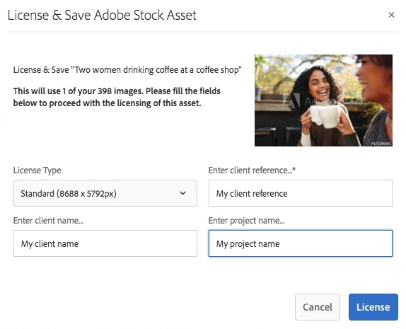

# Använd [!DNL Adobe Stock] resurser i [!DNL Adobe Experience Manager Assets] {#use-adobe-stock-assets-in-aem-assets}

>[!CAUTION]
>
>AEM 6.4 har nått slutet på den utökade supporten och denna dokumentation är inte längre uppdaterad. Mer information finns i [teknisk supportperiod](https://helpx.adobe.com/support/programs/eol-matrix.html). Hitta de versioner som stöds [här](https://experienceleague.adobe.com/docs/).

Organisationer kan integrera sina [!DNL Adobe Stock] företagsplan med [!DNL Experience Manager Assets] för att säkerställa att licensierade mediefiler finns tillgängliga i stor omfattning för kreativa projekt och marknadsföringsprojekt, med de kraftfulla filhanteringsfunktionerna i [!DNL Experience Manager].

[!DNL Adobe Stock] ger designers och företag tillgång till miljontals utvalda och royaltyfria foton, vektorer, illustrationer, videor, mallar och 3D-resurser av hög kvalitet för alla kreativa projekt. [!DNL Experience Manager] -användare snabbt kan hitta, förhandsgranska och licensiera [!DNL Adobe Stock] resurser som har sparats i [!DNL Experience Manager], utan att lämna [!DNL Experience Manager] gränssnitt.

## Förutsättningar {#prerequisites}

Integreringen kräver en [Enterprise Adobe Stock-plan](https://stockenterprise.adobe.com/) och [!DNL Experience Manager] 6.4 med minst Service Pack 2 distribuerat. För [!DNL Experience Manager] 6.4 service pack details, see these [versionsinformation](/help/release-notes/sp-release-notes.md).

## Integrera [!DNL Experience Manager] och [!DNL Adobe Stock] {#integrate-aem-and-adobe-stock}

För att tillåta kommunikation mellan [!DNL Experience Manager] och [!DNL Adobe Stock], skapa en IMS-konfiguration och [!DNL Adobe Stock] konfiguration i [!DNL Experience Manager].

>[!NOTE]
>
>Endast [!DNL Experience Manager] administratörer och [!DNL Admin Console] administratörer för en organisation kan utföra integreringen eftersom den kräver administratörsbehörighet.

### Skapa en IMS-konfiguration {#create-an-ims-configuration}

1. I [!DNL Experience Manager] användargränssnitt, navigera till **[!UICONTROL Tools]** > **[!UICONTROL Security]** > **[!UICONTROL Adobe IMS Configurations]**. Klicka på **[!UICONTROL Create]** och välj **[!UICONTROL Cloud Solution]** > **[!UICONTROL Adobe Stock]**.
1. Återanvänd ett befintligt certifikat eller välj **[!UICONTROL Create new certificate]**.
1. Klicka på **[!UICONTROL Create certificate]**. Ladda ned den offentliga nyckeln när du har skapat den. Klicka på **[!UICONTROL Next]**. Lämna [!UICONTROL Adobe IMS Technical Account Configuration] visas för att ange de värden som krävs inom kort.
1. Åtkomst [Adobe Developer Console](https://console.adobe.io). Se till att ditt konto har administratörsbehörighet för organisationen som integreringen krävs för.
1. Klicka **[!UICONTROL Create new project]** och klicka **[!UICONTROL Add API]**. Välj **[!UICONTROL Adobe Stock]** från listan med API:er som är tillgängliga för dig. Välj [!UICONTROL OAUTH 2.0 Web].
1. Ange **[!UICONTROL Default redirect URI]** och **[!UICONTROL Redirect URI pattern]** värden. Klicka på **[!UICONTROL Save configured API]**. Kopiera genererat ID och hemlighet.
1. I [!UICONTROL Adobe IMS Technical Account Configuration] ska du ange värdena i rutorna med rubriken **[!UICONTROL Title]**, **[!UICONTROL Authorization Server]**, **[!UICONTROL API Key]**, **[!UICONTROL Client Secret]** och **[!UICONTROL Payload]**. Mer information om dessa värden finns i [Snabbstart för JWT-autentisering](https://www.adobe.io/authentication/auth-methods.html#!AdobeDocs/adobeio-auth/master/JWT/JWT.md).

<!-- TBD: Update the URL when the new URL is available. Logged issue github.com/AdobeDocs/adobeio-auth/issues/63.
-->

### Skapa [!DNL Adobe Stock] konfiguration i [!DNL Experience Manager] {#create-adobe-stock-configuration-in-aem}

1. I [!DNL Experience Manager] användargränssnitt, navigera till **[!UICONTROL Tools]** > **[!UICONTROL Cloud Services]** > **[!UICONTROL Adobe Stock]**.
1. Klicka **[!UICONTROL Create]** för att skapa en konfiguration och koppla den till din befintliga IMS-konfiguration. Välj `PROD` som parametern environment.
1. I **[!UICONTROL Licensed Assets Path]** lämnar du platsen som den är. Ändra inte platsen där du vill lagra [!DNL Adobe Stock] resurser.
1. Skapa genom att lägga till alla nödvändiga egenskaper. Klicka på **[!UICONTROL Save & Close]**.
1. Lägg till [!DNL Experience Manager] användare eller grupper, som kan licensiera mediefilerna.

>[!NOTE]
>
>Om det finns flera [!DNL Adobe Stock] -konfigurationer väljer du önskad konfiguration på panelen Användarinställningar (**[!UICONTROL AEM]** > **[!UICONTROL User Icon]** > **[!UICONTROL User Preferences]** > **[!UICONTROL Stock Configuration]**).

## Använd och hantera [!DNL Adobe Stock] resurser i [!DNL Experience Manager] {#usemanage}

Med den här funktionen kan organisationer låta användarna arbeta med [!DNL Adobe Stock] resurser i [!DNL Experience Manager Assets]. Från [!DNL Experience Manager] användargränssnitt, användare kan söka [!DNL Adobe Stock] resurser och licensiera de nödvändiga resurserna.

En gång en [!DNL Adobe Stock] mediefilen är licensierad i [!DNL Experience Manager]kan den användas och hanteras som en vanlig resurs. I [!DNL Experience Manager], kan användarna söka efter och förhandsgranska resurserna, kopiera och publicera tillgångarna, dela tillgångarna på [!DNL Brand Portal]; åtkomst till och användning av resurser via [!DNL Experience Manager] datorprogram, och så vidare.

*Bild: Sök efter [!DNL Adobe Stock] resurser och filtrera resultat från [!DNL Experience Manager] gränssnitt.*

**A.**[!DNL Adobe Stock] Sök efter resurser som liknar de resurser vars ID har angetts. **B.** Sök efter resurser som matchar ditt val av form eller orientering. **C.** Sök efter en eller flera resurstyper som stöds **D.** Öppna eller komprimera filterrutan **E.** Licensiera och spara den valda resursen i [!DNL Experience Manager] **F.** Spara resursen i [!DNL Experience Manager] med vattenstämpel **G.** Utforska resurser på [!DNL Adobe Stock] webbplatsen som liknar den valda resursen **H.** Visa markerade resurser på [!DNL Adobe Stock] webbplats **Jag.** Antal valda resurser från sökresultaten **J.** Växla mellan kortvyn och listvyn

### Hitta resurser {#find-assets}

Dina [!DNL Experience Manager] -användare kan söka efter resurser i båda, [!DNL Experience Manager] och [!DNL Adobe Stock]. När sökplatsen inte är begränsad till [!DNL Adobe Stock], sökresultaten från [!DNL Experience Manager] och [!DNL Adobe Stock] visas.

* Sök efter [!DNL Adobe Stock] resurser, klicka på **[!UICONTROL Navigation]** > **[!UICONTROL Assets]** > **[!UICONTROL Search Adobe Stock]**.

* Söka efter resurser i [!DNL Adobe Stock] och [!DNL Experience Manager Assets]klickar du på Sök .

Du kan också börja skriva `Location: Adobe Stock` i sökfältet för att markera [!DNL Adobe Stock] resurser. [!DNL Experience Manager] har avancerade filtreringsfunktioner för de sökbara resurserna, vilket gör att användarna snabbt kan nollställa de resurser som behövs med hjälp av filter, som typer av resurser som stöds, bildorientering och licensierat läge.

>[!NOTE]
>
>Resurser som sökts från [!DNL Adobe Stock] visas bara i [!DNL Experience Manager]. [!DNL Adobe Stock] resurser hämtas och lagras i [!DNL Experience Manager] endast efter att en användare antingen [sparar en resurs](/help/assets/aem-assets-adobe-stock.md#saveassets) eller [licensierar och sparar en resurs](/help/assets/aem-assets-adobe-stock.md#licenseassets). Resurser som redan är lagrade i [!DNL Experience Manager] visas och markeras för att underlätta referens och åtkomst. Dessutom [!DNL Stock] resurser sparas med ytterligare metadata som anger källan som [!DNL Stock].

*Bild: Sök filter i [!DNL Experience Manager] och markerade [!DNL Adobe Stock] resurser i sökresultat.*

### Spara och visa nödvändiga resurser {#saveassets}

Välj en resurs som du vill spara i [!DNL Experience Manager]. Klicka [!UICONTROL Save] i verktygsfältet högst upp och ange resursens namn och plats. De olicensierade resurserna sparas lokalt med en vattenstämpel.

Nästa gång du söker efter resurser markeras de sparade resurserna med ett märke som anger att sådana resurser är tillgängliga i [!DNL Experience Manager Assets].

>[!NOTE]
>
>De nyligen tillagda resurserna visas med märket Nytt i stället för Licensierad.

### Licensiera resurser {#licenseassets}

Användare kan licensiera [!DNL Adobe Stock] tillgångar genom att använda sin kvot [!DNL Adobe Stock] företagsplan. När du licensierar en mediefil sparas den utan vattenstämpel och är tillgänglig för sökning och användning i [!DNL Experience Manager Assets].

*Bild: Dialog där du kan licensiera och spara [!DNL Adobe Stock] resurser i [!DNL Experience Manager Assets].*

### Få åtkomst till metadata och resursegenskaper {#access-metadata-and-asset-properties}

Användarna kan komma åt och förhandsgranska metadata, inklusive [!DNL Adobe Stock] metadataegenskaper för resurser som sparats i [!DNL Experience Manager]och lägga till **[!UICONTROL License References]** för en tillgång. Uppdateringarna av licensreferensen synkroniseras dock inte mellan [!DNL Experience Manager] och [!DNL Adobe Stock] webbplats.

Användarna kan se egenskaperna för både, licensierade och olicensierade resurser.

*Bild: Visa och öppna metadata och licensreferenser för sparade resurser.*

## Kända begränsningar {#known-limitations}

* **Varning om redigeringsbild visas inte**: När du licensierar en bild kan du inte kontrollera om en bild endast är för redaktionellt bruk. För att förhindra eventuell felaktig användning kan administratören stänga av åtkomsten till redaktionella mediefiler från Admin Console.

* **Fel licenstyp visas**: Det är möjligt att en felaktig licenstyp visas i [!DNL Experience Manager] för en tillgång. Användarna kan logga in på [!DNL Adobe Stock] webbplats för att se licenstypen.

* **Referensfält och metadata synkroniseras inte**: När en användare uppdaterar ett licensreferensfält uppdateras licensreferensinformationen i [!DNL Experience Manager] men inte på [!DNL Adobe Stock] webbplats. Om användaren uppdaterar referensfälten på [!DNL Adobe Stock] på webbplatsen synkroniseras inte uppdateringarna i [!DNL Experience Manager].

>[!MORELIKETHIS]
>
>* [Videosjälvstudiekurs om hur du använder [!DNL Adobe Stock] resurser med [!DNL Experience Manager Assets]](https://experienceleague.adobe.com/docs/experience-manager-learn/assets/creative-workflows/adobe-stock.html)
>* [[!DNL Adobe Stock] hjälp med Enterprise Plan](https://helpx.adobe.com/enterprise/admin-guide.html/enterprise/using/adobe-stock-enterprise.ug.html)
>* [[!DNL Adobe Stock] Vanliga frågor](https://helpx.adobe.com/stock/faq.html)

