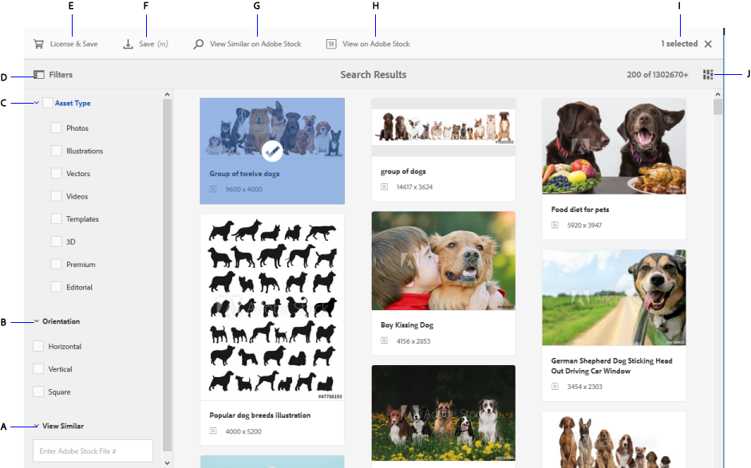

# Use Adobe Stock assets in AEM Assets {#use-adobe-stock-assets-in-aem-assets}

Organisationer kan integrera sin Adobe Stock Enterprise-plan med AEM Assets för att se till att licensierade mediefiler finns tillgängliga i stor omfattning för kreativa projekt och marknadsföringsprojekt, med de kraftfulla mediehanteringsfunktionerna i AEM.

Adobe Stock ger designers och företag tillgång till miljontals utvalda och royaltyfria foton, vektorer, illustrationer, videor, mallar och 3D-resurser av hög kvalitet för alla kreativa projekt. AEM-användare kan snabbt hitta, förhandsgranska och licensiera Adobe Stock-mediefiler som har sparats i AEM, utan att behöva lämna AEM-arbetsytan.

## Förutsättningar {#prerequisites}

Integreringen kräver en Adobe Stock-plan [för](https://stockenterprise.adobe.com/) företag och AEM 6.4 med minst Service Pack 2. Information om AEM 6.4-Service Pack finns i [versionsinformationen](/help/release-notes/sp-release-notes.md).

## Integrera AEM och Adobe Stock {#integrate-aem-and-adobe-stock}

Om du vill tillåta kommunikation mellan AEM och Adobe Stock skapar du en IMS-konfiguration och en Adobe Stock-konfiguration i AEM.

>[!NOTE]
>
>Endast AEM-administratörer och Admin Console-administratörer för en organisation kan utföra integreringen eftersom den kräver administratörsbehörighet.

### Create an IMS configuration {#create-an-ims-configuration}

1. Klicka på AEM-logotypen. Navigera till **[!UICONTROL Tools]** > **[!UICONTROL Security]** > **[!UICONTROL Adobe IMS Configurations]**. Klicka på **[!UICONTROL Create]** och välj **[!UICONTROL Cloud Solution]** > **[!UICONTROL Adobe Stock]**.
1. Återanvänd ett befintligt certifikat eller välj **[!UICONTROL Create new certificate]**.
1. Klicka på **[!UICONTROL Create certificate]**. Ladda ned den offentliga nyckeln när du har skapat den. Klicka på **[!UICONTROL Next]**.
1. Ange lämpliga värden i fälten **[!UICONTROL Title]**, **[!UICONTROL Authorization Server]**, **[!UICONTROL API Key]**, **[!UICONTROL Client Secret]** och **[!UICONTROL Payload]**. Avsnittet [Snabbstart för JWT-autentisering](https://www.adobe.io/authentication/auth-methods.html#!AdobeDocs/adobeio-auth/master/JWT/JWT.md) innehåller detaljerad information om hur du hämtar dessa värden från Adobe I/O.
1. Lägg till den nedladdade publika nyckeln till ditt Adobe I/O-tjänstkonto.

<!-- TBD: Update the URL when the new URL is available. Logged issue github.com/AdobeDocs/adobeio-auth/issues/63.
-->

### Skapa Adobe Stock-konfiguration i AEM {#create-adobe-stock-configuration-in-aem}

1. In AEM user interface, navigate to **[!UICONTROL Tools]** > **[!UICONTROL Cloud Services]** > **[!UICONTROL Adobe Stock]**.
1. Klicka **[!UICONTROL Create]** för att skapa en konfiguration och koppla den till din befintliga IMS-konfiguration. Välj `PROD` som miljöparameter.
1. I **[!UICONTROL Licensed Assets Path]** fältet låter du platsen vara som den är. Ändra inte den plats där du vill lagra Adobe Stock-mediefiler.
1. Skapa genom att lägga till alla nödvändiga egenskaper. Klicka på **[!UICONTROL Save & Close]**.
1. Lägg till AEM-användare eller -grupper som kan licensiera mediefilerna.

>[!NOTE]
>
>Om det finns flera Adobe Stock-konfigurationer markerar du den önskade konfigurationen på panelen Användarinställningar (**[!UICONTROL AEM]** > **[!UICONTROL User Icon]** > **[!UICONTROL User Preferences]** > **[!UICONTROL Stock Configuration]**).

## Använda och hantera Adobe Stock-mediefiler i AEM {#use-and-manage-adobe-stock-assets-in-aem}

Med den här funktionen kan organisationer tillåta användare att arbeta med Adobe Stock-mediefiler i AEM Assets. I AEM-användargränssnittet kan användarna söka efter Adobe Stock-mediefiler och licensiera de mediefiler som behövs.

När en Adobe Stock-mediefil har licensierats i AEM kan den användas och hanteras som en vanlig mediefil. I AEM kan användarna söka efter och förhandsgranska resurserna; kopiera och publicera tillgångarna, dela tillgångarna på varumärkesportalen, få tillgång till och använda materialet via AEM-datorprogrammet, och så vidare.

*Bild: Sök efter Adobe Stock-resurser och filtrera resultat från din AEM-arbetsyta*

**A.** Sök efter resurser som liknar de resurser vars Adobe Stock ID har angetts. **B.** Sök efter resurser som matchar ditt val av form eller orientering. **C.** Sök efter en eller flera av de resurstyper som stöds **D.** Öppna eller dölj filterrutan **E.** Licensiera och spara den valda resursen i AEM **F.** Spara resursen i AEM med vattenstämpel **G.** Utforska resurser på Adobe Stock-webbplatsen som liknar den valda resursen **H.** Visa de valda resurserna på Adobe Stock-webbplatsen **I.** Antal valda resurser i sökresultatet **J.** Växla mellan kortvyn och listvyn

### Hitta resurser {#find-assets}

Dina AEM-användare kan söka efter resurser i både AEM och Adobe Stock. När sökplatsen inte är begränsad till Adobe Stock visas sökresultaten från AEM och Adobe Stock.

* Om du vill söka efter Adobe Stock-resurser klickar du på **[!UICONTROL Navigation]** > **[!UICONTROL Assets]** > **[!UICONTROL Search Adobe Stock]**.

* Om du vill söka efter resurser i Adobe Stock och AEM Assets klickar du på sökikonen .

Du kan också börja skriva `Location: Adobe Stock` i sökfältet och välja Adobe Stock-mediefiler.  AEM erbjuder avancerade filtreringsfunktioner för de sökbara resurserna, vilket gör att användarna snabbt kan nollställa de nödvändiga resurserna med hjälp av filter, som typer av resurser som stöds, bildorientering och licensierat läge.

>[!NOTE]
>
>Resurser som eftersöks från Adobe Stock visas bara i AEM. Adobe Stock-mediefiler hämtas och lagras i AEM-databasen först när en användare antingen [sparar en mediefil](aem-assets-adobe-stock.md#saveassets) eller [licensierar en mediefil](aem-assets-adobe-stock.md#licenseassets). Resurser som redan lagras i AEM visas och markeras för att underlätta referens och åtkomst. Dessutom sparas sådana resurser med ytterligare metadata som anger källan som Adobe Stock.

*Bild: Sök efter filter i AEM och markerade Adobe Stock-mediefiler i sökresultaten*

### Spara och visa nödvändiga resurser {#saveassets}

Välj en resurs som du vill spara i AEM. Klicka på Spara i verktygsfältet överst och ange resursens namn och plats. De olicensierade resurserna sparas lokalt med en vattenstämpel.

Nästa gång du söker efter resurser markeras de sparade resurserna med ett märke som anger att sådana resurser är tillgängliga i AEM Assets.

>[!NOTE]
>
>De nyligen tillagda resurserna visas med märket Nytt i stället för Licensierad.

### Licensiera resurser {#licenseassets}

Användare kan licensiera Adobe Stock-mediefiler genom att använda kvoten för deras Adobe Stock Enterprise-plan. När du licensierar en mediefil sparas den utan vattenstämpel och är tillgänglig för sökning och användning i AEM Assets.

*Bild: Dialogruta där du kan licensiera och spara Adobe Stock-mediefiler i AEM Assets*

### Få åtkomst till metadata och resursegenskaper {#access-metadata-and-asset-properties}

Användare kan komma åt och förhandsgranska metadata, inklusive Adobe Stock-metadataegenskaperna för resurser som sparats i AEM, och lägga till **[!UICONTROL License References]** för en resurs. Uppdateringarna av licensreferenser synkroniseras dock inte mellan AEM- och Adobe Stock-webbplatsen.

Användarna kan se egenskaperna för både, licensierade och olicensierade resurser.

*Bild: Visa och få tillgång till metadata och licensreferenser för sparade resurser*

## Kända begränsningar {#known-limitations}

<!--These next 3 sections used to be accordions until converted to straight Markdown. When accordions are enabled, revert-->

### Varning om redigeringsbild visas inte

När du licensierar en bild kan du inte kontrollera om en bild endast är för redaktionellt bruk. För att förhindra eventuell felaktig användning kan administratören stänga av åtkomsten till redaktionella mediefiler från Admin Console.

### Fel licenstyp visas

Det är möjligt att en felaktig licenstyp visas i AEM för en resurs. Användarna kan logga in på Adobe Stock-webbplatsen för att se licenstypen.

### Referensfält och metadata synkroniseras inte

När en användare uppdaterar ett licensreferensfält uppdateras licensreferensinformationen i AEM, men inte på Adobe Stock-webbplatsen. Om användaren uppdaterar referensfälten på Adobe Stock-webbplatsen synkroniseras inte uppdateringarna i AEM.

>[!MORELIKETHIS]
>
>* [Videosjälvstudiekurs om hur du använder Adobe Stock-mediefiler med AEM Assets](https://helpx.adobe.com/experience-manager/kt/assets/using/stock-assets-feature-video-use.html)
>* [Hjälp om Adobe Stock-företagsplaner](https://helpx.adobe.com/enterprise/using/adobe-stock-enterprise.html)
>* [Vanliga frågor om Adobe Stock](https://helpx.adobe.com/stock/faq.html)

