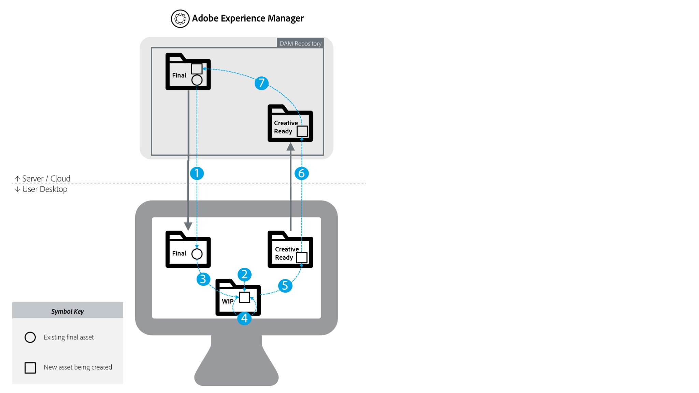

# Bästa praxis för integrering av AEM och Creative Cloud {#aem-and-creative-cloud-integration-best-practices}

<!-- TBD: Reconcile with 6.5 article that's ahead of this article now in terms of content streamlining and structuring.
-->

Adobe Experience Manager Assets är en DAM-lösning (Digital Asset Management) som kan integreras med Adobe Creative Cloud för att hjälpa DAM-användare att samarbeta med kreativa team och effektivisera samarbetet när innehåll skapas.

Adobe Creative Cloud ger kreativa team ett ekosystem av lösningar och tjänster som hjälper dem att skapa digitala resurser. Det omfattar program för dator och mobil, molntjänster som lagring med datorsynkronisering eller webbupplevelse, liksom marknadsplatser som Adobe Stock.

Läs vidare för att ta reda på vilka integreringar som du ska välja mellan stationär dator och företagsspecifik DAM baserat på ditt användningsfall och vilka metoder som är associerade med de sammankopplade arbetsflödena.

>[!NOTE]
>
>AEM till Creative Cloud-mappdelning är föråldrat och ingår inte längre i den här guiden. Adobe rekommenderar att du använder nyare funktioner som [Adobe Asset Link](https://helpx.adobe.com/enterprise/using/adobe-asset-link.html) eller [AEM-datorprogrammet](https://docs.adobe.com/content/help/en/experience-manager-desktop-app/using/introduction.html) för att ge kreativa användare tillgång till resurser som hanteras i AEM.

## Samarbete mellan kreatörer, marknadsförare och DAM-användare {#collaboration-needs-of-creatives-marketers-and-dam-users}

| Krav | Använd skiftläge | Involverade ytor |
|---|---|---|
| Förenkla för kreatörer på datorn | Effektivisera åtkomsten till resurser från en DAM (AEM Assets) för kreatörer, eller mer allmänt för användare på datorer som arbetar med program för att skapa egna resurser. De behöver ett enkelt och enkelt sätt att upptäcka, använda (öppna), redigera och spara ändringar i AEM samt överföra nya filer. | Skrivbordet Win eller Mac. Creative Cloud-program |
| Tillhandahåll högkvalitativa, färdiga mediefiler från Adobe Stock | Marknadsförarna hjälper till att snabba upp processen för att skapa innehåll genom att hjälpa till med materialanskaffning och identifiering. Kreatörer använder det godkända materialet direkt inifrån sina kreativa verktyg. | AEM Assets; Adobe Stock Marketplace; metadatafält |
| Distribuera och dela resurser efter organisationer | Interna avdelningar/lokala kontor och externa partners, distributörer och byråer använder det godkända material som delas av huvudorganisationen. Organisationen vill säkert och smidigt dela de skapade resurserna för vidare återanvändning. | Varumärkesportal, Resursdelningskommentarer |

## Adobes lösningar för samverkan {#adobe-offerings-to-support-the-collaboration-need}

| Värdeförslag för berörda personer | Erbjudande | Involverade ytor |
|---|---|---|
| Creative-användare upptäcker resurser från AEM, öppnar och använder dem, redigerar och överför ändringar till AEM samt överför nya filer till AEM, utan att behöva lämna Creative Cloud-programmen. | [Adobe Asset Link](https://helpx.adobe.com/enterprise/using/adobe-asset-link.html) | Photoshop, Illustrator och InDesign |
| Affärsanvändare förenklar öppning och användning av resurser, redigering och överföring av ändringar till AEM samt överföring av nya filer till AEM från skrivbordsmiljön. De använder en allmän integrering för att öppna alla resurstyper i det inbyggda datorprogrammet, inklusive sådana som inte kommer från Adobe. | [AEM-skrivbordsapp](https://docs.adobe.com/content/help/en/experience-manager-desktop-app/using/using.html) | AEM-skrivbordsapp på Win och Mac |
| Marknadsförare och företagsanvändare upptäcker, förhandsgranskar, licensierar och sparar Adobe Stock-mediefiler från AEM. Licensierade och sparade mediefiler innehåller utvalda Adobe Stock-metadata för bättre styrning. | [Integrering av Experience Manager och Adobe Stock](aem-assets-adobe-stock.md) | AEM-webbgränssnitt |

Den här artikeln fokuserar främst på de två första aspekterna av samarbetsbehovet. Distribution och anskaffning av resurser i stor skala omnämns kortfattat som ett användningsexempel. Överväg Adobe Brand Portal eller Assets Share Commons för sådana behov. Alternativa lösningar som [Varumärkesportalen](https://helpx.adobe.com/experience-manager/brand-portal/user-guide.html), lösningar som kan byggas baserat på komponenterna [Resursdelningar](https://adobe-marketing-cloud.github.io/asset-share-commons/) , [Länkdelning](/help/assets/link-sharing.md)och [Experience Manager Assets](/help/assets/managing-assets-touch-ui.md) bör granskas utifrån specifika krav.

<!-- 
## Terms and definitions {#terms-and-definitions}

The terms used in this document may have a different meaning in other contexts. In particular, the following terms pertaining to the digital asset lifecycle are used when referring to workflows between a creative professional's desktop and DAM:

* **Work-in-progress or creative work-in-progress (WIP):** A phase in asset lifecycle where an asset undergoes multiple changes and is typically not yet ready to be shared with broader teams.
* **Creative-ready assets:** Assets that are ready to be shared with a broader team, or have been  selected / approved  by the creative team for sharing with marketing or LOB teams.
* **Asset approvals:** The approval process that runs for assets already uploaded to DAM, which typically includes brand approvals, legal approvals, and so on.
* **Final asset:** An asset that has gone through all  approvals/metadata  tagging and is ready to be used by the broader team. Such an asset is stored in DAM and made available to all (or all interested) users. It can be used in marketing channels or by creative teams to create designs.
* **Minor asset  update/change:** A quick and small change to a digital asset. It is often made in response to a retouching or minor editing request, asset review, or approval (for example, reposition, change text size, adjust saturation/brightness, color, and so on).
* **Major asset  update/change:** A change to a digital asset that requires considerable work, and sometimes must be done over a longer period of time. It typically includes multiple changes. The asset must be saved multiple times while being updated. Major asset updates typically cause the asset to enter a WIP stage.
* **DAM:** Digital asset management. In this document, it is synonymous with AEM Experience Manager Assets, unless specifically mentioned otherwise.
* **Creative user:** A creative professional, who creates digital assets using Creative Cloud apps and services. In some cases, a creative user may be a member of a creative team who may use Creative Cloud, but does not create digital assets (like a creative director or creative team manager).
* **DAM user:** A typical user of a DAM system. Depending on the organization, a DAM user can be a marketing or a non-marketing user, for example a Line-of-Business (LOB) user, librarian, sales person, and so on.
-->

### Mappning av användningsfall

| Använd skiftläge | AEM-skrivbordsapp | Mappdelning | Andra lösningar |
|---|---|---|---|
| Dela ett mindre antal (1) DAM-resurser med den kreativa användaren | ✔✔ | ✔ |  |
| Dela fler (2) DAM-resurser med den kreativa användaren | ✔✔ | ✘ | [Varumärkesportal](https://docs.adobe.com/content/help/en/experience-manager-brand-portal/using/home.html)  [Resursresurs](assets-finder-editor.md) |
| Dela DAM-resurser med användare som har åtkomst till DAM | ✔✔ | ✔ | [Länkdelning](link-sharing.md) |
| Dela DAM-resurser med användare som inte har åtkomst till DAM | ✘ | ✔✔ | [Varumärkesportal](https://docs.adobe.com/content/help/en/experience-manager-brand-portal/using/home.html)  [Resursresurs](assets-finder-editor.md) |
| Spara mindre antal/volym resurser till DAM | ✔✔ | ✔ | [Överföring av webbgränssnitt](managing-assets-touch-ui.md) |
| Spara fler resurser på DAM (3) | ✔✔ | ✘ | [Anpassat skript/verktyg för](managing-assets-touch-ui.md)   överföring av webbgränssnitt |
| Migrera ett stort antal resurser till DAM | ✘ | ✘ | [Migreringshandbok](assets-migration-guide.md) |
| Öppna en resurs på skrivbordet snabbt | ✔✔ | ✘ |  |
| Öppna och ändra resurser snabbt på datorn | ✔✔ | ✘ |  |

Förklaring till symbolerna:

* ✔ ✔: bästa lösning
* ✔: godtagbar lösning
* ✘: ska inte användas för användningsfallet

Ytterligare kommentarer:

* (1) Mindre antal resurser: till exempel en liten uppsättning resurser som är kopplade till ett projekt eller en kampanj
* (2) Större antal tillgångar: till exempel alla godkända tillgångar i organisationen
* (3) Använda funktionen Överföringsmapp för AEM-skrivbordsapp

För att stödja användningsexemplen på resursfördelning bör andra lösningar beaktas:

* [Varumärkesportalen](https://helpx.adobe.com/experience-manager/brand-portal/user-guide.html) för ett konfigurerbart SaaS-tillägg i AEM Assets för publicering av resurser.
* Anpassade lösningar skapas baserat på kodbasen [Resursdelningskommentarer](https://adobe-marketing-cloud.github.io/asset-share-commons/) .
* AEM [link share](/help/assets/link-sharing.md) to share assets ad hoc using links.
* [AEM Assets-webbgränssnittet](/help/assets/managing-assets-touch-ui.md) med områden för externa parter som skyddas av AEM Access Control-installationen och med nödvändiga IT-/nätverkskonfigurationsjusteringar, vilket ger dessa externa användare tillgång till AEM.

## Viktiga begrepp och användningsområden {#key-concepts-and-use-cases}

### Ordlista med vanliga termer {#glossary-of-common-terms}

* **** Work-in-progress eller creative work-in-progress (PIP): En fas i en tillgångs livscykel där en resurs genomgår flera ändringar och vanligtvis inte är redo att delas med fler team.
* **** Kreativa resurser: Resurser som är klara att delas med ett större team, eller som har valts ut/godkänts av det kreativa teamet för att delas med marknadsförings- eller LOB-team.
* **** Godkännanden av tillgångar: Godkännandeprocessen som körs för resurser som redan har överförts till DAM, som vanligtvis omfattar varumärkesgodkännanden, juridiska godkännanden och så vidare.
* **** Slutlig tillgång: En resurs som har genomgått alla godkännanden/metadatataggar och är klar att användas av teamet. En sådan resurs lagras i DAM och görs tillgänglig för alla (eller alla intresserade) användare. Den kan användas i marknadsföringskanaler eller av kreativa team för att skapa design.
* **** Mindre uppdatering/ändring av resurs: En snabb och liten förändring av en digital resurs. Det görs ofta som svar på en begäran om retuschering eller mindre redigering, granskning av resurser eller godkännande (t.ex. omplacering, ändring av textstorlek, justering av mättnad/intensitet, färg osv.).
* **** Uppdatering/ändring av större tillgångar: En förändring av en digital resurs som kräver mycket arbete och ibland måste göras under en längre tidsperiod. Det innehåller vanligtvis flera ändringar. Resursen måste sparas flera gånger medan den uppdateras. Viktiga resursuppdateringar gör att resursen går in i ett Pågående arbete-stadium.
* **** DAM: Digital resurshantering. I det här dokumentet är det synonymt med AEM Experience Manager Assets, om inget annat anges.
* **** Kreativ användare: En kreatör som skapar digitalt material med Creative Cloud-program och -tjänster. I vissa fall är en kreativ användare medlem i ett kreativt team som kanske använder Creative Cloud, men som inte skapar digitala resurser (som en creative director eller creative team manager).
* **** DAM-användare: En typisk användare av ett DAM-system. Beroende på organisationen kan en DAM-användare vara en marknadsföringsanvändare eller en icke-marknadsföringsanvändare, till exempel en kontors- (LOB) användare, bibliotekarie, säljare osv.

### Att tänka på när du använder AEM och Creative Cloud-integrering {#considerations-when-using-aem-and-creative-cloud-integration}

* Se [de effektivaste strategierna för skrivbordsappar](https://docs.adobe.com/content/help/en/experience-manager-desktop-app/using/troubleshoot.html#best-practices-to-prevent-troubles)
* Se [Adobe Stock-integrering](aem-assets-adobe-stock.md)
* Se [Adobe Asset Link](https://helpx.adobe.com/enterprise/using/adobe-asset-link.html)

Detta är en kort sammanfattning av de effektivaste strategierna för Experience Manager och Creative Cloud-integrering. Läs resten av det här dokumentet för att få en mer detaljerad förståelse för dessa.

* **** För kreativa användare: arbete i Photoshop, InDesign eller Illustrator: Adobe Asset Link ger den bästa användarupplevelsen, inklusive ren hantering av pågående arbeten för resurser som checkats ut från AEM
* **** För att förenkla åtkomsten till resurser från skrivbordet för alla generiska filformat eller program: använd AEM-skrivbordsapp
* **** Förstå varför och när resurser ska lagras i DAM: Uppdateringar som ska göras tillgängliga för hela teamet i organisationen
* **** Lägg märke till mängden resurser som delas: Om ni använder mediedistribution kan det vara de viktigaste aspekterna för styrning och säkerhet. Överväg att använda verktyg som är byggda för att göra detta i stor skala, som varumärkesportalen.
* **** Förstå tillgångarnas livscykel: Ta reda på hur resurser hanteras i organisationen av olika team
* **** Hantera ofta sparade resurser med stor omsorg: Adobe Asset Link tar hand om det åt dig med PS, AI, ID. För andra program ska du inte utföra pågående uppgifter i mappad/delad mapp såvida du inte behöver alla ändringar i DAM

### Åtkomst till Adobe Stock-resurser från AEM Assets {#access-to-adobe-stock-assets-from-aem-assets}

[AEM- och Adobe Stock-integrering](/help/assets/aem-assets-adobe-stock.md) ger AEM-användare möjlighet att söka, förhandsgranska, licensiera och spara resurser från Adobe Stock i AEM. Licensierade och sparade Adobe Stock-mediefiler har valt Stock-metadata som kan användas för att söka efter dem med extra filter.

Några viktiga punkter om den här integreringen:

* När resurser från Adobe Stock sparas till AEM blir de ett vanligt AEM Resurser, med binärfiler sparade i AEM-databasen. Vissa metadata som är relaterade till Adobe Stock sparas för resursen i AEM, annars ser importen ut på samma sätt som för andra filer. Om till exempel smarta taggar är aktiva läggs taggarna till i de här resurserna när de sparas.
* Resursen som sparas till AEM är en kopia, inte en länk tillbaka till Adobe Stock.

**Arbeta med resurser som sparats från Adobe Stock till AEM i Creative Cloud**. Den här integreringen är oberoende av Adobe Asset Link, men Adobe Asset Link känner igen dessa resurser som sparats från Stock på det sättet och visar ytterligare metadata och Stock-ikoner för dessa resurser i Adobe Asset Link-tilläggsgränssnittet i Photoshop, Illustrator eller InDesign. Filerna är tillgängliga för att bläddra, öppna och så vidare, eftersom de är vanliga AEM-resurser när de sparas i AEM.
Creative-användare som arbetar i Creative Cloud-program med Adobe Asset Link-tillägget närvarande kan, förutom att ha tillgång till redan licensierade mediefiler från Adobe Stock till AEM, även använda Creative Cloud Libraries-panelen för att söka efter, förhandsgranska och licensiera Adobe Stock-mediefiler.
Resurser från Adobe Stock som licensierats och sparats i AEM blir tillgängliga för de större team som har tillgång till AEM Assets-distributionen, medan kreatörer som licensierar resurser från Adobe Stock via Creative Cloud Libraries-panelen gör dem tillgängliga endast som standard i sina Creative Cloud-konton.

<!-- 
TBD: A condensed version of the below content is better placed in the Adobe DAM article.
-->

## Lagra resurser i ett resurshanteringssystem {#about-storing-assets-in-a-dam}

För att skapa ett effektivt arbetsflöde mellan kreatörer och marknadsförare/branschspecifika team (LOB) och välja de bästa supportfunktionerna är det viktigt att förstå när och varför resurser lagras i DAM.

### Varför resurser lagras i DAM {#why-assets-are-stored-in-dam}

Genom att lagra resurser i DAM blir de enkelt tillgängliga och sökbara. Det ser till att resurserna kan utnyttjas av många användare i organisationen eller ekosystemet, bland annat partners, kunder och så vidare.

De flesta organisationer väljer att endast lagra resurser som är relevanta för marknadsförings-/LOB-processerna längre fram i kedjan (publicera till kanaler som webbkanal via AEM Sites eller andra kanaler som hanteras av Adobe Experience Cloud - Marketing Cloud, Advertizing Cloud och mäts av Analytics Cloud, som tillhandahålls användare/partner och så vidare). Dessutom lagrar organisationer resurser som kan bli föremål för en gransknings-/godkännandeprocess i DAM. På så sätt lagrar DAM de flesta resurser som har stora chanser att utnyttjas och undviker att lagra inaktiva resurser.

Lagring av resurser är också beroende av tekniska aspekter och resursutnyttjande. DAM tillhandahåller ytterligare tjänster runt lagrade resurser, inklusive extrahering av metadata, versionshantering, generering av förhandsgranskning/omkodning, hantering av referenser och tillägg av åtkomstkontrollsinformation. Dessa tjänster kräver extra tid och infrastrukturresurser.

Det är ofta inte önskvärt att lagra alla resurser och uppdateringar. Om till exempel uppdateringar av specifika resurser har dålig kvalitet och förbrukar för mycket resurser, kanske resurserna inte lagras i DAM.

### När resurser lagras i DAM {#when-assets-are-stored-in-dam}

Kreativa team (och organisationer) är vanligtvis inte intresserade av att lagra resurser i varje skede av resursens livscykel. De undviker till exempel att lagra resurser i följande fall:

* Resurser som ännu inte färdigställts eller som är föremål för experimenterande
* Resurser som inte godkänns i granskningsprocessen
* Jämfört med den aktuella resursen har teamet bättre kandidater att representera sitt arbete för externa team

Vanligtvis lagras följande klassresurser i DAM:

* Tillgångar som har nått en viss löptid och anses vara klara att delas
* Resurser som har valts ut i förväg av det kreativa teamet
* Specifika resursformat som kan användas eller begäras av marknadsföring, beroende på ett specifikt kontrakt eller avtal (t.ex. JPG-filer som konverterats från RAW-filer, TIFF-filer/bilder från PSD-original)

### När uppdateringar av resurser lagras i DAM {#when-updates-to-assets-are-stored-in-dam}

I regel ska endast uppdateringar av resurser som är relevanta för den bredare uppsättningen DAM-användare lagras i DAM. Det ser till att användare (marknadsföringsfunktioner och liknande funktioner) bara ser relevanta versioner på tidslinjen för DAM-resurser.

Vanligtvis ändras relaterade till viktiga milstolpar i resursens livscykel. Till exempel bör det ursprungliga kreativa materialet eller en officiell uppdatering som baseras på begäran/granskning som tillhandahålls av det kreativa teamet lagras och versionsindelas i DAM.

Det kreativa teamets uppdatering för granskning av marknadsföringsteamet efter en begäran om ändring av befintligt material i DAM är ett exempel på en relevant uppdatering. Den ska lagras och versionshanteras i DAM för vidare referens eller för att återgå till den tidigare versionen.

Nedan följer exempel på uppdateringar som vanligtvis inte är relevanta:

* Tidiga versioner av mediefiler som överförts innan de är klara för marknadsföringsgranskning
* Vanliga kreativa ändringar av resursen i den pågående arbetsfasen innan det kreativa teamet bestämmer att resursen är klar

### Användaråtkomst till DAM {#user-access-to-dam}

AEM Assets stöder två typer av användare baserat på deras åtkomst till AEM Assets-distributionen. Vanligtvis har användare i företagsnätverket (brandväggen) direktåtkomst till DAM. Andra användare utanför företagsnätverket skulle inte ha direktåtkomst. Användartypen avgör vilka integreringar som kan användas ur teknisk synpunkt.

#### Kreativa användare med direkt åtkomst till DAM {#creative-users-with-direct-access-to-dam}

Vanligtvis har interna kreativa team, byråer/kreatörer som är anställda på det interna nätverket tillgång till DAM-instansen, inklusive AEM-inloggning.

I sådana fall kan AEM-datorprogrammet ge enkel åtkomst till det slutliga/godkända materialet och göra det möjligt att spara kreativa resurser på DAM.

#### Kreativa användare utan åtkomst till DAM {#creative-users-without-access-to-dam}

Externa byråer och frilansare som inte har direkt åtkomst till DAM-instansen kan behöva åtkomst till godkända resurser eller lägga till sina nya designer i DAM.

I sådana fall kan du utnyttja integreringen med AEM/Creative Cloud för att förbättra arbetsflödet. Förutsättningen är att de kreativa användarna har ett Adobe ID och ett Creative Cloud-konto med lagringstjänsten.

Använd följande strategier för att ge tillgång till slutliga/godkända mediefiler:

* Så här ger du åtkomst till ett stort antal resurser: Använd [AEM Assets Brand Portal](https://helpx.adobe.com/experience-manager/brand-portal/user-guide.html), eller kundens implementering av [Assets Share](assets-finder-editor.md) i AEM-publiceringsinfrastruktur

* Så här ger du åtkomst till några resurser: AEM-mappdelning med Adobe Creative Cloud kan användas utöver AEM Assets Brand Portal eller Asset Share. Observera att det finns vissa begränsningar för den här integreringen som beskrivs mer ingående i den här artikeln.

### Användningsexempel {#use-cases}

Följande exempel beskriver olika typer av arbetsflöden mellan DAM och designerns skrivbord.

#### Skapa ny design med resurser från DAM {#creating-new-designs-using-assets-from-dam}

I följande diagram visas livscykeln för digitala resurser. Det visar hur kreativa användare och DAM-användare (marknadsförare, LOB-användare) utnyttjar befintliga resurser och använder dem för att skapa fler resurser och skicka dem för godkännande.

Resursens livscykel omfattar följande steg:

1. Dela godkänt material till den kreativa datorn: Slutliga resurser från DAM blir tillgängliga för den kreativa användaren (på datorn)
1. Skapa en ny design (kreativt digitalt material): En ny fil lagras i området Pågående arbete.
1. Använd (placera) godkända resurser i en ny design: Den kreativa användaren skapar en ny resurs med befintliga godkända resurser i Creative Cloud-program
1. Uppdateringar av pågående arbete sparas ofta: Den kreativa användaren itererar snabbt och sparar filen ofta. I det här skedet kan den kreativa användaren samarbeta med andra, men de ofta sparade uppdateringarna är vanligtvis inte av intresse för DAM-användare.
1. Resursen når sin status som klar för kreativitet och sparas i mappen Creative Ready
1. Resursuppdatering: En resursuppdatering eller en ny fil är tillgänglig för användarna i DAM
1. Resursen används i produktionen: Detta är en DAM-process som, beroende på organisationen, kan omfatta taggning, godkännanden och ändring av åtkomstkontroll. I det här skedet betraktas tillgången som slutgiltig och kan användas av bredare team som utnyttjar DAM. Den kan också användas av kreativa användare för att skapa andra resurser.

Här följer några allmänna rekommendationer om hur du hanterar resurser genom den här processen:

* Använd ett dedikerat lagringsutrymme/system, till exempel synkroniserad mapp för Adobe Creative Cloud Resurser, för Pågående arbete-filerna: Vanliga uppdateringar som inte är relevanta för DAM-användare hanteras bäst av ett dedikerat system, inte från AEM Resurser. PIA-resurser kan synkroniseras till en lokal disk med hjälp av Adobe Creative Cloud-datorprogrammet, sparas på en lokal lagringsplats och så vidare.
* Använd separata mappar/resurser för slutliga resurser och resurser som överförs till DAM: För tydlighetens skull bör de slutliga resurserna ha en egen mappad/delad mapp (&quot;Final&quot; example above) och de resurser som ska överföras tillbaka till DAM ska ha en egen (&quot;Creative Ready&quot;)

#### Ändra befintliga resurser som hanteras i DAM {#changing-existing-assets-managed-in-dam}

I vissa fall kan resurser i DAM kräva ändringar. Exempel:

* Begäran om ändringar av resurser från granskning och godkännande i AEM Assets
* Viktiga uppdateringar av befintliga sluttillgångar
* Snabbredigering av en befintlig fil (särskilt innan den godkänts)

I sådana fall är AEM-datorprogrammet det enklaste sättet att utföra dessa åtgärder.

Här är händelseflödet som visas i diagrammet:

<!-- TBD for formatting. 
This article will get fixed automatically when 6.5 content is ported to it.
And 6.5 content will be ported after updating it for AEM desktop app 2.0 best practices.
And it will be updated for DA2.0 best practices after 6.5 repo is available for writers to edit content in.
-->

* **** 1: Dela resursen från DAM till skrivbordet eller öppna den direkt på skrivbordet i det program du väljer (till exempel Adobe Photoshop). Du bör checka ut om du vill låsa filen.
* **** 2: Mindre uppdatering: Redigera filen och spara ändringarna.
* Alternativt flöde till steg 2

   * **** S: Huvuduppdatering: Om filen kräver en omfattande uppsättning ändringar bör den sparas regelbundet och kopieras till en Pågående arbete-mapp/ett Pågående arbete-område.
   * **** B: Arbetet med filen i Pågående arbete-mapparna fortsätter. De sparade ändringarna synkroniseras inte till versionen i DAM
   * **** C: När uppdateringarna är klara kopieras filen tillbaka eller sparas i den mappade mappen

* **** 3: Resursuppdateringar återspeglas i DAM. Checka in resursen för att låsa upp den.
* **** 4: Resursen ställs i produktion.

Här följer några allmänna rekommendationer om hur du hanterar resurser under den här processen:

* Undvik att spara en fil som du har öppnat från en nätverksresurs som mappats av AEM-skrivbordsappen direkt, såvida inte ändringarna du gjort i filen är små.
* Kopiera filen till en separat Pågående arbete-mapp om du vill göra ytterligare ändringar i den, spara regelbundet eller samarbeta med det kreativa teamet.

#### Massöverföring till DAM {#bulk-upload-to-dam}

Du kan behöva överföra ett större antal filer till DAM samtidigt i vissa scenarier, till exempel:

* Överföra resultat från foton eller större projekt
* Överföra material från reklambyråer
* Överför markerade resurser från en större uppsättning om markeringen görs utanför DAM

Observera att den här beskrivningen avser att överföra filer operativt (t.ex. varje vecka, eller med varje fotografering osv.), som en normal del av datoranvändarens arbetsflöde. Stora resursmigreringar beskrivs inte här.

Du kan utnyttja följande funktioner om du vill överföra resurser i grupp:

* Om du vill överföra stora/hierarkiska mappar använder du AEM-skrivbordsappen, som har en funktion för [mappöverföring](https://helpx.adobe.com/experience-manager/desktop-app/aem-desktop-app.html#bulkupload) . Du kan också överföra hierarkiska mappstrukturer. Resurserna överförs i bakgrunden och är därför inte knutna till en webbläsarsession
* Om du vill överföra några filer från en enda mapp drar du dem direkt från skrivbordet till webbgränssnittet eller använder alternativet Skapa i webbgränssnittet för AEM Resurser.

>[!NOTE]
>
>Beroende på vilka affärskrav du har kan du även använda en anpassad överförare.

#### Hantera digitala resurser direkt från skrivbordet {#managing-digital-assets-directly-from-desktop}

Om du använder Network File Shares för att hantera digitala resurser kan du se att bara den nätverksresurs som är mappad av AEM-skrivbordsappen används som ett praktiskt alternativ. När du övergår från filresurser i nätverk bör du komma ihåg att AEM Web UI har en mängd funktioner för hantering av digitala resurser som går mycket längre än vad som är möjligt på en nätverksresurs (sökning, samlingar, metadata, samarbete, förhandsvisningar osv.), och AEM-datorprogrammet erbjuder en praktisk länk för att ansluta DAM-databasen på serversidan med datorarbetet.

Undvik att använda AEM-datorprogrammet för att hantera resurser direkt i nätverksresursen för AEM Assets. Undvik till exempel att använda AEM-skrivbordsappen för att flytta/kopiera flera filer. Använd i stället webbgränssnittet för AEM Resurser för att dra mappar från Finder/Explorer till nätverksresursen eller använd funktionen för överföring av AEM Resursmapp.

#### Resursmigrering {#asset-migration}

Information om hur du planerar och kör resursmigreringar från ett befintligt system till ett nytt system eller migrering av stora volymer resurser som lagras på servrar finns i [migreringshandboken](/help/assets/assets-migration-guide.md). AEM-datorprogrammet och AEM till Creative Cloud-integreringar stöder inte sådana migreringar. På grund av de stora volymer resurser som ska importeras och ytterligare krav på metadatamappning, omvandling och förtäring bör migreringar hanteras med olika verktyg och metoder.

>[!MORELIKETHIS]
>
>* [Adobe Asset Link](https://helpx.adobe.com/in/enterprise/using/adobe-asset-link.html)
>* [Bästa praxis för AEM-skrivbordsprogram](https://docs.adobe.com/content/help/en/experience-manager-desktop-app/using/archive/best-practices-for-v1.html)
>* [AEM Brand Portal](https://docs.adobe.com/content/help/en/experience-manager-brand-portal/using/introduction/brand-portal.html)
>* [Integrering med AEM och Adobe Stock](aem-assets-adobe-stock.md)

