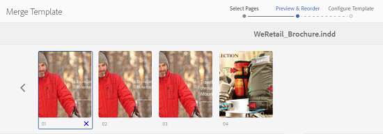

# Resursmallar {#asset-templates}

Resursmallar är en speciell typ av resurser som gör det enkelt att snabbt återanvända visuellt avancerat innehåll för digitala medier och trycksaker. En resursmall består av två delar, avsnittet med fasta meddelanden och det redigerbara avsnittet.

Avsnittet med fasta meddelanden kan innehålla eget innehåll, t.ex. varumärkeslogotyp och copyrightinformation som har inaktiverats för redigering. Det redigerbara avsnittet kan innehålla visuellt och textbaserat innehåll i fält som kan redigeras för att anpassa meddelanden.

Flexibiliteten att göra begränsade redigeringar samtidigt som globala signaturer skyddas gör att materialmallar är idealiska byggstenar för snabb innehållsanpassning och distribution som innehållsartefakter för olika funktioner. Återanvändning av innehåll minskar kostnaderna för att hantera tryckta och digitala kanaler och leverera en helhetsbild och enhetliga upplevelser i alla dessa kanaler.

Som marknadsförare kan ni lagra och hantera mallar i AEM Resurser och använda en enda basmall för att enkelt skapa flera personaliserade utskriftsupplevelser. Ni kan skapa olika typer av marknadsföringsmaterial, som broschyrer, flygblad, vykort, visitkort och så vidare, för att på ett enkelt sätt förmedla ert marknadsföringsbudskap till kunderna. Du kan också montera flersidiga utskrifter från befintliga eller nya utskrifter. Framför allt kan ni enkelt leverera både digitala och tryckta upplevelser samtidigt för att skapa en enhetlig, integrerad upplevelse för användarna.

Resursmallar är till största delen InDesign-filer, men InDesign-kunskaper är inget hinder för att skapa fantastiska artefakter. Du behöver inte mappa fälten i din InDesign-mall till de produktfält som du annars behöver när du skapar kataloger. Du kan redigera mallarna i WYSIWYG-läge direkt i webbgränssnittet. För att InDesign ska kunna behandla dina redigeringsändringar måste du först konfigurera AEM Resurser så att de integreras med InDesign-servern.

Möjligheten att redigera InDesign-mallar från webbgränssnittet bidrar till ett bättre samarbete mellan kreatörer och marknadsförare, samtidigt som time to market för lokala marknadsföringssatsningar minskar.

Du kan göra följande med resursmallar:

* Ändra redigerbara mallfält från webbgränssnittet
* Styr den grundläggande formateringen av text, t.ex. teckenstorlek, stil och typ på taggnivå
* Ändra bilder i mallen med hjälp av innehållsväljaren
* Förhandsgranska malländringar
* Sammanfoga flera mallfiler för att skapa en flersidig artefakt

När du väljer en mall för dina säkerheter skapar AEM Resurser en kopia av mallen som du kan redigera. Den ursprungliga mallen bevaras, vilket säkerställer att den globala signaturen förblir intakt och kan återanvändas för att stärka varumärkets enhetlighet.

Du kan exportera den uppdaterade filen i den överordnade mappen i följande format:

* INDD
* PDF
* JPG

Du kan även hämta utdata i dessa format till ditt lokala system.

## Skapa en säkerhet {#creating-a-collateral}

Tänk dig ett scenario där du vill skapa digital tryckbar information som broschyrer, flygblad och annonser för en kommande kampanj och dela med butiker globalt. Genom att skapa material som bygger på en mall kan ni leverera en enhetlig kundupplevelse över alla kanaler. Designers kan skapa kampanjmallar (en eller flera sidor) med hjälp av en kreativ lösning, som InDesign, och överföra mallarna till AEM Assets åt dig. Innan du skapar en säkerhet ska du ha en eller flera INDD-mallar överförda till och tillgängliga i Experience Manager i förväg.

1. Klicka på eller tryck på AEM-logotypen och sedan på/på **[!UICONTROL Resurser]** på navigeringssidan.
1. Välj **[!UICONTROL Mallar]** bland alternativen.

   

1. Klicka på/tryck på **[!UICONTROL Skapa]** och välj sedan den information du vill skapa på menyn. Välj till exempel **[!UICONTROL Broschyr]**.

   

1. Ha en eller flera INDD-mallar överförda till och tillgängliga i Experience Manager i förväg. Välj en mall för din broschyr och klicka/tryck på **[!UICONTROL Nästa]**.

   

1. Ange ett namn och en valfri beskrivning för broschyren.

   

1. (Valfritt) Klicka/tryck på ikonen **[!UICONTROL Taggar]** bredvid fältet **[!UICONTROL Taggar]** och välj en eller flera taggar för broschyren. Bekräfta ditt val genom att klicka/trycka på **[!UICONTROL Bekräfta]** .

   

1. Klicka på **[!UICONTROL Skapa]**. En dialogruta bekräftar att en ny broschyr har skapats. Klicka/tryck på **[!UICONTROL Öppna]** för att öppna broschyren i redigeringsläge.

   

   Du kan också stänga dialogrutan och navigera till mappen på mallsidan som du började med för att visa den broschyr du skapade. Typen av säkerhet visas på miniatyrbilden i kortvyn. I det här fallet visas t.ex. Broschyr på miniatyrbilden.

   

## Redigera en säkerhet {#editing-a-collateral}

Du kan redigera en sammanställning direkt när du har skapat den. Du kan även öppna den från mallsidan eller resurssidan.

1. Gör något av följande om du vill öppna materialet för redigering:

   * Öppna den säkerhet (broschyr i det här fallet) som du skapade i steg 7 i [Skapa en säkerhet](asset-templates.md#creating-a-collateral).
   * Navigera från sidan Mallar till en mapp där du har skapat materialet och klicka/tryck på snabbåtgärden Redigera på miniatyrbilden av ett material.
   * Klicka på/tryck på ikonen Redigera i verktygsfältet på resurssidan för den aktuella resursen.
   * Markera den önskade delen och klicka/tryck på ikonen Redigera i verktygsfältet.
   

   Resurssökaren och textredigeraren visas till vänster på sidan. Textredigeraren är öppen som standard.

   Du kan använda textredigeraren för att ändra texten som ska visas i textfältet. Du kan ändra teckenstorlek, stil, färg och typ på taggnivå.

   Med hjälp av sökaren kan du bläddra bland eller söka efter bilder i AEM Resurser och ersätta de redigerbara bilderna i mallen med de bilder du väljer.

   

   De redigerbara visas till höger. För att ett fält ska kunna redigeras i AEM Resurser måste motsvarande fält i mallen taggas i InDesign. Med andra ord bör de göras ändringsbara i InDesign.

   

   >[!NOTE]
   >
   >Se till att din AEM-instans är integrerad med en InDesign-server så att AEM Assets kan extrahera data från InDesign-mallen och göra den tillgänglig för redigering. Mer information finns i [Integrera AEM-resurser med InDesign Server](indesign.md).

1. Om du vill ändra texten i ett redigerbart fält klickar/trycker du på textfältet i listan med redigerbara fält och redigerar texten i fältet.

   

   Du kan redigera textegenskaperna, till exempel teckensnittsstil, färg och storlek, med de alternativ som finns.

1. Klicka på/tryck på ikonen **[!UICONTROL Förhandsgranska]** om du vill förhandsgranska textändringarna.

   

1. Klicka/tryck på ikonen **[!UICONTROL Resurssökning]** om du vill byta ut en bild.

   

1. Markera bildfältet i listan med redigerbara fält och dra sedan en önskad bild från resursväljaren till det redigerbara fältet.

   

   Du kan också söka efter bilder med nyckelord, taggar och baserat på deras publiceringsstatus. Du kan bläddra genom AEM Resurser-databasen och navigera till den önskade bildens plats.

   

1. Klicka på/tryck på ikonen **[!UICONTROL Förhandsgranska]** för att förhandsvisa bilden.

   

1. Om du vill redigera en viss sida i en flersidig säkerhetssida använder du sidnavigeraren längst ned.

   

1. Klicka på/tryck på ikonen **[!UICONTROL Förhandsgranska]** i verktygsfältet för att förhandsgranska alla ändringar. Klicka/tryck på **[!UICONTROL Klar]** om du vill spara redigeringsändringarna för den aktuella informationen.

   >[!NOTE]
   >
   >Ikonerna Förhandsvisa och Klar är bara aktiverade när de redigerbara bildfälten i den sammansatta bilden inte har några ikoner som saknas. Om det saknas ikoner i din information beror det på att AEM inte kan matcha bilderna i InDesign-mallen. Vanligtvis kan AEM inte lösa bilder i följande fall:
   >
   >* Bilder bäddas inte in i den underliggande InDesign-mallen
   >* Bilderna länkas från det lokala filsystemet
   >
   >Så här aktiverar du AEM för att lösa bilder:
   >
   >* Bädda in bilder när du skapar InDesign-mallar (se [Länkar och inbäddade bilder](https://helpx.adobe.com/indesign/using/graphics-links.html)).
   >* Montera AEM i ditt lokala filsystem och mappa sedan saknade ikoner med befintliga AEM-resurser.
   >
   >Mer information om hur du arbetar med InDesign-dokument finns i [Bästa metoder för att arbeta med InDesign-dokument i AEM](https://helpx.adobe.com/experience-manager/kb/best-practices-idd-docs-aem.html).

1. Om du vill generera en PDF-återgivning för broschyren väljer du alternativet Acrobat i dialogrutan och klickar sedan på **[!UICONTROL Fortsätt]**.
1. Säkerheten skapas i den mapp du började med. Om du vill visa återgivningarna öppnar du materialet och väljer **[!UICONTROL Återgivningar]** i listan GlobalNav.

   

1. Klicka på/tryck på PDF-återgivningen i listan över återgivningar för att hämta PDF-filen. Öppna PDF-filen för att granska materialet.

   

## Lägg samman säkerhet {#merge-collateral}

1. Klicka på eller tryck på **[!UICONTROL Verktyg > Resurser]**.
1. Välj **[!UICONTROL Mallar]** bland alternativen.
1. Klicka/tryck på **[!UICONTROL Skapa]** och välj **[!UICONTROL Sammanfoga]** på menyn.

   

1. Klicka på/tryck på ikonen Sammanfoga på sidan Mallsammanfogning.

   

1. Navigera till platsen för den säkerhet som du vill sammanfoga, klicka/tryck på miniatyrbilderna för den säkerhet som du vill sammanfoga för att markera dem.

   

   Du kan till och med söka efter mallar i rutan OmniSearch.

   

   Du kan bläddra genom AEM Resurser-databasen eller -samlingar, navigera till platsen för önskade mallar och sedan välja dem att sammanfoga.

   

   Du kan använda olika filter för att söka efter de önskade mallarna. Du kan till exempel söka efter mallar baserat på filtyp eller taggar.

   

1. Klicka/tryck på **[!UICONTROL Nästa]** i verktygsfältet.
1. På skärmen **[!UICONTROL Förhandsgranska och ordna]** om kan du ordna om mallarna om det behövs och förhandsgranska valet av mallar som ska sammanfogas. Klicka/tryck sedan på **[!UICONTROL Nästa]** i verktygsfältet.

   

1. Ange ett namn för säkerheten på skärmen Konfigurera mall. Du kan också ange de taggar som du anser lämpliga. Om du vill exportera utdata i PDF-format markerar du alternativet **[!UICONTROL Acrobat (.PDF)]** . Som standard exporteras materialet i JPG- och InDesign-format. Om du vill ändra miniatyrbilden för flersidig information klickar/trycker du på **[!UICONTROL Ändra miniatyrbild]**.

   

1. Klicka/tryck på **[!UICONTROL Spara]** och sedan på/klicka på **[!UICONTROL OK]** i dialogrutan för att stänga dialogrutan. Den flersidiga säkerheten skapas i den mapp du började med.

   >[!NOTE]
   >
   >Du kan inte redigera en sammanfogad säkerhet senare eller använda den för att skapa annan säkerhet.

