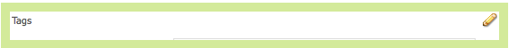

# Skapa och konfigurera sidor för Resursredigeraren {#creating-and-configuring-asset-editor-pages}

>[!CAUTION]
>
>AEM 6.4 har nått slutet på den utökade supporten och denna dokumentation är inte längre uppdaterad. Mer information finns i [teknisk supportperiod](https://helpx.adobe.com/support/programs/eol-matrix.html). Hitta de versioner som stöds [här](https://experienceleague.adobe.com/docs/).

I det här dokumentet beskrivs följande:

* Därför ska du skapa anpassade resursredigeringssidor.
* Skapa och anpassa resursredigeringssidor, dvs. WCM-sidor, där du kan visa och redigera metadata samt utföra åtgärder på resursen.
* Så här redigerar du flera resurser samtidigt.

>[!NOTE]
>
>Resursresurs är tillgänglig som en referensimplementering med öppen källkod. Se [Kommandon för resursdelning](https://adobe-marketing-cloud.github.io/asset-share-commons/) . Det stöds inte officiellt.

## Varför skapa och konfigurera resursredigeringssidor? {#why-create-and-configure-asset-editor-pages}

Digital Asset Management används i allt fler scenarier. När man går från en småskalig lösning för en liten användargrupp med professionellt utbildade användare - t.ex. fotografer eller taxonomier - till större och mer mångsidiga användargrupper, t.ex. affärsanvändare, WCM-författare, journalister och så vidare, det kraftfulla användargränssnittet i [!DNL Adobe Experience Manager Assets] för professionella användare kan tillhandahålla för mycket information och intressenter börjar begära specifika användargränssnitt eller program för att få tillgång till de digitala resurser som är relevanta för dem.

Dessa resurscentrerade program kan vara enkla fotogallerier i ett intranät där medarbetarna kan ladda upp bilder från mässor eller ett presscenter på en offentlig webbplats, till exempel i Geometrixx. Tillgångscentrerade tillämpningar kan även omfatta kompletta lösningar som kundvagnar, kassor och verifieringsprocesser.

Att skapa ett resurscentrerat program blir i stor utsträckning en konfigurationsprocess som inte kräver kodning, bara kunskap om användargrupper och deras behov samt kunskap om de metadata som används. Resurscentrerade program skapade med [!DNL Assets] är utökningsbara: med måttlig kodningsansträngning kan återanvändbara komponenter för att söka, visa och ändra resurser skapas.

Ett resurscentrerat program i [!DNL Experience Manager] består av en tillgångsredigeringssida, som kan användas för att få en detaljerad vy av en viss resurs. På en resursredigeringssida kan du även redigera metadata, förutsatt att användaren som använder resursen har de behörigheter som krävs.

## Skapa och konfigurera en resursdelningssida {#creating-and-configuring-an-asset-share-page}

Du kan anpassa DAM Finder-funktionen och skapa sidor som har alla funktioner du behöver, som kallas resursdelningssidor. Om du vill skapa en ny resursdelningssida lägger du till sidan med hjälp av mallen Geometrixx Resursdelning och sedan anpassar du de åtgärder som användare kan utföra på den sidan, avgör hur tittarna ser resurserna och avgör hur användare kan skapa sina frågor.

Här är några exempel på hur du kan skapa en anpassad resursdelningssida:

* Presscenter för journalister
* Bildsökningsmotor för interna företagsanvändare
* Bilddatabas för webbplatsanvändare
* Media Tagging Interface for metadata editors

### Skapa en resursdelningssida {#creating-an-asset-share-page}

Om du vill skapa en ny resursdelningssida kan du antingen skapa den när du arbetar på webbplatser eller från den digitala resurshanteraren.

>[!NOTE]
>
>Som standard när du skapar en resursdelningssida från **Nytt** i den digitala resurshanteraren skapas ett resursläsare och en tillgångsredigerare automatiskt åt dig.

Skapa en ny resursdelningssida på sidan **Webbplatser** konsol:

1. I **[!UICONTROL Websites]** navigera till den plats där du vill skapa en resursdelningssida och klicka på **[!UICONTROL New]**.

1. Välj **[!UICONTROL Asset Share]** sida och klicka **[!UICONTROL Create]**. Den nya sidan skapas och resursdelningssidan visas på **[!UICONTROL Websites]** -fliken.

Grundsidan som skapas med Geometrixx DAM-resursmallen ser ut så här:

Om du vill anpassa sidan Resursdelning använder du element från sidosparken och redigerar även egenskaper för frågebyggaren. Sidan **[!UICONTROL Geometrixx Press Center]** är en anpassad version av en sida som är baserad på den här mallen:

Så här skapar du en ny resursdelningssida via den digitala resurshanteraren:

1. I Digital Asset Manager: **[!UICONTROL New]**, markera **[!UICONTROL New Asset Share]**.
1. I **[!UICONTROL Title]** anger du namnet på resursdelningssidan. Om du vill kan du ange ett namn för URL:en.

   

1. Dubbelklicka på resursdelningssidan för att öppna den och konfigurera sidan.

   

   Som standard när du skapar en resursdelningssida från **[!UICONTROL New]**, skapas en resursvisare och resursredigerare automatiskt.

#### Anpassa funktionsmakron {#customizing-actions}

Du kan avgöra vilka åtgärder användare kan utföra på valda digitala resurser från ett urval av fördefinierade åtgärder.

Så här lägger du till åtgärder på sidan Resursresurs:

1. På sidan Resursresurs som du vill anpassa klickar du på **[!UICONTROL Actions]** i sidesparken.

   Följande åtgärder är tillgängliga:
   

| Åtgärd | Beskrivning |
|---|---|
| [!UICONTROL Delete Action] | Användare kan ta bort de markerade resurserna. |
| [!UICONTROL Download Action] | Tillåter användare att hämta valda resurser till sina datorer. |
| [!UICONTROL Lightbox Action] | Sparar resurser i en&quot;ljuslåda&quot; där du kan utföra andra åtgärder på dem. Detta är praktiskt när du arbetar med resurser på flera sidor. Ljuslådan kan också användas som kundvagn för resurser. |
| [!UICONTROL Move Action] | Användarna kan flytta resursen till en annan plats |
| [!UICONTROL Tags Action] | Tillåter användare att lägga till taggar i markerade resurser |
| [!UICONTROL View Asset Action] | Öppnar resursen i tillgångsredigeraren för användarmanipulering. |

1. Dra lämplig åtgärd till **Åtgärder** på sidan. När du gör det skapas en knapp som används för att utföra åtgärden.

   

#### Bestämma hur sökresultat visas {#determining-how-search-results-are-presented}

Du bestämmer hur resultaten ska visas i en fördefinierad lista med objektiv.

Så här ändrar du hur sökresultat visas:

1. På sidan Resursresurs som du vill anpassa klickar du på **[!UICONTROL Search]**.

   

1. Dra lämplig lins till sidans övre mitt. I Press Center finns objekten redan tillgängliga. Användarna kan visa sökresultaten genom att trycka på motsvarande objektivikon.

Följande linser är tillgängliga:

| Lins | Beskrivning |
|---|---|
| **[!UICONTROL List Lens]** | Visar resurserna i en lista med detaljer. |
| **[!UICONTROL Mosaic Lens]** | Presenterar resurser på ett mosaiskt sätt. |

#### Mosaik {#mosaic-lens}

#### List Lens {#list-lens}

#### Anpassa Query Builder {#customizing-the-query-builder}

Med frågebyggaren kan du ange söktermer och skapa innehåll för sidan Resursdelning. När du redigerar frågebyggaren kan du även bestämma hur många sökresultat som ska visas per sida, vilken resursredigerare som ska öppnas när du dubbelklickar på en resurs, vilken sökväg frågan söker i och anpassar nodtyper.

Så här anpassar du frågeverktyget:

1. På sidan Resursresurs som du vill anpassa klickar du på **[!UICONTROL Edit]** i Query Builder. Som standard är **[!UICONTROL General]** -fliken öppnas.

1. Välj antalet resultat per sida, sökvägen till resursredigeraren (om du har en anpassad resursredigerare) och åtgärdstiteln.

   

1. Klicka på **[!UICONTROL Paths]** -fliken. Ange en eller flera sökvägar som sökningen ska köras på. Dessa sökvägar skrivs över om användaren använder Banor-predikatet.

   

1. Ange en annan nodtyp, om du vill.

1. I **[!UICONTROL Query Builder URL]** kan du åsidosätta eller omsluta frågeverktyget och ange de nya URL-adresserna för servleten med den befintliga frågebyggarkomponenten. I **[!UICONTROL Feed URL]** kan du även åsidosätta feed-URL:en.

   

1. I **[!UICONTROL Text]** anger du den text som du vill ska visas för resultat och sidnummer. Klicka **[!UICONTROL OK]** när ändringarna är klara.

   

#### Lägg till predikat {#adding-predicates}

[!DNL Experience Manager Assets] innehåller ett antal predikat som du kan lägga till på sidan Resursresurs. På så sätt kan användarna begränsa sökningarna ytterligare. I vissa fall kan de åsidosätta en frågebyggarparameter (till exempel parametern Path).

Så här lägger du till predikat:

1. På sidan Resursresurs som du vill anpassa klickar du på **[!UICONTROL Search]**.

   

1. Dra lämpliga predikat till sidan Resursresurs under frågebyggaren. Då skapas rätt fält.

   

   Följande predikat är tillgängliga:

| Förutse | Beskrivning |
|---|---|
| **[!UICONTROL Date Predicate]** | Tillåter användare att söka efter resurser som har ändrats före och efter vissa datum. |
| **[!UICONTROL Options Predicate]** | Webbplatsägaren kan ange en egenskap att söka efter (som i egenskapspredikatet, till exempel cq:tags) och ett innehållsträd att fylla i alternativen från (till exempel taggträdet). Då genereras en lista med alternativ där användarna kan välja de värden (taggar) som den valda egenskapen (taggegenskap) ska ha. Med det här predikatet kan du skapa listkontroller som listan över taggar, filtyper, bildorienteringar och så vidare. Det passar bra för en fast uppsättning alternativ. |
| **[!UICONTROL Path Predicate]** | Tillåter användare att definiera sökvägen och undermapparna, om så önskas. |
| **[!UICONTROL Property Predicate]** | Webbplatsägaren anger en egenskap att söka efter, t.ex. tiff:ImageLength, och användaren kan sedan ange ett värde, t.ex. 800. Då returneras alla bilder som är 800 pixlar höga. Användbart predikat om egenskapen kan ha godtyckliga värden. |

Mer information finns i [predikera javadocs](https://helpx.adobe.com/experience-manager/6-4/sites/developing/using/reference-materials/javadoc/com/day/cq/search/eval/package-summary.html).

1. Dubbelklicka på predikatet om du vill konfigurera det ytterligare. När du t.ex. öppnar Förutsägande av sökväg måste du tilldela rotsökvägen.

   

## Skapa och konfigurera en resursredigeringssida {#creating-and-configuring-an-asset-editor-page}

Du anpassar resursredigeraren för att avgöra hur användare kan visa och redigera digitala resurser. För att göra detta skapar du en ny resursredigeringssida och anpassar sedan vyerna och de åtgärder som användarna kan utföra på den sidan.

>[!NOTE]
>
>Om du vill lägga till anpassade fält i DAM-resursredigeraren lägger du till nya cq:Widget-noder i `/apps/dam/content/asseteditors.`

### Skapa sidan Resursredigeraren {#creating-the-asset-editor-page}

När du skapar sidan Resursredigerare kan det vara bra att skapa sidan direkt under sidan Resursdelning.

Så här skapar du en resursredigeringssida:

1. I **[!UICONTROL Websites]** navigera till den plats där du vill skapa en resursredigeringssida och klicka på **[!UICONTROL New]**.

1. Välj **[!UICONTROL Geometrixx Asset Editor]** och klicka **[!UICONTROL Create]**. Den nya sidan skapas och sidan visas på **[!UICONTROL Websites]** -fliken.

Grundsidan som skapas med Geometrixx Resursredigeraren ser ut så här:

Om du vill anpassa resursredigeringssidan använder du element från sidosparken. Sidan Resursredigeraren som du kommer åt från **[!UICONTROL Geometrixx Press Center]** är en anpassad version av en sida som är baserad på den här mallen:

#### Ange vilken resursredigerare som ska öppnas från en resursdelningssida {#setting-which-asset-editor-opens-from-an-asset-share-page}

När du har skapat den anpassade resursredigeringssidan måste du se till att när du dubbelklickar på resurser som den anpassade resursresursen du skapade öppnar resurserna på den anpassade redigeringssidan.

Så här anger du sidan Resursredigeraren:

1. På sidan Resursresurs klickar du på **[!UICONTROL Edit]** bredvid Query Builder.

   

1. Klicka på **[!UICONTROL General]** om det inte redan är markerat.

1. I **[!UICONTROL Path of Asset Editor]** anger du sökvägen till den resursredigerare som du vill att sidan Resursresurs ska öppna resurser i och klickar på **[!UICONTROL OK]**.

   

#### Lägg till komponenterna i Resursredigeraren {#adding-asset-editor-components}

Du bestämmer vilken funktionalitet en resursredigerare har genom att lägga till komponenter på sidan.

Så här lägger du till komponenterna för redigering av resurser:

1. På sidan Resursredigeraren som du vill anpassa väljer du **[!UICONTROL Asset Editor]** i sidesparken. Alla tillgängliga komponenterna för redigeringsprogrammet för resurser visas.

   >[!NOTE]
   >
   >Vad du kan anpassa beror på vilka komponenter som är tillgängliga. Om du vill aktivera komponenter går du till designläge och markerar de komponenter som du behöver ha aktiverade.

1. Dra komponenterna från sidosparken till resursredigeraren och gör eventuella ändringar i komponentdialogrutorna. Komponenterna beskrivs i följande tabell och beskrivs i de detaljerade instruktionerna som följer.

   >[!NOTE]
   >
   >När du utformar resursredigeringssidan skapar du komponenter som är skrivskyddade eller redigerbara. Användarna vet att ett fält kan redigeras om en bild av en penna visas i den komponenten. Som standard är de flesta komponenter skrivskyddade.

   | Komponent | Beskrivning |
   |---|---|
   | **[!UICONTROL Metadata Form]och[!UICONTROL Metadata Text Field]** | Gör att du kan lägga till ytterligare metadata för en resurs och utföra en åtgärd, som att skicka, för den resursen. |
   | **[!UICONTROL Sub Assets]** | Gör att du kan anpassa underresurser. |
   | **Taggar** | Tillåter användare att markera och lägga till taggar i en resurs. |
   | **[!UICONTROL Thumbnail]** | Visar en miniatyrbild av resursen, dess filnamn och låter dig lägga till en alternativ text. Du kan även lägga till resursredigeringsåtgärder här. |
   | **[!UICONTROL Title]** | Visar resursens titel, som kan anpassas. |

   

#### Metadataformulär och textfält - Konfigurera komponenten Visa metadata {#metadata-form-and-text-field-configuring-the-view-metadata-component}

Metadataformuläret är ett formulär som innehåller en start- och slutåtgärd. däremellan skriver du **[!UICONTROL Text]** fält. Se [Forms](../sites-authoring/default-components.md) om du vill ha mer information om hur du arbetar med formulär.

1. Skapa en startåtgärd genom att klicka på **[!UICONTROL Edit]** i formulärets startdel. Om du vill kan du ange en Box-titel. Box-titeln är som standard **[!UICONTROL Metadata]**. Markera kryssrutan Klientvalidering om du vill att Java-script-klientkoden ska genereras för validering.

   

1. Skapa en slutåtgärd genom att klicka på **[!UICONTROL Edit]** i formulärets slutdel. Du kanske vill skapa en **[!UICONTROL Submit]** om du vill tillåta användare att skicka sina metadataändringar. Du kan också lägga till en **[!UICONTROL Reset]** som återställer metadata till det ursprungliga läget.

   

1. Mellan **[!UICONTROL Form Start]** och **Formulärslut** drar du metadatatextfält till formuläret. Användare fyller i metadata i dessa textfält som de kan skicka eller slutföra en annan åtgärd på.

1. Dubbelklicka på fältnamnet, till exempel **Titel** för att öppna metadatafältet och göra ändringar. I **[!UICONTROL General]** -fliken i [!UICONTROL Edit Component] window, you define the namespace and the field label well as type, example, `dc:title`.

   

   Se [Anpassa och utöka [!DNL Assets]](extending-assets.md) om du vill ha information om hur du ändrar de namnutrymmen som finns i metadataformuläret.

1. Klicka på **[!UICONTROL Constraints]** -fliken. Här kan du välja om ett fält är obligatoriskt och vid behov lägga till begränsningar.

   

1. Klicka på **[!UICONTROL Display]** -fliken. Här kan du ange en ny bredd och ett nytt antal rader för metadatafältet. Välj **Fältet är skrivskyddat** för att tillåta användare att redigera metadata.

   

   Följande är ett exempel på ett metadataformulär med olika fält:

   

På sidan Resursredigeraren kan användare sedan ange värden i metadatafälten (om de är redigerbara) och utföra slutåtgärden (till exempel skicka ändringarna).

#### Deltillgångar {#sub-assets}

I delresurskomponenten kan du visa och välja delresurser. Du kan ange vilka namn som ska visas under [huvudtillgång](assets.md#what-are-digital-assets) och deltillgångar.

Dubbelklicka på delresurskomponenten för att öppna dialogrutan med delresurser där du kan ändra rubrikerna för huvudresursen och eventuella delresurser. Standardvärdena visas under motsvarande fält.

Följande är ett exempel på en ifylld delresurskomponent:

Om du till exempel markerar en underresurs bör du tänka på hur komponenten visar rätt sida och ruttiteln ändras från underresurser till syskon.

#### Taggar {#tags}

Komponenten Tags är en komponent där användare kan tilldela befintliga taggar till en resurs, vilket gör det enklare att ordna och hämta den senare. Du kan göra den här komponenten skrivskyddad, så användarna kan inte lägga till taggar, utan bara visa dem.

Dubbelklicka på taggkomponenten för att öppna dialogrutan Taggar där du kan ändra titeln från Taggar, om du vill, och där du kan välja de tilldelade namnutrymmena. Om du vill göra det här fältet redigerbart rensar du **Dölj redigering** kryssrutan. Som standard är taggar redigerbara.

Om användare kan redigera taggar kan de klicka på pennan för att lägga till taggar genom att välja dem i listrutan Taggar.

Följande är en ifylld tagg-komponent:

#### Miniatyrbild {#thumbnail}

Miniatyrkomponenten är den plats där den valda miniatyrbilden visas (för många av formaten extraheras miniatyrbilden automatiskt). Komponenten visar dessutom filnamnet, och [åtgärder som du kan ändra](assets-finder-editor.md#adding-asset-editor-actions).

Dubbelklicka på miniatyrkomponenten för att öppna dialogrutan med miniatyrbilder där du kan ändra alternativ text. Som standard är miniatyrens alt-text **[!UICONTROL Click to download]** resurs.

Följande är ett exempel på en fylld miniatyrkomponent:

#### Titel {#title}

Rubrikkomponenten visar resursens namn och en beskrivning.

Som standard är den i skrivskyddat läge, så användare kan inte redigera den. Om du vill göra den redigerbar dubbelklickar du på komponenten och tar bort **Dölj redigeringsknapp** kryssrutan. Ange dessutom en titel för flera resurser.

Om det går att redigera titeln kan du lägga till en rubrik och beskrivning genom att klicka på pennan för att öppna **Resursegenskaper** -fönstret. Dessutom kan du aktivera och inaktivera resursen genom att välja datum och tid.

När användare redigerar titeln genom att klicka på pennikonen kan de ändra **Titel**, **Beskrivning** och ange **På** och **Av gånger** för att aktivera och inaktivera tillgången.

Följande är ett exempel på en ifylld Title-komponent:

#### Lägg till resursredigeringsåtgärder {#adding-asset-editor-actions}

Du kan avgöra vilka åtgärder användare kan utföra på valda digitala resurser från ett urval av fördefinierade åtgärder.

Så här lägger du till åtgärder på sidan Resursredigeraren:

1. På sidan Resursredigeraren som du vill anpassa klickar du på **[!UICONTROL Asset Editor]** i sidesparken. 

   

   Följande åtgärder är tillgängliga:

   | Åtgärd | Beskrivning |
   |---|---|
   | [!UICONTROL Download] | Tillåter användare att hämta valda resurser till sina datorer. |
   | [!UICONTROL Editors] | Tillåter användare att redigera en bild (interaktiv redigering) |
   | [!UICONTROL Lightbox] | Sparar resurser i en&quot;ljuslåda&quot; där du kan utföra andra åtgärder på dem. Detta är praktiskt när du arbetar med resurser på flera sidor. |
   | [!UICONTROL Locking] | Tillåter användare att låsa en resurs. Den här funktionen är inte aktiverad som standard och måste aktiveras i komponentlistan. |
   | [!UICONTROL References] | Klicka här för att visa på vilka sidor resursen används. |
   | [!UICONTROL Versioning] | Gör att du kan skapa och återställa versioner av en resurs. |

1. Dra lämplig åtgärd till **Åtgärder** på sidan. När du gör det skapas en knapp som används för att utföra åtgärden.

## Redigera flera resurser med sidan Resursredigeraren {#multi-editing-assets-with-the-asset-editor-page}

Med [!DNL Assets] du kan ändra flera resurser samtidigt. När du har valt resurser kan du ändra deras:

* Taggar
* Metadata

Så här gör du om du vill redigera flera resurser på sidan Resursredigeraren:

1. Öppna Geometrixx **[!UICONTROL Press Center]** sida vid `http://localhost:4502/content/geometrixx/en/company/press.html`.
1. Välj resurser:

   * i Windows: `Ctrl + click` varje resurs.
   * på Mac: `Cmd + click` varje resurs.

   Så här väljer du en rad resurser: klicka på den första resursen och sedan `Shift + click` den sista resursen.

1. Klicka **[!UICONTROL Edit Metadata]** i **Åtgärder** fält (vänster del av sidan).

1. Geometrixx **[!UICONTROL Press Center Asset Editor]** sidan öppnas på en ny flik. Resursernas metadata visas enligt följande:

   * En tagg som inte gäller för alla resurser utan bara för ett fåtal, visas i kursiv stil.
   * En tagg som gäller för alla resurser visas med ett vanligt teckensnitt.
   * Andra metadata än taggar: värdet för fältet visas bara om det är samma för alla markerade resurser.

1. Klicka **[!UICONTROL Download]** om du vill hämta en ZIP-fil som innehåller de ursprungliga resursåtergivningarna.
1. Klicka på pennikonen bredvid **[!UICONTROL Tags]** fält för att redigera taggarna:

   * En tagg som inte gäller för alla resurser, men bara för ett fåtal har en grå bakgrund.
   * En tagg som gäller för alla resurser har en vit bakgrund.

   Du kan:

   * Klicka på `x` om du vill ta bort taggen för alla resurser.
   * Klicka på `+` om du vill lägga till taggen i alla resurser.
   * Klicka på `arrow` och välj en tagg för att lägga till en ny tagg till alla resurser.

   Klicka **[!UICONTROL OK]** för att skriva ändringarna i formuläret. Lådan bredvid **Taggar** fältet kontrolleras automatiskt.

1. Redigera beskrivningsfältet. Ange det till exempel till: `This is a common description`. När ett fält redigeras skrivs de befintliga värdena för de valda resurserna över när formuläret skickas. Rutan bredvid fältet markeras automatiskt när fältet redigeras.

   `This is a common description`

   När ett fält redigeras skrivs de befintliga värdena för de valda resurserna över när formuläret skickas.

   Obs! kryssrutan bredvid fältet markeras automatiskt när fältet redigeras.

1. Klicka **[!UICONTROL Update Metadata]** om du vill skicka formuläret och spara ändringarna för alla resurser. Endast markerade metadata ändras.
