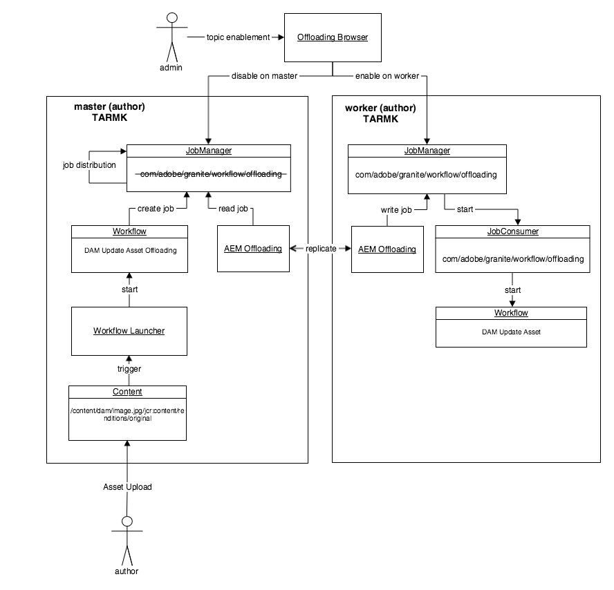
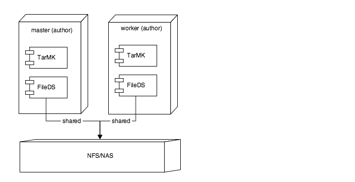

# Metodtips för att avlasta resurser {#assets-offloading-best-practices}

>[!CAUTION]
>
>AEM 6.4 har nått slutet på den utökade supporten och denna dokumentation är inte längre uppdaterad. Mer information finns i [teknisk supportperiod](https://helpx.adobe.com/support/programs/eol-matrix.html). Hitta de versioner som stöds [här](https://experienceleague.adobe.com/docs/).

>[!WARNING]
>
>Den här funktionen är föråldrad [!DNL Experience Manager] 6.4 och framåt och tas bort i [!DNL Experience Manager] 6.5. Planera därefter.

Att hantera stora filer och köra arbetsflöden i Adobe Experience Manager Assets kan ta mycket processorkraft, minne och I/O-resurser i anspråk. I synnerhet kan storleken på resurser, arbetsflöden, antalet användare och frekvensen för tillgångsinmatning påverka systemets totala prestanda. De mest resurskrävande åtgärderna är bland annat arbetsflöden för tillgångsinmatning och replikering. Intensiv användning av dessa arbetsflöden i en enda redigeringsinstans kan påverka redigeringseffektiviteten negativt.

Genom att avlasta dessa uppgifter för dedikerade arbetarinstanser kan du minska kostnaderna för processor, minne och IO. I allmänhet är tanken bakom avlastning att distribuera uppgifter som förbrukar intensiva processor-/minnes-/IO-resurser till dedikerade arbetarinstanser. Följande avsnitt innehåller rekommenderade användningsfall för avlastning av resurser.

## [!DNL Experience Manager Assets] Avlastning {#aem-assets-offloading}

[!DNL Experience Manager] Resurser implementerar ett internt resursspecifikt arbetsflödestillägg för avlastning. Det bygger på det allmänna arbetsflödestillägget som avlastningsramverket erbjuder, men innehåller ytterligare resursspecifika funktioner i implementeringen. Målet med resursavlastning är att effektivt köra arbetsflödet för DAM-uppdatering av tillgångar på en överförd resurs. Genom att avlasta resurser får du bättre kontroll över arbetsflödena för att lägga in material.

## [!DNL Experience Manager] Resurser som avlastar komponenter {#aem-assets-offloading-components}

I följande diagram visas huvudkomponenterna i resursavlastningsprocessen:

### Arbetsflöde för DAM Update Asset Offloading {#dam-update-asset-offloading-workflow}

Arbetsflödet för DAM Update Asset Offloading körs på den primära (författarservern) på vilken användaren överför resurserna. Det här arbetsflödet utlöses av ett vanligt startprogram för arbetsflöden. I stället för att bearbeta den överförda resursen skapar det här avlastande arbetsflödet ett nytt jobb med hjälp av ämnet *com/adobe/granite/workflow/offloading*. Arbetsflödet för avlastning lägger till namnet på målarbetsflödet - arbetsflödet för DAM-uppdatering av resurs i det här fallet, och resursens sökväg till jobbets nyttolast. När avlastningsjobbet har skapats väntar avlastningsarbetsflödet på den primära instansen tills avlastningsjobbet har körts.

### Jobbhanterare {#job-manager}

Jobbhanteraren distribuerar nya jobb till arbetarinstanser. När du utformar distributionsmekanismen är det viktigt att ta hänsyn till ämnesaktivering. Jobb kan bara tilldelas till instanser där jobbets ämne är aktiverat. Inaktivera ämnet `com/adobe/granite/workflow/offloading` på den primära arbetaren och aktivera den på arbetaren för att säkerställa att jobbet har tilldelats arbetaren.

### [!DNL Experience Manager] avlastning {#aem-offloading}

Avlastningsramverket identifierar arbetsflödesavlastningsjobb som tilldelats arbetsinstanser och använder replikering för att fysiskt överföra dem, inklusive deras nyttolast (till exempel bilder som ska hämtas), till arbetare.

### Avlastning av arbetsflöde, jobbkonsument {#workflow-offloading-job-consumer}

När ett jobb har skrivits på arbetaren, anropar jobbchefen den jobbkonsument som ansvarar för *com/adobe/granite/workflow/offloading* ämne. Jobbkonsumenten kör sedan arbetsflödet DAM Update Asset på resursen.

## Sling Topology {#sling-topology}

Sling-topologigrupperna [!DNL Experience Manager] och gör det möjligt för dem att vara medvetna om varandra, oberoende av den underliggande persistensen. Denna egenskap hos Sling-topologin gör att du kan skapa topologier för icke-klustrade, grupperade och blandade scenarier. En instans kan visa egenskaper för hela topologin. Ramverket innehåller återanrop för avlyssning av ändringar i topologin (instanser och egenskaper). Sling-topologin utgör grunden för Sling-distribuerade jobb.

### Säljer distribuerade jobb {#sling-distributed-jobs}

Genom att skicka distribuerade jobb underlättas fördelningen av jobb mellan en uppsättning instanser som är medlemmar i topologin. Sling-jobb bygger på tanken på funktioner. Ett jobb definieras av dess jobbämne. För att köra ett jobb måste en instans tillhandahålla en jobbkonsument för ett specifikt jobbämne. Jobbämnet är huvuddrivrutinen för distributionsmekanismen.

Jobb distribueras bara till instanser som tillhandahåller en jobbkonsument för ämnet. Genom att aktivera/inaktivera jobbkonsumenter på en instans kan du definiera en instans funktioner och påverka distributionsmekanismen. De tillgängliga jobbkonsumenterna i en instans sänds till hela topologin.

I det här sammanhanget innebär termen distribution tilldelning av ett jobb till en viss instans som ger en jobbkonsument. Tilldelningen till en instans lagras i databasen. Med andra ord kan Sling-distribuerade jobb tilldelas alla instanser i topologin som standard. Andra jobb kan bara köras av instanser som delar samma databas. Detta innebär att dessa jobb bara kan köras av instanser som tillhör samma kluster. Jobb som tilldelats till instanser av ett annat kluster körs inte.

### Ramverk för avlastning av Granit {#granite-offloading-framework}

Granite-avlastningsramverket kompletterar Sling-jobbdistributionen för att köra jobb som är tilldelade till icke-grupperade instanser. Den utför ingen distribution (instanstilldelning). Det identifierar emellertid Sling-jobb som distribuerats till icke-grupperade instanser och överför dem till målinstansen för körning. För närvarande används replikering för att utföra den här jobbtransporten vid avlastning. Om du vill köra ett jobb definierar avlastning indata och utdata, som sedan kombineras med jobbet för att skapa jobbnyttolasten.

Genom att skicka distribuerade jobb tillhandahålls jobb- och distributionsramverket. Avlastning av granit tar bara hand om transporten i det särskilda fall där jobb distribueras till icke-klustrade instanser.

Förutom transport innehåller avlastningsramverket ett tillägg för arbetsflödesmotorn. Det gör att ramverket kan skapa distribuerade jobb som en del av ett arbetsflöde och vänta tills de är klara, innan arbetsflödet går vidare. Den implementeras med arbetsflödets API för externt steg från arbetsflödesmotorn. Ett av tilläggen underlättar allmän distribution av arbetsflöden. Det går inte att distribuera enstaka arbetsflödessteg.

Avlastningsramverket har också ett användargränssnitt (UI) för att visualisera och kontrollera aktiveringen av jobbämnen i hela topologin. Med användargränssnittet kan du enkelt konfigurera ämnesraden för Sling-distribuerade jobb. Du kan också konfigurera avlastning utan användargränssnittet.

## Allmänna riktlinjer och bästa metoder för tillgångsavlastning {#general-guidance-and-best-practices-for-asset-offloading}

Alla implementeringar är unika och därför finns det ingen avlastningskonfiguration som passar alla. I följande avsnitt ges vägledning och bästa metoder för att ta bort innehåll från resurser.

Avlastning av tillgångar medför också allmänna kostnader för systemet, inklusive driftskostnader. Om du stöter på problem med resursinmatningsbelastningen rekommenderar Adobe att du först förbättrar konfigurationen utan att ta bort inläsningen. Tänk på följande alternativ innan du flyttar till tillgångsavlastning:

* Skala upp maskinvara
* Optimera arbetsflöden
* Använd tillfälliga arbetsflöden
* Begränsa antalet kärnor som används för arbetsflöden

Om du kommer fram till att avlastning av resurser är ett lämpligt sätt för dig ger Adobe följande vägledning:

* En TARMK-baserad distribution rekommenderas
* Avlastning av bensinbaserade resurser med tarMK är inte utformad för omfattande horisontell skalning
* Säkerställ att nätverksprestanda mellan författaren och arbetarna är tillfredsställande

### Rekommenderade resurser avlastar distributionen {#recommended-assets-offloading-deployment}

Med [!DNL Experience Manager] och Oak, det finns flera möjliga distributionsscenarier. För avlastning av resurser rekommenderas en TARMK-baserad distribution med ett delat datalager. I följande diagram visas den rekommenderade distributionen:

Mer information om hur du konfigurerar ett datalager finns i [Konfigurera nodarkiv och datalager i AEM](../sites-deploying/data-store-config.md).

### Stänger av automatisk agenthantering {#turning-off-automatic-agent-management}

Adobe rekommenderar att du inaktiverar automatisk agenthantering eftersom den inte har stöd för binär replikering och kan skapa förvirring när du konfigurerar en ny avlastningstopologi. Dessutom stöder den inte automatiskt det framåtriktade replikeringsflöde som krävs för binär replikering.

1. Öppna Configuration Manager från URL:en `http://localhost:4502/system/console/configMgr`.
1. Öppna konfigurationen för `OffloadingAgentManager` (`http://localhost:4502/system/console/configMgr/com.adobe.granite.offloading.impl.transporter.OffloadingAgentManager`).
1. Inaktivera automatisk agenthantering.

### Använda framåtreplikering {#using-forward-replication}

Som standard används omvänd replikering för att hämta avlastade resurser från arbetaren till den primära resursen för att avlasta transporten. Omvända replikeringsagenter stöder inte binär replikering. Du bör konfigurera avlastning för att använda framåtreplikering för att överföra avlastade resurser från arbetare till primär.

1. Om du migrerar från standardkonfigurationen med omvänd replikering kan du inaktivera eller ta bort alla agenter med namnet &quot; `offloading_outbox`&quot; och &quot; `offloading_reverse_*`&quot; på primär och arbetare, där &amp;ast; representerar Sling-ID för målinstansen.
1. Skapa en ny framåtriktad replikeringsagent som pekar på den primära för varje arbetare. Proceduren är densamma som att skapa framåtagenter från primär till arbetare. Se [Skapar replikeringsagenter för avlastning](../sites-deploying/offloading.md#creating-replication-agents-for-offloading) för instruktioner om hur du ställer in avlastning av replikeringsagenter.
1. Öppna konfiguration för `OffloadingDefaultTransporter`  (`http://localhost:4502/system/console/configMgr/com.adobe.granite.offloading.impl.transporter.OffloadingDefaultTransporter`).
1. Ändra värdet för egenskapen `default.transport.agent-to-master.prefix` från `offloading_reverse` till `offloading`.

<!-- TBD: Make updates to the configuration for allow and block list after product updates are done.
TBD: Update the property in the last step when GRANITE-30586 is fixed.
-->

### Använda delad datalager och binär replikering mellan författare och arbetare  {#using-shared-datastore-and-binary-less-replication-between-author-and-workers}

Du bör använda binär replikering utan att använda binärfiler för att minska transportkostnaderna vid avlastning av resurser. Om du vill veta hur du konfigurerar binär replikering utan att använda binärfiler för ett delat datalager kan du läsa mer i [Konfigurera nodarkiv och datalager i AEM](/help/sites-deploying/data-store-config.md). Proceduren skiljer sig inte åt när det gäller avlastning av resurser, förutom att den omfattar andra replikeringsagenter. Eftersom binärfri replikering endast fungerar med framåtriktade replikeringsagenter bör du även använda framåtreplikering för alla avlastningsagenter.

### Inaktivera transportpaket {#turning-off-transport-packages}

Som standard skapas ett innehållspaket som innehåller avlastningsjobbet och jobbnyttolasten (den ursprungliga resursen), och det här avlastningspaketet överförs med en enda replikeringsbegäran. Det är kontraproduktivt att skapa avlastningspaketen när binär replikering används, eftersom binärfiler serialiseras i paketet igen när paketet skapas. Användningen av dessa transportpaket kan stängas av, vilket gör att avlastningsjobbet och nyttolasten transporteras i flera replikeringsbegäranden, en för varje nyttolastpost. På så sätt kan fördelarna med binär replikering användas.

1. Öppna komponentkonfigurationen för *OffloadingDefaultTransporter* komponent vid [http://localhost:4502/system/console/configMgr/com.adobe.granite.offloading.impl.transporter.OffloadingDefaultTransporter](http://localhost:4502/system/console/configMgr/com.adobe.granite.offloading.impl.transporter.OffloadingDefaultTransporter)
1. Inaktivera egenskapen *Replikeringspaket (default.transport.contentpackage)*.

### Inaktivera transport av arbetsflödesmodell {#disabling-the-transport-of-workflow-model}

Som standard är *DAM - uppdatera tillgångsavlastning* avlastning av arbetsflöde lägger till arbetsflödesmodellen för att anropa arbetaren till jobbnyttolasten. Eftersom det här arbetsflödet följer körklart *DAM-uppdateringsresurs* som standard kan denna ytterligare nyttolast tas bort.

Om arbetsflödesmodellen är inaktiverad från jobbnyttolasten ska du se till att du distribuerar ändringar till den refererade arbetsflödesmodellen med andra verktyg, till exempel pakethanteraren.

Om du vill inaktivera transport av arbetsflödesmodellen ändrar du arbetsflödet DAM Update Asset Offloading.

1. Öppna arbetsflödeskonsolen från [http://localhost:4502/libs/cq/workflow/content/console.html](http://localhost:4502/libs/cq/workflow/content/console.html).
1. Öppna fliken Modeller.
1. Öppna arbetsflödesmodellen DAM Update Asset Offloading.
1. Öppna stegegenskaper för steget DAM Workflow Offloading.
1. Öppna fliken Argument och avmarkera alternativen Lägg till modell i indata och Lägg till modell i utdata.
1. Spara ändringarna i modellen.

### Optimera avsökningsintervallet {#optimizing-the-polling-interval}

Avlastning av arbetsflöde implementeras med ett externt arbetsflöde på den primära, som avsöker för slutförande av arbetsflödet som avlästs på arbetaren. Standardavsökningsintervallet för de externa arbetsflödesprocesserna är fem sekunder. Adobe rekommenderar att du ökar avsökningsintervallet för avlastningssteget Resurser till minst 15 sekunder för att minska avlastningskostnaderna för det primära.

1. Öppna arbetsflödeskonsolen från [http://localhost:4502/libs/cq/workflow/content/console.html](http://localhost:4502/libs/cq/workflow/content/console.html).

1. Öppna fliken Modeller.
1. Öppna arbetsflödesmodellen DAM Update Asset Offloading.
1. Öppna stegegenskaperna för steget DAM Workflow Offloading.
1. Öppna fliken Commons och justera värdet för egenskapen Period.
1. Spara ändringarna i modellen.

## Fler resurser {#more-resources}

Det här dokumentet fokuserar på tillgångsavlastning. Här följer ytterligare dokumentation om avlastning:

* [Avlastar jobb](/help/sites-deploying/offloading.md)
* [Resursarbetsflöde avlastare](/help/sites-administering/workflow-offloader.md)
