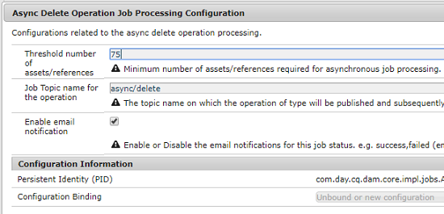

# Asynkrona åtgärder {#asynchronous-operations}

För att minska negativ påverkan på prestanda bearbetar [!DNL Adobe Experience Manger Assets] vissa långvariga och resurskrävande resursoperationer asynkront. Asynkron bearbetning innebär att du måste placera flera uppgifter i kö och sedan utföra dem på ett seriellt sätt beroende på om det finns systemresurser tillgängliga. Dessa åtgärder omfattar:

* Att ta bort många resurser..
* Flytta många resurser eller resurser med många referenser.
* Exportera och importera resursmetadata i grupp.

Du kan visa status för asynkrona uppgifter på sidan **[!UICONTROL Async Job Status]**.

>[!NOTE]
>
>Som standard körs [!DNL Assets]-åtgärderna parallellt. Om `N` är antalet processorkärnor kan `N/2`-aktiviteter köras parallellt som standard. Om du vill använda anpassade inställningar för uppgiftskön ändrar du **[!UICONTROL Async Operation Default Queue]**-konfigurationen från [!UICONTROL Web Console]. Mer information finns i [konfigurationer av kön](https://sling.apache.org/documentation/bundles/apache-sling-eventing-and-job-handling.html#queue-configurations).

## Övervaka status för asynkrona åtgärder {#monitoring-the-status-of-asynchronous-operations}

När [!DNL Assets] bearbetar en åtgärd asynkront får du ett meddelande i din [!DNL Experience Manager] [Inkorg](/help/sites-authoring/inbox.md) och via ett e-postmeddelande. Gå till sidan **[!UICONTROL Async Job Status]** för att se detaljerad status gällande asynkrona åtgärder.

1. I gränssnittet [!DNL Experience Manager] klickar du på **[!UICONTROL Operations]** > **[!UICONTROL Jobs]**.

1. Granska informationen om åtgärderna på sidan **[!UICONTROL Async Job Status]**.

   

   Information om förloppet för en åtgärd finns i kolumnen **[!UICONTROL Status]**. Beroende på förloppet visas ett av följande statusvärden:

   * **[!UICONTROL Active]**: åtgärden bearbetas.
   * **[!UICONTROL Success]**: åtgärden har slutförts.
   * **[!UICONTROL Fail]** eller **[!UICONTROL Error]**: det gick inte att bearbeta åtgärden.
   * **[!UICONTROL Scheduled]**: åtgärden är schemalagd för bearbetning vid ett senare tillfälle.

1. Om du vill avbryta en aktiv åtgärd markerar du den i listan och klickar på **[!UICONTROL Stop]**  i verktygsfältet.

1. Om du vill visa extra information, till exempel beskrivning och loggar, markerar du åtgärden och klickar på **[!UICONTROL Open]**  i verktygsfältet. Sidan med aktivitetsinformation visas.

   

1. Välj **[!UICONTROL Delete]** i verktygsfältet för att ta bort åtgärden från listan. Klicka på **[!UICONTROL Download]** för att ladda ned informationen i en CSV-fil.

   >[!NOTE]
   >
   >Du kan inte ta bort en uppgift om dess status är aktiv eller köad.

## Töm slutförda uppgifter {#purge-completed-tasks}

[!DNL Experience Manager Assets] kör en rensningsåtgärd varje dag i 010 timmar för att ta bort slutförda asynkrona uppgifter som är mer än en dag gamla.

<!-- TBD: Find out from the engineering team and mention the time zone of this 1:00 am task.
-->

Du kan ändra schemat för rensningsaktiviteten och hur länge information om slutförda uppgifter sparas innan de tas bort. Du kan också konfigurera det maximala antalet slutförda uppgifter för vilka information sparas när som helst.

1. I gränssnittet [!DNL Experience Manager] klickar du på **[!UICONTROL Tools]** > **[!UICONTROL Operations]** > **[!UICONTROL Web Console]**.
1. Öppna aktiviteten **[!UICONTROL Adobe CQ DAM Async Jobs Purge Scheduled]**.
1. Ange tröskelvärdet för antal dagar efter vilka slutförda uppgifter tas bort och det högsta antalet uppgifter som detaljerna sparas för i historiken. Spara ändringarna.

   

## Konfigurera tröskelvärde för asynkrona borttagningsåtgärder {#configure-thresholds-for-asynchronous-delete-operations}

Om antalet resurser eller mappar som ska tas bort överstiger det angivna tröskelvärdet, utförs borttagningsåtgärden asynkront.

1. I gränssnittet [!DNL Experience Manager] klickar du på **[!UICONTROL Tools]** > **[!UICONTROL Operations]** > **[!UICONTROL Web Console]**.
1. Öppna **[!UICONTROL Async Delete Operation Job Processing]**-konfigurationen från [!UICONTROL Web Console].
1. I rutan **[!UICONTROL Threshold number of assets]** anger du tröskelvärden för att ta bort resurser, mappar eller referenser asynkront. Spara ändringarna.

   

## Konfigurera tröskelvärde för asynkrona flyttåtgärder {#configure-thresholds-for-asynchronous-move-operations}

Om antalet resurser, mappar eller referenser som ska flyttas överstiger det angivna tröskelvärdet, utförs flyttåtgärden asynkront.

1. I gränssnittet [!DNL Experience Manager] klickar du på **[!UICONTROL Tools]** > **[!UICONTROL Operations]** > **[!UICONTROL Web Console]**.
1. Öppna **[!UICONTROL Async Move Operation Job Processing]**-konfigurationen från [!UICONTROL Web Console].
1. I rutan **[!UICONTROL Threshold number of assets/references]** anger du tröskelvärden för att flytta resurser, mappar eller referenser asynkront. Spara ändringarna.

   

>[!MORELIKETHIS]
>
>* [Konfigurera e-post i Experience Manager](/help/sites-administering/notification.md).
>* [Importera och exportera resursers metadata gruppvis](/help/assets/metadata-import-export.md).

