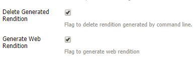

# Installera och konfigurera ImageMagick så att det fungerar med [!DNL Experience Manager Assets] {#install-and-configure-imagemagick-to-work-with-aem-assets}

>[!CAUTION]
>
>AEM 6.4 har nått slutet på den utökade supporten och denna dokumentation är inte längre uppdaterad. Mer information finns i [teknisk supportperiod](https://helpx.adobe.com/support/programs/eol-matrix.html). Hitta de versioner som stöds [här](https://experienceleague.adobe.com/docs/).

ImageMagick är en plugin för att skapa, redigera, komponera och konvertera bitmappsbilder. Det kan läsa och skriva bilder i olika format (över 200), bland annat PNG, JPEG, JPEG-2000, GIF, TIFF, DPX, EXR, WebP, Postscript, PDF och SVG. Använd ImageMagick för att ändra storlek, vända, spegla, rotera, förvränga, skeva och omforma bilder. Du kan också justera bildfärger, använda olika specialeffekter eller rita text, linjer, polygoner, ellipser och kurvor med ImageMagick.

Använd Adobe Experience Manager mediehanterare från kommandoraden för att bearbeta bilder via ImageMagick. Information om hur du arbetar med olika filformat med ImageMagick finns i [Metodtips för att skapa filformat](assets-file-format-best-practices.md). Mer information om alla filformat som stöds finns i [Format som stöds för resurser](assets-formats.md).

Om du vill bearbeta stora filer med ImageMagick bör du tänka på högre minneskrav än vanligt, möjliga ändringar av IM-policyer och den övergripande inverkan på prestanda. Minneskraven beror på olika faktorer som upplösning, bitdjup, färgprofil och filformat. Om du tänker bearbeta mycket stora filer med ImageMagick bör du testa [!DNL Experience Manager] server. Äntligen finns det resurser som kan vara till hjälp.

>[!NOTE]
>
>Om du använder [!DNL Experience Manager] om du planerar att bearbeta stora PSD- eller PSB-filer på Adobe Managed Services (AMS) kan du kontakta Adobe kundsupport. Det går inte att bearbeta PSB-filer med hög upplösning som är större än 30000 x 23000 pixlar i Experience Manager.

## Installera ImageMagick {#installing-imagemagick}

Det finns flera versioner av installationsfilerna för ImageMagic för olika operativsystem. Använd rätt version för ditt operativsystem.

1. Ladda ned [ImageMagick-installationsfiler](https://www.imagemagick.org/script/download.php) för ditt operativsystem.
1. Installera ImageMagick på disken som är värd för [!DNL Experience Manager] startar du installationsfilen.

1. Ange miljövariabeln path till installationskatalogen för ImageMagic.
1. Kontrollera om installationen lyckades genom att köra `identify -version` -kommando.

## Ställa in kommandoradens processsteg {#set-up-the-command-line-process-step}

Du kan ställa in kommandoradens processsteg för ditt särskilda användningsfall. Följ de här stegen för att generera en bild och miniatyrbilder som har vänts (140x100, 48x48, 319x319 och 1280x1280) varje gång du lägger till en JPEG-bildfil i `/content/dam` på [!DNL Experience Manager] server:

1. På [!DNL Experience Manager] server, gå till Workflow Console (`https://[aem_server]:[Port]/workflow`) och öppna **[!UICONTROL DAM Update Asset]** arbetsflödesmodell.
1. Från **[!UICONTROL DAM Update Asset]** arbetsflödesmodell, öppna **[!UICONTROL EPS thumbnails (powered by ImageMagick)]** steg.
1. I **[!UICONTROL Arguments tab]**, lägga till `image/jpeg` till **[!UICONTROL Mime Types]** lista.

   

1. I **[!UICONTROL Commands]** anger du följande kommando:

   `convert ./${filename} -flip ./${basename}.flipped.jpg`

1. Välj **[!UICONTROL Delete Generated Rendition]** och **[!UICONTROL Generate Web Rendition]** flaggor.

   

1. I **[!UICONTROL Web Enabled Image]** anger du information för återgivningen med måtten 1 280 × 1 280 pixlar. Dessutom anger du i *bild/jpeg* i **[!UICONTROL Mimetype]** box.

   

1. Tryck/klicka på **[!UICONTROL OK]** för att spara ändringarna.

   >[!NOTE]
   >
   >The `convert` -kommandot kanske inte kan köras med vissa Windows-versioner (till exempel Windows SE) eftersom det är i konflikt med det inbyggda `convert` som ingår i Windows-installationen. I det här fallet anger du den fullständiga sökvägen för verktyget ImageMagick. Ange t.ex.
   >
   >`"C:\Program Files\ImageMagick-6.8.9-Q16\convert.exe" -define jpeg:size=319x319 ./${filename} -thumbnail 319x319 cq5dam.thumbnail.319.319.png`

1. Öppna **[!UICONTROL Process Thumbnails]** och lägga till MIME-typen `image/jpeg` under **[!UICONTROL Skip Mime Types]**.

   

1. I **[!UICONTROL Web Enabled Image]** lägger du till MIME-typen `image/jpeg` under **[!UICONTROL Skip List]**. Tryck/klicka på **[!UICONTROL OK]** för att spara ändringarna.

   

1. Spara arbetsflödet.
1. Om du vill kontrollera om ImageMagic kan bearbeta bilderna på rätt sätt överför du en JPG-bild till [!DNL Assets]. Kontrollera om en bild som har vänts och återgivningarna genereras för den.

## Minska säkerhetsluckor {#mitigating-security-vulnerabilities}

Det finns flera säkerhetsluckor i samband med användning av ImageMagick för att bearbeta bilder. Att bearbeta bilder som skickas in av användaren innebär till exempel en risk för fjärrexekvering av kod (RCE).

Dessutom är olika bildbehandlingsplugins beroende av ImageMagick-biblioteket, inklusive, men inte begränsat till, PHP:s bild, Rubys magick och paperclip samt Node.js imagemagick.

Om du använder ImageMagick eller ett drabbat bibliotek rekommenderar Adobe att du åtgärdar de kända säkerhetsluckorna genom att utföra minst en av följande åtgärder (men helst båda):

1. Verifiera att alla bildfiler börjar med det förväntade [&quot;magiska byte&quot;](https://en.wikipedia.org/wiki/List_of_file_signatures) motsvarar de bildfiltyper som du stöder innan du skickar dem till ImageMagick för bearbetning.
1. Använd en principfil för att inaktivera sårbara ImageMagick-kodare. Den globala principen för ImageMagick finns på `/etc/ImageMagick`.

>[!MORELIKETHIS]
>
>* [Bästa tillvägagångssätt för att bearbeta olika filformat med [!DNL Assets]](assets-file-format-best-practices.md)
>* [Kommandoradsalternativ för ImageMagick](https://www.imagemagick.org/script/command-line-options.php)
>* [Grundläggande och avancerade exempel på användning av ImageMagick](https://www.imagemagick.org/Usage/)
>* [Prestandajustering för resurser för ImageMagick](performance-tuning-guidelines.md)
>* [Fullständig lista över filformat som stöds av [!DNL Assets]](assets-formats.md)
>* [Förstå filformat och minneskostnad för bilder](https://www.scantips.com/basics1d.html)

