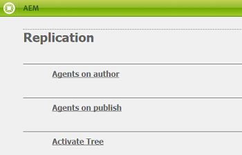

# Konfigurera AEM Assets-integrering med varumärkesportalen {#configure-aem-assets-integration-with-brand-portal}

Lär dig hur du integrerar AEM Assets med varumärkesportalen för publicering av resurser och samlingar på varumärkesportalen.

Om du är kund hos Adobe Experience Manager (AEM) Assets Brand Portal kan du integrera AEM Assets med varumärkesportalen för att möjliggöra publicering av resurser på varumärkesportalen. Du kan konfigurera den här integreringen med gränssnittet i Adobe.io.

> [!Note]
>
>Adobe rekommenderar att du uppgraderar till AEM 6.4.1.0 eller senare för att säkerställa att AEM Assets Brand Portal är integrerad med AEM Assets. En begränsning i AEM 6.4 ger ett fel när integreringen med varumärkesportalen konfigureras och replikeringen misslyckas.

Skapa först ett program, som innehåller en autentiseringsmekanism, i den offentliga gatewayen för Marketing Cloud. Skapa sedan en profil i din AEM Resurser-instans med det program-ID som du får från gatewayen.

Använd den här konfigurationen för att publicera resurser från AEM Assets till varumärkesportalen. I bakgrunden autentiserar AEM-servern din profil med gatewayen och integrerar sedan AEM Assets med Brand Portal.

>[!NOTE]
>
>Användargränssnittet för konfigurering av autentiseringsintegreringar finns på [https://legacy-oauth.cloud.adobe.io/](https://legacy-oauth.cloud.adobe.io/), som tidigare fanns på [https://marketing.adobe.com/developer/](https://marketing.adobe.com/developer/).

## Skapa JWT-program {#create-jwt-application}

1. Logga in på [https://legacy-oauth.cloud.adobe.io/](https://legacy-oauth.cloud.adobe.io/) med ditt Adobe ID. Sidan [!UICONTROL JWT-program] visas.

   >[!NOTE]
   >
   >Du kan bara skapa ett program-ID om du är systemadministratör för din organisation. Klientorganisationen är det tekniska namnet för din organisation som är registrerad hos Adobe Marketing Cloud.

2. Välj **[!UICONTROL Lägg till program]** för att skapa ett program.
3. Ange ett **[!UICONTROL programnamn]** och en valfri **[!UICONTROL beskrivning]**.
4. I listan **[!UICONTROL Organisation]** väljer du den organisation som du vill synkronisera resurser för.
5. Välj **[!UICONTROL dam-read]** , **[!UICONTROL dam-sync]**, **[!UICONTROL dam-write]** och **[!UICONTROL cc-share]** i listan **[!UICONTROL Scope]**.
6. Tryck/klicka på **[!UICONTROL Lägg till]**. Ett JWT-tjänstprogram skapas. Du kan redigera programmet och sedan spara.
7. Kopiera det program-ID som genereras för det nya programmet.

   >[!NOTE]
   >
   >Se till att du inte oavsiktligt kopierar programhemligheten i stället för program-ID.

## Skapa en ny molnkonfiguration {#create-a-new-cloud-configuration}

1. På **[!UICONTROL navigeringssidan]** i den lokala AEM Resurser-instansen trycker/klickar du på ikonen **[!UICONTROL Verktyg]** till vänster.

   

2. Gå till **[!UICONTROL molntjänster > Äldre molntjänster]**.

   

3. Gå till [!UICONTROL Cloud Services] -sidan och leta upp tjänsten **[!UICONTROL Assets Brand Portal]** under **[!UICONTROL Adobe Experience Cloud]**.

   

4. Tryck/klicka på länken **[!UICONTROL Konfigurera nu]** under tjänsten för att visa dialogrutan [Skapa konfiguration] .
5. I dialogrutan [!UICONTROL Skapa konfiguration] anger du en rubrik och ett namn för den nya konfigurationen och trycker/klickar på **[!UICONTROL Skapa]**.

   

6. I dialogrutan [!UICONTROL AEM Assets Brand Portal Replication] anger du organisationens URL i fältet [!UICONTROL Klient-URL] .
7. I fältet [!UICONTROL Klient-ID] klistrar du in det program-ID som du kopierade i slutet av proceduren [Skapa ett program](#create-jwt-application). Click **[!UICONTROL OK]**.

   

8. Om du vill göra resurserna (publicerade från AEM) tillgängliga för alla användare av varumärkesportalen markerar du kryssrutan Publicera i **[!UICONTROL gemensam mapp]** .

   >[!NOTE]
   >
   >Alternativet att aktivera publicering av **[!UICONTROL gemensamma mappar]** är tillgängligt i AEM 6.3.2.1 och senare.

9. På sidan Konfiguration [!UICONTROL av] varumärkesportal trycker/klickar du på **[!UICONTROL Visa offentlig nyckel]** för att visa den offentliga nyckel som genererats för instansen.

   

   Du kan också klicka på **[!UICONTROL Hämta offentlig nyckel för OAuth Gateway]** för att hämta filen som innehåller den offentliga nyckeln. Öppna sedan filen för att visa den offentliga nyckeln.

## Aktivera integrering {#enable-integration}

1. Visa den offentliga nyckeln med någon av följande metoder som nämns i det sista steget i proceduren [Lägg till en ny konfiguration i Marketing Cloud](#create-a-new-cloud-configuration).

   * Klicka på knappen **[!UICONTROL Visa offentlig nyckel]** för att visa nyckeln.
   * Öppna den hämtade filen som innehåller nyckeln.

2. Öppna gränssnittet för Marketing Cloud Developer Connection och klicka på det program du skapade i [Skapa ett program](#create-jwt-application).
3. Klistra in den offentliga nyckeln i fältet **[!UICONTROL Offentlig nyckel]** i konfigurationsgränssnittet
4. Tryck/klicka på **[!UICONTROL Spara]**. Ett meddelande bekräftar att programmet har uppdaterats.

## Testa integreringen {#test-the-integration}

1. På **[!UICONTROL navigeringssidan]** i den lokala AEM Resurser-instansen klickar du på ikonen **[!UICONTROL Verktyg]** till vänster.

   

2. Navigera till **[!UICONTROL Distribution > Replikering]**.

   

3. På sidan [!UICONTROL Replikering] trycker/klickar du på **[!UICONTROL Agenter på författaren]**.

   

4. Kontrollera anslutningen mellan AEM Author och Brand Portal genom att öppna någon av de fyra replikeringsagenterna och klicka på **[!UICONTROL Testa anslutning]**.

   >[!NOTE]
   >
   >Replikeringsagenterna arbetar parallellt och delar jobbdistributionen jämnt, vilket ökar publiceringshastigheten fyra gånger den ursprungliga hastigheten. När molntjänsten har konfigurerats krävs ingen ytterligare konfiguration för att aktivera de replikeringsagenter som aktiveras som standard för att aktivera parallell publicering av flera resurser.

   >[!NOTE]
   >
   >Undvik att inaktivera någon av replikeringsagenterna eftersom det kan göra att replikeringen av vissa resurser misslyckas.

   

5. Titta på testresultatens nedre del för att kontrollera att replikeringen lyckades.

   

När replikeringen är klar kan du publicera resurser, mappar och samlingar på varumärkesportalen. Mer information finns i:

* [Publicera resurser och mappar på varumärkesportalen](brand-portal-publish-folder.md)
* [Publicera samlingar på varumärkesportalen](brand-portal-publish-collection.md)

## Publicera resurser på varumärkesportalen {#publish-assets-to-brand-portal}

När replikeringen är klar kan du publicera resurser, mappar och samlingar på varumärkesportalen. Så här publicerar du resurser på varumärkesportalen:

>[!NOTE]
>
>Adobe rekommenderar att publiceringen staggats, helst under icke-topp-timmar, så att AEM-författaren inte tar upp för mycket resurser.

1. I resurskonsolen håller du muspekaren över de önskade resurserna och väljer **[!UICONTROL alternativet Publicera]** bland snabbåtgärderna.

   Du kan också välja de resurser du vill publicera på varumärkesportalen.

   

2. Det finns två tillgängliga alternativ för att publicera resurserna på varumärkesportalen:
   * [Publicera resurser direkt](#publish-now)
   * [Publicera resurser senare](#publish-later)

### Publicera resurser nu {#publish-now}

Gör något av följande om du vill publicera de markerade resurserna på varumärkesportalen:

* Välj **[!UICONTROL Snabbpublicering]** i verktygsfältet. Välj sedan **[!UICONTROL Publicera på varumärkesportalen]** på menyn.

* Välj **[!UICONTROL Hantera publikation]** i verktygsfältet.

   1. Välj sedan **[!UICONTROL Publicera på varumärkesportal]** i **[!UICONTROL Åtgärd]** och välj **[!UICONTROL Now]** i **[!UICONTROL Scheduling]**. Tryck/klicka på **[!UICONTROL Nästa].**

   2. Bekräfta ditt val inom **[!UICONTROL scopet]** och tryck/klicka på **[!UICONTROL Publicera på varumärkesportalen]**.

Ett meddelande visas som anger att resurserna har placerats i kö för publicering på varumärkesportalen. Logga in i gränssnittet för varumärkesportalen för att se de publicerade resurserna.

### Publicera resurser senare {#publish-later}

Så här schemalägger du publicering av resurser på varumärkesportalen till ett senare datum eller en senare tidpunkt:

1. När du har valt resurser/mappar att publicera väljer du **[!UICONTROL Hantera publikation]** i verktygsfältet högst upp.
2. På sidan **[!UICONTROL Hantera publikation]** väljer du **[!UICONTROL Publicera på varumärkesportal]** från **[!UICONTROL åtgärd]** och väljer **[!UICONTROL Senare]** från **[!UICONTROL Schemaläggning]**.

   

3. Välj ett **[!UICONTROL aktiveringsdatum]** och ange tid. Tryck/klicka på **[!UICONTROL Nästa]**.
4. Välj ett **[!UICONTROL aktiveringsdatum]** och ange tid. Tryck/klicka på **[!UICONTROL Nästa]**.
5. Ange en arbetsflödesrubrik under **[!UICONTROL Arbetsflöden]**. Tryck/klicka på **[!UICONTROL Publicera senare]**.

   

Logga nu in på Brand Portal för att se om de publicerade resurserna finns i gränssnittet Brand Portal.

