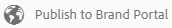

# Publicera samlingar på varumärkesportalen {#publish-collections-to-brand-portal}

>[!CAUTION]
>
>AEM 6.4 har nått slutet på den utökade supporten och denna dokumentation är inte längre uppdaterad. Mer information finns i [teknisk supportperiod](https://helpx.adobe.com/support/programs/eol-matrix.html). Hitta de versioner som stöds [här](https://experienceleague.adobe.com/docs/).

Som Adobe Experience Manager Assets-administratör kan du publicera samlingar på [!DNL Experience Manager Assets Brand Portal] -instans för din organisation. Du måste dock först integrera Assets med Brand Portal. Mer information finns i [Konfigurera Assets med varumärkesportalen](configure-aem-assets-with-brand-portal.md).

Om du gör senare ändringar i den ursprungliga samlingen i Assets återspeglas inte ändringarna i Brand Portal förrän du publicerar samlingen igen. Den här egenskapen ser till att ändringar i pågående arbete inte är tillgängliga i Brand Portal. Endast godkända ändringar som publiceras av en administratör finns i varumärkesportalen.

>[!NOTE]
>
>Det går inte att publicera innehållsfragment på varumärkesportalen. Om du väljer innehållsfragment på [!DNL Experience Manager] Författare, sedan **[Publicera till Brand Portal]** åtgärden är inte tillgänglig.
>
>Om samlingar som innehåller innehållsfragment publiceras från [!DNL Experience Manager] Om du skriver till Brand Portal replikeras allt innehåll i mappen utom innehållsfragment till Brand Portal-gränssnittet.

## Publicera en samling på Brand Portal {#publish-a-collection-to-brand-portal}

1. Tryck/klicka på knappen [!DNL Experience Manager] logotyp. Gå sedan till **[!UICONTROL Assets > Collections]** från **[!UICONTROL Navigation]** sida.
2. På Samlingar-konsolen väljer du den samling du vill publicera till Brand Portal.

   

3. Tryck/klicka i verktygsfältet **[!UICONTROL Publish to Brand Portal]**.

   

4. I bekräftelsedialogrutan: tryck/klicka **[!UICONTROL Publish]**.
5. Stäng bekräftelsemeddelandet.
6. Logga in på Brand Portal som administratör. Den publicerade samlingen är tillgänglig i samlingskonsolen.

   

## Avpublicera samlingar {#unpublish-collections}

Du kan avpublicera samlingar som du publicerar från Assets till Brand Portal. När du har avpublicerat originalsamlingen är kopian inte längre tillgänglig för Brand Portal-användare.

1. Från Samlingar-konsolen i [!DNL Assets] och välj den samling som du vill avpublicera.

   

2. Tryck/klicka på knappen **[!UICONTROL Remove from Brand Portal]** ikon.

   

3. Tryck/klicka i dialogrutan **[!UICONTROL Unpublish]**.
4. Stäng bekräftelsemeddelandet. Samlingen tas bort från varumärkesportalens gränssnitt.
