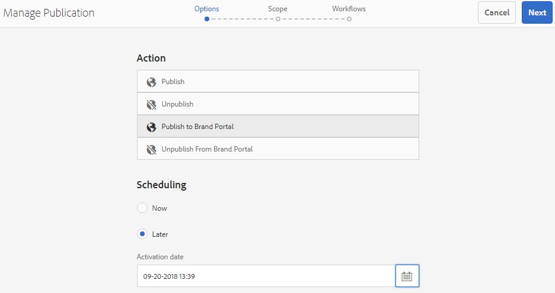

# Publicera mappar på varumärkesportalen {#publish-folders-to-brand-portal}

Som administratör för Adobe Experience Manager-resurser (AEM) kan du publicera resurser och mappar i instansen av AEM Assets Brand Portal (eller schemalägga publiceringsarbetsflödet till ett senare datum/tid) för organisationen. Du måste dock först integrera AEM Assets med varumärkesportalen. Mer information finns i [Konfigurera AEM Assets-integrering med varumärkesportalen](brand-portal-configuring-integration.md).

När du har publicerat en resurs eller mapp är den tillgänglig för användare i varumärkesportalen.

Om du gör senare ändringar av den ursprungliga resursen eller mappen i AEM Resurser återspeglas inte ändringarna i Varumärkeportalen förrän du publicerar resursen eller mappen på nytt. Den här funktionen ser till att pågående ändringar inte är tillgängliga i varumärkesportalen. Endast godkända ändringar som publiceras av en administratör är tillgängliga i varumärkesportalen.

## Publicera mappar på varumärkesportalen {#publish-folders-to-brand-portal-1}

1. I gränssnittet för AEM Resurser håller du pekaren över den önskade mappen och väljer **[!UICONTROL alternativet Publicera]** bland snabbåtgärderna.

   Du kan också markera önskad mapp och följa stegen nedan.

   

2. **Publicera mappar nu**

   Om du vill publicera de markerade mapparna på varumärkesportalen gör du något av följande:

   * Välj **[!UICONTROL Snabbpublicering]** i verktygsfältet. Välj sedan **[!UICONTROL Publicera på varumärkesportalen]** på menyn.
   * Välj **[!UICONTROL Hantera publikation]** i verktygsfältet.

3. Välj sedan **[!UICONTROL Publicera på varumärkesportal]** i **[!UICONTROL Åtgärd]** och välj **[!UICONTROL Now]** i **[!UICONTROL Scheduling]**. Tryck på **[!UICONTROL Nästa].**
4. Bekräfta ditt val inom **[!UICONTROL scopet]** och tryck på **[!UICONTROL Publicera på varumärkesportalen]**.

   Det visas ett meddelande om att mappen har placerats i kö för publicering på varumärkesportalen. Logga in i gränssnittet för varumärkesportalen för att se den publicerade mappen.

   **Publicera mappar senare**

   Så här schemalägger du arbetsflödet för publicering till varumärkesportalen för resursmappar till ett senare datum eller en senare tidpunkt:

   1. När du har valt resurser/mappar att publicera väljer du **[!UICONTROL Hantera publikation]** i verktygsfältet högst upp.
   2. På sidan **[!UICONTROL Hantera publikation]** väljer du **[!UICONTROL Publicera på varumärkesportal]** från **[!UICONTROL åtgärd]** och väljer **[!UICONTROL Senare]** från **[!UICONTROL Schemaläggning]**.

      

   3. Välj ett **[!UICONTROL aktiveringsdatum]** och ange tid. Tryck på **[!UICONTROL Nästa]**.
   4. Bekräfta ditt val i **[!UICONTROL Omfång]**. Tryck på **[!UICONTROL Nästa]**.
   5. Ange en arbetsflödesrubrik under **[!UICONTROL Arbetsflöden]**. Tryck på **[!UICONTROL Publicera senare]**.

      

## Avpublicera mappar från varumärkesportalen {#unpublish-folders-from-brand-portal}

Du kan ta bort alla resursmappar som publicerats på varumärkesportalen genom att avpublicera dem från AEM Author-instansen. När du har avpublicerat originalmappen är dess kopia inte längre tillgänglig för användare av varumärkesportalen.

Du kan avpublicera mappar från varumärkesportalen snabbt eller schemalägga dem för ett senare datum och en senare tidpunkt. Så här avpublicerar du resursmappar från varumärkesportalen:

1. I gränssnittet AEM Resurser i AEM Author-instansen väljer du den mapp du vill avpublicera.

   

2. Tryck/klicka på **[!UICONTROL Hantera publikation]** i verktygsfältet.

3. **Avpublicera från varumärkesportalen nu**

   Så här avpublicerar du snabbt den önskade mappen från varumärkesportalen:

   1. På sidan **[!UICONTROL Hantera publikation]** väljer du **[!UICONTROL Avpublicera från]** varumärkesportalen **[!UICONTROL i Åtgärd]** och **[!UICONTROL Schemaläggning]** väljer **[!UICONTROL nu]**.
   2. Tryck/klicka på **[!UICONTROL Nästa].**
   3. Bekräfta ditt val i **[!UICONTROL Scope]** och tryck på **[!UICONTROL Avpublicera från varumärkesportalen]**.
   

   **Avpublicera från varumärkesportalen senare**

   Så här schemalägger du publiceringen av en mapp från varumärkesportalen till ett senare datum och en senare tidpunkt:

   1. På sidan **[!UICONTROL Hantera publikation]** väljer du **[!UICONTROL Avpublicera från]** varumärkesportalen **[!UICONTROL i]** Åtgärd **[!UICONTROL och välj]** Senare **[!UICONTROL i]Schemaläggning.**
   2. Välj ett **[!UICONTROL aktiveringsdatum]** och ange tid. Tryck på **[!UICONTROL Nästa]**.
   3. Bekräfta ditt val inom **[!UICONTROL Omfång]** och tryck på **[!UICONTROL Nästa]**.
   4. Ange en **[!UICONTROL arbetsflödesrubrik]** under **[!UICONTROL Arbetsflöden]**. Tryck på **[!UICONTROL Avpublicera senare].**

      

>[!NOTE]
>
>Proceduren för att publicera/avpublicera en resurs till/från varumärkesportalen liknar motsvarande procedur för en mapp.
