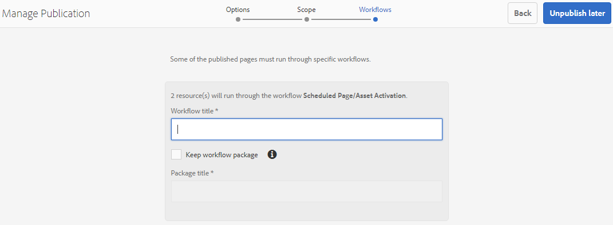

# Publicera mappar på varumärkesportalen {#publish-folders-to-brand-portal}

Som Adobe Experience Manager (AEM) Assets-administratör kan du publicera resurser och mappar till AEM Assets Brand Portal-instansen (eller schemalägga publiceringsarbetsflödet till ett senare datum/tid) för din organisation. Du måste dock först integrera AEM Assets med Brand Portal. Mer information finns i [Konfigurera AEM Assets med varumärkesportalen](configure-aem-assets-with-brand-portal.md).

När du har publicerat en resurs eller mapp är den tillgänglig för användare i varumärkesportalen.

Om du gör senare ändringar i den ursprungliga resursen eller mappen i AEM Assets återspeglas inte ändringarna i varumärkesportalen förrän du publicerar resursen eller mappen på nytt. Funktionen säkerställer att pågående ändringar inte finns i varumärkesportalen. Endast godkända ändringar som publiceras av en administratör finns i varumärkesportalen.

## Publicera mappar på varumärkesportalen {#publish-folders-to-brand-portal-1}

1. I AEM Assets-gränssnittet för du pekaren över den önskade mappen och väljer **[!UICONTROL Publish]**-alternativ bland snabbåtgärderna.

   Du kan också markera önskad mapp och följa stegen nedan.

   

2. **Publicera mappar nu**

   Gör något av följande för att publicera de markerade mapparna på varumärkesportalen:

   * Välj **[!UICONTROL Quick Publish]** i verktygsfältet. Välj sedan **[!UICONTROL Publish to Brand Portal]** på menyn.
   * Välj **[!UICONTROL Manage Publication]** i verktygsfältet.

3. Välj sedan **[!UICONTROL Publish to Brand Portal]** från **[!UICONTROL Action]** och välj **[!UICONTROL Now]** från **[!UICONTROL Scheduling]**. Tryck på **[!UICONTROL Next].**
4. Bekräfta ditt val i **[!UICONTROL Scope]** och tryck på **[!UICONTROL Publish to Brand Portal]**.

   Ett meddelande visas som anger att mappen har placerats i kö för publicering på varumärkesportalen. Logga in i gränssnittet för varumärkesportalen för att se den publicerade mappen.

   **Publicera mappar senare**

   Så här schemalägger du arbetsflödet för publicering till varumärkesportalen för resursmappar till ett senare datum eller en senare tidpunkt:

   1. När du har valt resurser/mappar att publicera väljer du **[!UICONTROL Manage Publication]** i verktygsfältet högst upp.
   2. På sidan **[!UICONTROL Manage Publication]** väljer du **[!UICONTROL Publish to Brand Portal]** från **[!UICONTROL Action]** och väljer **[!UICONTROL Later]** från **[!UICONTROL Scheduling]**.

      

   3. Markera en **[!UICONTROL Activation date]** och ange en tid. Tryck på **[!UICONTROL Next]**.
   4. Bekräfta ditt val i **[!UICONTROL Scope]**. Tryck på **[!UICONTROL Next]**.
   5. Ange en arbetsflödestitel under **[!UICONTROL Workflows]**. Tryck på **[!UICONTROL Publish Later]**.

      

## Avpublicera mappar från varumärkesportalen {#unpublish-folders-from-brand-portal}

Du kan ta bort alla resursmappar som publicerats på varumärkesportalen genom att avpublicera dem från AEM Author-instansen. När du har avpublicerat originalmappen har varumärkesportalens användare har inte längre tillgång till kopian.

Du kan avpublicera mappar från varumärkesportalen snabbt eller schemalägga dem för ett senare datum och en senare tidpunkt. Gör så här för att avpublicerar resursmappar från varumärkesportalen:

1. I AEM Assets-gränssnittet i AEM Author-instansen väljer du den mapp du vill avpublicera.

   

2. Tryck/klicka på **[!UICONTROL Manage Publication]** i verktygsfältet.

3. **Avpublicera från varumärkesportalen nu**

   Så här avpublicerar du snabbt den önskade mappen från varumärkesportalen:

   1. På sidan **[!UICONTROL Manage Publication]** väljer du **[!UICONTROL Action]** från **[!UICONTROL Unpublish from Brand Portal]** och från **[!UICONTROL Scheduling]** **[!UICONTROL Now]**.
   2. Tryck/klicka på **[!UICONTROL Next].**
   3. Bekräfta ditt val i **[!UICONTROL Scope]** och tryck på **[!UICONTROL Unpublish from Brand Portal]**.

   

   **Avpublicera från varumärkesportalen senare**

   Så här schemalägger du publiceringen av en mapp från varumärkesportalen till ett senare datum och en senare tidpunkt:

   1. På **[!UICONTROL Manage Publication]**-sidan väljer du **[!UICONTROL Action]** från **[!UICONTROL Unpublish from Brand Portal]** och från **[!UICONTROL Scheduling]** välj **[!UICONTROL Later].**
   2. Markera ett **[!UICONTROL Activation date]** och ange tiden. Tryck på **[!UICONTROL Next]**.
   3. Bekräfta ditt val i **[!UICONTROL Scope]** och tryck på **[!UICONTROL Next]**.
   4. Ange **[!UICONTROL Workflow title]** under **[!UICONTROL Workflows]**. Tryck på **[!UICONTROL Unpublish Later].**

      

>[!NOTE]
>
>Proceduren för att publicera/avpublicera en resurs till/från varumärkesportalen liknar motsvarande procedur för en mapp.
