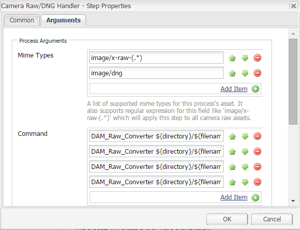

# Använda Camera Raw för att bearbeta bilder {#camera-raw-support}

>[!CAUTION]
>
>AEM 6.4 har nått slutet på den utökade supporten och denna dokumentation är inte längre uppdaterad. Mer information finns i [teknisk supportperiod](https://helpx.adobe.com/support/programs/eol-matrix.html). Hitta de versioner som stöds [här](https://experienceleague.adobe.com/docs/).

Du kan aktivera det Camera Raw stödet för att bearbeta råfilsformat, som CR2, NEF och RAF, och återge bilderna i JPEG-format. Funktionen stöds i Adobe Experience Manager Assets med [Camera Raw paket](https://experience.adobe.com/#/downloads/content/software-distribution/en/aem.html?package=/content/software-distribution/en/details.html/content/dam/aem/public/adobe/packages/aem630/product/assets/aem-assets-cameraraw-pkg) som kan köpas från Software Distribution.

>[!NOTE]
>
>Funktionen har bara stöd för JPEG-renderingar. Det stöds i Windows 64-bitars, Mac OS och RHEL 7.x.

Så här aktiverar du Camera Raw support i Adobe Experience Manager Assets:

1. Ladda ned [Camera Raw paket](https://experience.adobe.com/#/downloads/content/software-distribution/en/aem.html?package=/content/software-distribution/en/details.html/content/dam/aem/public/adobe/packages/aem630/product/assets/aem-assets-cameraraw-pkg) från Software Distribution.

1. Öppna `https://[aem_server]:[port]/workflow`. Öppna **[!UICONTROL DAM Update Asset]** arbetsflöde.

1. Öppna **[!UICONTROL Process Thumbnails]** steg.

1. Ange följande konfiguration i **[!UICONTROL Thumbnails]** tab:

   * **[!UICONTROL Thumbnails]**: `140:100:false, 48:48:false, 319:319:false`
   * **[!UICONTROL Skip Mime Types]**: `skip:image/dng, skip:image/x-raw-(.*)`

   

1. I **[!UICONTROL Web Enabled Image]** -fliken, i **[!UICONTROL Skip List]** fält, ange `audio/mpeg, video/(.*), image/dng, image/x-raw-(.*)`.

   

1. Lägg till **[!UICONTROL Camera Raw/DNG Handler]** steg under **[!UICONTROL Thumbnail creation]** steg.

1. I **[!UICONTROL Camera Raw/DNG Handler]** lägg till följande konfiguration i **[!UICONTROL Arguments]** tab:

   * **[!UICONTROL Mime Types]**: `image/dng` och `image/x-raw-(.*)`
   * **[!UICONTROL Command]**:

      * `DAM_Raw_Converter ${directory}/${filename} ${directory} cq5dam.web.1280.1280.jpeg 1280 1280`
      * `DAM_Raw_Converter ${directory}/${filename} ${directory} cq5dam.thumbnail.319.319.jpeg 319 319`
      * `DAM_Raw_Converter ${directory}/${filename} ${directory} cq5dam.thumbnail.140.100.jpeg 140 100`
      * `DAM_Raw_Converter ${directory}/${filename} ${directory} cq5dam.thumbnail.48.48.jpeg 48 48`

   

1. Klicka på **[!UICONTROL Save]**.

>[!NOTE]
>
>Kontrollera att ovanstående konfiguration är samma som **[!UICONTROL Sample DAM Update Asset With Camera RAW and DNG Handling Step]** konfiguration.

Nu kan du importera Camera Raw-filer till [!DNL Experience Manager] Resurser. När du har installerat det Camera Raw paketet och konfigurerat arbetsflödet, **[!UICONTROL Image Adjust]** visas i listan med sidorutor.

*Bild: Alternativ i sidopanelen*

*Bild: Använd det här alternativet om du vill göra små ändringar i dina bilder*

När du har sparat redigeringarna i en Camera Raw bild skapas en ny rendering `AdjustedPreview.jpg` genereras för bilden. För andra bildtyper, förutom Camera Raw, återspeglas ändringarna i alla återgivningar.

## God praxis, kända problem och begränsningar {#best-practices}

Funktionen har följande begränsningar:

* Funktionen har bara stöd för JPEG-renderingar. Det stöds på 64-bitars Windows, Mac OS och RHEL 7.x.
* Metadatatillbakaskrivning stöds inte för RAW- och DNG-format.
* Det Camera Raw biblioteket har begränsningar för det totala antalet pixlar som kan bearbetas samtidigt. För närvarande kan programmet bearbeta maximalt 65 000 pixlar på den långa sidan av en fil eller 512 MP, oavsett vilket villkor som påträffas först.
