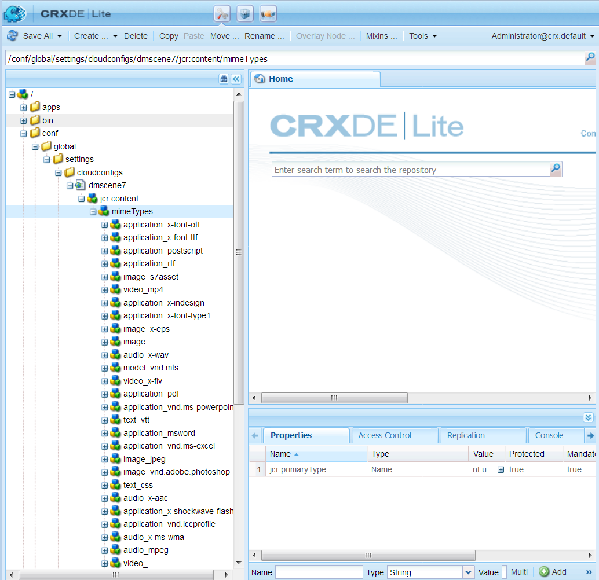

# Konfigurera Dynamic Media - Scene7-läge {#configuring-dynamic-media-scene-mode}

Om du använder Adobe Experience Manager som konfigurerats för olika miljöer, till exempel en för utveckling, en för staging och en för liveproduktion, måste du konfigurera Dynamic Media-Cloud Service för var och en av dessa miljöer.

## Arkitektur för Dynamic Media - Scene7-läge {#architecture-diagram-of-dynamic-media-scene-mode}

I följande arkitekturdiagram beskrivs hur Dynamic Media - Scene7-läge fungerar.

Med den nya arkitekturen ansvarar AEM för överordnad material och synkronisering med Dynamic Media för bearbetning och publicering av material:

1. När den överordnad resursen överförs till AEM replikeras den till Dynamic Media. Då hanterar Dynamic Media all bearbetning och generering av resurser, till exempel videokodning och dynamiska varianter av en bild.
1. När återgivningarna har genererats kan AEM på ett säkert sätt komma åt och förhandsgranska de fjärranslutna Dynamic Media (inga binärfiler skickas tillbaka till AEM-instansen).
1. När innehållet är klart att publiceras och godkännas utlöses Dynamic Media-tjänsten att skicka ut innehåll till leveransservrar och cachelagra innehåll på CDN.


## Aktivera Dynamic Media i Scene7-läge {#enabling-dynamic-media-in-scene-mode}

[Dynamic Media](https://www.adobe.com/solutions/web-experience-management/dynamic-media.html) är inaktiverade som standard. Om du vill utnyttja funktionerna för dynamiska medier måste du aktivera dem.

>[ANMÄRKNING]
>
>Dynamic Media - Scene7-läget är endast till för AEM Author. Därför måste du konfigurera `runmode=dynamicmedia_scene7`på AEM Author-instansen, inte AEM Publish-instansen.

Om du vill aktivera Dynamic Media måste du starta AEM med `dynamicmedia_scene7` körningsläget från kommandoraden genom att ange följande i ett terminalfönster (exempelporten är 4502):

```shell
java -Xms4096m -Xmx4096m -Doak.queryLimitInMemory=500000 -Doak.queryLimitReads=500000 -jar cq-quickstart-6.4.0.jar -gui -r author,dynamicmedia_scene7 -p 4502
```

## (Valfritt) Migrera förinställningar och konfigurationer för Dynamic Media från 6.3 till 6.4 utan driftstopp {#optional-migrating-dynamic-media-presets-and-configurations-from-to-zero-downtime}

Om du uppgraderar AEM-Dynamic Media från 6.3 till 6.4 (som nu innehåller funktioner för att inte ha några driftavbrott) måste du köra följande kommando för att migrera alla förinställningar och konfigurationer från `/etc` till `/conf` i CRXDE Lite.

>[ANMÄRKNING]
>
>Om du kör AEM-instansen i kompatibilitetsläge, d.v.s. har kompatibilitetspaketet installerat, behöver du inte köra dessa kommandon.

Om du vill migrera dina anpassade förinställningar och konfigurationer från `/etc` till `/conf`kör du följande Linux-kommando:

`curl -u admin:admin http://localhost:4502/libs/settings/dam/dm/presets.migratedmcontent.json`

För alla uppgraderingar, antingen med eller utan kompatibilitetspaketet, kan du kopiera förinställningarna för visningsprogrammet som inte är installerade genom att köra följande kommando:

`curl -u admin:admin http://localhost:4502/libs/settings/dam/dm/presets/viewer.pushviewerpresets`

## (Valfritt) Installera funktionspaket 18912 för migrering av bulkresurser {#installing-feature-pack}

Med funktionspaketet 18912 kan du antingen importera resurser gruppvis via FTP eller migrera resurser från antingen Dynamic Media - hybrid- eller Dynamic Media Classic till Dynamic Media - Scene7-läge på AEM. Den kan fås från Adobe Professional Services.

Mer information finns i [Installera funktionspaket 18912 för migrering](bulk-ingest-migrate.md) av gruppresurser.

## Konfigurera Dynamic Media-Cloud Service {#configuring-dynamic-media-cloud-services}

Ändra lösenordet innan du konfigurerar Dynamic Media-Cloud Service. När du har fått ditt e-postmeddelande med Dynamic Media-autentiseringsuppgifter måste du [logga in](https://www.adobe.com/marketing-cloud/experience-manager/scene7-login.html) på Dynamic Media Classic för att ändra ditt lösenord. Lösenordet som anges i e-postmeddelandet om etablering genereras av systemet och är endast avsett som ett tillfälligt lösenord. Det är viktigt att du uppdaterar lösenordet så att Dynamic Media-Cloud Servicen har rätt autentiseringsuppgifter.

>[!NOTE]
>
>Som standard är konfigurationssökvägen för Cloud Service `/content/dam`. Andra konfigurationssökvägar stöds inte i Dynamic Media - Scene7-läge.

Så här konfigurerar du Dynamic Media-Cloud Service:

1. I AEM trycker du på AEM-logotypen för att komma åt den globala navigeringskonsolen, trycker på verktygsikonen och sedan på **[!UICONTROL Cloud Services > Dynamic Media Configuration]**.
1. Tryck på **[!UICONTROL global]** och tryck i den vänstra rutan på sidan Dynamic Media Configuration Browser (Konfigurationsläsare) **[!UICONTROL Create]**. Tryck inte på eller välj mappikonen till vänster om [!UICONTROL global].
1. På [!UICONTROL Create Dynamic Media Configuration] sidan anger du en titel, Dynamic Media-kontots e-postadress, lösenord och väljer sedan region. Dessa tillhandahålls av Adobe i e-postmeddelandet om etablering. Kontakta supporten om du inte fått detta.

   Tryck på **[!UICONTROL Connect to Dynamic Media]**.

   >[!NOTE]
   >
   >När du har fått ditt e-postmeddelande med Dynamic Media-autentiseringsuppgifter [loggar du in på](https://www.adobe.com/marketing-cloud/experience-manager/scene7-login.html) Dynamic Media Classic för att ändra ditt lösenord. Lösenordet som anges i e-postmeddelandet om etablering genereras av systemet och är endast avsett som ett tillfälligt lösenord. Det är viktigt att du uppdaterar lösenordet så att Dynamic Media molntjänst konfigureras med rätt autentiseringsuppgifter.

1. Om anslutningen lyckas kan du även ange följande:

   * **[!UICONTROL Company]** - namnet på Dynamic Media-kontot. Det är möjligt att du har flera Dynamic Media för olika undervarumärken, divisioner eller olika mellanlagrings-/produktionsmiljöer.
   * **[!UICONTROL Company Root Folder Path]**
   * **[!UICONTROL Publishing Assets]** - alternativet **[!UICONTROL Immediately]** innebär att när resurser överförs, importeras resurserna och URL/Embed anges omedelbart. Ingen användaråtgärd krävs för att publicera resurser. Alternativet **[!UICONTROL Upon Activation]** innebär att du måste publicera resursen explicit innan en URL/Embed-länk anges.
   * **[!UICONTROL Secure Preview Server]** - gör att du kan ange URL-sökvägen till förhandsgranskningsservern för säkra återgivningar. Det innebär att när återgivningarna har genererats kan AEM på ett säkert sätt komma åt och förhandsgranska de fjärranslutna Dynamic Media (inga binärfiler skickas tillbaka till AEM-instansen).

      Om du inte har ett särskilt arrangemang för att använda ditt företags server eller en speciell server rekommenderar Adobe att du använder standardinställningen.
   >[!NOTE]
   >
   >Det finns inget stöd för versionshantering i DMS7. Also, delayed activation applies only if **[!UICONTROL Publish Assets]** in the [!UICONTROL Edit Dynamic Media Configuration] page is set to **[!UICONTROL Upon Activation]**, and then only until the first time the asset is activated.
   >
   >När en mediefil har aktiverats publiceras uppdateringar direkt till S7 Delivery.

   

1. Tryck på **[!UICONTROL Save]**.
1. Om du vill förhandsgranska Dynamic Media-innehåll på ett säkert sätt innan det publiceras måste du tillåtslista AEM-författarinstansen för att ansluta till Dynamic Media:

   * Logga in på ditt Dynamic Media Classic-konto: [https://www.adobe.com/marketing-cloud/experience-manager/scene7-login.html](https://www.adobe.com/marketing-cloud/experience-manager/scene7-login.html). Dina autentiseringsuppgifter och din inloggning tillhandahölls av Adobe vid tidpunkten för etableringen. Om du inte har den här informationen kontaktar du teknisk support.
   * Tryck på i navigeringsfältet uppe till höger på sidan **[!UICONTROL Setup > Application Setup > Publish Setup > Image Server]**.
   * Välj **[!UICONTROL Test Image Serving]** i listrutan Publiceringskontext på sidan Image Server Publish Context.
   * Tryck på **[!UICONTROL Add]** Klientadressfiltret.
   * Markera kryssrutan för att aktivera (aktivera) adressen och ange sedan IP-adressen för instansen AEM Author (inte Dispatcher IP).
   * Tryck på **[!UICONTROL Save]**.

Du är nu klar med den grundläggande konfigurationen; är du redo att använda Dynamic Media - Scene7-läge.

Om du vill anpassa konfigurationen ytterligare kan du utföra alla åtgärder under [(Valfritt) Konfigurera avancerade inställningar i Dynamic Media - Scene7-läge](#optional-configuring-advanced-settings-in-dynamic-media-scene-mode).

## (Valfritt) Konfigurera avancerade inställningar i Dynamic Media - Scene7-läge {#optional-configuring-advanced-settings-in-dynamic-media-scene-mode}

Om du vill anpassa konfigurationen och konfigurationen av Dynamic Media - Scene7-läget ytterligare eller optimera dess prestanda kan du utföra en eller flera av följande valfria uppgifter:

* [(Valfritt) Konfigurera och konfigurera Dynamic Media - Inställningar för Scene7-läge](#optional-setup-and-configuration-of-dynamic-media-scene-mode-settings-p)

* [(Valfritt) Justera prestanda för Dynamic Media - Scene7-läge](#optional-tuning-the-performance-of-dynamic-media-scene-mode)
* [(Valfritt) Filtrera resurser för replikering](#optional-filtering-assets-for-replication)

### (Valfritt) Konfigurera och konfigurera Dynamic Media - Inställningar för Scene7-läge</p> {#optional-setup-and-configuration-of-dynamic-media-scene-mode-settings-p}

När du är i körningsläge **dynamicmedia_scene7** använder du användargränssnittet i Dynamic Media Classic (Scene7) för att göra ändringar i Dynamic Medias inställningar.

Vissa av ovanstående uppgifter kräver att du loggar in i Dynamic Media Classic här: [https://www.adobe.com/marketing-cloud/experience-manager/scene7-login.html](https://www.adobe.com/marketing-cloud/experience-manager/scene7-login.html)

Installations- och konfigureringsuppgifter är:

* [Publiceringskonfiguration för Image Server](#publishing-setup-for-image-server)
* [Konfigurera allmänna inställningar för programmet](#configuring-application-general-settings)
* [Konfigurera färghantering](#configuring-color-management)
* [Konfigurera bearbetning av resurser](#configuring-asset-processing)
* [Lägga till anpassade MIME-typer för format som inte stöds](#adding-custom-mime-types-for-unsupported-formats)
* [Skapa gruppuppsättningsförinställningar för automatisk generering av bilduppsättningar och snurpuppsättningar](#creating-batch-set-presets-to-auto-generate-image-sets-and-spin-sets)

#### Publiceringskonfiguration för Image Server {#publishing-setup-for-image-server}

Publiceringsinställningarna avgör hur resurser levereras som standard från Dynamic Media. Om ingen inställning anges levererar Dynamic Media en resurs enligt standardinställningarna som definierats i Publiceringsinställningar. En begäran om att leverera en bild som inte innehåller ett upplösningsattribut ger till exempel en bild med inställningen för standardobjektupplösning.

Så här konfigurerar du publiceringsinställningar: i Dynamic Media Classic: tryck **[!UICONTROL Setup > Application Setup > Publish Setup > Image Server]**.

Bildserverskärmen anger standardinställningar för att leverera bilder. En beskrivning av varje inställning finns i användargränssnittet.

* **[!UICONTROL Request Attributes]** - De här inställningarna begränsar antalet bilder som kan levereras från servern.
* **[!UICONTROL Default Request Attributes]** - De här inställningarna gäller standardutseendet för bilder.
* **[!UICONTROL Common Thumbnail Attributes]** - De här inställningarna gäller för miniatyrbildernas standardutseende.
* **[!UICONTROL Defaults for Catalog Fields]** - De här inställningarna gäller bildernas upplösning och standardtyp av miniatyrbilder.
* **[!UICONTROL Color Management Attributes]** - De här inställningarna avgör vilka ICC-färgprofiler som används.
* **[!UICONTROL Compatibility Attributes]** - Den här inställningen gör att inledande och avslutande stycken i textlager kan hanteras som de var i version 3.6 för bakåtkompatibilitet.
* **[!UICONTROL Localization Support]** - Med de här inställningarna kan du hantera flera språkattribut. Här kan du också ange en sträng för språkområdeskarta så att du kan definiera vilka språk du vill ha stöd för de olika verktygstipsen i visningsprogram. Mer information om hur du konfigurerar stöd för lokalisering finns i [Saker att tänka på när du konfigurerar lokalisering av resurser](https://help.adobe.com/en_US/scene7/using/WS997f1dc4cb0179f034e07dc31412799d19a-8000.html).

#### Konfigurera allmänna inställningar för programmet {#configuring-application-general-settings}

Öppna [!UICONTROL Application General Settings] sidan genom att trycka på **[!UICONTROL Setup > Application Setup > General Settings]** i fältet Global navigering i Dynamic Media Classic.

**[!UICONTROL Servers]** - Vid kontoetablering tillhandahåller Dynamic Media automatiskt de tilldelade servrarna för ditt företag. De här servrarna används för att skapa URL-strängar för din webbplats och dina program. Dessa URL-anrop är specifika för ditt konto. Ändra inte något av servernamnen såvida inte AEM-stödet uttryckligen har instruerat att göra det.

**[!UICONTROL Overwrite Images]** - två filer kan inte ha samma namn i Dynamic Media. Varje objekts URL-ID (filnamnet minus filtillägget) måste vara unikt. De här alternativen anger hur ersättningsresurser överförs: om de ersätter originalet eller blir dubbletter. Duplicerade resurser får ett nytt namn med namnet&quot;-1&quot; (till exempel heter stol.tif stol-1.tif). Dessa alternativ påverkar resurser som överförts till en annan mapp än den ursprungliga eller resurser med ett annat filnamnstillägg än den ursprungliga (till exempel JPG, TIF eller PNG).

* **[!UICONTROL Overwrite in current folder, same base image name/extension]** - Det här alternativet är den striktaste regeln för ersättning. Det kräver att du överför ersättningsbilden till samma mapp som originalbilden och att ersättningsbilden har samma filnamnstillägg som originalbilden. Om dessa krav inte uppfylls skapas en dubblett.

>[!NOTE]
>
>Välj **[!UICONTROL Overwrite in current folder, same base image name/extension]** om du vill ha enhetlighet med AEM.

* **[!UICONTROL Overwrite in any folder, same base asset name/extension]** - Kräver att ersättningsbilden har samma filnamnstillägg som den ursprungliga bilden (till exempel ersätts `chair.jpg` och inte `chair.jpg` `chair.tif`). Du kan dock överföra ersättningsbilden till en annan mapp än den ursprungliga. Den uppdaterade bilden finns i den nya mappen; filen inte längre kan hittas på sin ursprungliga plats.
* **[!UICONTROL Overwrite in any folder, same base asset name regardless of extension]** - Det här alternativet är den mest omfattande ersättningsregeln. Du kan överföra en ersättningsbild till en annan mapp än den ursprungliga, överföra en fil med ett annat filnamnstillägg och ersätta den ursprungliga filen. Om originalfilen finns i en annan mapp finns ersättningsbilden i den nya mappen som den överfördes till.

**[!UICONTROL Default Color Profiles]** - Mer information finns i [Konfigurera färghantering](#configuring-color-management) .

>[!NOTE]
>
>Som standard visas 15 återgivningar när du väljer **[!UICONTROL Renditions]** och 15 visningsförinställningar när du väljer **[!UICONTROL Viewers]** i resursens detaljvy. Du kan öka den här gränsen. See [Increasing the number of image presets that display](managing-image-presets.md#increasing-or-decreasing-the-number-of-image-presets-that-display) or [Increasing the number of viewer presets that display](managing-viewer-presets.md#increasing-the-number-of-viewer-presets-that-display).

#### Konfigurera färghantering {#configuring-color-management}

Med dynamisk mediefärghantering kan du färgkorrigera resurser. Med färgkorrigering behåller inkapslade resurser sin färgmodell (RGB, CMYK, Grå) och inbäddad färgprofil. När du begär en dynamisk återgivning korrigeras bildfärgen till målfärgrymden med hjälp av CMYK-, RGB- eller grå utdata. Se [Konfigurera bildförinställningar](managing-image-presets.md).

Så här konfigurerar du standardfärgegenskaperna så att färgkorrigering aktiveras när du begär bilder:

1. [Logga in i Dynamic Media Classic](https://www.adobe.com/marketing-cloud/experience-manager/scene7-login.html) med de autentiseringsuppgifter som angavs under etableringen. Navigera till **[!UICONTROL Setup > Application Setup]**.
1. Expandera området **[!UICONTROL Publish Setup]** och markera **[!UICONTROL Image Server]**. Ange **[!UICONTROL Publish Context]** som **[!UICONTROL Image Serving]** när du anger standardvärden för publiceringsinstanser.
1. Bläddra till den egenskap som du behöver ändra, till exempel en egenskap i **[!UICONTROL Color Management Attributes]** området.

   Du kan ange följande egenskaper för färgkorrigering:

   * [!UICONTROL CMYK Default Color Space] - Namn på CMYK-standardfärgprofil
   * [!UICONTROL Gray-Scale Default Color Space] - Namn på standardfärgprofilen för gråskala
   * [!UICONTROL RGB Default Color Space] - Namn på standardfärgprofilen för RGB
   * [!UICONTROL Color Conversion Rendering Intent] - Anger återgivningsmetod. Godkända värden är `perceptual`, `relative` , `colometric`och `saturation``absolute colometric`. Adobe rekommenderar `relative` som standard.

1. Tryck på **[!UICONTROL Save]**.

Du kan till exempel ställa in **[!UICONTROL RGB Default Color Space]** på `sRGB` och **[!UICONTROL CMYK Default Color Space]** på `WebCoated`.

Om du gör det gör du så här:

* Aktiverar färgkorrigering för RGB- och CMYK-bilder.
* RGB-bilder som saknar färgprofil antas finnas i `sRGB` färgmodellen.
* CMYK-bilder som inte har någon färgprofil antas vara i `WebCoated` färgrymden.
* Dynamiska återgivningar som returnerar RGB-utdata returnerar det i `sRGB` färgrymden.
* Dynamiska återgivningar som returnerar CMYK-utdata returnerar det i `WebCoated` färgrymden.

#### Konfigurera bearbetning av resurser {#configuring-asset-processing}

Du kan definiera vilka resurstyper som ska bearbetas av Dynamic Media och anpassa avancerade parametrar för resurshantering. Du kan till exempel ange att parametrar för bearbetning av resurser ska göra följande:

* Konvertera en Adobe PDF till en eCatalog-resurs.
* Konvertera ett Adobe Photoshop-dokument (.PSD) till en bannermallsresurs för personalisering.
* Rastrera en Adobe Illustrator-fil (.AI) eller en Adobe Photoshop Encapsulated Postscript-fil (.EPS).

>[ANMÄRKNING]
>
>Videoprofiler och bildprofiler kan användas för att definiera bearbetning av videoklipp och bilder.

Se [Överföra resurser](managing-assets-touch-ui.md#uploading-assets).

**Så här konfigurerar du bearbetning** av resurser:

1. I AEM trycker du på AEM-logotypen för att komma åt den globala navigeringskonsolen, trycker sedan på **[!UICONTROL Tools]** -ikonen (hammer) och navigerar till **[!UICONTROL General > CRXDE Lite]**.
1. Navigera till följande i den vänstra listen:

   `/conf/global/settings/cloudconfigs/dmscene7/jcr:content/mimeTypes`

   

1. Välj en MIME-typ under `mimeTypes` mappen.
1. Till höger på CRXDE Lite-sidan i den nedre delen:

   * dubbelklicka på **[!UICONTROL enabled]** fältet. Som standard är alla resursens MIME-typer aktiverade (inställda på **[!UICONTROL true]**), vilket innebär att resurserna synkroniseras till Dynamic Media för bearbetning. Om du vill utesluta den här resursens MIME-typ från bearbetningen ändrar du den här inställningen till **[!UICONTROL false]**.
   * dubbelklicka **[!UICONTROL jobParam]** för att öppna det tillhörande textfältet. Se [Mime-typer](assets-formats.md#supported-mime-types) som stöds för en lista över tillåtna värden för processparametrar som du kan använda för en viss MIME-typ.

1. Gör något av följande:

   * Upprepa steg 3-4 om du vill redigera ytterligare MIME-typer.
   * Tryck på **[!UICONTROL Save All]** på menyraden på sidan CRXDE Lite.

1. Tryck för **[!UICONTROL CRXDE Lite]** att gå tillbaka till AEM i det övre vänstra hörnet på sidan.

#### Lägga till anpassade MIME-typer för format som inte stöds {#adding-custom-mime-types-for-unsupported-formats}

Du kan lägga till anpassade MIME-typer för format som inte stöds i AEM Assets. För att säkerställa att nya noder som du lägger till i CRXDE Lite inte tas bort av AEM måste du se till att du placerar MIME-typen före **[!UICONTROL image_]** och att dess aktiverade värde är inställt på **[!UICONTROL false]**.

**Så här lägger du till anpassade MIME-typer för format** som inte stöds:

1. Klicka på AEM **[!UICONTROL Tools > Operations > Web Console]**.

   

1. En ny flik i webbläsaren öppnas på **[!UICONTROL Adobe Experience Manager Web Console Configuration]** sidan.

   

1. Bläddra nedåt till namnet på sidan **[!UICONTROL Adobe CQ Scene7 Asset MIME type Service]**. To the right of the name, tap **[!UICONTROL Edit the configuration values]** (pencil icon).

   

1. Klicka på en plusteckenikon på **[!UICONTROL Adobe CQ Scene7 Asset MIME type Service]** sidan `+`. Platsen i tabellen där du klickar på plustecknet för att lägga till den nya mime-typen är enkel.

   

1. Skriv `DWG=image/vnd.dwg` i det tomma textfältet som du just lade till.

   Observera att exemplet bara `DWG=image/vnd.dwg` är för illustrationsändamål. MIME-typen som du lägger till här kan vara ett annat format som inte stöds.

   

1. I sidans nedre högra hörn klickar du på **[!UICONTROL Save]**.

   Nu kan du stänga webbläsarfliken som har den öppna konfigurationssidan för Adobe Experience Manager Web Console.

1. Gå tillbaka till webbläsarfliken med din öppna AEM-konsol.

1. Klicka på AEM **[!UICONTROL Tools > General > CRXDE Lite]**.

   

1. Navigera till följande i den vänstra listen:

   `conf/global/settings/cloudconfigs/dmscene7/jcr:content/mimeTypes`

1. Dra MIME-typen `image_vnd.dwg` och släpp den direkt ovanför `image_` i trädet.

   

1. With the mime type `image_vnd.dwg` still selected in the tree, from the **[!UICONTROL Properties]** tab, in the **[!UICONTROL enabled]** row, under the **[!UICONTROL Value]** column header, double-click the value to open the **[!UICONTROL Value]** drop-down list.

1. Skriv `false` i fältet (eller välj `false` från listrutan).

   

1. Near the upper-left corner of the CRXDE Lite page, click **[!UICONTROL Save All]**.

#### Skapa gruppuppsättningsförinställningar för automatisk generering av bilduppsättningar och snurpuppsättningar {#creating-batch-set-presets-to-auto-generate-image-sets-and-spin-sets}

Använd förinställningar för gruppuppsättningar för att automatisera skapandet av bilduppsättningar eller snurruppsättningar medan resurser överförs till Dynamic Media.

Definiera först namnkonventionen för hur resurser ska grupperas tillsammans i en uppsättning. Du kan sedan skapa en gruppuppsättningsförinställning som är en unik, självständig uppsättning instruktioner som definierar hur uppsättningen ska skapas med bilder som matchar de definierade namnkonventionerna i förinställningsreceptet.

När du överför filer skapar Dynamic Media automatiskt en uppsättning med alla filer som matchar den definierade namnkonventionen i de aktiva förinställningarna.

**Konfigurerar standardnamngivning**

Skapa en standardnamnkonvention som används i alla förinställda gruppuppsättningar. Den standardnamnkonvention som valts i förinställningsdefinitionen för gruppuppsättning kan vara allt ditt företag behöver för att gruppgenerera uppsättningar. En gruppuppsättningsförinställning skapas för att använda den standardnamnkonvention som du definierar. Du kan skapa så många gruppuppsättningsförinställningar med alternativa, anpassade namnkonventioner som behövs för en viss uppsättning innehåll om det finns ett undantag från den företagsdefinierade standardnamngivningen.

När det inte krävs någon standardnamnkonvention för att använda funktionen för gruppuppsättningsförinställningar rekommenderar vi att du använder standardnamnkonventionen för att definiera så många element i namnkonventionen som du vill gruppera i en uppsättning så att du kan effektivisera skapandet av gruppuppsättningar.

Observera också att du kan använda **[!UICONTROL View Code]** utan formulärfält. I den här vyn skapar du namnkonventionens definitioner helt med hjälp av reguljära uttryck.

Det finns två element att definiera **[!UICONTROL Match]** och **[!UICONTROL Base Name]**. Med dessa fält kan du definiera alla element i en namnkonvention och identifiera den del av konventionen som används för att namnge den uppsättning i vilken de finns. Ett företags personliga namnkonvention kan använda en eller flera definitionsrader för vart och ett av dessa element. Du kan använda så många rader för din unika definition och gruppera dem i distinkta element, t.ex. för Huvudbild, Färgelement, Alternativa vyer och Färgruteelement.

**Så här konfigurerar du standardnamn:**

1. Logga in på ditt Dynamic Media Classic-konto (Scene7): [www.adobe.com/marketing-cloud/experience-manager/scene7-login.html](https://www.adobe.com/marketing-cloud/experience-manager/scene7-login.html)

   Dina autentiseringsuppgifter och din inloggning tillhandahölls av Adobe vid tidpunkten för etableringen. Om du inte har den här informationen kontaktar du teknisk support.

1. Tryck på i navigeringsfältet uppe på sidan **[!UICONTROL Setup > Application Setup > Batch Set Presets > Default Naming].**
1. Välj **[!UICONTROL View Form]** eller **[!UICONTROL View Code]** för att ange hur du vill visa och ange information om varje element.

   Du kan markera kryssrutan om du vill visa värdeuppbyggnaden för det reguljära uttrycket tillsammans med dina formulärval. **[!UICONTROL View Code]** Du kan ange eller ändra dessa värden för att underlätta definitionen av elementen i namnkonventionen, om formulärvyn begränsar dig av någon anledning. Om dina värden inte kan tolkas i formulärvyn blir formulärfälten inaktiva.

   >[!NOTE]
   >
   >Inaktiverade formulärfält verifierar inte att reguljära uttryck är korrekta. Resultaten av det reguljära uttryck som du skapar för varje element efter resultatraden visas. Det fullständiga reguljära uttrycket visas längst ned på sidan.

1. Expandera varje element efter behov och ange de namnkonventioner som du vill använda.
1. Gör något av följande om det behövs:

   * Tryck för **[!UICONTROL Add]** att lägga till en annan namnkonvention för ett element.
   * Tryck för **[!UICONTROL Remove]** att ta bort en namnkonvention för ett element.

1. Gör något av följande:

   * Tryck **[!UICONTROL Save As]** och skriv ett namn för förinställningen.
   * Tryck **[!UICONTROL Save]** om du redigerar en befintlig förinställning.

**Skapa en förinställning för gruppuppsättning**

I Dynamic Media används gruppuppsättningsförinställningar för att ordna resurser i uppsättningar med bilder (alternativa bilder, färgalternativ, 360 rotation) för visning i visningsprogram. Förinställningarna för gruppuppsättningar körs automatiskt tillsammans med överföringsprocesserna för resurser i Dynamic Media.

Du kan skapa, redigera och hantera dina gruppuppsättningsförinställningar. Det finns två former av förinställda gruppuppsättningsdefinitioner: en för en standardnamnkonvention som du kan ha konfigurerat och en för anpassade namnkonventioner som du skapar direkt.

Du kan antingen använda formulärfältsmetoden för att definiera en gruppuppsättningsförinställning eller kodmetoden, som gör att du kan använda reguljära uttryck. Precis som i Standardnamn kan du välja [!UICONTROL View Code] samtidigt som du definierar i [!UICONTROL Form View] och använda reguljära uttryck för att skapa definitioner. Du kan också avmarkera en vy om du vill använda den ena eller den andra enbart.

**Så här skapar du en förinställning för gruppuppsättning:**

1. Logga in på ditt Dynamic Media Classic-konto (Scene7): [www.adobe.com/marketing-cloud/experience-manager/scene7-login.html](https://www.adobe.com/marketing-cloud/experience-manager/scene7-login.html)

   Dina autentiseringsuppgifter och din inloggning tillhandahölls av Adobe vid tidpunkten för etableringen. Om du inte har den här informationen kontaktar du teknisk support.

1. Tryck på i navigeringsfältet uppe på sidan **[!UICONTROL Setup > Application Setup > Batch Set Presets > Batch Set Preset].**

   Observera att [!UICONTROL View Form]standardvyn är inställd i det övre högra hörnet på [!UICONTROL Details] sidan.

1. Tryck på panelen Förinställningslista för **[!UICONTROL Add]** att aktivera definitionsfälten på **[!UICONTROL Details]** panelen till höger på skärmen.
1. Skriv ett namn på förinställningen i **[!UICONTROL Details]** fältet på **[!UICONTROL Preset Name]** panelen.
1. Välj en förinställningstyp på den **[!UICONTROL Batch Set Type]** nedrullningsbara menyn.
1. Gör något av följande:

   * Om du använder en standardnamnkonvention som du tidigare har konfigurerat under **[!UICONTROL Application Setup > Batch Set Presets > Default Naming]** expanderar du **[!UICONTROL Asset Naming Conventions]** och trycker sedan på **[!UICONTROL File Naming]** i **[!UICONTROL Default]** listrutan.
   * Om du vill definiera en ny namnkonvention när du ställer in förinställningen **[!UICONTROL Asset Naming Conventions]** och sedan trycker du på **[!UICONTROL File Naming]** i **[!UICONTROL Custom]** listrutan.

1. I [!UICONTROL Sequence order]definierar du i vilken ordning bilderna ska visas efter att uppsättningen har grupperats tillsammans i Dynamic Media.

   Som standard sorteras dina resurser alfanumeriskt. Du kan dock använda en kommaavgränsad lista med reguljära uttryck för att definiera ordningen.

1. För **[!UICONTROL Set Naming]** och **[!UICONTROL Creation Convention]** anger du suffixet eller prefixet för basnamnet som du definierade i **[!UICONTROL Asset Naming Convention]**. Definiera också var uppsättningen ska skapas i mappstrukturen för Dynamic Media.

   Om du definierar ett stort antal uppsättningar kanske du föredrar att hålla dessa åtskilda från de mappar som innehåller själva resurserna. Du kan till exempel skapa en mapp för bilduppsättningar och placera genererade uppsättningar här.

1. In the **[!UICONTROL Details]** panel, tap **[!UICONTROL Save]**.
1. Tryck **[!UICONTROL Active]** bredvid den nya förinställningens namn.

   När du aktiverar förinställningen används den för att generera uppsättningen när du överför resurser till Dynamic Media.

**Skapa en gruppuppsättningsförinställning för automatisk generering av en 2D-snurpuppsättning**

Du kan använda gruppuppsättningstypen **[!UICONTROL Multi-Axis Spin Set]** för att skapa ett recept som automatiserar genereringen av 2D-snurpuppsättningar. Vid gruppering av bilder används reguljära uttryck för rad och kolumn så att bildresurserna justeras korrekt på motsvarande plats i den flerdimensionella arrayen. Det finns inget minsta eller högsta antal rader eller kolumner som du måste ha i en rotationsuppsättning med flera axlar.

Anta till exempel att du vill skapa en fleraxelsnurvuppsättning med namnet `spin-2dspin`. Du har en uppsättning bilder med snurra uppsättningar som innehåller tre rader, med 12 bilder per rad. Bilderna får följande namn:

```
spin-01-01 
 spin-01-02 
 … 
 spin-01-12 
 spin-02-01 
 … 
 spin-03-12
```

Med den här informationen kan ditt [!UICONTROL Batch Set Type] recept skapas på följande sätt:


Grouping for the shared asset name part of the spinset is added to the **[!UICONTROL Match]** field (as highlighted). The variable part of the asset name containing the row and column is added to the **[!UICONTROL Row]** and **[!UICONTROL Column]** fields, respectively.

When the Spin Set is uploaded and published, you activate the name of the 2D Spin Set recipe that is listed under **[!UICONTROL Batch Set Presets]** in the **[!UICONTROL Upload Job Options]** dialog box.

**Så här skapar du en gruppuppsättningsförinställning för automatisk generering av en 2D-snurpuppsättning:**

1. Logga in på ditt Dynamic Media Classic-konto (Scene7): [https://www.adobe.com/marketing-cloud/experience-manager/scene7-login.html](https://www.adobe.com/marketing-cloud/experience-manager/scene7-login.html)

   Dina autentiseringsuppgifter och din inloggning tillhandahölls av Adobe vid tidpunkten för etableringen. Om du inte har den här informationen kontaktar du teknisk support.

1. Tryck på i navigeringsfältet uppe på sidan **[!UICONTROL Setup > Application Setup > Batch Set Presets > Batch Set Preset]**.

   Observera att [!UICONTROL View Form]standardvyn är inställd i det övre högra hörnet på [!UICONTROL Details] sidan.

1. Tryck på för **[!UICONTROL Preset List]** att aktivera definitionsfälten på panelen till höger om skärmen på **[!UICONTROL Add]** **[!UICONTROL Details]** panelen.
1. Skriv ett namn på förinställningen i fältet [!UICONTROL-förinställning[!UICONTROL-namn på panelen. **[!UICONTROL Details]**
1. In the **[!UICONTROL Batch Set Type]** drop-down menu, select **[!UICONTROL Asset Set]**.
1. I listrutan **[!UICONTROL Sub Type]** väljer du **[!UICONTROL Multi-Axis Spin Set]**.
1. Expandera **[!UICONTROL Asset Naming Conventions]** och tryck sedan på i **[!UICONTROL File Naming]** listrutan **[!UICONTROL Custom]**.
1. Använd attributen **[!UICONTROL Match]** och eventuellt **[!UICONTROL Base Name]** för att definiera ett reguljärt uttryck för namngivning av bildresurser som utgör grupperingen.

   Det reguljära uttrycket för literal Match kan till exempel se ut så här:

   `(w+)-w+-w+`

1. Expandera **[!UICONTROL Row Column Position]** och definiera sedan namnformatet för bildresursens position i 2D-rotationsmatrisen.

   Använd parentesen för att omsluta rad- eller kolumnpositionen i filnamnet.

   För en rad med ett reguljärt uttryck kan det se ut så här:

   `\w+-R([0-9]+)-\w+`

   eller

   `\w+-(\d+)-\w+`

   För det reguljära uttrycket i kolumnen kan det se ut så här:

   `\w+-\w+-C([0-9]+)`

   eller

   `\w+-\w+-C(\d+)`

   Kom ihåg att detta bara är exempel. Du kan skapa det reguljära uttrycket hur du vill.

   >[!NOTE]
   >
   >Om kombinationen av reguljära uttryck för rader och kolumner inte kan avgöra positionen för resursen i den flerdimensionella spinset-arrayen, läggs resursen inte till i uppsättningen och ett fel loggas.

1. För **[!UICONTROL Set Naming]** och **[!UICONTROL Creation Convention]** anger du suffixet eller prefixet för basnamnet som du definierade i **[!UICONTROL Asset Naming Convention]**.

   Ange också var rotationsuppsättningen ska skapas i mappstrukturen för Dynamic Media Classic.

   Om du definierar ett stort antal uppsättningar kanske du föredrar att hålla dessa åtskilda från de mappar som innehåller själva resurserna. Du kan till exempel skapa en mapp för snurruppsättningar där du kan placera genererade uppsättningar här.

1. In the **[!UICONTROL Details]** panel, tap **[!UICONTROL Save]**.
1. Tryck **[!UICONTROL Active]** bredvid den nya förinställningens namn.

   När du aktiverar förinställningen används den för att generera uppsättningen när du överför resurser till Dynamic Media.

### (Valfritt) Justera prestanda för Dynamic Media - Scene7-läge {#optional-tuning-the-performance-of-dynamic-media-scene-mode}

För att Dynamic Media Scene7-läget ska fungera smidigt rekommenderar Adobe följande tips för finjustering av synkroniseringsprestanda/skalbarhet:

* Uppdaterar de fördefinierade jobbparametrarna för bearbetning av olika filformat.
* Uppdaterar de fördefinierade arbetstrådarna för Granite-arbetsflödet (videoresurser).
* Uppdaterar det fördefinierade tillfälliga Granite-arbetsflödet (bilder och icke-videomaterial) för köarbetstrådar.
* Uppdaterar de maximala överföringsanslutningarna till Dynamic Media Classic-servern.

#### Uppdatera de fördefinierade jobbparametrarna för bearbetning av olika filformat

Du kan justera jobbparametrar för snabbare bearbetning när du överför filer. Om du till exempel överför PSD-filer, men inte vill bearbeta dem som mallar, kan du ange att lagerextraheringen ska vara false (av). I så fall visas den justerade jobbparametern som `process=None&createTemplate=false`.

Adobe rekommenderar att du använder följande&quot;justerade&quot; jobbparametrar för PDF-, PostScript- och PSD-filer:

| Filtyp | Rekommenderade jobbparametrar |
| ---| ---|
| PDF | `pdfprocess=Rasterize&resolution=150&colorspace=Auto&pdfbrochure=false&keywords=false&links=false` |
| Postscript | `psprocess=Rasterize&psresolution=150&pscolorspace=Auto&psalpha=false&psextractsearchwords=false&aiprocess=Rasterize&airesolution=150&aicolorspace=Auto&aialpha=false` |
| PSD | `process=None&layerNaming=Layername&anchor=Center&createTemplate=false&extractText=false&extendLayers=false` |

Om du vill uppdatera någon av de här parametrarna följer du stegen i [Aktivera stöd](#enabling-mime-type-based-assets-scene-upload-job-parameter-support)för MIME-typbaserade resurser/Dynamic Media Classic-överföringsjobbparametrar.

#### Uppdaterar kön för Granska tillfälligt arbetsflöde {#updating-the-granite-transient-workflow-queue}

Kön för Bevilja överföring av arbetsflöde används för **[!UICONTROL DAM Update Asset]** arbetsflödet. I Dynamic Media används den för bildkonsumtion och -bearbetning.

**Så här uppdaterar du kön** för Granska tillfälligt arbetsflöde:

1. Gå till [https://&lt;server>/system/console/configMgr](http://localhost:4502/system/console/configMgr) och sök efter **[!UICONTROL Queue: Granite Transient Workflow Queue]**.

   >[!NOTE]
   >
   >En textsökning är nödvändig i stället för en direkt URL eftersom OSGi PID genereras dynamiskt.

1. I **[!UICONTROL Maximum Parallel Jobs]** fältet ändrar du talet till önskat värde.

   Som standard beror det maximala antalet parallella jobb på antalet tillgängliga processorkärnor. På en server med fyra kärnor tilldelas till exempel två arbetstrådar. (Ett värde mellan 0,0 och 1,0 är baserat på förhållandet, eller alla tal som är större än 1 tilldelar antalet arbetstrådar.)

   Adobe rekommenderar att 32 **[!UICONTROL Maximum Parallel Jobs]** är konfigurerat för att ge tillräckligt stöd för överföring av stora mängder filer till Dynamic Media Classic.

   

1. Tryck på **[!UICONTROL Save]**.

#### Uppdaterar kön för Granite-arbetsflöde {#updating-the-granite-workflow-queue}

Beviljad arbetsflödeskö används för icke-tillfälliga arbetsflöden. I Dynamic Media bearbetades video med **[!UICONTROL Dynamic Media Encode Video]** arbetsflödet.

**Så här uppdaterar du arbetsflödeskön för Granite:**

1. Navigera till `https://<server>/system/console/configMgr` och sök efter **[!UICONTROL Queue: Granite Workflow Queue]**.

   >[!NOTE]
   >
   >En textsökning är nödvändig i stället för en direkt URL eftersom OSGi PID genereras dynamiskt.

1. I **[!UICONTROL Maximum Parallel Jobs]** fältet ändrar du talet till önskat värde.

   Som standard beror det maximala antalet parallella jobb på antalet tillgängliga processorkärnor. På en server med fyra kärnor tilldelas till exempel två arbetstrådar. (Ett värde mellan 0,0 och 1,0 är baserat på förhållandet, eller alla tal som är större än 1 tilldelar antalet arbetstrådar.)

   I de flesta fall räcker standardinställningen 0,5.

   

1. Tryck på **[!UICONTROL Save]**.

#### Uppdaterar anslutning för överföring av Scene7 {#updating-the-scene-upload-connection}

Inställningen Scene7 Upload Connection synkroniserar AEM-resurser till Dynamic Media Classic-servrar.

**Så här uppdaterar du anslutningen för Scene7-överföring:**

1. Navigera till `https://<server>/system/console/configMgr/com.day.cq.dam.scene7.impl.Scene7UploadServiceImpl`
1. I [!UICONTROL Number of connections] fältet och/eller i [!UICONTROL Active job timeout] fältet ändrar du numret.

   Inställningen styr **[!UICONTROL Number of connections]** det maximala antalet HTTP-anslutningar som tillåts för AEM-överföring till Dynamic Media. vanligtvis räcker det fördefinierade värdet på 10 anslutningar.

   Inställningen avgör **[!UICONTROL Active job timeout]** väntetiden för överförda Dynamic Media-resurser som ska publiceras på leveransservern. Det här värdet är som standard 2 100 sekunder eller 35 minuter.

   I de flesta fall räcker det med inställningen 2 100.

   

1. Tryck på **[!UICONTROL Save]**.

### (Valfritt) Filtrera resurser för replikering {#optional-filtering-assets-for-replication}

I andra installationer än Dynamic Media replikerar du *alla *resurser (både bilder och video) från AEM-redigeringsmiljön till AEM-publiceringsnoden. Det här arbetsflödet är nödvändigt eftersom AEM-publiceringsservrarna också levererar resurserna.

I distributioner av Dynamic Media finns det dock inget behov av att replikera samma resurser till AEM-publiceringsnoder eftersom resurserna levereras via molntjänsten. Ett sådant&quot;hybridpubliceringsarbetsflöde&quot; undviker extra lagringskostnader och längre bearbetningstider för att replikera resurser. Annat innehåll, till exempel webbplatssidor, fortsätter att hanteras från AEM-publiceringsnoderna.

Med filtren kan du *utesluta* resurser från replikering till AEM-publiceringsnoden.

#### Använda standardresursfilter för replikering {#using-default-asset-filters-for-replication}

Om du använder Dynamic Media för bild och/eller video kan du använda de standardfilter som vi tillhandahåller i befintligt skick. Följande filter är aktiva som standard:

<table> 
 <tbody> 
  <tr> 
   <td> </td> 
   <td><strong>Filter</strong></td> 
   <td><strong>MimeterType</strong></td> 
   <td><strong>Återgivningar</strong></td> 
  </tr> 
  <tr> 
   <td>Dynamic Media Image Delivery</td> 
   <td><p>filterbilder</p> <p>filteruppsättningar</p> <p> </p> </td> 
   <td><p>Börjar med <strong>bild/</strong></p> <p>Innehåller <strong>program/</strong> och slutar med <strong>en uppsättning</strong>.</p> </td> 
   <td>De färdiga filterbilderna (gäller för enstaka bildresurser, inklusive interaktiva bilder) och "filteruppsättningar" (gäller Spin Sets, Image Sets, Mixed Media Sets och Carousel Sets) kommer att 
    <ul> 
     <li>Uteslut den ursprungliga bilden och statiska bildåtergivningar från replikering.</li> 
    </ul> </td> 
  </tr> 
  <tr> 
   <td>Dynamic Media Video Delivery</td> 
   <td>filter-video</td> 
   <td>Börjar med <strong>video/</strong></td> 
   <td>"filter-video" som är klar att användas: 
    <ul> 
     <li>Undanta återgivningar av originalvideo och statiska miniatyrer från replikering.<br /> <br /> </li> 
    </ul> </td> 
  </tr> 
 </tbody> 
</table>

>[!NOTE]
>
>Filter gäller för MIME-typer och kan inte vara sökvägsspecifika.

#### Anpassa resursfilter för replikering {#customizing-asset-filters-for-replication}

1. I AEM trycker du på AEM-logotypen för att komma åt den globala navigeringskonsolen, trycker på **[!UICONTROL Tools]** ikonen och navigerar till **[!UICONTROL General > CRXDE Lite]**.
1. Navigera till det vänstra mappträdet för `/etc/replication/agents.author/publish/jcr:content/damRenditionFilters` att granska filtren.

   

1. Du definierar Mime-typen för filtret genom att leta reda på Mime-typen enligt följande:

   I den vänstra listen expanderar du **[!UICONTROL content > dam > <`locate_your_asset`> > jcr:content > metadata]** och letar sedan upp **[!UICONTROL dc:format]** tabellen.

   Följande bild är ett exempel på en resurs sökväg till dc:format.

   

   Observera att `dc:format` för tillgången `Fiji Red.jpg` är `image/jpeg`.

   Om du vill att det här filtret ska gälla för alla bilder, oavsett format, anger du värdet `image/*` där `*` är ett reguljärt uttryck som ska användas för alla bilder i alla format.

   Om du bara vill att filtret ska gälla för bilder av typen JPEG anger du värdet `image/jpeg`.

1. Definiera vilka renderingar du vill inkludera eller exkludera från replikering.

   Följande tecken kan användas för att filtrera replikering:

   <table> 
    <tbody> 
    <tr> 
    <td><strong>Tecken som ska användas</strong></td> 
    <td><strong>Så här filtrerar du resurser för replikering</strong></td> 
    </tr> 
    <tr> 
    <td>*</td> 
    <td>Jokertecken<br /> </td> 
    </tr> 
    <tr> 
    <td>+</td> 
    <td>Innehåller resurser för replikering.</td> 
    </tr> 
    <tr> 
    <td>-</td> 
    <td>Exkluderar resurser från replikering.</td> 
    </tr> 
    </tbody> 
   </table>

   Navigera till **content/dam/&lt;`locate your asset`>/jcr:content/renditions**.

   Följande grafik är ett exempel på en resurs återgivningar.

   

   Om du bara vill replikera originalet skriver du `+original`.

