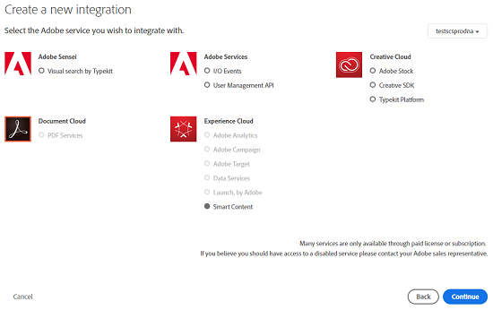

# Konfigurera resurstaggning med Smart Content Service {#configure-asset-tagging-using-the-smart-content-service}

Lär dig hur du konfigurerar smart taggning och förbättrad smart taggning i AEM med hjälp av Smart Content Service.

Du kan integrera Adobe Experience Manager (AEM) med Smart Content Service. Använd den här konfigurationen för att komma åt tjänsten Smart Content Service inifrån AEM och tagga dina bilder automatiskt.

Artikeln innehåller information om följande viktiga uppgifter som krävs för att konfigurera tjänsten Smart Content. I bakänden autentiserar AEM-servern dina inloggningsuppgifter med Adobe IO-gatewayen innan din begäran vidarebefordras till Smart Content Service.

1. Skapa en konfiguration för Smart Content Service i AEM för att generera en offentlig nyckel. Hämta ett offentligt certifikat för OAuth-integrering.
1. Skapa en integrering i Adobe I/O och överför den genererade publika nyckeln.
1. Konfigurera din AEM-instans med API-nyckeln och andra autentiseringsuppgifter från Adobe I/O.
1. Du kan även aktivera automatisk taggning vid överföring av resurser.

## Förutsättningar {#prerequisites}

Innan du kan använda tjänsten Smart Content måste du se till att följande är integrerat med Adobe I/O:

* Ett Adobe ID-konto som har administratörsbehörighet för organisationen.
* Tjänsten Smart Content Service är aktiverad för din organisation.

Om du vill aktivera förbättrade smarta taggar installerar du förutom ovanstående även det senaste [AEM-Service Pack](https://helpx.adobe.com/experience-manager/aem-releases-updates.html).

## Hämta offentligt certifikat {#obtain-public-certificate}

Med ett offentligt certifikat kan du autentisera din profil på Adobe I/O.

1. I AEM-användargränssnittet: tryck på AEM-logotypen och gå till **[!UICONTROL Verktyg]** > **[!UICONTROL Molntjänster]** > **[!UICONTROL Äldre molntjänster]**.

1. Tryck/klicka på **[!UICONTROL Konfigurera nu]** under Smarta taggar för **[!UICONTROL resurser på sidan för molntjänster]**.
1. I dialogrutan **[!UICONTROL Skapa konfiguration]** anger du en rubrik och ett namn för konfigurationen av smarta taggar. Tryck/klicka på **[!UICONTROL Skapa]**.
1. Använd följande värden i dialogrutan **[!UICONTROL AEM Smart Content Service]** :

   **[!UICONTROL Tjänst-URL]**: `https://mc.adobe.io/marketingcloud/smartcontent`

   **[!UICONTROL Auktoriseringsserver]**: `https://ims-na1.adobelogin.com`

   Lämna de andra fälten tomma (kommer senare). Tryck/klicka på **[!UICONTROL OK]**.

   

   >[!NOTE]
   >
   >URL:en som anges som [!UICONTROL tjänst-URL] är inte tillgänglig via webbläsaren och genererar ett 404-fel. Konfigurationen fungerar korrekt med samma värde som parametern [!UICONTROL Service URL] . Mer information om status och underhållsplan för Adobe I/O finns i [https://status.adobe.com](https://status.adobe.com).

1. Tryck/klicka på **[!UICONTROL Hämta offentligt certifikat för OAuth-integrering]** och hämta den offentliga certifikatfilen `AEM-SmartTags.crt`.

   

## Skapa Adobe I/O-integration {#create-adobe-i-o-integration}

Om du vill använda API:er för tjänsten Smart Content Service skapar du en integrering i Adobe I/O för att generera API-nyckel, ID för tekniskt konto, organisations-ID och klienthemlighet.

1. Gå till [https://console.adobe.io](https://console.adobe.io/).
1. På sidan **[!UICONTROL Integrationer]** väljer du din organisation.
1. Tryck/klicka på **[!UICONTROL Ny integrering]**.
1. På sidan **[!UICONTROL Skapa en ny integrering]** väljer du **[!UICONTROL Åtkomst till ett API]**. Tryck/klicka på **[!UICONTROL Fortsätt]**.
1. Under **[!UICONTROL Experience Cloud]** väljer du **[!UICONTROL Smart innehåll]**. Tryck/klicka på **[!UICONTROL Fortsätt]**.

   

1. På nästa sida väljer du **[!UICONTROL Ny integrering]**. Tryck/klicka på **[!UICONTROL Fortsätt]**.
1. Ange ett namn för integreringsgatewayen på sidan **[!UICONTROL Integreringsinformation]** och lägg till en beskrivning.
1. Överför **[!UICONTROL filen som du hämtade ovan i certifikaten]** för `AEM-SmartTags.crt` offentliga nycklar.
1. Tryck/klicka på **[!UICONTROL Skapa integrering]**.
1. Om du vill visa integreringsinformationen trycker/klickar du på **[!UICONTROL Fortsätt för att visa integreringsinformationen]**.

   

## Konfigurera Smart Content Service {#configure-smart-content-service}

Om du vill konfigurera integreringen använder du nyckelfälten Teknisk konto-ID, Organisations-ID, Klienthemlighet, Auktoriseringsserver och API från Adobe I/O-integreringen. Om du skapar en molnkonfiguration för smarta taggar kan du autentisera API-begäranden från AEM-instansen.

1. I AEM-användargränssnittet: tryck/klicka på AEM-logotypen. Gå till **[!UICONTROL Verktyg > Molntjänst > Äldre molntjänster]** för att öppna molntjänstkonsolen.
1. Öppna konfigurationen som skapats ovan under Smarta taggar för **[!UICONTROL resurser]**. Klicka på **[!UICONTROL Redigera]** på tjänstinställningssidan.
1. I dialogrutan **[!UICONTROL AEM Smart Content Service]** använder du de förifyllda värdena för fälten **[!UICONTROL Service URL]** och **[!UICONTROL Authorization Server]** .
1. Använd de värden som genereras ovan för fälten API-nyckel, ID för tekniskt konto, organisations-ID och Klienthemlighet.

## Validera konfigurationen {#validate-the-configuration}

När du är klar med konfigurationen kan du använda en JMX MBean för att validera konfigurationen. Följ de här stegen för att validera.

1. I AEM öppnar du OSGi-konsolen genom att klicka på **[!UICONTROL Verktyg > Åtgärder > Webbkonsol]**. Klicka på **[!UICONTROL Meny > JMX]**.
1. Klicka på **[!UICONTROL com.day.cq.dam.similarAritysearch.internal.impl]**. Den öppnar **[!UICONTROL LikhetSök efter andra uppgifter.]**
1. Klicka på **[!UICONTROL validateConfigs()]**. I dialogrutan **[!UICONTROL Validera konfigurationer]** klickar du på **[!UICONTROL Anropa]**.

   Valideringsresultatet visas i samma dialogruta.

## Aktivera smart taggning i arbetsflödet DAM-uppdatering (valfritt) {#enable-smart-tagging-in-the-update-asset-workflow-optional}

1. I AEM-användargränssnittet: tryck/klicka på AEM-logotypen och gå till **[!UICONTROL Verktyg > Arbetsflöde > Modeller]**.
1. På sidan **[!UICONTROL Arbetsflödesmodeller]** väljer du arbetsflödesmodellen **[!UICONTROL DAM-uppdatering]** .
1. Tryck/klicka på **[!UICONTROL Redigera]** i verktygsfältet.
1. Expandera sidopanelen för att visa stegen. Dra steget **[!UICONTROL Smart Tag Asset]** som finns i arbetsflödesavsnittet för DAM och placera det efter steget **[!UICONTROL Bearbeta miniatyrer]** .

   

1. Öppna steget i redigeringsläge. Under **[!UICONTROL Avancerade inställningar]** kontrollerar du att alternativet **[!UICONTROL Avancerat]** för hanterare är markerat.

   

1. På fliken **[!UICONTROL Argument]** väljer du **[!UICONTROL Ignorera fel]** om du vill att arbetsflödet ska slutföras även om det automatiska taggningssteget misslyckas.

   

   Om du vill tagga resurser när de överförs, oavsett om smart taggning är aktiverat för mappar, väljer du **[!UICONTROL Ignorera smart taggflagga]**.

   

1. Tryck/klicka på **[!UICONTROL OK]** för att stänga processteget och spara sedan arbetsflödet.

>[!MORELIKETHIS]
>
>* [Smarta taggar i AEM Resurser](https://helpx.adobe.com/experience-manager/kt/assets/using/smart-tags-feature-video-understand.html)
>* [Använd smarta taggar med AEM Resurser](https://helpx.adobe.com/experience-manager/kt/assets/using/smart-tags-feature-video-use.html)
>* [Använd förbättrade smarta taggar med AEM Assets](https://helpx.adobe.com/experience-manager/kt/assets/using/enhanced-smart-tags-feature-video-use.html)
>* [Konfigurera förbättrade smarta taggar i AEM Resurser](https://helpx.adobe.com/experience-manager/kt/assets/using/enhanced-smart-tags-technical-video-setup.html)

