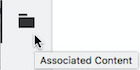

# Associerat innehåll {#associated-content}

>[!CAUTION]
>
>Vissa funktioner för innehållsfragment kräver [AEM 6.4 Service Pack 2 (6.4.2.0) eller senare](/help/release-notes/sp-release-notes.md).

Associerat innehåll ger anslutningen så att resurser (t.ex.) kan (valfritt) användas med fragmentet när det läggs till på en innehållssida. Detta ger flexibilitet genom att [tillhandahålla ett antal resurser att komma åt när du använder innehållsfragmentet på en sida](/help/sites-authoring/content-fragments.md#using-associated-content), samtidigt som det minskar tiden som krävs för att söka efter rätt resurs.

## Lägger till associerat innehåll {#adding-associated-content}

>[!NOTE]
>
>Det finns olika metoder för att lägga till [visuella resurser (t.ex. bilder)](content-fragments.md#fragments-with-visual-assets) till avsnittet och/eller sidan.

Om du vill skapa en association måste du först [lägga till dina mediefiler i en samling](managing-collections-touch-ui.md#adding-assets-to-a-collection). När det är klart kan du:

1. Öppna fragmentet och välj **[!UICONTROL Associated Content]** på sidopanelen.

   

1. Välj **[!UICONTROL Associate Content]** eller **[!UICONTROL Associate Collection]** (beroende på om några samlingar redan har associerats eller inte).
1. Välj önskad samling.

   Du kan också lägga till själva fragmentet i den valda samlingen; detta hjälper till att spåra.

   

1. Bekräfta (med bockmarkering). Samlingen listas som associerad.

   

## Redigera associerat innehåll {#editing-associated-content}

När du har kopplat en samling kan du:

* **Ta** bort associationen.
* **Lägg till** resurser i samlingen.
* Välj en resurs för ytterligare åtgärder.
* Redigera resursen.
