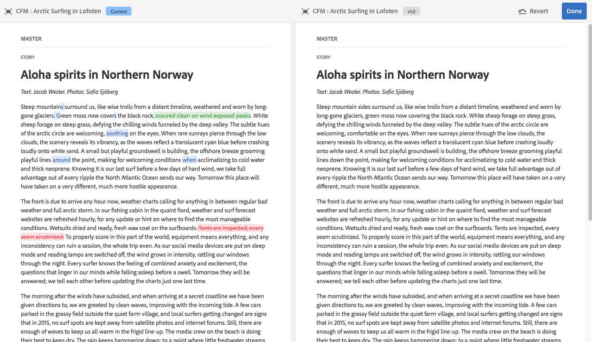

# Hantera innehållsfragment {#managing-content-fragments}

>[!CAUTION]
>
>Vissa funktioner för innehållsfragment kräver att [AEM 6.4 Service Pack 2 (6.4.2.0) eller senare](/help/release-notes/sp-release-notes.md)används.

Innehållsfragment lagras som **[!UICONTROL Assets]** och hanteras i första hand från **[!UICONTROL Assets]** konsolen.

>[!NOTE]
>
>Innehållsfragment används sedan med redigeringssidor; Se [Sidredigering med innehållsfragment](/help/sites-authoring/content-fragments.md).

## Skapa innehållsfragment {#creating-content-fragments}

### Skapa en innehållsmodell {#creating-a-content-model}

[Modeller](content-fragments-models.md) för innehållsfragment kan aktiveras och skapas innan du skapar innehållsfragment med strukturerat innehåll.

>[!NOTE]
>
>Mer information om mallar finns i [Utveckla innehållsfragment](/help/sites-developing/customizing-content-fragments.md) . används för enkla innehållsfragment.

### Skapa ett innehållsfragment {#creating-a-content-fragment}

Metoden för att skapa ett innehållsfragment är (i princip) densamma för både enkla och strukturerade fragment:

1. Navigate to the **[!UICONTROL Assets]** folder where you want to create the fragment.
1. Välj **[!UICONTROL Create]** och **[!UICONTROL Content Fragment]** öppna sedan guiden.
1. I det första steget i guiden måste du ange grunden för det nya fragmentet.

   * Detta kan vara en:

      * [Mall](/help/sites-developing/content-fragment-templates.md) - till exempel **[!UICONTROL Simple Fragment]**
      * [Modell](content-fragments-models.md) - används för att skapa ett fragment som kräver strukturerat innehåll. till exempel **flygplatsmodellen**
   * Alla tillgängliga mallar och modeller visas.

   Efter markeringen använder du **[!UICONTROL Next]** för att fortsätta.

   

1. In the **[!UICONTROL Properties]** step specify:

   * **[!UICONTROL Basic]**

      * **[!UICONTROL Title]**

         Fragmenttiteln.

         Obligatorisk.

      * **[!UICONTROL Description]**
      * **[!UICONTROL Tags]**
   * **[!UICONTROL Advanced]**

      * **[!UICONTROL Name]**

         Namnet; används för att skapa URL:en.

         Obligatoriskt. hämtas automatiskt från titeln, men kan uppdateras.

1. Select **[!UICONTROL Create]** to complete the action, then either **[!UICONTROL Open]** the fragment for editing or return to the console with **[!UICONTROL Done]**.

## Åtgärder för ett innehållsfragment {#actions-for-a-content-fragment}

I **[!UICONTROL Assets]** konsolen finns ett antal åtgärder tillgängliga för dina innehållsfragment, antingen:

* Från verktygsfältet; när du har valt fragmentet är alla lämpliga åtgärder tillgängliga.
* som [snabbåtgärder](/help/sites-authoring/basic-handling.md#quick-actions), en delmängd av åtgärder som är tillgängliga för de enskilda fragmentkorten.

Markera fragmentet för att visa verktygsfältet med tillämpliga åtgärder:

* **[!UICONTROL Download]**

   * Spara fragmentet som en ZIP-fil; du kan definiera om element, variationer och metadata ska inkluderas.

* **[!UICONTROL Create]**
* **[!UICONTROL Checkout]**
* **[!UICONTROL Properties]**

   * Gör att du kan visa och/eller redigera fragmentets metadata.

* **[!UICONTROL Edit]**

   * Gör att du kan [öppna fragmentet för redigering av innehåll](content-fragments-variations.md) tillsammans med dess element, variationer, tillhörande innehåll och metadata.

* **[!UICONTROL Manage Tags]**
* **[!UICONTROL To Collection]**

   * Lägg till fragmentet i en samling.
   * Detta kan även göras när en samling [kopplas till fragmentet](content-fragments-assoc-content.md#adding-associated-content).

* **[!UICONTROL Copy/Paste]**
* **[!UICONTROL Move]**
* **[!UICONTROL Quick Publish]**
* **[!UICONTROL Manage Publication]**
* **[!UICONTROL Delete]**

>[!NOTE]
>
>Många av dessa åtgärder är [standardåtgärder för Assets](managing-assets-touch-ui.md) och/eller [datorprogrammet](https://helpx.adobe.com/experience-manager/desktop-app/aem-desktop-app.html).

## Öppna fragmentredigeraren {#opening-the-fragment-editor}

Så här öppnar du fragmentet för redigering:

>[!CAUTION]
>
>Om du vill redigera ett innehållsfragment behöver du [rätt behörigheter](/help/sites-developing/customizing-content-fragments.md#asset-permissions). Kontakta systemadministratören om du har problem.

1. Använd **[!UICONTROL Assets]** konsolen för att navigera till platsen för ditt innehållsfragment.
1. Öppna fragmentet för redigering, antingen genom att:

   * Klicka/tryck på fragment- eller fragment-länken (detta beror på konsolvyn).
   * Markera fragmentet och sedan **[!UICONTROL Edit]** från verktygsfältet.

   Fragmentredigeraren öppnas:

   

   >[!NOTE]
   >
   >1. Ett meddelande visas när fragmentet redan refereras på en innehållssida.
      >
      >
   2. Sidpanelen kan döljas/visas med hjälp av **[!UICONTROL Toggle Side Panel]** ikonen .

1. Navigera genom de tre lägena med ikonerna på sidopanelen:

   * Variationer: [Redigera innehåll](#editing-the-content-of-your-fragment) och [hantera variationer](#creating-and-managing-variations-within-your-fragment)
   * [Anteckningar](content-fragments-variations.md#annotating-a-content-fragment)
   * [Associerat innehåll](#associating-content-with-your-fragment)
   * [Metadata](#viewing-and-editing-the-metadata-properties-of-your-fragment)

   

1. När du har gjort ändringarna ska du använda **[!UICONTROL Save]** eller **[!UICONTROL Cancel]** så.

   >[!NOTE]
   >
   >Both **[!UICONTROL Save]** and **[!UICONTROL Cancel]** will exit the editor - see [Save, Cancel and Versions](#save-cancel-and-versions) for full information on how both options operate for content fragments.

## Spara, Avbryt och Versioner {#save-cancel-and-versions}

>[!NOTE]
>
>Versioner kan också [skapas, jämföras och återställas från tidslinjen](https://helpx.adobe.com/experience-manager/6-3/assets/using/content-fragments-managing.html#timeline-for-content-fragments).

Redigeraren har två alternativ:

* **[!UICONTROL Save]**

   Sparar de senaste ändringarna och avslutar redigeraren.

   >[!CAUTION]
   >
   >Om du vill redigera ett innehållsfragment behöver du [rätt behörigheter](/help/sites-developing/customizing-content-fragments.md#asset-permissions). Kontakta systemadministratören om du har problem.

   >[!NOTE]
   >
   >Det går att vara kvar i redigeraren och göra en serie ändringar innan du väljer **[!UICONTROL Save]**.

   >[!CAUTION]
   >
   >Förutom att bara spara ändringarna uppdaterar **[!UICONTROL Save]** även alla referenser och ser till att dispatchern rensas efter behov. Dessa ändringar kan ta tid att bearbeta. På grund av detta kan prestandan påverkas på ett stort/komplext/tungt belastat system.
   >
   >
   >Tänk på detta när du använder **[!UICONTROL Save]** och ange sedan snabbt fragmentredigeraren igen för att göra och spara ytterligare ändringar.

* **[!UICONTROL Cancel]**

   Redigeraren avslutas utan att de senaste ändringarna sparas.

När du redigerar ditt innehållsfragment skapar AEM automatiskt versioner för att säkerställa att tidigare innehåll kan återställas om du gör **[!UICONTROL Cancel]** dina ändringar:

1. När ett innehållsfragment öppnas för redigering AEM söker efter den cookie-baserade token som anger om det finns en *redigeringssession* :

   1. Om token hittas betraktas fragmentet som en del av den befintliga redigeringssessionen.
   1. Om token *inte* är tillgänglig och användaren börjar redigera innehåll, skapas en version och en token för den nya redigeringssessionen skickas till klienten, där den sparas i en cookie.

1. När det finns en *aktiv* redigeringssession sparas innehållet som redigeras automatiskt var 600:e sekund (standard).

   >[!NOTE]
   >
   >Intervallet för att spara automatiskt kan konfigureras med hjälp av `/conf` mekanismen.
   >
   >Standardvärde, se:
   >
   >`/libs/settings/dam/cfm/jcr:content/autoSaveInterval`

1. Om användaren väljer att redigera **[!UICONTROL Cancel]** återställs den version som skapades i början av redigeringssessionen och token tas bort för att avsluta redigeringssessionen.
1. Om användaren väljer att redigera **[!UICONTROL Save]** kommer de uppdaterade elementen/varianterna att finnas kvar och token tas bort för att avsluta redigeringssessionen.

## Redigera innehållet i fragmentet {#editing-the-content-of-your-fragment}

När du har öppnat fragmentet kan du använda fliken [Variationer](content-fragments-variations.md) för att skapa innehållet.

## Skapa och hantera variationer i fragment {#creating-and-managing-variations-within-your-fragment}

När du har skapat det Överordnad innehållet kan du skapa och hantera [varianter](content-fragments-variations.md) av det innehållet.

## Koppla innehåll till fragment {#associating-content-with-your-fragment}

Du kan också [koppla innehåll](content-fragments-assoc-content.md) till ett fragment. Detta ger en anslutning så att resurser (t.ex. bilder) kan användas (valfritt) med fragmentet när det läggs till på en innehållssida.

## Visa och redigera metadata (egenskaper) för fragmentet {#viewing-and-editing-the-metadata-properties-of-your-fragment}

Du kan visa och redigera egenskaperna för ett fragment på [!UICONTROL Metadata](content-fragments-metadata.md) fliken.

## Tidslinje för innehållsfragment {#timeline-for-content-fragments}

Förutom standardalternativen innehåller [tidslinjen](managing-assets-touch-ui.md#timeline) både information och åtgärder som är specifika för innehållsfragment:

* Visa information om versioner, kommentarer och anteckningar
* Åtgärder för versioner

   * **[!UICONTROL Revert to this Version](#reverting-to-a-version)** (välj ett befintligt fragment och sedan en specifik version)
   * **[!UICONTROL Compare to Current](#comparing-fragment-versions)** (välj ett befintligt fragment och sedan en specifik version)
   * Lägg till ett **[!UICONTROL Label]** och/eller **[!UICONTROL Comment]** (välj ett befintligt fragment, sedan en specifik version)
   * **[!UICONTROL Save as Version]** (markera ett befintligt fragment och sedan uppilen längst ned på tidslinjen)

* Åtgärder för anteckningar

   * **[!UICONTROL Delete]**

>[!NOTE]
>
>Kommentarerna är:
>
>* Standardfunktionalitet för alla resurser
>* Skapat i tidslinjen
>* Relaterat till fragmentresursen

>
>
Anteckningar (för innehållsfragment) är:
>
>* Anges i fragmentredigeraren
>* Specifik för ett markerat textsegment i fragmentet

Till exempel:

## Jämföra fragmentversioner {#comparing-fragment-versions}

Funktionsmakrot är tillgängligt från **[!UICONTROL Compare to Current]** [!UICONTROL Timeline](https://helpx.adobe.com/experience-manager/6-3/assets/using/content-fragments-managing.html#timeline-for-content-fragments) när du har valt en viss version.

Den här öppnas:

* den **[!UICONTROL Current]** (senaste) versionen (vänster)

* den valda versionen **v&lt;*x.y*>** (höger)

De visas sida vid sida, där:

* Eventuella skillnader markeras

   * Borttagen text - röd
   * Infogad text - grön
   * Ersatt text - blå

* Med helskärmsikonen kan du öppna båda versionerna separat; växla sedan tillbaka till den parallella vyn
* Du kan **[!UICONTROL Revert]** till den specifika versionen
* **[!UICONTROL Done]** kommer du tillbaka till konsolen

>[!NOTE]
>
>Du kan inte redigera fragmentinnehållet när du jämför fragment.

## Återställa till en version  {#reverting-to-a-version}

Du kan återgå till en viss version av fragmentet:

* Direkt från [!UICONTROL Timeline](content-fragments-managing.md#timeline-for-content-fragments).

   Välj önskad version och sedan **[!UICONTROL Revert to this Version]** åtgärden.

* När du [jämför en version med den aktuella versionen](content-fragments-managing.md#comparing-fragment-versions) kan du **[!UICONTROL Revert]** med den valda versionen.

## Publicera och referera till ett fragment {#publishing-and-referencing-a-fragment}

>[!CAUTION]
>
>Om fragmentet är baserat på en modell bör du se till att [modellen har publicerats](content-fragments-models.md#publishing-a-content-fragment-model).
>
>Om du publicerar ett innehållsfragment för vilket modellen ännu inte har publicerats, visas detta i en urvalslista och modellen publiceras med fragmentet.

Innehållsfragment måste publiceras för användning i publiceringsmiljön. De kan publiceras:

* Efter skapande; från **[!UICONTROL Assets]** konsolen.
* När du [publicerar en sida som använder fragmentet](/help/sites-authoring/content-fragments.md#publishing); fragmentet kommer att listas i sidreferenserna.

>[!CAUTION]
>
>När ett fragment har publicerats och/eller refererats visar AEM en varning när en författare öppnar fragmentet för redigering igen. Detta är för att varna för att ändringar i avsnittet även påverkar de refererade sidorna.

## Ta bort ett fragment {#deleting-a-fragment}

Så här tar du bort ett fragment:

1. Gå till innehållsfragmentets plats i **[!UICONTROL Assets]** konsolen.
1. Markera fragmentet.

   >[!NOTE]
   >
   >Åtgärden är inte tillgänglig som **[!UICONTROL Delete]** en snabbåtgärd.

1. Select **[!UICONTROL Delete]** from the toolbar.
1. Bekräfta **[!UICONTROL Delete]** åtgärden.

   >[!CAUTION]
   >
   >If the fragment is already referenced in a page you will then see a warning message and be required to confirm that you want to proceed with a **[!UICONTROL Force Delete]**. Fragmentet, tillsammans med dess innehållskomponentfragment, tas bort från alla innehållssidor.

