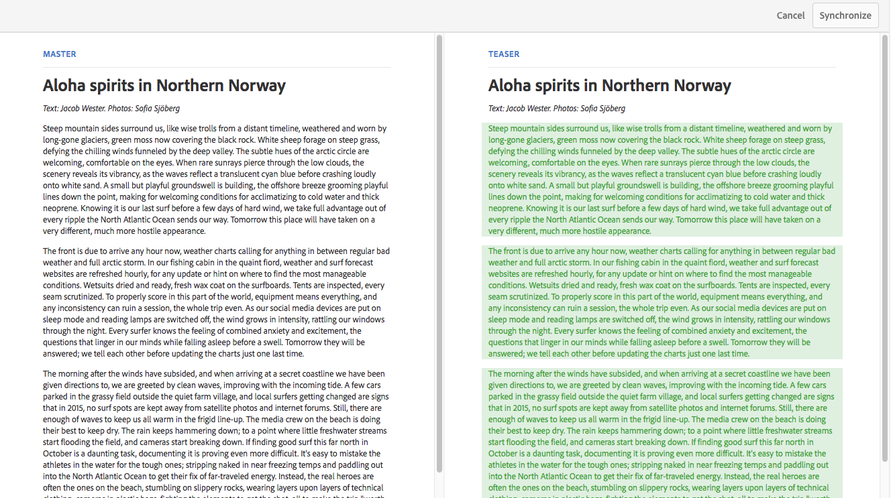

# Variationer – redigera innehållsfragment {#variations-authoring-fragment-content}

>[!CAUTION]
>
>Vissa funktioner för innehållsfragment kräver att [AEM 6.4 Service Pack 2 (6.4.2.0) eller senare](../release-notes/sp-release-notes.md).

[Variationer](content-fragments.md#constituent-parts-of-a-content-fragment) är en viktig egenskap i innehållsfragment, eftersom de gör det möjligt att skapa och redigera kopior av det överordnad innehållet för användning i specifika kanaler och/eller scenarier.

Från **Variationer** -flik:

* [Ange innehållet](#authoring-your-content) för ditt fragment
* [Skapa och hantera variationer](#managing-variations) i **Överordnad** innehåll

Utför en rad andra åtgärder beroende på vilken datatyp som redigeras. till exempel:

* [Infoga visuella resurser i fragmentet](#inserting-assets-into-your-fragment) (bilder)
* Välj mellan [RTF](#rich-text), [Oformaterad text](#plain-text) och [Markering](#markdown) för redigering

* [Överför innehåll](#uploading-content)

* [Visa nyckelstatistik](#viewing-key-statistics) (om text med flera rader)
* [Sammanfatta text](#summarizing-text)

* [Synkronisera varianter med Överordnad innehåll](#synchronizing-with-master)

>[!CAUTION]
>
>När ett fragment har publicerats och/eller refererats visar AEM en varning när en författare öppnar fragmentet för redigering igen. Detta är för att varna för att ändringar i avsnittet även påverkar de refererade sidorna.

## Redigera ditt innehåll {#authoring-your-content}

När du öppnar ditt innehållsfragment för redigering visas **Variationer** som standard är fliken öppen. Här kan du skapa innehåll, för Överordnad eller andra varianter som du har. Du kan:

* gör redigeringar direkt i **Variationer** tab
* öppna [helskärmsredigerare](#full-screen-editor) till:

   * välj [Format](#formats)
   * se fler redigeringsalternativ (för [RTF](#rich-text) format)
   * få tillgång till ett antal [funktionsmakron](#actions)

Till exempel:

* Redigera ett enkelt fragment

   Ett enkelt fragment består av ett textfält med flera rader (visuella resurser kan läggas till i helskärmsredigeraren).

   

* Redigera ett fragment med strukturerat innehåll

   Ett strukturerat fragment innehåller olika fält, av olika datatyper, som har definierats i innehållsmodellen. För flerradiga fält visas [helskärmsredigerare](#full-screen-editor) är tillgängligt.

   

### Helskärmsredigerare {#full-screen-editor}

När du redigerar ett textfält med flera rader kan du öppna fullskärmsredigeraren:

Helskärmsredigeraren ger dig följande:

* Åtkomst till olika [funktionsmakron](#actions)
* Beroende på [format](#formats), ytterligare formateringsalternativ ([RTF](#rich-text))

### Åtgärder {#actions}

Följande åtgärder är också tillgängliga (för alla [format](#formats)) när helskärmsredigeraren (d.v.s. text med flera rader) är öppen:

* Välj [format](#formats) ([RTF](#rich-text), [Oformaterad text](#plain-text), [Markering](#markdown))
* [Visa textstatistik](#viewing-key-statistics)
* [Överför innehåll](#uploading-content)
* [Synkronisera med Överordnad](#synchronizing-with-master) (när du redigerar en variant)
* [Sammanfatta text](#summarizing-text)
* [Anteckna](content-fragments-variations.md#annotating-a-content-fragment) din text

* [Infoga visuella resurser i fragmentet](#inserting-assets-into-your-fragment) (bilder)

### Format {#formats}

Vilka alternativ du kan använda för att redigera text med flera rader beror på vilket format du har valt:

* [RTF-text](#rich-text)
* [Oformaterad text](#plain-text)
* [Markdown](#markdown)

Formatet kan väljas när helskärmsredigeraren används.

### RTF-text {#rich-text}

Med textredigering kan du formatera:

* Fet
* Kursiv
* Understrykning
* Justering: vänster, mitten, höger
* Punktlista
* Numrerad lista
* Indrag: öka, minska
* Skapa/bryt hyperlänkar
* Öppna helskärmsredigeraren, där följande formateringsalternativ är tillgängliga:

   * Klistra in text/text från Word
   * Infoga en tabell
   * Styckeformat: Stycke, Rubrik 1/2/3
   * [Infoga visuella resurser](#inserting-assets-into-your-fragment)
   * Sökning
   * Sök/ersätt
   * Stavningskontroll
   * [Anteckningar](content-fragments-variations.md#annotating-a-content-fragment)

The [funktionsmakron](#actions) kan även användas i helskärmsredigeraren.

### Oformaterad text {#plain-text}

Med oformaterad text kan du snabbt lägga in innehåll utan formaterings- eller markeringsinformation. Du kan även öppna helskärmsredigeraren för ytterligare information [funktionsmakron](#actions).

>[!CAUTION]
>
>Om du väljer **Oformaterad text** kan du förlora formatering, markdown-kod och/eller resurser som du har infogat i **RTF** eller **Markdown-kod**.

### Markering {#markdown}

>[!NOTE]
>
>Mer information finns i [Markering](content-fragments-markdown.md) dokumentation.

På så sätt kan du formatera texten med hjälp av markeringar. Du kan definiera:

* Rubriker
* Stycken och radbrytningar
* Länkar
* Bilder
* Blockcitat
* Listor
* Betoning
* Kodblock
* Backslash Escapes

Du kan även öppna helskärmsredigeraren för ytterligare information [funktionsmakron](#actions).

>[!CAUTION]
>
>Om du växlar mellan **RTF** och **Markdown-kod** kan du få oväntade effekter med Blockcitattecken och Kodblock, eftersom dessa båda format kan hanteras på olika sätt.

### Visa nyckelstatistik {#viewing-key-statistics}

När helskärmsredigeraren är öppen visar åtgärden **Textstatistik** information om texten. Till exempel:

### Överför innehåll {#uploading-content}

För att underlätta redigeringen av innehållsfragment kan du överföra text, förberedd i en extern redigerare och lägga till den direkt i fragmentet.

### Sammanfatta text {#summarizing-text}

Att sammanfatta text är utformat för att hjälpa användare att minska längden på texten till ett fördefinierat antal ord, samtidigt som man behåller huvudpunkterna och den övergripande innebörden.

>[!NOTE]
>
>På en mer teknisk nivå håller systemet kvar de meningar som det bedömer som att det tillhandahåller *bästa förhållandet mellan informationstäthet och unikhet* enligt specifika algoritmer.

>[!CAUTION]
>
>Innehållsfragmentet måste ha en giltig språkmapp som överordnad. används för att fastställa vilken språkmodell som ska användas.
>
>Till exempel: `en/` som i följande sökväg:
>
>`/content/dam/my-brand/en/path-down/my-content-fragment`

>[!CAUTION]
>
>Engelska finns i körklart skick.
>
>Andra språk är tillgängliga som språkmodellpaket från programvarudistribution:
>
>* [Franska (fr) från programvarudistribution](https://experience.adobe.com/#/downloads/content/software-distribution/en/aem.html?package=/content/software-distribution/en/details.html/content/dam/aem/public/adobe/packages/cq630/product/smartcontent-model-fr)
>* [German (de) from Software Distribution](https://experience.adobe.com/#/downloads/content/software-distribution/en/aem.html?package=/content/software-distribution/en/details.html/content/dam/aem/public/adobe/packages/cq630/product/smartcontent-model-de)
>* [Italian (it) from Software Distribution](https://experience.adobe.com/#/downloads/content/software-distribution/en/aem.html?package=/content/software-distribution/en/details.html/content/dam/aem/public/adobe/packages/cq630/product/smartcontent-model-it)
>* [Spanska (es) från programvarudistribution](https://experience.adobe.com/#/downloads/content/software-distribution/en/aem.html?package=/content/software-distribution/en/details.html/content/dam/aem/public/adobe/packages/cq630/product/smartcontent-model-es)
>

1. Välj **[!UICONTROL Master]** eller den variation som krävs.
1. Öppna fullskärmsredigeraren.

1. Välj **[!UICONTROL Summarize text]** i verktygsfältet.

   

1. Ange målantalet ord och markera **[!UICONTROL Start]**:
1. Den ursprungliga texten visas sida vid sida med den föreslagna sammanfattningen:

   * Alla meningar som ska tas bort markeras med rött, med genomstrykning.
   * Klicka på en markerad mening om du vill behålla den i det sammanfattande innehållet.
   * Klicka på en mening som inte är markerad för att ta bort den.

   

1. Välj **[!UICONTROL Summarize]** för att bekräfta ändringarna.

### Anteckna ett innehållsfragment {#annotating-a-content-fragment}

Så här kommenterar du ett fragment:

1. Välj **[!UICONTROL Master]** eller den variation som krävs.
1. Öppna fullskärmsredigeraren.
1. Markera text. The **[!UICONTROL Annotate]** blir ikonen tillgänglig.

   

1. En dialogruta öppnas. Här kan du ange din anteckning.

1. Stäng helskärmsredigeraren och **[!UICONTROL Save]** fragmentet.

### Visa, redigera, ta bort anteckningar {#viewing-editing-deleting-annotations}

Anteckningar:

* Indikeras av markeringen på texten, både i helskärmsläge och i normalt läge i redigeraren. Du kan sedan visa, redigera och/eller ta bort all information i en anteckning genom att klicka på den markerade texten, som öppnar dialogrutan igen.

   >[!NOTE]
   >
   >En nedrullningsbar väljare tillhandahålls om flera anteckningar har tillämpats på ett textstycke.

* När du tar bort hela texten som kommentaren användes på tas även anteckningen bort.

* Kan listas och tas bort genom att välja **[!UICONTROL Annotations]** i fragmentredigeraren.

   

* Kan visas, tas bort och visas i [Tidslinje](https://helpx.adobe.com/experience-manager/6-3/assets/using/content-fragments-managing.html#timeline-for-content-fragments) för det valda fragmentet.

### Infoga resurser i fragment {#inserting-assets-into-your-fragment}

Du kan lägga till [Resurser](managing-assets-touch-ui.md) (bilder) direkt till fragmentet.

De läggs till i fragmentets styckesekvens utan formatering. formatering kan göras när [fragment används/refereras på en sida](/help/sites-authoring/content-fragments.md).

>[!CAUTION]
>
>Dessa resurser kan inte flyttas eller tas bort på en referenssida. Detta måste göras i fragmentredigeraren.
>
>Formatering av resursen (t.ex. storlek) måste dock göras i [sidredigerare](/help/sites-authoring/content-fragments.md). Representationen av resursen i fragmentredigeraren är endast till för att skapa innehållsflödet.

>[!NOTE]
>
>Det finns olika metoder att lägga till [bilder](content-fragments.md#fragments-with-visual-assets) till fragmentet och/eller sidan.

1. Placera markören på den plats där du vill lägga till bilden.
1. Använd **[!UICONTROL Insert Asset]** -ikonen för att öppna sökdialogrutan.

   

1. I dialogrutan kan du antingen:

   * navigera till den nödvändiga resursen i DAM
   * söka efter resursen i DAM

   Välj önskad resurs genom att klicka på miniatyrbilden.

1. Använd **[!UICONTROL Select]** om du vill lägga till resursen i innehållsfragmentets styckesystem på den aktuella platsen.

   >[!CAUTION]
   >
   >Om du efter att ha lagt till en resurs ändrar formatet till:
   >
   >* **Oformaterad text**: Resursen kommer att förloras helt från fragmentet.
   >* **Markdown-kod**: Resursen visas inte, men finns fortfarande kvar när du återgår till **RTF**.

## Hantera variationer {#managing-variations}

### Skapa en variant {#creating-a-variation}

Med variationer kan du ta **Överordnad** innehållet och variera det beroende på syfte (om det behövs).

Så här skapar du en ny variant:

1. Öppna fragmentet och se till att sidopanelen är synlig.
1. Välj **[!UICONTROL Variations]** från ikonfältet på sidopanelen.
1. Välj **[!UICONTROL Create Variation]**.
1. En dialogruta öppnas. Ange **[!UICONTROL Title]** och **[!UICONTROL Description]** för den nya variationen.
1. Välj **[!UICONTROL Add]**; fragmentet **[!UICONTROL Master]** kopieras till den nya varianten som nu är öppen för [redigera](#editing-a-variation).

   >[!NOTE]
   >
   >När du skapar en ny variant är det alltid **Överordnad** som kopieras, inte varianten som är öppen.

### Redigera en variant {#editing-a-variation}

Du kan ändra variantinnehållet efter antingen:

* [Skapa en variant](#creating-a-variation).
* Öppna ett befintligt fragment och välj sedan önskad variation på sidopanelen.

### Byta namn på en variant {#renaming-a-variation}

Så här byter du namn på en befintlig variant:

1. Öppna fragmentet och välj **[!UICONTROL Variations]** från sidopanelen.
1. Välj önskad variant.
1. Välj **[!UICONTROL Rename]** från **[!UICONTROL Actions]** nedrullningsbar meny.

1. Ange det nya **[!UICONTROL Title]** och/eller **[!UICONTROL Description]** i dialogrutan som visas.

1. Bekräfta **[!UICONTROL Rename]** åtgärd.

>[!NOTE]
>
>Detta påverkar bara variationen **Titel**.

### Ta bort en variant {#deleting-a-variation}

Så här tar du bort en befintlig variant:

1. Öppna fragmentet och välj **[!UICONTROL Variations]** från sidopanelen.
1. Välj önskad variant.
1. Välj **[!UICONTROL Delete]** från **[!UICONTROL Actions]** nedrullningsbar meny.

1. Bekräfta **[!UICONTROL Delete]** i dialogrutan.

>[!NOTE]
>
>Du kan inte ta bort **Överordnad**.

### Synkroniserar med Överordnad {#synchronizing-with-master}

**Överordnad** är en integrerad del av ett innehållsfragment och innehåller per definition den överordnad kopian av innehållet, medan varianterna innehåller de individuella uppdaterade och anpassade versionerna av det innehållet. När Överordnad uppdateras är det möjligt att dessa ändringar också är relevanta för variationerna och därför måste spridas till dem.

När du redigerar en variant har du tillgång till åtgärden för att synkronisera det aktuella elementet i variationen med Överordnad. På så sätt kan du automatiskt kopiera ändringar som gjorts Överordnad till den önskade variationen.

>[!CAUTION]
>
>Synkronisering är bara tillgängligt för att kopiera ändringar *från **mastern**till varianten*.
>
>Endast det aktuella elementet i variationen kommer att synkroniseras.
>
>Synkronisering fungerar bara på datatypen **Flerradig text**.
>
>Du kan inte överföra ändringar *från en variant till **mastern***.

1. Öppna ditt innehållsfragment i fragmentredigeraren. Se till att **Överordnad** har redigerats.
2. Välj en specifik variant och sedan lämplig synkroniseringsåtgärd från antingen:

   * den **Åtgärder** nedrullningsbar väljare - **Synkronisera aktuellt element med överordnad**
   * verktygsfältet i fullskärmsredigeraren - **Synkronisera med överordnad**

3. Överordnad och variationen visas sida vid sida:

   * grönt anger innehåll som lagts till (i varianten)
   * rött anger att innehållet har tagits bort (från varianten)

   

4. Välj **[!UICONTROL Synchronize]** uppdateras och visas variationen.
