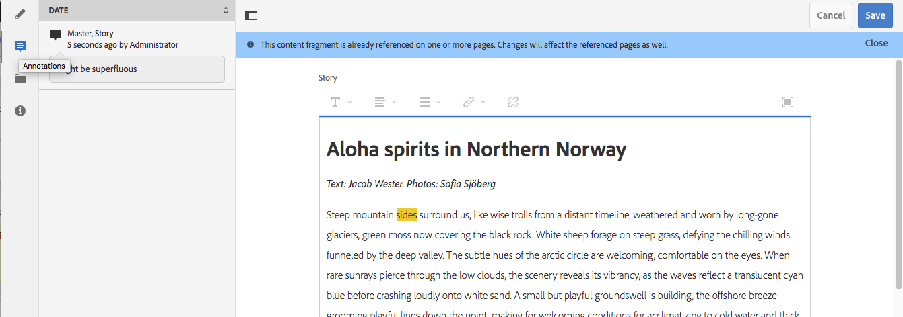

# Variationer – redigera innehållsfragment {#variations-authoring-fragment-content}

>[!CAUTION]
>
>Vissa funktioner för innehållsfragment kräver att [AEM 6.4 Service Pack 2 (6.4.2.0) eller senare](../release-notes/sp-release-notes.md)används.

[Variationer](content-fragments.md#constituent-parts-of-a-content-fragment) är en viktig egenskap i innehållsfragment, eftersom de gör att du kan skapa och redigera kopior av huvudinnehållet för användning i specifika kanaler och/eller scenarier.

På fliken **Variationer** kan du:

* [Ange innehållet](#authoring-your-content) för fragmentet
* [Skapa och hantera variationer](#managing-variations) av **mallinnehållet**

Utför en rad andra åtgärder beroende på vilken datatyp som redigeras. till exempel:

* [Infoga visuella resurser i fragmentet](#inserting-assets-into-your-fragment) (bilder)
* Välj mellan [RTF](#rich-text), [Oformaterad text](#plain-text) och [Markering](#markdown) för redigering

* [Överför innehåll](#uploading-content)

* [Visa nyckelstatistik](#viewing-key-statistics) (om flerradig text)
* [Sammanfatta text](#summarizing-text)

* [Synkronisera varianter med mallinnehåll](#synchronizing-with-master)

>[!CAUTION]
>
>När ett fragment har publicerats och/eller refererats visar AEM en varning när en författare öppnar fragmentet för redigering igen. Detta är för att varna för att ändringar i avsnittet även påverkar de refererade sidorna.

## Redigera ditt innehåll {#authoring-your-content}

När du öppnar ditt innehållsfragment för redigering öppnas fliken **Variationer** som standard. Här kan du skapa innehållet, för mallsidor eller andra varianter som du har. Du kan:

* gör redigeringar direkt på fliken **Variationer**
* öppna [helskärmsredigeraren](#full-screen-editor) för att:

   * välj [Format](#formats)
   * see more editing options (for [Rich Text](#rich-text) format)
   * access a range of [actions](#actions)

Till exempel:

* Redigera ett enkelt fragment

   A simple fragment consists of one multi-line text field (visual assets can be added from the full-screen editor).

   

* Editing a fragment with structured content

   A structured fragment contains various fields, of various data-types, that were defined in the content model. For any multi-line fields the [full-screen editor](#full-screen-editor) is available.

   

### Helskärmsredigerare {#full-screen-editor}

När du redigerar ett textfält med flera rader kan du öppna fullskärmsredigeraren:

Helskärmsredigeraren ger dig följande:

* Åtkomst till olika [åtgärder](#actions)
* Beroende på [format](#formats)kan ytterligare formateringsalternativ användas ([RTF](#rich-text))

### Åtgärder {#actions}

Följande åtgärder är också tillgängliga (för alla [format](#formats)) när helskärmsredigeraren (d.v.s. flerradig text) är öppen:

* Välj [format](#formats) ([RTF](#rich-text), [Oformaterad text](#plain-text), [Markering](#markdown))
* [Visa textstatistik](#viewing-key-statistics)
* [Överför innehåll](#uploading-content)
* [Synkronisera med mallsida](#synchronizing-with-master) (när du redigerar en variant)
* [Sammanfatta text](#summarizing-text)
* [Anteckna](content-fragments-variations.md#annotating-a-content-fragment) texten

* [Infoga visuella resurser i fragmentet](#inserting-assets-into-your-fragment) (bilder)

### Format {#formats}

Vilka alternativ du kan använda för att redigera text med flera rader beror på vilket format du har valt:

* [RTF-text](#rich-text)
* [Oformaterad text](#plain-text)
* [Markdown](#markdown)

Formatet kan väljas när helskärmsredigeraren används.

### RTF-text {#rich-text}

Med textredigering kan du formatera:

* Fet
* Kursiv
* Understrykning
* Justering: vänster, mitten, höger
* Punktlista
* Numrerad lista
* Indrag: öka, minska
* Skapa/bryt hyperlänkar
* Öppna helskärmsredigeraren, där följande formateringsalternativ är tillgängliga:

   * Klistra in text/text från Word
   * Infoga en tabell
   * Styckeformat: Stycke, Rubrik 1/2/3
   * [Infoga visuella resurser](#inserting-assets-into-your-fragment)
   * Sökning
   * Sök/ersätt
   * Stavningskontroll
   * [Anteckningar](content-fragments-variations.md#annotating-a-content-fragment)

Du kan även komma åt [funktionsmakrona](#actions) från helskärmsredigeraren.

### Plain Text {#plain-text}

Plain Text allows for rapid entry of content without formatting or markdown information. Du kan även öppna helskärmsredigeraren för ytterligare [åtgärder](#actions).

>[!CAUTION]
>
>Om du väljer **Oformaterad text** kan du förlora formatering, markdown-kod och/eller resurser som du har infogat i **RTF** eller **Markdown-kod**.

### Markdown {#markdown}

>[!NOTE]
>
>Mer information finns i dokumentationen för [Markdown](content-fragments-markdown.md) .

På så sätt kan du formatera texten med hjälp av markeringar. Du kan definiera:

* Rubriker
* Stycken och radbrytningar
* Länkar
* Bilder
* Block Quotes
* Listor
* Betoning
* Kodblock
* Backslash Escapes

Du kan även öppna helskärmsredigeraren för ytterligare [åtgärder](#actions).

>[!CAUTION]
>
>Om du växlar mellan **RTF** och **Markdown-kod** kan du få oväntade effekter med Blockcitattecken och Kodblock, eftersom dessa båda format kan hanteras på olika sätt.

### Visa nyckelstatistik {#viewing-key-statistics}

När helskärmsredigeraren är öppen visar åtgärden **Textstatistik** information om texten. Till exempel:

### Överför innehåll {#uploading-content}

För att underlätta redigeringen av innehållsfragment kan du överföra text, förberedd i en extern redigerare och lägga till den direkt i fragmentet.

### Sammanfatta text {#summarizing-text}

Att sammanfatta text är utformat för att hjälpa användare att minska längden på texten till ett fördefinierat antal ord, samtidigt som man behåller huvudpunkterna och den övergripande innebörden.

>[!NOTE]
>
>På en mer teknisk nivå behåller systemet meningarna som det klassificerar som att ge den *bästa andelen informationstäthet och unika egenskaper* enligt specifika algoritmer.

>[!CAUTION]
>
>Innehållsfragmentet måste ha en giltig språkmapp som överordnad. används för att fastställa vilken språkmodell som ska användas.
>
>Till exempel `en/` som i följande sökväg:
>
>`/content/dam/my-brand/en/path-down/my-content-fragment`

>[!CAUTION]
>
>Engelska finns i körklart skick.
>
>Andra språk är tillgängliga som språkmodellpaket från programvarudistribution:
>
>* [Franska (fr) från programvarudistribution](https://experience.adobe.com/#/downloads/content/software-distribution/en/aem.html?package=/content/software-distribution/en/details.html/content/dam/aem/public/adobe/packages/cq630/product/smartcontent-model-fr)
>* [German (de) from Software Distribution](https://experience.adobe.com/#/downloads/content/software-distribution/en/aem.html?package=/content/software-distribution/en/details.html/content/dam/aem/public/adobe/packages/cq630/product/smartcontent-model-de)
>* [Italian (it) from Software Distribution](https://experience.adobe.com/#/downloads/content/software-distribution/en/aem.html?package=/content/software-distribution/en/details.html/content/dam/aem/public/adobe/packages/cq630/product/smartcontent-model-it)
>* [Spanish (es) from Software Distribution](https://experience.adobe.com/#/downloads/content/software-distribution/en/aem.html?package=/content/software-distribution/en/details.html/content/dam/aem/public/adobe/packages/cq630/product/smartcontent-model-es)
>

1. Välj **[!UICONTROL Master]** eller önskad variation.
1. Öppna fullskärmsredigeraren.

1. Select **[!UICONTROL Summarize text]** from the toolbar.

   

1. Ange målantalet ord och välj **[!UICONTROL Start]**:
1. Den ursprungliga texten visas sida vid sida med den föreslagna sammanfattningen:

   * Any sentences to be eliminated are highlighted in red, with strike-through.
   * Klicka på en markerad mening om du vill behålla den i det sammanfattande innehållet.
   * Klicka på en mening som inte är markerad för att ta bort den.
   

1. Markera **[!UICONTROL Summarize]** för att bekräfta ändringarna.

### Anteckna ett innehållsfragment {#annotating-a-content-fragment}

Så här kommenterar du ett fragment:

1. Välj **[!UICONTROL Master]** eller önskad variation.
1. Öppna fullskärmsredigeraren.
1. Markera text. Ikonen blir **[!UICONTROL Annotate]** tillgänglig.

   

1. En dialogruta öppnas. Här kan du ange din anteckning.

1. Stäng helskärmsredigeraren och **[!UICONTROL Save]** fragmentet.

### Visa, redigera, ta bort anteckningar {#viewing-editing-deleting-annotations}

Anteckningar:

* Indikeras av markeringen på texten, både i helskärmsläge och i normalt läge i redigeraren. Du kan sedan visa, redigera och/eller ta bort all information i en anteckning genom att klicka på den markerade texten, som öppnar dialogrutan igen.

   >[!NOTE]
   >
   >En nedrullningsbar väljare tillhandahålls om flera anteckningar har tillämpats på ett textstycke.

* När du tar bort hela texten som kommentaren användes på tas även anteckningen bort.

* Du kan visa och ta bort en lista genom att välja **[!UICONTROL Annotations]** fliken i fragmentredigeraren.

   

* Kan visas och tas bort i [tidslinjen](https://helpx.adobe.com/experience-manager/6-3/assets/using/content-fragments-managing.html#timeline-for-content-fragments) för det markerade fragmentet.

### Infoga resurser i fragment {#inserting-assets-into-your-fragment}

Om du vill skapa innehållsfragment enklare kan du lägga till [resurser](managing-assets-touch-ui.md) (bilder) direkt i fragmentet.

De läggs till i fragmentets styckesekvens utan formatering. formatering kan göras när [fragmentet används/refereras på en sida](/help/sites-authoring/content-fragments.md).

>[!CAUTION]
>
>Dessa resurser kan inte flyttas eller tas bort på en referenssida. Detta måste göras i fragmentredigeraren.
>
>Formatering av resursen (t.ex. storlek) måste dock göras i [sidredigeraren](/help/sites-authoring/content-fragments.md). The representation of the asset in the fragment editor is purely for authoring the content flow.

>[!NOTE]
>
>There are various methods of adding [images](content-fragments.md#fragments-with-visual-assets) to the fragment and/or page.

1. Placera markören på den plats där du vill lägga till bilden.
1. Use the **[!UICONTROL Insert Asset]** icon to open the search dialog.

   

1. In the dialog you can either:

   * navigate to the required asset in DAM
   * search for the asset in DAM
   Välj önskad resurs genom att klicka på miniatyrbilden.

1. Use **[!UICONTROL Select]** to add the asset to the paragraph system of your content fragment at the current location.

   >[!CAUTION]
   >
   >Om du efter att ha lagt till en resurs ändrar formatet till:
   >
   >* **Oformaterad text**: Resursen kommer att förloras helt från fragmentet.
   >* **Markdown-kod**: Resursen visas inte, men finns fortfarande kvar när du återgår till **RTF**.

## Hantera variationer {#managing-variations}

### Skapa en variant {#creating-a-variation}

Med variationer kan du ta **mallinnehållet** och ändra det efter syfte (om det behövs).

Så här skapar du en ny variant:

1. Öppna fragmentet och se till att sidopanelen är synlig.
1. Select **[!UICONTROL Variations]** from the icon bar in the side panel.
1. Välj **[!UICONTROL Create Variation]**.
1. A dialog will open, specify the **[!UICONTROL Title]** and **[!UICONTROL Description]** for the new variation.
1. Select **[!UICONTROL Add]**; the fragment **[!UICONTROL Master]** will be copied to the new variation, which is now open for [editing](#editing-a-variation).

   >[!NOTE]
   >
   >När du skapar en ny variant är det alltid **mallsida** som kopieras, inte varianten som är öppen.

### Editing a Variation {#editing-a-variation}

You can make changes to the variation content after either:

* [Skapa din variation](#creating-a-variation).
* Öppna ett befintligt fragment och välj sedan önskad variation på sidopanelen.

### Renaming a Variation {#renaming-a-variation}

To rename an existing variation:

1. Open your fragment and select **[!UICONTROL Variations]** from the side panel.
1. Välj önskad variant.
1. Välj **[!UICONTROL Rename]** i **[!UICONTROL Actions]** listrutan.

1. Enter the new **[!UICONTROL Title]** and/or **[!UICONTROL Description]** in the resulting dialog box.

1. Bekräfta **[!UICONTROL Rename]** åtgärden.

>[!NOTE]
>
>Detta påverkar bara **varianttiteln**.

### Ta bort en variant {#deleting-a-variation}

Så här tar du bort en befintlig variant:

1. Open your fragment and select **[!UICONTROL Variations]** from the side panel.
1. Välj önskad variant.
1. Välj **[!UICONTROL Delete]** i **[!UICONTROL Actions]** listrutan.

1. Bekräfta **[!UICONTROL Delete]** åtgärden i dialogrutan.

>[!NOTE]
>
>Du kan inte ta bort **mallsida**.

### Synkroniserar med mallsida {#synchronizing-with-master}

**Mallen** är en integrerad del av ett innehållsfragment och innehåller per definition huvudkopian av innehållet, medan varianterna innehåller de individuella uppdaterade och anpassade versionerna av det innehållet. När mallsidan uppdateras är det möjligt att dessa ändringar också är relevanta för variationerna och därför måste spridas till dem.

When editing a variation you have access to the action for synchronizing the current element of the variation with Master. This allows you to automatically copy changes made to Master to the required variation.

>[!CAUTION]
>
>Synkronisering är bara tillgängligt för att kopiera ändringar *från **mastern**till varianten*.
>
>Endast det aktuella elementet i variationen synkroniseras.
>
>Synkronisering fungerar bara på datatypen **Flerradig text**.
>
>Du kan inte överföra ändringar *från en variant till **mastern ***.

1. Open your content fragment in the fragment editor. Ensure that the **Master** has been edited.
2. Välj en specifik variant och sedan lämplig synkroniseringsåtgärd från antingen:

   * listrutan **Åtgärder** - **Synkronisera aktuellt element med mallsida**
   * verktygsfältet i fullskärmsredigeraren - **Synkronisera med mallsida**

3. Master and the variation will be shown side-by-side:

   * grönt anger innehåll som lagts till (i varianten)
   * rött anger att innehållet har tagits bort (från varianten)
   

4. Välj **[!UICONTROL Synchronize]** det här alternativet om varianten ska uppdateras och visas.

