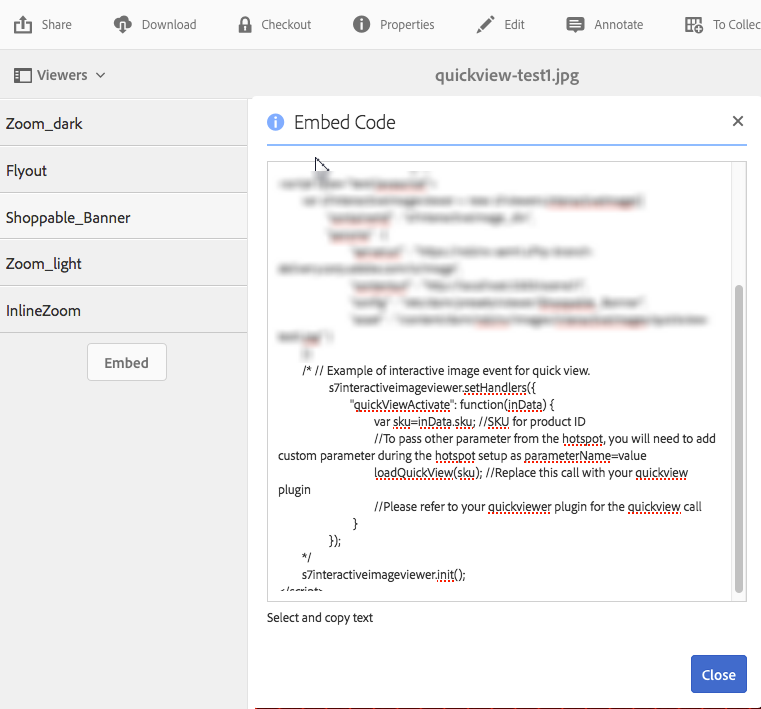

# Skapa anpassade popup-fönster med snabbvyer {#using-quickviews-to-create-custom-pop-ups}

>[!CAUTION]
>
>AEM 6.4 har nått slutet på den utökade supporten och denna dokumentation är inte längre uppdaterad. Mer information finns i [teknisk supportperiod](https://helpx.adobe.com/support/programs/eol-matrix.html). Hitta de versioner som stöds [här](https://experienceleague.adobe.com/docs/).

Standardsnabbvyn används i e-handelsupplevelser där ett popup-fönster visas med produktinformation som driver ett köp. Du kan emellertid utlösa anpassat innehåll som ska visas i popup-fönstren. Beroende på vilket visningsprogram du använder kan användarna med den här funktionen klicka på en hotspot, en miniatyrbild eller på ett bildschema för att se information eller relaterat innehåll.

Snabbvyer stöds av följande visningsprogram i Dynamic Media:

* Interaktiva bilder (klickbara hotspot-områden)
* Interaktiv video (klickbara miniatyrbilder vid videouppspelning)
* Carousel Banners (klickbara hotspot-områden eller bildscheman)

Även om funktionerna i de olika visningsprogrammen skiljer sig åt är processen att skapa en snabbvy densamma för alla tre visningsprogram som stöds.

**Så här skapar du anpassade popup-fönster med snabbvyer:**

1. Skapa en snabbvy för en överförd resurs.

   Vanligtvis skapar du en snabbvy samtidigt som du redigerar en resurs för användning med det visningsprogram du använder.

   <table> 
    <tbody> 
    <tr> 
    <td><strong>Visningsprogram som du använder</strong></td> 
    <td><strong>Följ de här stegen för att skapa snabbvyn</strong></td> 
    </tr> 
    <tr> 
    <td>Interaktiva bilder</td> 
    <td><a href="/help/assets/interactive-images.md#adding-hotspots-to-an-image-banner" target="_blank">Lägga till aktiveringspunkter i en bildbanderoll</a>.</td> 
    </tr> 
    <tr> 
    <td>Interaktiva videoklipp</td> 
    <td><a href="/help/assets/interactive-videos.md#adding-interactivity-to-your-video" target="_blank">Lägga till interaktivitet i videon</a>.</td> 
    </tr> 
    <tr> 
    <td>Karusellbanner</td> 
    <td><a href="/help/assets/carousel-banners.md#adding-hotspots-or-image-maps-to-an-image-banner" target="_blank">Lägga till aktiveringspunkter eller bildscheman i en banderoll</a>.<br /> </td> 
    </tr> 
    </tbody> 
   </table>

1. Hämta visningsprogrammets inbäddningskod för att integrera visningsprogrammet på webbplatsen.

   <table> 
    <tbody> 
    <tr> 
    <td><strong>Visningsprogram som du använder</strong><br /> </td> 
    <td><strong>Följ de här stegen för att integrera visningsprogrammet med webbplatsen</strong></td> 
    </tr> 
    <tr> 
    <td>Interaktiv bild</td> 
    <td><a href="/help/assets/interactive-images.md#integrating-an-interactive-image-with-your-website" target="_blank">Integrera en interaktiv bild med webbplatsen</a>.<br /> </td> 
    </tr> 
    <tr> 
    <td>Interaktiv video<br /> </td> 
    <td><a href="/help/assets/interactive-videos.md#integrating-an-interactive-video-with-your-website" target="_blank">Integrera en interaktiv video med webbplatsen</a>.<br /> </td> 
    </tr> 
    <tr> 
    <td>Carousel banner</td> 
    <td><a href="/help/assets/carousel-banners.md#adding-a-carousel-banner-to-your-website-page" target="_blank">Lägga till en karusellbanderoll på webbsidan</a>.<br /> </td> 
    </tr> 
    </tbody> 
   </table>

1. Visningsprogrammet som du använder behöver nu veta hur du använder snabbvyn.

   För att göra detta använder visningsprogrammet en hanterare som kallas `QuickViewActive`.

   **Exempel**
Anta att du använde följande exempelkod för inbäddning på webbsidan för en interaktiv bild:

   

   Hanteraren läses in i visningsprogrammet med `setHandlers`:

   `*viewerInstance*.setHandlers({ *handler 1*, *handler 2*}, ...`

   **Med exempelkoden för inbäddning ovan har vi följande kod:**

   ```xml
   s7interactiveimageviewer.setHandlers({
       quickViewActivate": function(inData) {
           var sku=inData.sku;
           var genericVariable1=inData.genericVariable1;
           var genericVariable2=inData.genericVariable2;
          loadQuickView(sku,genericVariable1,genericVariable2);
       }
   })
   ```

   Läs mer om `setHandlers()` metod på följande sätt:

   * Interaktivt bildvisningsprogram: [setHandlers](https://experienceleague.adobe.com/docs/dynamic-media-developer-resources/library/viewers-for-aem-assets-only/interactive-images/jsapi-interactive-image/r-html5-aem-int-image-viewer-javascriptapiref-sethandlers.html)
   * Interaktivt visningsprogram för video: [setHandlers](https://experienceleague.adobe.com/docs/dynamic-media-developer-resources/library/viewers-for-aem-assets-only/interactive-video/jsapi-interactive-video/r-html5-aem-int-video-javascriptapiref-sethandlers.html)

1. Nu måste du konfigurera `quickViewActivate` hanterare.

   Hanteraren quickViewActivate styr snabbvyerna i visningsprogrammet. Hanteraren innehåller variabellistan och funktionsanrop som kan användas med snabbvyn. Inbäddningskoden innehåller mappning för SKU-variabeluppsättningen i snabbvyn samt ett exempel på loadQuickView-funktionsanrop.

   **Variabelmappning**
Mappa variabler för användning på webbsidan till SKU-värdet och generiska variabler som finns i snabbvyn:

   `var *variable1*= inData.*quickviewVariable*`

   Angiven inbäddningskod har en exempelmappning för SKU-variabeln:

   `var sku=inData.sku`

   Mappa ytterligare variabler från snabbvyn, som i följande exempel:

   ```
   var <i>variable2</i>= inData.<i>quickviewVariable2</i> 
    var <i>variable3</i>= inData.<i>quickviewVariable3</i>
   ```

   **Funktionsanrop**
Hanteraren kräver också ett funktionsanrop för att snabbvyn ska fungera. Funktionen antas vara tillgänglig för värdsidan. Inbäddningskoden innehåller ett exempel på funktionsanrop:

   `loadQuickView(sku)`

   Samplingsfunktionsanropet förutsätter funktionen `loadQuickView()` finns och är tillgänglig.

   Läs mer om metoden quickViewActivate här:

   * Interaktiv bildläsare - [Händelseåteranrop](https://experienceleague.adobe.com/docs/dynamic-media-developer-resources/library/viewers-for-aem-assets-only/interactive-images/c-html5-aem-interactive-image-event-callbacks.html)
   * Interaktiv videoläsare - [Händelseåteranrop](https://experienceleague.adobe.com/docs/dynamic-media-developer-resources/library/viewers-for-aem-assets-only/interactive-video/c-html5-aem-int-video-event-callbacks.html)
   * Stöd för interaktiva data i Interactive Video Viewer - [Stöd för interaktiva data](https://experienceleague.adobe.com/docs/dynamic-media-developer-resources/library/viewers-for-aem-assets-only/interactive-video/c-html5-aem-int-video-int-data-support.html)

1. Gör följande:

   * Avkommentera avsnittet setHandlers i den inbäddade koden.
   * Mappa eventuella ytterligare variabler som finns i snabbvyn.

      * Uppdatera `loadQuickView(sku,*var1*,*var2*)` anropa om du lägger till ytterligare variabler.
   * Skapa en enkel loadQuickView ()-funktion på sidan, utanför visningsprogrammet.

      Följande skriver till exempel värdet för sku till webbläsarkonsolen:

   ```xml
   function loadQuickView(sku){
       console.log ("quickview sku value is " + sku);
   }
   ```

   * Ladda upp en testsida för HTML till en webbserver och öppna den.

      När variablerna från snabbvyn är mappade och funktionsanropet är på plats, skriver webbläsarkonsolen variabelvärdet till webbläsarkonsolen med den angivna exempelfunktionen.


1. Du kan nu använda en funktion för att anropa ett enkelt popup-fönster i snabbvyn. I följande exempel används en `DIV` för en popup.
1. Formatera popup-fönstret `DIV` på följande sätt. Lägg till egen formatering efter behov.

   ```xml
   <style type="text/css">
       #quickview_div{
           position: absolute;
           z-index: 99999999;
           display: none;
       }
   </style>
   ```

1. Placera popup-fönstret `DIV` på HTML-sidan.

   Ett av elementen anges med ett ID som uppdateras med SKU-värdet när användaren anropar en snabbvy. Exemplet innehåller också en enkel knapp som döljer popup-fönstret igen när det är synligt.

   ```xml
   <div id="quickview_div" >
       <table>
           <tr><td><input id="btnClosePopup" type="button" value="Close"        onclick='document.getElementById("quickview_div").style.display="none"' /><br /></td></tr>
           <tr><td>SKU</td><td><input type="text" id="txtSku" name="txtSku"></td></tr>
       </table>
   </div>
   ```

1. Lägg till en funktion för att uppdatera skalvärdet i popup-fönstret; göra popup-fönstret synligt genom att ersätta den enkla funktionen som skapades i steg 5. med följande:

   ```xml
   <script type="text/javascript">
       function loadQuickView(sku){
           document.getElementById("txtSku").setAttribute("value",sku); // write sku value
           document.getElementById("quickview_div").style.display="block"; // show popup
       }
   </script>
   ```

1. Ladda upp en testsida för HTML till webbservern och öppna den. Visningsprogrammet visar popup-fönstret `DIV` när en användare anropar en snabbvy.
1. **Visa det anpassade popup-fönstret i helskärmsläge**

   Vissa visningsprogram, till exempel Interactive Video Viewer, stöder visning i helskärmsläge. Om du däremot använder popup-fönstret enligt beskrivningen i föregående steg visas det bakom visningsprogrammet i helskärmsläge.

   Om du vill att popup-fönstret ska visas i både standardläge och helskärmsläge, kopplar du popup-fönstret till visningsbehållaren. För att uppnå detta kan du använda en andra hanterarmetod, `initComplete`.

   The `initComplete` hanteraren anropas när visningsprogrammet har initierats.

   ```xml
   "initComplete":function() { code block }
   ```

   Läs mer om `init()` metod på följande sätt:

   * Interaktiv bildläsare - [init](https://experienceleague.adobe.com/docs/dynamic-media-developer-resources/library/viewers-for-aem-assets-only/interactive-images/jsapi-interactive-image/r-html5-aem-int-image-viewer-javascriptapiref-init.html)
   * Interaktiv videoläsare - [init](https://experienceleague.adobe.com/docs/dynamic-media-developer-resources/library/viewers-for-aem-assets-only/interactive-video/jsapi-interactive-video/r-html5-aem-int-video-javascriptapiref-init.html)

1. Om du vill bifoga popup-fönstret, som beskrivs i föregående steg, till visningsprogrammet använder du följande kod:

   ```xml
   "initComplete":function() {
       var popup = document.getElementById('quickview_div');
       popup.parentNode.removeChild(popup);
       var sdkContainerId = s7interactivevideoviewer.getComponent("container").getInnerContainerId();
       var inner_container = document.getElementById(sdkContainerId);
       inner_container.appendChild(popup);
   }
   ```

   I koden ovan har vi gjort följande:

   * Identifierade vårt anpassade popup-fönster.
   * Den togs bort från DOM.
   * Identifierade visningsprogrambehållaren.
   * Popup-fönstret bifogades till visningsbehållaren.

1. Hela din setHandlers-kod ska nu se ut ungefär så här (Interactive Video Viewer användes):

   ```xml
   s7interactivevideoviewer.setHandlers({
       "quickViewActivate": function(inData) {
           var sku=inData.sku;
           loadQuickView(sku);
   
       },
       "initComplete":function() {
           var popup = document.getElementById('quickview_div'); // get custom quick view container
           popup.parentNode.removeChild(popup); // remove it from current DOM
           var sdkContainerId = s7interactivevideoviewer.getComponent("container").getInnerContainerId();
           var inner_container = document.getElementById(sdkContainerId);
           inner_container.appendChild(popup);
       }
   });
   ```

1. När hanterarna har lästs in initierar du visningsprogrammet:

   `*viewerInstance.*init()`

   **Exempel**
I det här exemplet används visningsprogrammet för interaktiva bilder.

   `s7interactiveimageviewer.init()`

   När du har bäddat in visningsprogrammet på värdsidan måste du se till att visningsprograminstansen skapas och att hanterarna läses in innan visningsprogrammet anropas med `init()`.
