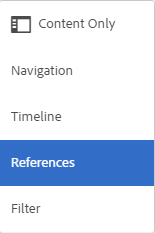
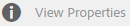

# Digital Rights Management för tillgångar {#digital-rights-management-in-assets}

>[!CAUTION]
>
>AEM 6.4 har nått slutet på den utökade supporten och denna dokumentation är inte längre uppdaterad. Mer information finns i [teknisk supportperiod](https://helpx.adobe.com/support/programs/eol-matrix.html). Hitta de versioner som stöds [här](https://experienceleague.adobe.com/docs/).

Digitala resurser är ofta kopplade till en licens som anger användningsvillkoren och hur länge de ska användas. För [!DNL Adobe Experience Manager Assets] är helt integrerat med [!DNL Experience Manager] kan du effektivt hantera förfalloinformation och resurstillstånd. Du kan även associera licensinformation med resurser.

## Resursens förfallodatum {#asset-expiration}

Att mediefiler förfaller är ett effektivt sätt att tillämpa licenskrav för mediefiler. Det säkerställer att den publicerade resursen inte publiceras när den upphör att gälla, vilket förhindrar eventuella brott mot licensen. En användare utan administratörsbehörighet kan inte redigera, kopiera, flytta, publicera och hämta en utgången resurs.

Du kan visa förfallostatusen för en resurs i [!DNL Assets] i både kort- och listvyn.

*Bild: I kortvyn anger en flagga på kortet att resursen har gått ut.*

*Bild: I listvyn visas [!UICONTROL Status] kolumnen visar [!UICONTROL Expired] banner.*

Du kan visa förfallostatusen för en resurs i [!UICONTROL Timeline] i vänster räl.

>[!NOTE]
>
>Utgångsdatumet för en resurs visas olika för användare i olika tidszoner.

Du kan även visa förfallostatusen för resurser i **[!UICONTROL References]** järnväg. Den hanterar förfallostatus och relationer mellan sammansatta resurser och refererade delresurser, samlingar och projekt.

1. Navigera till resursen som du vill visa referenser till webbsidor och sammansatta resurser för.
1. Markera resursen och klicka på [!DNL Experience Manager] logotyp.

   

1. Välj **[!UICONTROL References]** på menyn.

   

   För utgånna mediefiler visas statusen för referensraden **[!UICONTROL Asset is Expired]** överst.

   

   Om resursen har upphört att gälla visas statusen på referenslinjen **[!UICONTROL Asset has Expired Sub-Assets]**.

   

### Sök efter utgångna resurser {#search-expired-assets}

Du kan söka efter utgångna resurser, inklusive underresurser som gått ut, på sökpanelen.

1. I [!DNL Assets] klickar du på **[!UICONTROL Search]** i verktygsfältet för att visa rutan Sök.

   

1. Tryck på Retur när markören är i rutan Sök så visas sökresultatsidan.

   

1. Klicka [!DNL Experience Manager] logotyp för att visa sökpanelen.

   

1. Klicka på **[!UICONTROL Expiry Status]** för att expandera den.

   

1. Välj **[!UICONTROL Expired]**. De förfallna resurserna visas i sökresultaten.

   

När du väljer **[!UICONTROL Expired]** alternativ, [!DNL Assets] I konsolen visas endast utgångna resurser och underresurser som sammansatta resurser refererar till. De sammansatta resurserna som refererar till utgångna delresurser visas inte omedelbart efter att delresurserna har upphört att gälla. I stället visas de efter [!DNL Experience Manager] identifierar att de refererar till utgångna delresurser nästa gång som schemaläggaren körs.

Om du ändrar förfallodatumet för en publicerad resurs till ett datum som är tidigare än den aktuella schemaläggningscykeln, identifierar schemat fortfarande den här resursen som en utgången resurs nästa gång den körs och visar dess status i enlighet med detta.

Om ett fel eller fel dessutom förhindrar att schemaläggaren upptäcker förfallna resurser i den aktuella cykeln, undersöker schemaläggaren om dessa resurser i nästa cykel och identifierar deras förfallna status.

Aktivera [!DNL Assets] konsol för att visa de refererande sammansatta resurserna tillsammans med de utgångna delresurserna, konfigurera och **[!UICONTROL Adobe CQ DAM Expiry Notification]** arbetsflöde i [!DNL Experience Manager] Configuration Manager.

1. Öppna [!DNL Experience Manager] Configuration Manager.
1. Välj **[!UICONTROL Adobe CQ DAM Expiry Notification]**. Som standard **[!UICONTROL Time based Scheduler]** väljs, vilket schemalägger ett jobb att vid en viss tidpunkt kontrollera om en resurs har upphört att gälla för delresurser. När jobbet har slutförts visas resurser som har upphört att gälla och refererade resurser som utgångna i sökresultaten.

   

1. Om du vill köra jobbet regelbundet avmarkerar du fältet **[!UICONTROL Time Based Scheduler Rule]** och ändrar tiden i sekunder i fältet **[!UICONTROL Periodic Scheduler]**. Exempeluttrycket ”0 0 0 &amp;ast; &amp;ast; ?” utlöser till exempel jobbet kl. 00.
1. Välj **[!UICONTROL send email]** för att få e-post när en mediefil förfaller.

   >[!NOTE]
   >
   >Endast den som har skapat tillgången (den person som överför en viss resurs till [!DNL Assets]) får ett e-postmeddelande när resursen förfaller. Se [konfigurera e-postmeddelanden](/help/sites-administering/notification.md) om du vill ha mer information om hur du konfigurerar e-postmeddelanden på [!DNL Experience Manager] nivå.

1. I **[!UICONTROL Prior notification in seconds]** anger du tiden i sekunder innan en resurs förfaller när du vill få ett meddelande om förfallotiden. Om du är administratör eller den som har skapat resursen får du ett meddelande innan resursen upphör att gälla om att resursen håller på att gå ut efter den angivna tiden.

   När resursen har gått ut får du ett meddelande som bekräftar att den har gått ut. Dessutom inaktiveras utgångna resurser.

1. Klicka på **[!UICONTROL Save]**.

## Tillgångstillstånd {#asset-states}

The [!DNL Assets] konsolen kan visa olika lägen för resurser. Beroende på det aktuella tillståndet för en viss resurs visas en etikett som beskriver dess tillstånd, till exempel Utgången, Publicerad, Godkänd, Avvisad och så vidare, i kortvyn.

1. I [!DNL Assets] väljer du en resurs i användargränssnittet.

   

1. Klicka på **[!UICONTROL Publish]** i verktygsfältet. Om du inte ser **Publicera** i verktygsfältet klickar du på **[!UICONTROL More]** i verktygsfältet och leta upp **[!UICONTROL Publish]** alternativ.

   

1. Välj **[!UICONTROL Publish]** på menyn och stäng sedan bekräftelsedialogrutan.
1. Avsluta markeringsläget. Publiceringsstatusen för resursen visas längst ned på miniatyrbilden av resursen i kortvyn. I listvyn visar kolumnen Publicerad den tidpunkt då resursen publicerades.

   

1. Om du vill visa sidan med tillgångsinformation i [!DNL Assets] gränssnitt, markera en resurs och klicka på **[!UICONTROL Properties]**.

   

1. Ange ett förfallodatum för resursen på fliken Avancerat **[!UICONTROL Expires]** fält.

   

   *Bild: [!UICONTROL Advanced] flik i resurs [!UICONTROL Properties] sida för att ange förfallodatum för resurs.*

1. Klicka **[!UICONTROL Save]** och sedan klicka **[!UICONTROL Close]** för att visa resurskonsolen.
1. Publiceringsstatusen för resursen anger att den har upphört att gälla längst ned på miniatyrbilden av resursen i kortvyn. I listvyn visas resursens status som **[!UICONTROL Expired]**.

   

1. I [!DNL Assets] väljer du en mapp och skapar en granskningsåtgärd för mappen.
1. Granska och godkänn/avvisa resurserna i granskningsaktiviteten och klicka på **[!UICONTROL Complete]**.
1. Navigera till mappen som du skapade granskningsaktiviteten för. Statusen för de mediefiler som du har godkänt/avvisat visas längst ned i kortvyn. I listvyn visas status för godkännande och förfallodatum i lämpliga kolumner.

   

1. Om du vill söka efter resurser baserat på deras status klickar du på **[!UICONTROL Search]** för att visa omsökningsfältet.

   

1. Tryck på Retur och klicka [!DNL Experience Manager] för att visa sökpanelen.
1. Klicka på **[!UICONTROL Publish Status]** och markera **[!UICONTROL Published]** för att söka efter publicerade resurser i [!DNL Assets].

   

1. Klicka **[!UICONTROL Approval Status]** och klicka på lämpligt alternativ för att söka efter godkända eller avvisade resurser.

   

1. Om du vill söka efter resurser baserat på deras förfallostatus markerar du **[!UICONTROL Expiry Status]** på sökpanelen och väljer lämpligt alternativ.

   

1. Du kan också söka efter resurser baserat på en kombination av statusvärden under olika sökfaktorer. Du kan till exempel söka efter publicerade resurser som har godkänts i en granskningsåtgärd och ännu inte har förfallit genom att välja lämpliga alternativ i sökfunktionerna.

   

## Digital Rights Management in [!DNL Assets] {#digital-rights-management-in-assets-1}

Den här funktionen tvingar till godkännande av licensavtalet innan du kan hämta en licensierad mediefil från [!DNL Adobe Experience Manager Assets].

Om du väljer en skyddad resurs och klickar på **[!UICONTROL Download]** omdirigeras du till en licenssida där du godkänner licensavtalet. Om du inte godkänner licensavtalet kan du **[!UICONTROL Download]** är inte tillgängligt.

Om markeringen innehåller flera skyddade resurser markerar du en resurs i taget, godkänner licensavtalet och fortsätter att hämta resursen.

En tillgång anses vara skyddad om något av dessa villkor är uppfyllt:

* Metadataegenskapen för resursen `xmpRights:WebStatement` pekar på sökvägen till sidan som innehåller licensavtalet för resursen.
* Värdet för resursens metadataegenskap `adobe_dam:restrictions` är ett obearbetat HTML som anger licensavtalet.

>[!NOTE]
>
>Platsen `/etc/dam/drm/licenses` används för att lagra licenser i tidigare versioner av [!DNL Experience Manager] är föråldrad.
>
>Om du skapar eller ändrar licenssidor, eller importerar dem från tidigare [!DNL Experience Manager] releaser rekommenderar Adobe att du lagrar dem under `/apps/settings/dam/drm/licenses` eller `/conf/&ast;/settings/dam/drm/licenses`.

### Hämta DRM-skyddade resurser {#downloading-drm-assets}

1. I kortvyn väljer du de resurser du vill hämta och klickar på **[!UICONTROL Download]**.
1. På sidan **[!UICONTROL Copyright Management]** väljer du den resurs du vill hämta i listan.
1. I [!UICONTROL License] välj **[!UICONTROL Agree]**. En bock visas bredvid resursen. Klicka på **[!UICONTROL Download]** alternativ.

   >[!NOTE]
   >
   >The **[!UICONTROL Download]** är bara aktiverat när du väljer att godkänna licensavtalet för en skyddad tillgång. Om markeringen omfattar både skyddade och oskyddade resurser visas endast de skyddade resurserna i rutan och **[!UICONTROL Download]** alternativet är aktiverat för att hämta oskyddade resurser. Om du vill acceptera licensavtal för flera skyddade resurser samtidigt markerar du resurserna i listan och väljer sedan **[!UICONTROL Agree]**.

   

1. Klicka på **[!UICONTROL Download]** om du vill hämta resursen eller dess återgivningar.
