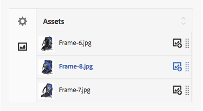

# Bilduppsättningar {#image-sets}

Bilduppsättningar ger användarna en integrerad visningsupplevelse, där användarna kan se olika vyer av ett objekt genom att klicka på en miniatyrbild. Med bilduppsättningar kan du visa alternativa vyer av ett objekt och visningsprogrammet har zoomverktyg som gör att du kan granska bilder noggrant.

Bilduppsättningar definieras av en banderoll med ordet **[!UICONTROL IMAGESET]**. Om bilduppsättningen publiceras visas dessutom det publiceringsdatum som anges av ikonen **[!UICONTROL World]** på banderollen tillsammans med det senaste ändringsdatumet, som anges av ikonen **[!UICONTROL Pencil]**.

I bilduppsättningen kan du även skapa färgrutor genom att skapa en bilduppsättning och lägga till miniatyrbilder.

Det här programmet är särskilt användbart när du vill visa ett objekt i en annan färg, ett annat mönster eller en annan avslutning. Om du vill skapa en bilduppsättning med färgrutor behöver du en bild för varje färg, mönster eller slut som du vill presentera för användarna. Du behöver också en färg-, mönster- eller slutfärgruta för varje färg, mönster eller slut.

Anta till exempel att du vill visa bilder med olika färgskalor; räkningarna är röda, gröna och blå. I så fall behöver du tre bilder med samma lock. Du behöver en bild med rött, en med grönt och en med blå räkning. Du behöver också en röd, grön och blå färgruta. Färgrutorna fungerar som miniatyrbilder som användare klickar på i visningsprogrammet för färgrutor för att visa den röda, gröna eller blå hatten.

>[!NOTE]
>
>Mer information om gränssnittet Resurser finns i [Hantera resurser med Touch-gränssnittet](managing-assets-touch-ui.md).

När du skapar en bilduppsättning rekommenderar Adobe följande metodtips och tillämpar följande begränsningar:

| Begränsningstyp | Bästa praxis | Begränsning har införts |
| --- | --- | --- |
| Antal dubblettresurser per uppsättning | Inga dubbletter | 20 |
| Maximalt antal bilder per uppsättning | 5-10 bilder per uppsättning | 1000 |

Se även [Dynamic Media begränsningar](/help/assets/limitations.md).

## Snabbstart: Bilduppsättningar {#quick-start-image-sets}

Så här kommer du igång snabbt:

1. [Överför dina primära bilder för flera vyer.](#uploading-assets-in-image-sets)

   Börja med att ladda upp bilderna för dina bilduppsättningar. Eftersom användare kan zooma in på bilder i bilduppsättningsvisningsprogrammet bör du ta hänsyn till zoomning när du väljer bilder. Se till att bilderna har minst 2 000 pixlar i den största dimensionen för optimal zoomdetaljrikedom. Dynamic Media kan återge bilder på upp till 25 megapixlar vardera. Du kan till exempel använda en 5 000 × 5 000 megapixelbild eller någon annan storlekskombination på upp till 25 megapixlar.

   AEM Assets har stöd för många bildfilsformat, men förlustfria bilder i TIFF, PNG och EPS rekommenderas.

1. [Skapa bilduppsättningar.](#creating-image-sets)

   I Bilduppsättningar klickar användare på miniatyrbilder i Bilduppsättningsvisningsprogrammet.

   Om du vill skapa en bilduppsättning i resurser trycker du på **[!UICONTROL Create > Image Sets]**. Lägg sedan till bilder och tryck **[!UICONTROL Save]**.

   Du kan också skapa bilduppsättningar automatiskt med [gruppuppsättningsförinställningar](/help/assets/config-dms7.md#creating-batch-set-presets-to-auto-generate-image-sets-and-spin-sets).

   **Viktigt** — Batchuppsättningar skapas av IPS (Image Production System) som en del av tillgångsintag och är endast tillgängliga i Dynamic Media-Scene7-läge.

   Se [Förbereda bilduppsättningsresurser för överföring och överföring av filer](#uploading-assets-in-image-sets).

   Se [Arbeta med väljare.](working-with-selectors.md)

1. Lägg till [Bildinställningar för visningsprogram](managing-viewer-presets.md), efter behov.

   Administratörer kan skapa eller ändra bilder **[!UICONTROL Set Viewer Presets]**. Om du vill visa bilduppsättningen med en visningsförinställning markerar du bilduppsättningen och väljer i listrutan till vänster **[!UICONTROL Viewers]**.

   Se **[!UICONTROL Tools > Assets > Viewer Presets]** om du vill skapa eller redigera förinställningar för visningsprogram.

1. (Valfritt) [Visa bilduppsättningar](image-sets.md#viewing-image-sets) som skapades med gruppuppsättningsförinställningar.
1. [Förhandsgranska bilduppsättningar.](previewing-assets.md)

   Markera bilduppsättningen och du kan förhandsgranska den. Tryck på miniatyrbildikonerna för att undersöka bilduppsättningen i det valda visningsprogrammet. Du kan välja olika visningsprogram från **[!UICONTROL Viewers]** som finns på den vänstra menyn.

1. [Publicera bilduppsättningar.](publishing-dynamicmedia-assets.md)

   När du publicerar en bilduppsättning aktiveras URL-adressen och strängen Embed. Dessutom måste du [publicera anpassade visningsprogramförinställningar](managing-viewer-presets.md) som du har skapat. Visningsförinställningarna som är färdiga för leverans har redan publicerats.

1. [Länka URL:er till ditt webbprogram](linking-urls-to-yourwebapplication.md) eller [Bädda in video- eller bildvisningsprogrammet](embed-code.md).

   AEM Assets skapar URL-anrop för bilduppsättningar och aktiverar dem när du har publicerat bilduppsättningarna. Du kan kopiera dessa URL:er när du förhandsgranskar resurser. Du kan även bädda in dem på din webbplats.

   Markera bilduppsättningen och välj sedan **[!UICONTROL Viewers]** i listrutan till vänster.

   Läs mer i [Länka en bilduppsättning till en webbsida](linking-urls-to-yourwebapplication.md) och [Bädda in video- eller bildvisningsprogrammet](embed-code.md).

Information om hur du redigerar bilduppsättningar finns i [redigera bilduppsättningar.](#editing-image-sets) Dessutom kan du visa och redigera [Egenskaper för bilduppsättning](managing-assets-touch-ui.md#editing-properties).

Om du har problem med att skapa uppsättningar läser du Bilder och uppsättningar i [Felsökning av Dynamic Media - Scene7-läge](troubleshoot-dms7.md#images-and-sets).

## Överföra resurser i bilduppsättningar {#uploading-assets-in-image-sets}

Börja med att ladda upp bilderna för dina bilduppsättningar. Eftersom användare kan zooma in på bilder i bilduppsättningsvisningsprogrammet bör du ta hänsyn till zoomning när du väljer bilder. Se till att bilderna har minst 2 000 pixlar i den största dimensionen. Bilduppsättningar har stöd för många bildfilsformat, men förlustfria bilder i TIFF, PNG och EPS rekommenderas.

Du kan överföra bilder för bilduppsättningar på samma sätt som du gör [ladda upp alla andra resurser i Assets](managing-assets-touch-ui.md#uploading-assets).

### Förbereder bilduppsättningsresurser för överföring {#preparing-image-set-assets-for-upload}

Innan du skapar bilduppsättningar bör du kontrollera att bilderna har rätt storlek och format.

Om du vill skapa en bilduppsättning med flera vyer behöver du bilder som visar ett objekt från olika vypunkter eller visar olika aspekter av samma objekt. Målet är att framhäva de viktiga funktionerna i ett objekt så att läsarna får en fullständig bild av hur det ser ut eller gör.

Eftersom användare kan zooma bilder i bilduppsättningar bör du se till att bilderna har minst 2 000 pixlar i den största dimensionen. Resurser har stöd för många bildfilsformat, men du bör använda förlustfria TIFF-, PNG- och EPS-bilder.

>[!NOTE]
>
>Om du använder miniatyrbilder för att ange färgrutor för produkten måste du dessutom göra följande:
>
>Du behöver vinjetter eller olika bilder av samma bild som visar den i olika färger, mönster eller färger. Du behöver också miniatyrbilder som motsvarar de olika färgerna, mönstren eller ytorna. Om du till exempel vill visa miniatyrbilder med en bilduppsättning med samma jacka i svart, brunt och grönt behöver du:
>
>* En svart, brun och grön tagning av samma jacka.
>* En svart, brun och grön färgminiatyrbild.
>

## Skapa bilduppsättningar {#creating-image-sets}

Du kan skapa bilduppsättningar via användargränssnittet eller via API:t. I det här avsnittet beskrivs hur du skapar bilduppsättningar i användargränssnittet.

>[!NOTE]
>
>Du kan också skapa bilduppsättningar automatiskt med [gruppuppsättningsförinställningar](/help/assets/config-dms7.md#creating-batch-set-presets-to-auto-generate-image-sets-and-spin-sets).

**Viktigt:** Batchuppsättningar skapas av IPS (Image Production System) som en del av tillgångsintag och är endast tillgängliga i Dynamic Media-Scene7-läge.

När du lägger till resurser i uppsättningen läggs de automatiskt till i alfanumerisk ordning. Du kan ändra ordning på eller sortera resurser manuellt när de har lagts till.

>[!NOTE]
>
>Bilduppsättningar stöds inte för resurser med `,` (komma) i filnamnet.

När du skapar en bilduppsättning rekommenderar Adobe följande metodtips och tillämpar följande begränsningar:

| Begränsningstyp | Bästa praxis | Begränsning har införts |
| --- | --- | --- |
| Antal dubblettresurser per uppsättning | Inga dubbletter | 20 |
| Maximalt antal bilder per uppsättning | 5-10 bilder per uppsättning | 1000 |

Se även [Dynamic Media begränsningar](/help/assets/limitations.md).

**Skapa en bilduppsättning**:

1. I **Resurser**, navigera till den plats där du vill skapa en bilduppsättning, tryck **[!UICONTROL Create]** och markera **[!UICONTROL Image Set]**. Du kan också skapa uppsättningen inifrån en mapp som innehåller resurserna.

   

1. På sidan Bilduppsättningsredigerare, i **[!UICONTROL Title]** anger du ett namn för bilduppsättningen. Namnet visas i banderollen över bilduppsättningen. Du kan också ange en beskrivning.

   

   >[!NOTE]
   >
   >När du skapar bilduppsättningen kan du ändra miniatyrbilden för bilduppsättningen eller tillåta att AEM väljer miniatyrbild automatiskt baserat på resurserna i bilduppsättningen. Välj en miniatyrbild genom att trycka **[!UICONTROL Change thumbnail]** och markera en bild (du kan navigera till andra mappar för att hitta bilder också). Om du har valt en miniatyrbild och sedan bestämmer dig för att du vill att AEM ska generera en från bilduppsättningen väljer du **[!UICONTROL Switch to Automatic thumbnail]**.

1. Gör något av följande:

   * Nära det övre vänstra hörnet av **[!UICONTROL Image Set Editor]** sida, tryck **[!UICONTROL Add Asset]**.
   * I mitten av **[!UICONTROL Image Set Editor]** sida, tryck **[!UICONTROL Tap to open Asset Selector]**.

   Tryck för att välja resurser som du vill inkludera i din bilduppsättning. De markerade resurserna visas med en bock. När du är klar trycker du på **[!UICONTROL Select]**.

   Med resursväljaren kan du söka efter resurser genom att skriva ett nyckelord och trycka på **[!UICONTROL Return]**. Du kan också använda filter för att förfina sökresultatet. Du kan filtrera efter sökväg, samling, filtyp och tagg. Markera filtret och tryck sedan på ikonen **[!UICONTROL Filter]** i verktygsfältet. Ändra vyn genom att trycka på **[!UICONTROL View]** ikon och markera **[!UICONTROL Column View]**, **[!UICONTROL Card View]**, eller **[!UICONTROL List View]**.

   Se [Arbeta med väljare.](working-with-selectors.md)

   

1. När du lägger till resurser i uppsättningen läggs de automatiskt till i alfanumerisk ordning. Du kan sortera om eller sortera resurser manuellt när du har lagt till dem.

   Om det behövs drar du en resurs **[!UICONTROL Reorder]** till höger om resursens filnamn om du vill ändra ordning på bilderna i uppsättningslistan.

   

   Om du vill ändra en miniatyrbild eller färgruta trycker du på **[!UICONTROL Thumbnail]** -ikonen bredvid bilden och navigera till miniatyrbilden eller färgrutan som du vill använda. När du är klar trycker du på alla bilder **[!UICONTROL Save]**.

1. (Valfritt) Gör något av följande:

   * Om du vill ta bort en bild markerar du bilden och trycker sedan **[!UICONTROL Delete Asset]**.
   * Om du vill använda en förinställning i det övre högra hörnet av sidan trycker du på **[!UICONTROL Preset]** väljer du sedan en förinställning som ska användas på alla resurser samtidigt.

1. Tryck på **[!UICONTROL Save]**. Den nya bilduppsättningen visas i den mapp du skapade den i.

## Visa bilduppsättningar {#viewing-image-sets}

Du kan skapa bilduppsättningar antingen i användargränssnittet eller automatiskt med [gruppuppsättningsförinställningar](/help/assets/config-dms7.md#creating-batch-set-presets-to-auto-generate-image-sets-and-spin-sets).

**Viktigt** — Batchuppsättningar skapas av IPS [Bildproduktionssystem] som en del av tillgångsintag och är endast tillgängliga i Dynamic Media - Scene7-läge.)

Men uppsättningar som skapats med gruppuppsättningsförinställningar gör *not* visas i användargränssnittet. Du kan visa uppsättningarna på tre olika sätt. (Dessa metoder är tillgängliga även om du har skapat bilduppsättningarna i användargränssnittet).

* När egenskaperna för en enskild resurs öppnas. Egenskaperna anger vad som ställer in den valda resursen som medlem av (under **[!UICONTROL Member of Sets]**). Tryck på uppsättningens namn för att visa hela uppsättningen.

   

* Från en medlemsbild i en uppsättning. Välj **[!UICONTROL Sets]** för att visa de uppsättningar som resursen är medlem i.

   

* Du kan välja **[!UICONTROL Filters]** och sedan expandera **[!UICONTROL Dynamic Media]** och markera **[!UICONTROL Sets]**.

   Sökningen returnerar matchande uppsättningar som skapats manuellt i användargränssnittet eller automatiskt skapats med gruppuppsättningsförinställningar. För automatiserade uppsättningar utförs sökfrågan med sökvillkoren &quot;Börjar med&quot;, som skiljer sig från AEM sökning som baseras på sökvillkoren &quot;Innehåller&quot;. Ange att filtret ska **[!UICONTROL Sets]** är det enda sättet att söka i automatiska uppsättningar.

   

>[!NOTE]
>
>Du kan visa uppsättningar via användargränssnittet enligt beskrivningen i [Redigera bilduppsättningar](#editing-image-sets).

## Redigera bilduppsättningar {#editing-image-sets}

Du kan utföra en mängd redigeringsåtgärder på bilduppsättningar, till exempel:

* Lägg till bilder i bilduppsättningen.
* Ändra ordning på bilderna i bilduppsättningen.
* Ta bort resurser i bilduppsättningen.
* Använd förinställningar för visningsprogram.
* Ta bort bilduppsättningen.

**Redigera bilduppsättningar**:

1. Gör något av följande:

   * Håll pekaren över en resurs i en bilduppsättning och tryck sedan **[!UICONTROL Edit]** (pennikon).
   * Hovra över en resurs i en bilduppsättning, tryck **[!UICONTROL Select]** (bockmarkeringsikon) och sedan trycka **[!UICONTROL Edit]** i verktygsfältet.
   * Tryck på en bilduppsättningsresurs och tryck sedan på **[!UICONTROL Edit]** (pennikon) i verktygsfältet.

1. Gör något av följande om du vill redigera bilderna i bilduppsättningen:

   * Om du vill ändra ordning på resurser drar du en bild till en ny plats (markera sorteringsikonen för att flytta objekt).
   * Om du vill sortera objekt i stigande eller fallande ordning trycker du på kolumnrubriken.
   * Om du vill lägga till en resurs eller uppdatera en befintlig resurs trycker du på **[!UICONTROL Add Asset]**. Navigera till en resurs, markera den och tryck sedan på **[!UICONTROL Select]** nära sidans övre högra hörn.

   >[!NOTE]
   >Om du tar bort den bild som AEM använder som miniatyrbild genom att ersätta den med en annan bild, visas fortfarande originalresursen.

   * Om du vill ta bort en resurs markerar du den och trycker sedan **[!UICONTROL Delete Asset]**.
   * Om du vill använda en förinställning i det övre högra hörnet av sidan trycker du på **[!UICONTROL Preset]** väljer du sedan en visningsförinställning.
   * Om du vill lägga till eller ändra en miniatyrbild markerar du miniatyrbildikonen bredvid resursens högra sida. Navigera till den nya miniatyrbilden eller färgruteresursen, markera den och tryck sedan på **[!UICONTROL Select]**.
   * Om du vill ta bort en hel bilduppsättning går du till bilduppsättningen, markerar den och trycker på **[!UICONTROL Delete]**.

   >[!NOTE]
   >
   >Du kan redigera bilderna i en bilduppsättning genom att gå till uppsättningen och trycka på **[!UICONTROL Set Members]** till vänster och tryck sedan på **[!UICONTROL Pencil]** på en enskild resurs för att öppna redigeringsfönstret.

1. Tryck **[!UICONTROL Save]** när du är klar med redigeringen.

## Förhandsvisa bilduppsättningar {#previewing-image-sets}

Se [Förhandsgranska resurser](previewing-assets.md).

## Publicera bilduppsättningar {#publishing-image-sets}

Se [Publicera resurser](publishing-dynamicmedia-assets.md).
