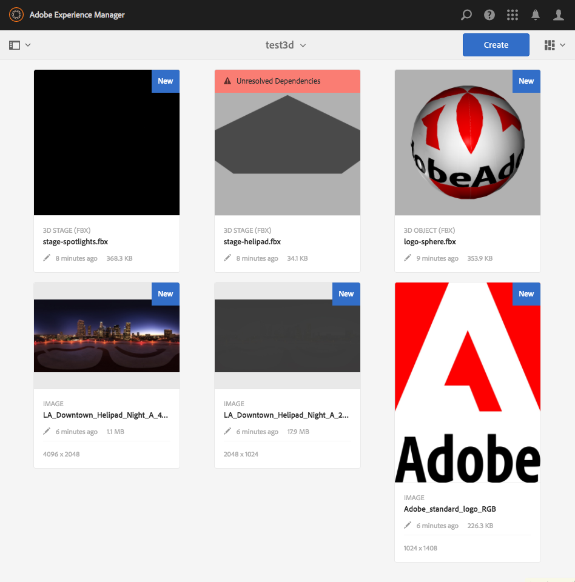

# Installera och konfigurera AEM 3D {#installing-and-configuring-aem-d}

Installation och konfiguration av AEM 3D (version 3.0) innefattar följande:

1. Installera Autodesk® FBX® SDK-biblioteket.
1. Hämta och installera det inbyggda 3D-kodpaketet.
1. Konfigurerar arbetsflödet för att hämta 3D-resurser och startar om AEM.
1. Verifierar installationen av AEM 3D.

Se även [Arbeta med 3D-resurser](assets-3d.md).

Se även [AEM 3D Assets versionsinformation](/help/release-notes/aem3d-release-notes.md) för information om krav, webbläsare som stöds och annan viktig versionsinformation.

Se även [Arbeta med 3D-platskomponenten](using-the-3d-sites-component.md).

>[!NOTE]
>
>Innan du hämtar och installerar 3D-paketet kontrollerar du att du har installerat alla nödvändiga AEM-paket korrekt. Se versionsinformationen för [AEM 3D.](install-config-3d.md)

## Installera Autodesk FBX SDK-biblioteket {#installing-the-autodesk-fbx-sdk-library}

Den inbyggda AEM 3D-koden kräver Autodesk FBX-biblioteket för att stödja FBX-filformatet. (Adobe kan för närvarande inte återdistribuera det här biblioteket.)

Se även [Avancerade konfigurationsinställningar](advanced-config-3d.md).

1. Logga in på värddatorn där AEM är installerat.

   * Om det här är en Windows Server-distribution loggar du in på servern som administratör.
   * Om det här är ett Mac- eller Windows-skrivbord måste du ha administratörsbehörighet.

1. Använd den länk som är lämplig för ditt operativsystem för att hämta **FBX SDK version 2016.1.2**

   * **Windows**

      [https://download.autodesk.com/us/fbx_release_older/2016.1.2/fbx20161_2_fbxsdk_vs2010_win.exe](https://download.autodesk.com/us/fbx_release_older/2016.1.2/fbx20161_2_fbxsdk_vs2010_win.exe)

   * **OS X**

      [https://download.autodesk.com/us/fbx_release_older/2016.1.2/fbx20161_2_fbxsdk_clang_mac.pkg.tgz](https://download.autodesk.com/us/fbx_release_older/2016.1.2/fbx20161_2_fbxsdk_clang_mac.pkg.tgz)

   * **Linux**

      [https://download.autodesk.com/us/fbx_release_older/2016.1.2/fbx20161_2_fbxsdk_linux.tar.gz](https://download.autodesk.com/us/fbx_release_older/2016.1.2/fbx20161_2_fbxsdk_linux.tar.gz)

1. Installera FBX SDK:

   * Windows. Installera på den enhet där AEM finns.
   * Mac. Installera på samma partition där AEM finns.
   * Linux. Extrahera det hämtade paketet och följ instruktionerna i `<yourFBXSDKpath>/Install_FbxFileSdk.txt`. Installera SDK i `/usr`.

## Hämta och installera det inbyggda 3D-kodpaketet {#downloading-and-installing-the-native-d-code-package}

>[!NOTE]
>
>Innan du fortsätter med installationen och konfigurationen av AEM 3D rekommenderar Adobe att du distribuerar alla tillämpliga servicepaket och andra relaterade funktionspaket. Se [Versionsinformation](/help/release-notes/aem3d-release-notes.md)för AEM 3D.

Se även [Avancerade konfigurationsinställningar](advanced-config-3d.md).

**Så här installerar du det inbyggda 3D-kodpaketet**:

1. Gör något av följande:

   * Om det här är en Windows Server-distribution loggar du in på servern som administratör.
   * Om det här är ett Mac- eller Windows-skrivbord måste du ha administratörsbehörighet.

1. Kontrollera att du har en webbläsare som stöds tillgänglig för att komma åt AEM.

   Se [Systemkrav](/help/release-notes/aem3d-release-notes.md#system-requirements).

1. Gå till [Software Distribution Portal](https://experience.adobe.com/#/downloads/content/software-distribution/en/aem.html). Gå till version 3.0.1 av `AEM-6.4-DynamicMedia-3D` funktionspaketet och ladda ned det.

1. I AEM klickar du på **[!UICONTROL Tools > Administration > Deployment > Package Manager]**.

1. Överför det hämtade funktionspaketet till AEM. Leta reda på den och klicka **[!UICONTROL Install]**.

1. Expandera **[!UICONTROL Install Package]** Avancerade inställningar **i** dialogrutan och ange **[!UICONTROL Access Control Handling]** till **Sammanfoga**.
1. Klicka **[!UICONTROL Install]** för att påbörja installationen av paketet.

   Filen `sample-3D-content.zip` placeras i **[!UICONTROL Assets]** rotmappen. Mer information finns i [Validera installationen av AEM 3D](#validating-the-setup-of-aem-d) .

## Konfigurera arbetsflödet för inhämtning av 3D-resurser och starta om AEM {#configuring-the-d-asset-ingestion-workflow-and-restarting-aem}

**Så här konfigurerar du arbetsflödet** för 3D-tillgångsinmatning:

1. I AEM klickar du på AEM-logotypen för att komma åt den globala navigeringskonsolen, klickar sedan på **[!UICONTROL Tools]** ikonen och navigerar till **[!UICONTROL Workflow > Models]**.
1. Håll markören över arbetsflödet på **[!UICONTROL Workflow Models]** **[!UICONTROL DAM Update Asset]** sidan och markera det när markeringen visas.

1. On the toolbar, click **[!UICONTROL Edit]**.
1. Klicka på ikonen till höger om arbetsflödet på den flytande AEM-panelen för att utöka listan på **[!UICONTROL DAM Update Asset]** skärmen **[!UICONTROL Plus]** . Markera **[!UICONTROL Process Step]** i listan.
1. Dra **[!UICONTROL Process Step]** och släpp det i arbetsflödet precis före **[!UICONTROL DAM Update Asset Workflow Completed]** komponenten i slutet av arbetsflödet.

   

1. Dubbelklicka på det nya processsteget.
1. Ange en lämplig beskrivning av processen, t.ex. i fältet, under **[!UICONTROL Step Properties]** fliken i **[!UICONTROL Common]** dialogrutan, i **[!UICONTROL Title]** fältet `Process 3D content`.
1. Click the **[!UICONTROL Process]** tab.

1. Välj i listrutan **[!UICONTROL Process]** och markera **[!UICONTROL Geometric 3D Object Service]** sedan **[!UICONTROL Handler Advance]** kryssrutan.

   

1. Klicka på bockmarkeringsikonen i dialogrutans övre högra hörn för att gå tillbaka till sidan DAM-uppdatering.
1. I närheten av det övre högra hörnet på **[!UICONTROL DAM Update Asset]** sidan klickar du på **[!UICONTROL Sync]** för att spara den redigerade arbetsflödesmodellen.
1. Starta om AEM.

   Efter omstart är du redo att överföra 3D-innehåll och låta AEM bearbeta det.

   Fortsätt med [valideringen av installationen av AEM 3D](#validating-the-setup-of-aem-d).

## Validera installationen av AEM 3D {#validating-the-setup-of-aem-d}

1. I AEM klickar du på **[!UICONTROL Tools > Assets]**, hämtar `sample-3D-content.zip`och expanderar den hämtade filen. (Du kan nu ta bort `sample-3D-content.zip` i AEM.)

   Se till **[!UICONTROL Card View]** att du är inne för att visa överföring och bearbetning av feedback i de återstående stegen.

1. Skapa en mapp med namnet `test3d` för att ta emot testinnehåll.
1. Överför alla filer från `sample-3D-content/images` till `test3d` mappen.
1. Vänta tills överföringen och bearbetningen är klar. Du kan behöva uppdatera webbläsaren.

   Överför de tre `.fbx` filerna från `sample-3D-content/` till `test3d` mappen.

   Överför inte .ma-modellfilerna ännu.

1. I kortvyn kan du titta på de meddelandebanderoller som visas på 3D-resurskortet.

   Varje resurs går igenom flera bearbetningssteg. När **[!UICONTROL Creating Preview...]** bearbetningen är klar uppdateras kortet med en miniatyrbild. När den slutliga bearbetningen är klar ersätts banderollen med **[!UICONTROL NEW]** indikatorn.

   >[!NOTE]
   >
   >Förvänta dig mycket hög processoranvändning medan 3D-bearbetning pågår. Beroende på tillgänglig processorkapacitet kan det ta lång tid att slutföra all bearbetning.

   

1. Nu får du lära dig att lösa filberoenden.

   Klicka på **[!UICONTROL Unresolved Dependencies]** ikonen på `stage-helipad.fbx` kortets banderoll för att navigera till resursens egenskaper och öppna fliken **[!UICONTROL Exclamation Point]** Beroenden **** .

   

1. Klicka på **[!UICONTROL Folder/Magnifying Glass]** ikonen till höger om filnamnet för att öppna resursläsaren och lösa beroendena enligt följande:

   

1. Klicka **[!UICONTROL Save]** och **[!UICONTROL Close]** för att slutföra bearbetningen av resursen och återgå till **[!UICONTROL Card View]** respektive resurs.
1. När bearbetningen är klar visas följande i **[!UICONTROL Card View]**:

   

1. På test3d-sidan klickar du på `logo-sphere.fbx` kortet för att öppna modellen i **[!UICONTROL Detail View]**.

   I närheten av det övre högra hörnet av sidan logo-sphere.fbx klickar du på ikonen Stage Spotlight för att expandera listrutan och väljer sedan `stage-spotlights.fbx`.

   

1. I listrutan **[!UICONTROL Stage Spotlight]** väljer du `stage-helipad.fbx`.

   Justera vyn med vänster musknapp. Bakgrunds- och modellljussättningen ändras för att återspegla den nya scenmarkeringen.

   

## Konfigurera stöd för Adobe Dimension-resurser {#configuring-support-for-adobe-dimension-assets}

>[!NOTE]
>
>Den här konfigurationsaktiviteten är valfri.

Du kan också konfigurera stöd i AEM 3D för Adobe Dimension-resurser.

Du måste konfigurera en extern konverteringstjänst så att Adobe Dimension 3D-resurser kan hämtas, förhandsgranskas och publiceras i AEM. Tjänsten konverterar från det egna Adobe Dimension-formatet (`.dn`) till en variant av glTF (formaterad som en `.glb` fil) som sparas med resursen Dn som en rendering. Återgivningen används för `.glb` webbaserad visning av 3D-resursen i AEM Assets, Sites och Screens och kan även hämtas för användning med tredjepartsprogram.

>[!NOTE]
>
>Adobe är värd för konverteringstjänsten i Amazon AWS. När tjänsten har konfigurerats på rätt sätt kopieras filer som har överförts till AEM på ett säkert sätt till konverteringstjänsten genom tillfällig lagring i Amazon S3. `.dn` Konverteringsresultatet överförs tillbaka till AEM genom temporär S3-lagring. Alla överföringar och lagring är skyddade. Innehållet finns också kvar i S3 och konverteringstjänsten är bara kort (vanligtvis inte längre än några minuter).

**Så här konfigurerar du stöd för Adobe Dimension-resurser**:

1. Kontakta er kontoansvarige på Adobe AEM, er provisioneringsexpert eller supportrepresentant för att begära inloggningsuppgifter för **AEM3D-tjänster**.

   >[!NOTE]
   >
   >Endast en uppsättning autentiseringsuppgifter krävs för varje organisation, oavsett hur många AEM-instanser autentiseringsuppgifterna är installerade på.

1. Kontrollera att du har fått följande information:

   * accountId
   * customerId
   * password
   * identityPoolId
   * userPoolId
   * clientId

1. Som administratör loggar du in på den AEM-författarinstans där du vill att inloggningsuppgifterna ska vara installerade och öppnar sedan **[!UICONTROL CRXDE Lite]**.
1. Konfigurera den nya inloggningsinformationen genom att göra följande i CRXDE Lite:

   1. Navigera till `/libs/settings/dam/v3D/services/dncr` och ställ in `clientId` egenskapen på det nya värdet.
   1. Navigera till `/libs/settings/dam/v3D/services/aws` och ange egenskaperna `accountId`, `customerId`, `identityPoolId`och `userPoolId` till de nya värdena.
   1. Läs in det nya lösenordsvärdet i `encryptedPassword` egenskapen. Det här värdet krypteras automatiskt när du trycker **[!UICONTROL Save All]**.
   1. Tryck **[!UICONTROL Save All]** och läs in sidan igen. Kontrollera sedan att `encryptedPassword` egenskapen visar en annan sträng omsluten av klammerparenteser. Det här utseendet visar att lösenordet är korrekt krypterat och säkert.

1. Ange formatet för `.glb` konverteringsrenderingen genom att göra följande i **[!UICONTROL CRXDE Lite]**:

   1. Navigera till `/libs/settings/dam/v3D/services/dncr` i **[!UICONTROL CRXDE Lite]**.
   1. Ange `outputFormat` egenskapen till antingen `Dn` eller `generic`.

      När konverteringen är inställd på `Dn``.glb` innehåller den Adobe-specifika tillägg, till exempel IBL-ljus, för bästa kvalitet när du visar Dn-resurser i AEM. Den konverterade .glb-renderingen kanske inte återges bra i tredjepartsprogram.

      När den anges till `generic`är `.glb` återgivningen generisk utan Adobe-specifika tillägg. Med den här inställningen kan den användas i tredjepartsprogram, medan visning med AEM 3D-visningsprogrammet blir visuellt suboptimalt.

1. Aktivera Dn-filformatet genom att göra följande i **[!UICONTROL CRXDE Lite]**:

   1. Navigera till `/libs/settings/dam/v3D/assetTypes/Dn`.
   1. Ställ in egenskapen på true `Enabled` .

1. Validera konfigurationen genom att göra följande:

   1. Öppna AEM Assets.
   1. Överför `logo_sphere.dn` till `test3d` mappen. Filen finns i `sample-3D-content/models`.

      Observera att du `sample-3D-content.zip` laddat ned tidigare för att validera de grundläggande 3D-funktionerna.
   1. Gå tillbaka till **[!UICONTROL Card View]** och observera den meddelandebanderoll som visas på den överförda resursen. Banderollen visas **[!UICONTROL Converting Format...]** medan konverteringen pågår.
   1. När all bearbetning är klar öppnar du resursen i för **[!UICONTROL Detail View]** att verifiera att den konverterade resursen visas korrekt och att visningsprogrammets navigeringskontroller är användbara.

   

   Om ett &quot;bearbetningsfel&quot; visas på Dn-resursen under **[!UICONTROL Card View]** 10-15 minuter misslyckades konverteringen.

   Om så är fallet kan du felsöka konverteringen genom att göra följande:

   * Ta bort resursen och överför den sedan igen.
   * Kontrollera att du har angett alla konfigurationsparametrar korrekt i **[!UICONTROL CRXDE Lite]**.
   * Kontrollera att ingen brandvägg blockerar åtkomst till konverteringstjänsten och AWS-slutpunkter.
