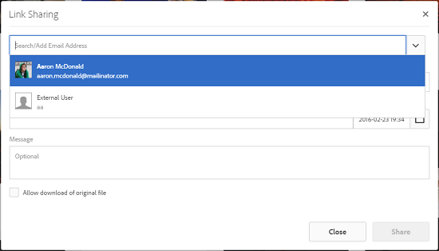

# Dela resurs via en länk {#asset-link-sharing}

>[!CAUTION]
>
>AEM 6.4 har nått slutet på den utökade supporten och denna dokumentation är inte längre uppdaterad. Mer information finns i [teknisk supportperiod](https://helpx.adobe.com/support/programs/eol-matrix.html). Hitta de versioner som stöds [här](https://experienceleague.adobe.com/docs/).

[!DNL Adobe Experience Manager Assets] Med kan du dela resurser, mappar och samlingar som en URL-adress med medlemmar i organisationen och externa enheter, inklusive partners och leverantörer. Att dela resurser via en länk är ett bekvämt sätt att göra resurser tillgängliga för externa parter utan att de först behöver logga in på [!DNL Assets].

>[!PREREQUISITES]
>
>* Du måste ha behörigheten Redigera åtkomstkontrollista för mappen eller resursen som du vill dela som en länk.
>* Konfigurera SMTP-serverinformationen i [Dagens CQ-posttjänst](#configmailservice).

## Dela resurser {#share-assets}

Använd dialogrutan Länkdelning för att generera URL:en för resurser som du vill dela med användare. Användare med administratörsbehörighet eller läsbehörighet på `/var/dam/share` platsen kan visa de länkar som delas med dem.

1. I [!DNL Assets] i användargränssnittet väljer du den resurs som ska delas som en länk.
1. I verktygsfältet klickar du på **[!UICONTROL Share Link]** . Länken som skapas när du klickar på **[!UICONTROL Share]** visas i förväg i [!UICONTROL Share Link] fält. Länken har inte skapats förrän du klickar **[!UICONTROL Submit]**.

   

   *Bild: Dialogrutan där du kan dela resurser som en länk.*

1. Skriv e-post-ID:t för den användare som du vill dela länken med i rutan för e-postadress i dialogrutan **[!UICONTROL Link Sharing]**. Du kan lägga till en eller flera användare.

   

   *Bild: Dela länkar till resurser direkt från [!UICONTROL Link Sharing] -dialogrutan.*

   >[!NOTE]
   >
   >Om du anger ett e-post-ID för en användare som inte är medlem i din organisation, är det ordet [!UICONTROL External User] föregås av användarens e-post-ID.

1. I **[!UICONTROL Subject]** anger du ett ämne för resursen som du vill dela.
1. I **[!UICONTROL Message]** anger du ett valfritt meddelande.

1. I **[!UICONTROL Expiration]** anger du ett förfallodatum och en förfallotid för länken så att den slutar fungera. Länkens standardförfallotid är en dag.

   

1. Om du vill att användarna ska kunna hämta den ursprungliga resursen tillsammans med återgivningarna väljer du **[!UICONTROL Allow download of original file]**. Som standard kan användare bara hämta återgivningar av resursen som du delar som en länk.

1. Klicka på **[!UICONTROL Share]**. Ett meddelande bekräftar att länken delas med användarna via ett e-postmeddelande.

1. Om du vill visa den delade resursen klickar du på länken i e-postmeddelandet som skickas till användaren. Om du vill generera en förhandsgranskning av resursen klickar du på den delade resursen. Om du vill stänga förhandsgranskningen klickar du på **[!UICONTROL Back]**. Om du har delat en mapp klickar du på **[!UICONTROL Parent Folder]** för att återgå till den överordnade mappen.

   

   >[!NOTE]
   >
   >[!DNL Experience Manager] har stöd för att generera en förhandsgranskning av resurser av endast de filtyper som stöds. Om andra MIME-typer delas kan du bara hämta resurserna och inte förhandsgranska.

1. Om du vill hämta den delade resursen klickar du på **[!UICONTROL Select]** Klicka på resursen i verktygsfältet och klicka sedan på **[!UICONTROL Download]** i verktygsfältet.

   

1. Om du vill visa resurser som du har delat som länkar går du till [!DNL Assets] användargränssnittet och klicka på [!DNL Experience Manager] logotyp. Välj **[!UICONTROL Navigation]**. Välj **[!UICONTROL Shared Links]** för att visa en lista med delade resurser.

1. Om du vill ta bort delningen av en resurs markerar du den och klickar på **[!UICONTROL Unshare]** i verktygsfältet. Ett bekräftelsemeddelande följer. Posten för resursen tas bort från listan.

## Konfigurera CQ-e-posttjänst för dag {#configure-day-cq-mail-service}

1. På [!DNL Experience Manager] hemsida, navigera till **[!UICONTROL Tools]** > **[!UICONTROL Operations]** > **[!UICONTROL Web Console]**.
1. I listan över tjänster letar du upp **[!UICONTROL Day CQ Mail Service]**.
1. Klicka **[!UICONTROL Edit]** bredvid tjänsten och konfigurera följande parametrar för **[!UICONTROL Day CQ Mail Service]** med de uppgifter som anges mot deras namn:

   * Värdnamn för SMTP-server: värdnamn för e-postserver
   * SMTP-serverport: e-postserverport
   * SMTP-användare: e-postserverns användarnamn
   * SMTP-lösenord: e-postserverlösenord

   

1. Klicka på **[!UICONTROL Save]**.

## Konfigurera maximal datastorlek {#configure-maximum-data-size}

När du hämtar resurser från den länk som delas med funktionen Länkdelning, [!DNL Experience Manager] komprimerar resurshierarkin från databasen och returnerar sedan resursen i en ZIP-fil. I avsaknad av begränsningar för den mängd data som kan komprimeras i en ZIP-fil utsätts stora mängder data för komprimering, vilket leder till minnesfel i JVM. För att skydda systemet från en potentiell denial of service-attack på grund av den här situationen måste du konfigurera den maximala storleken med **[!UICONTROL Max Content Size (uncompressed)]** parameter för **[!UICONTROL Day CQ DAM Adhoc Asset Share Proxy Servlet]** i Configuration Manager. Om resursens okomprimerade storlek överskrider det konfigurerade värdet, avvisas begäranden om hämtning av resurser. Standardvärdet är 100 MB.

1. Klicka på [!DNL Experience Manager] logotyp och sedan gå till **[!UICONTROL Tools]** > **[!UICONTROL Operations]** > **[!UICONTROL Web Console]**.
1. På webbkonsolen går du till **[!UICONTROL Day CQ DAM Adhoc Asset Share Proxy Servlet]** konfiguration.
1. Öppna **[!UICONTROL Day CQ DAM Adhoc Asset Share Proxy Servlet]** i redigeringsläge och ändra värdet för **[!UICONTROL Max Content Size (uncompressed)]** parameter.

   

1. Spara ändringarna.

## Bästa praxis och felsökning {#best-practices-and-troubleshooting}

* Resursmappar eller samlingar som innehåller ett tomt utrymme i namnet kanske inte delas.
* Om användarna inte kan hämta de delade resurserna bör du kontakta [!DNL Experience Manager] administrera vad [hämtningsgränser](#configure-maximum-data-size) är.
* Om du inte kan skicka e-post med länkar till delade resurser eller om andra användare inte kan ta emot din e-post, bör du kontakta din [!DNL Experience Manager] administratör om [e-posttjänst](#configure-day-cq-mail-service) är konfigurerad eller inte.
* Om du inte kan dela resurser med hjälp av länkdelningsfunktionen måste du se till att du har rätt behörighet. Se [dela resurser](#share-assets).
* Om en delad resurs flyttas till en annan plats slutar länken att fungera. Återskapa länken och dela den på nytt med användarna.

* Om du vill dela länkar från [!DNL Experience Manager] Skapa distribution till externa entiteter och se till att du bara visar följande URL:er som används för länkdelning, för `GET` endast begäranden. Blockera andra URL-adresser av säkerhetsskäl.

   * `http://[aem_server]:[port]/linkshare.html`
   * `http://[aem_server]:[port]/linksharepreview.html`
   * `http://[aem_server]:[port]/linkexpired.html`
   I [!DNL Experience Manager] gränssnitt, åtkomst **[!UICONTROL Tools]** > **[!UICONTROL Operations]** > **[!UICONTROL Web Console]**. Öppna **[!UICONTROL Day CQ Link Externalizer]** konfigurera och ändra följande egenskaper i **[!UICONTROL Domains]** fält med de värden som anges mot `local`, `author`och `publish`. För `local` och `author` anger du URL:en för de lokala instanserna respektive författarinstanserna. Om du kör en [!DNL Experience Manager] Använd samma värde för Author-instansen `local` och `author` egenskaper. Ange URL:en för publiceringsinstanser [!DNL Experience Manager] Publicera instans.
