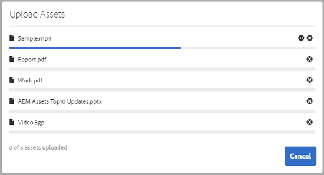
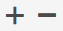
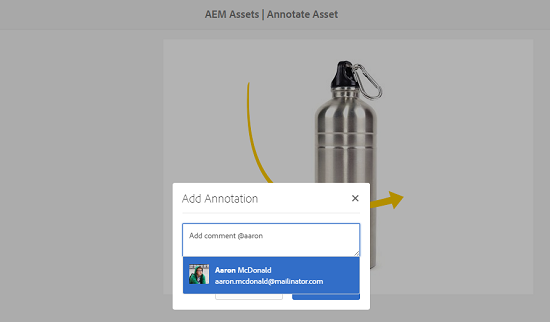

# Hantera era digitala resurser {#managing-assets-with-the-touch-optimized-ui}

Lär dig mer om olika resurshanterings- och redigeringsuppgifter som du kan utföra med det Touch-optimerade användargränssnittet i [!DNL Experience Manager] Resurser.

I den här artikeln beskrivs hur du hanterar och redigerar resurser med det Touch-optimerade användargränssnittet för Adobe Experience Manager Assets. Mer information om användargränssnittet finns i [Grundläggande hantering av Touch UI](/help/sites-authoring/basic-handling.md). Information om hur du hanterar innehållsfragment finns i [Hantera innehållsfragment](content-fragments-managing.md) resurser.

## Skapa mappar {#create-folders}

När du organiserar en samling resurser, till exempel, alla `Nature` kan du skapa mappar som håller ihop dem. Du kan använda mappar för att kategorisera och ordna dina resurser. [!DNL Experience Manager] Du behöver inte ordna resurser i mappar för att de ska fungera bättre.

>[!NOTE]
>
>* Dela en resursmapp av typen `sling:OrderedFolder` stöds inte vid delning till Marketing Cloud. Om du vill dela en mapp ska du inte välja Ordnad när du skapar en mapp.
>* Experience Manager tillåter inte att `subassets` ord som namnet på en mapp. Det är ett nyckelord som är reserverat för nod som innehåller delresurser för sammansatta resurser.

1. Navigera till den plats i mappen med digitala resurser där du vill skapa en ny mapp.
1. Klicka på **[!UICONTROL Create]**. Välj **[!UICONTROL New Folder]**.
1. I **[!UICONTROL Title]** anger du ett mappnamn. Som standard använder DAM den titel som du angav som mappnamn. När mappen har skapats kan du åsidosätta standardmappen och ange ett annat mappnamn.
1. Klicka på **[!UICONTROL Create]**. Mappen visas i mappen med digitala resurser.

Följande (blankstegsavgränsad lista med) tecken stöds inte:

* resursens filnamn får inte innehålla  `* / : [ \ \ ] | # % { } ? &`
* resursmappens namn får inte innehålla  `* / : [ \ \ ] | # % { } ? \" . ^ ; + & \t`

## Överför resurser {#uploading-assets}

Du kan överföra olika typer av resurser (inklusive bilder, PDF-filer, RAW-filer och så vidare) från den lokala mappen eller en nätverksenhet till [!DNL Experience Manager] Resurser.

>[!NOTE]
>
>I Dynamic Media - Scene7-läge kan du bara överföra resurser vars filstorlek är 2 GB eller mindre.

Du kan välja att överföra resurser till mappar med eller utan en bearbetningsprofil tilldelad dem.

För mappar som har en tilldelad bearbetningsprofil visas profilnamnet på miniatyrbilden i kortvyn. I listvyn visas profilnamnet i **[!UICONTROL Processing Profile]** kolumn. Se [Bearbetar profiler](processing-profiles.md).

Innan du överför en resurs måste du kontrollera att den finns i en [format som stöds](assets-formats.md).

**Så här överför du resurser**:

1. Navigera till den plats där du vill lägga till digitala resurser i webbgränssnittet Resurser.
1. Gör något av följande om du vill överföra resurserna:

   * Tryck på **[!UICONTROL Create]** ikon. Tryck sedan på **[!UICONTROL Files]**. Du kan byta namn på filen i den dialogruta som visas om det behövs.
   * I en webbläsare som stöder HTML5 drar du resurserna direkt i gränssnittet. Dialogrutan för att byta namn på filen visas inte.

   

   Om du vill markera flera filer trycker du på Ctrl/Kommando och väljer resurserna i dialogrutan för filväljaren. Från en iPad kan du bara markera en fil i taget.

   Du kan pausa överföringen av stora resurser (större än 500 MB) och återuppta den senare från samma sida. Tryck på **[!UICONTROL Pause]** -ikonen bredvid förloppsindikatorn som visas när överföringen startar.

   

   Den storlek över vilken en tillgång betraktas som en stor tillgång kan konfigureras. Du kan till exempel konfigurera systemet så att resurser över 1 000 MB (i stället för 500 MB) betraktas som stora resurser. I det här fallet **[!UICONTROL Pause]** i förloppsindikatorn visas när resurser som är större än 1 000 MB överförs.

   The **[!UICONTROL Pause]** visas inte om en fil som är större än 1 000 MB överförs med en fil som är mindre än 1 000 MB. Om du avbryter filöverföringen på mindre än 1000 MB kan du dock **[!UICONTROL Pause]** visas.

   Om du vill ändra storleksgränsen konfigurerar du `chunkUploadMinFileSize` egenskapen för `fileupload`i CRX-databasen.

   När du klickar på **[!UICONTROL Pause]** -ikonen växlar den till en **[!UICONTROL Play]** ikon. Om du vill återuppta överföringen klickar du på **[!UICONTROL Play]** ikon.

   

   Om du vill avbryta en pågående överföring klickar du på `X` intill förloppsindikatorn. När du avbryter överföringen [!DNL Experience Manager] Resurser tar bort den delvis överförda delen av resursen.

   Möjligheten att återuppta överföring är särskilt användbar i scenarier med låg bandbredd och nätverksfel, där det tar lång tid att överföra stora resurser. Du kan pausa överföringen och fortsätta senare när situationen förbättras. När du återupptar startar överföringen från den punkt där du pausade den.

   Under överföringen [!DNL Experience Manager] sparar de delar av resursen som överförs som datablock i CRX-databasen. När överföringen är klar [!DNL Experience Manager] konsoliderar dessa segment till ett enda datablock.

   Om du vill konfigurera rensningsaktiviteten för de oavslutade segmentöverföringsjobben går du till `https://[aem_server]:[port]/system/console/configMgr/org.apache.sling.servlets.post.impl.helper.ChunkCleanUpTask`.

   Om du överför en resurs med samma namn som en resurs som redan finns på den plats där du överför resursen visas en varningsdialogruta.

   Du kan välja att ersätta en befintlig resurs, skapa en annan version eller behålla båda genom att byta namn på den nya resursen som överförs. Om du ersätter en befintlig resurs tas metadata för resursen och eventuella tidigare ändringar och historik bort (till exempel anteckningar, beskärningar och så vidare). Om du väljer att behålla båda resurserna får den nya resursen ett nytt namn.

   

   >[!NOTE]
   >
   >När du väljer **[!UICONTROL Replace]** i **[!UICONTROL Name Conflict]** används för att generera om resurs-ID:t för den nya resursen. Detta ID skiljer sig från ID:t för föregående resurs.
   >
   >If **[!UICONTROL Asset Insights]** är aktiverat för att spåra visningar/klickningar med Adobe Analytics, gör detta återskapade resurs-ID att insamlade data för resursen i Adobe Analytics blir ogiltiga.

   Om resursen som du överför finns i [!DNL Experience Manager] Assets, **[!UICONTROL Duplicates Detected]** visas ett varningsmeddelande om att du försöker överföra en dubblettresurs. Dialogrutan visas bara om kontrollsummevärdet SHA 1 för den befintliga resursens binära värde matchar kontrollsummevärdet för den resurs som du överför. I det här fallet är namnen på tillgångarna oväsentliga. Dialogrutan kan med andra ord även visas för resurser som har olika namn om SHA 1-värdena för deras binärfiler är desamma.

   >[!NOTE]
   >
   >The **[!UICONTROL Duplicates Detected]** visas bara när **[!UICONTROL Duplicate Detection]** funktionen är aktiverad. Aktivera **[!UICONTROL Duplicate Detection]** funktion, se [Aktivera dubblettidentifiering](duplicate-detection.md).

   

   Tryck **[!UICONTROL Keep]** för att behålla den duplicerade resursen i [!DNL Experience Manager] Resurser. Tryck  **[!UICONTROL Delete]** om du vill ta bort den duplicerade resurs som du har överfört.

   [!DNL Experience Manager] Resurser förhindrar att du överför resurser med förbjudna tecken i filnamn. Om du försöker överföra en resurs som innehåller otillåtna tecken, [!DNL Experience Manager] Resurser visar ett varningsmeddelande om att det finns förbjudna tecken i filnamnet och stoppar överföringen tills du tar bort dessa tecken eller överför med ett tillåtet namn.

   Om du vill anpassa namngivningskonventionerna för din organisation kan du **[!UICONTROL Upload Assets]** I kan du ange långa namn för de filer som du överför.

   

   Följande (blankstegsavgränsad lista med) tecken stöds emellertid inte:
   * resursens filnamn får inte innehålla  `* / : [ \ \ ] | # % { } ? &`
   * resursmappens namn får inte innehålla  `* / : [ \ \ ] | # % { } ? \" . ^ ; + & \t`

   I gränssnittet Resurser visas dessutom den senaste resursen som du överför eller den mapp som du skapar först i alla vyer (**[!UICONTROL Card view]**, **[!UICONTROL List view]** och **[!UICONTROL Column view]**).

   När du överför stora resurser eller flera resurser samtidigt kan du ofta använda visuella indikatorer för att utvärdera förloppet. The **[!UICONTROL Upload Progress]** visas antalet överförda filer och de filer som inte kunde överföras.

   

   Om du avbryter överföringen innan filerna överförs, [!DNL Experience Manager] Resurser stoppar överföringen av den aktuella filen och uppdaterar innehållet. Filer som redan har överförts tas dock inte bort.

### Serieuppladdningar {#serial-uploads}

När du överför flera resurser i grupp förbrukas avsevärda systemresurser, vilket kan påverka prestandan negativt [!DNL Experience Manager] distribution. Möjliga flaskhalsar kan vara din internetanslutning, läs- och skrivåtgärder på disk, webbläsarbegränsningar för antalet begäranden om POST vid samtidig överföring av resurser. En gruppöverföring kan misslyckas eller avslutas i förtid. Med andra ord: [!DNL Experience Manager] resurser kan sakna vissa filer när en grupp filer importeras eller helt och hållet inte kan importera någon fil.

För att övervinna denna situation [!DNL Experience Manager] Resurser importerar en resurs i taget (seriell överföring) under en massöverföring, i stället för att alla resurser hämtas samtidigt.

Seriell överföring av resurser är aktiverat som standard. Om du vill inaktivera funktionen och tillåta samtidig överföring ska du lägga över `fileupload` i CRXDe och ange värdet för `parallelUploads` egenskap till `true`.

### Överför resurser med FTP {#uploading-assets-using-ftp}

Dynamic Media möjliggör batchöverföring av resurser via FTP-server. Om du tänker överföra stora resurser (>1 GB) eller överföra hela mappar och undermappar bör du använda FTP. Du kan till och med konfigurera FTP-överföring så att den sker regelbundet.

>[!NOTE]
>
>I Dynamic Media - Scene7-läge kan du bara överföra resurser vars filstorlek är 2 GB eller mindre.

>[!NOTE]
>
>Så här överför du resurser via FTP i Dynamic Media - Scene7 mode, installera feature pack pack (FP) 18912 på [!DNL Experience Manager] författare. Kontakta Adobe kundsupport för att få tillgång till FP-18912 och slutföra konfigurationen av ditt FTP-konto. Se [Installerar funktionspaket 18912 för migrering av gruppresurser](/help/assets/bulk-ingest-migrate.md).
>
>Om du använder FTP för att överföra resurser anges överföringsinställningarna i [!DNL Experience Manager] ignoreras. I stället används filbearbetningsregler, som de definieras i Dynamic Media Classic.

**Så här överför du resurser med FTP**

1. Logga in på FTP-servern med det FTP-användarnamn och lösenord som du fick från e-postmeddelandet om etablering. Överför filer eller mappar till FTP-servern i FTP-klienten.
1. Öppna [Dynamic Media Classic desktop application](https://experienceleague.adobe.com/docs/dynamic-media-classic/using/getting-started/signing-out.html#getting-started)loggar sedan in på ditt konto med hjälp av autentiseringsuppgifter från e-postmeddelandet om etablering.
1. Tryck på i det globala navigeringsfältet **[!UICONTROL Upload]**.
1. På **[!UICONTROL Upload]** i det övre vänstra hörnet trycker du på **[!UICONTROL Via FTP]** -fliken.
1. Välj en FTP-mapp att överföra filer från till vänster på sidan. till höger på sidan väljer du en målmapp.
1. I sidans nedre högra hörn trycker du **[!UICONTROL Job Options]** och ange sedan önskade alternativ baserat på resurserna i den mapp du valde.

   Se [Alternativ för överföringsjobb](#upload-job-options).

   >[!NOTE]
   >
   >När du överför resurser via FTP får de överföringsjobbalternativ som du anger i Dynamic Media Classic företräde framför de resurshanteringsparametrar som anges i AEM.

1. I det nedre högra hörnet av **[!UICONTROL Upload Job Options]** dialogruta, tryck **[!UICONTROL Save]**.
1. I det nedre högra hörnet av **[!UICONTROL Upload]** sida, tryck **[!UICONTROL Submit Upload]**.

   Om du vill visa överföringsförloppet trycker du på **[!UICONTROL Jobs]**. The **[!UICONTROL Jobs]** visas överföringsförloppet. Du kan fortsätta arbeta i [!DNL Experience Manager] och du kan när som helst återgå till jobbsidan i Dynamic Media Classic för att granska ett pågående jobb.

   Om du vill avbryta ett pågående överföringsjobb trycker du på **[!UICONTROL Cancel]** bredvid **[!UICONTROL Duration]** tid.

#### Alternativ för överföringsjobb {#upload-job-options}

| Överföringsalternativ | Delalternativ | Beskrivning |
|---|---|---|
| Jobbnamn |  | Standardnamnet som är förifyllt i textfältet innehåller den användardefinierade delen av namnet och datum- och tidsstämpeln. Du kan använda standardnamnet eller ange ett namn på ditt eget skapande för det här överföringsjobbet.  Jobbet och andra överförings- och publiceringsjobb registreras på sidan Jobs, där du kan kontrollera jobbens status. |
| Publicera efter överföring |  | Publicerar automatiskt de resurser som du överför. |
| Skriv över i valfri mapp, samma basresursnamn oavsett tillägg |  | Välj det här alternativet om du vill att de filer du överför ska ersätta befintliga filer med samma namn. Namnet på det här alternativet kan vara annorlunda, beroende på inställningarna i **[!UICONTROL Application Setup]** > **[!UICONTROL General Settings]** > **[!UICONTROL Upload to Application]** > **[!UICONTROL Overwrite Images]**. |
| Dekomprimera ZIP- eller TAR-filer vid överföring |  |  |
| Jobbalternativ |  | Tryck/klicka **[!UICONTROL Job Options]** för att öppna [!UICONTROL Upload Job Options] och välj alternativ som påverkar hela överföringsjobbet. De här alternativen är desamma för alla filtyper. Du kan välja standardalternativ för att överföra filer från sidan Allmänna inställningar i programmet. Om du vill öppna den här sidan väljer du **[!UICONTROL Setup]** > **[!UICONTROL Application Setup]**. Tryck på **[!UICONTROL Default Upload Options]** för att öppna [!UICONTROL Upload Job Options] -dialogrutan. |
|  | När | Välj En gång eller Återkommande. Om du vill ställa in ett återkommande jobb väljer du alternativet Upprepa - varje dag, Varje vecka, Varje månad eller Anpassa - för att ange när du vill att FTP-överföringsjobbet ska återkomma. Ange sedan schemaläggningsalternativen efter behov. |
|  | Inkludera undermappar | Överför alla undermappar i mappen som du vill överföra. Namnen på mappen och dess undermappar som du överför anges automatiskt i [!DNL Experience Manager] Resurser. |
|  | Beskärningsalternativ | Om du vill beskära manuellt från sidorna av en bild väljer du Beskär-menyn och sedan Manuell. Ange sedan antalet pixlar att beskära från en sida eller från varje sida av bilden. Hur mycket av bilden som beskärs beror på bildfilens ppi-inställning (pixlar per tum). Om bilden till exempel visar 150 ppi och du anger 75 i textrutorna Överkant, Höger, Underkant och Vänster beskärs en halv tum från varje sida.  Om du vill beskära pixlar med tomt utrymme automatiskt från en bild öppnar du menyn Beskär, väljer Manuell och anger pixelmått i fälten Överkant, Höger, Underkant och Vänster för att beskära från sidorna. Du kan också välja Trimma på menyn Beskär och välja följande alternativ:  **Trimma bort baserat på** <ul><li>**Färg** - Välj alternativet Färg. Välj sedan menyn Hörn och välj hörnet på bilden med den färg som bäst motsvarar den tomrumsfärg som du vill beskära.</li><li>**Öppenhet** - Välj alternativet Genomskinlighet.  **Tolerans** - Dra i skjutreglaget för att ange en tolerans mellan 0 och 1. Om du vill trimma baserat på färg anger du 0 för att beskära pixlar endast om de exakt matchar den färg du valde i bildens hörn. Nummer som ligger närmare 1 ger större färgskillnader. Om du vill trimma baserat på genomskinlighet anger du 0 så att pixlarna bara beskärs om de är genomskinliga. Siffror närmare 1 ger större genomskinlighet.</li></ul> Observera att dessa beskärningsalternativ är icke-förstörande. |
|  | Alternativ för färgprofil | Välj en färgkonvertering när du skapar optimerade filer som används för leverans:<ul><li>Standardfärgbevaring: Behåller källbildens färger när bilderna innehåller färgrymdsinformation. det inte finns någon färgkonvertering. Nästan alla bilder idag har rätt färgprofil inbäddad. Om en CMYK-källbild inte innehåller någon inbäddad färgprofil konverteras färgerna till sRGB-färgrymden (standard röd grön). sRGB är den rekommenderade färgrymden för visning av bilder på webbsidor.</li><li>Behåll ursprunglig färgrymd: Bevarar de ursprungliga färgerna utan någon färgkonvertering vid punkten. För bilder utan inbäddad färgprofil görs färgkonverteringen med de standardfärgprofiler som konfigurerats i publiceringsinställningarna. Färgprofilerna kanske inte justeras mot färgen i de filer som skapas med det här alternativet. Därför bör du använda alternativet Standardfärgbevaring.</li><li>Anpassa från > Till  Öppnar menyer så att du kan välja färgmodellen Konvertera från och Konvertera till. Det här avancerade alternativet åsidosätter eventuell färginformation som är inbäddad i källfilen. Välj det här alternativet när alla bilder som du skickar in innehåller felaktiga eller saknade färgprofildata.</li></ul> |
|  | Bildredigeringsalternativ | Du kan bevara urklippsmaskerna i bilder och välja en färgprofil.  Se [Ange bildredigeringsalternativ vid överföring](#setting-image-editing-options-at-upload). |
|  | PostScript-alternativ | Du kan rastrera PostScript®, beskära filer, behålla genomskinliga bakgrunder, välja en upplösning och välja en färgrymd.  Se [Ange överföringsalternativ för PostScript och Illustrator](#setting-postscript-and-illustrator-upload-options). |
|  | Photoshop-alternativ | Du kan skapa mallar från Adobe® Photoshop®-filer, behålla lager, ange hur lager ska namnges, extrahera text och ange hur bilder ska förankras i mallar.  Observera att mallar inte stöds i AEM.  Se [Ange överföringsalternativ för Photoshop](#setting-photoshop-upload-options). |
|  | Alternativ för PDF | Du kan rastrera filerna, extrahera sökord och länkar, automatiskt generera en e-katalog, ange upplösningen och välja en färgrymd.  Observera att e-kataloger inte stöds i AEM.   Se [Ange överföringsalternativ för PDF ](#setting-pdf-upload-options) **Anteckning**: Det högsta antalet sidor för en PDF som ska övervägas för extrahering är 5000 för nya överföringar. Denna gräns kommer att ändras till 100 sidor den 31 december 2022. Se även [Dynamic Media begränsningar](/help/assets/limitations.md). |
|  | Illustrator-alternativ | Du kan rastrera Adobe Illustrator®-filer, behålla genomskinliga bakgrunder, välja en upplösning och välja en färgrymd.  Se [Ange överföringsalternativ för PostScript och Illustrator](#setting-postscript-and-illustrator-upload-options). |
|  | EVideoalternativ | Du kan omkoda en videofil genom att välja en videoförinställning.  Se [Ange överföringsalternativ för eVideo](#setting-evideo-upload-options). |
|  | Förinställningar för gruppuppsättning | Om du vill skapa en bilduppsättning, eller en snurra uppsättning, från de överförda filerna klickar du på kolumnen Aktiv för den förinställning som du vill använda. Du kan markera flera förinställningar. Du skapar förinställningarna på sidan Programinställningar/Gruppinställningar i Dynamic Media Classic.  Se [Konfigurera förinställningar för gruppuppsättningar för att automatiskt generera bilduppsättningar och snurruppsättningar](config-dms7.md#creating-batch-set-presets-to-auto-generate-image-sets-and-spin-sets) om du vill veta mer om hur du skapar gruppuppsättningsförinställningar.  Se [Ställa in förinställningar för gruppuppsättning vid överföring](#setting-batch-set-presets-at-upload). |

#### Ange bildredigeringsalternativ vid överföring {#setting-image-editing-options-at-upload}

När du överför bildfiler, inklusive AI-, EPS- och PSD-filer, kan du utföra följande redigeringsåtgärder i **[!UICONTROL Upload Job Options]** dialogruta:

* Beskär tomt utrymme från bildens kant (se beskrivningen i tabellen ovan).
* Beskär manuellt från bildsidorna (se beskrivningen i tabellen ovan).
* Välj en färgprofil (se alternativbeskrivningen i tabellen ovan).
* Skapa en mask från en urklippsbana.
* Öka skärpan i bilder med oskarpa maskningsalternativ
* Blockera bakgrund

| Alternativ | Delalternativ | Beskrivning |
|---|---|---|
| Skapa mask från urklippsbana |  | Skapa en mask för bilden baserat på dess urklippsbaneinformation. Det här alternativet gäller bilder som skapats med bildredigeringsprogram där en urklippsbana har skapats. |
| Oskarp mask |  | Gör att du kan finjustera en skärpefiltereffekt i den slutliga nedsamplade bilden, styra intensiteten i effekten, radien för effekten (mätt i pixlar) och ett kontrasttröskelvärde som ignoreras.  Den här effekten använder samma alternativ som Photoshop Oskarp mask-filter. Till skillnad från vad namnet antyder är Oskarp mask ett skärpefilter. Under Oskarp mask anger du önskade alternativ. Inställningsalternativen beskrivs i följande: |
|  | Belopp | Styr mängden kontrast som används på kantpixlar.  Tänk på det som intensiteten i effekten. Den största skillnaden mellan mängden oskarp mask i Dynamic Media och mängden värden i Adobe Photoshop är att Photoshop har ett intervall på 1 till 500 %. I Dynamic Media är värdeintervallet 0,0 till 5,0. Värdet 5,0 motsvarar 500 % i Photoshop. värdet 0,9 motsvarar 90 % och så vidare. |
|  | Radie | Styr radien för effekten. Värdeintervallet är 0-250.  Effekten körs på alla pixlar i en bild och strålar ut från alla pixlar i alla riktningar. Radien mäts i pixlar. Om du till exempel vill få en liknande skärpeeffekt för en bild på 2 000 x 2 000 pixlar och en bild på 500 x 500 pixlar anger du en radie på två pixlar för bilden på 2 000 x 2 000 pixlar och ett radievärde på en pixel för bilden på 500 x 500 pixlar . Ett större värde används för en bild som har fler pixlar. |
|  | Tröskelvärde | Tröskelvärde är ett kontrastintervall som ignoreras när filtret Oskarp mask används. Det är viktigt så att inget &quot;brus&quot; uppstår i en bild när det här filtret används. Värdeintervallet är 0-255, vilket är antalet intensitetssteg i en gråskalebild. 0=svart, 128=50% grått och 255=vitt.  Ett tröskelvärde på 12 ignorerar t.ex. små variationer i hudtonens ljusstyrka för att undvika att lägga till brus, men ändå ger kantkontrast till kontrasterande områden, t.ex. där ögonfransarna möts av hud.  Om du t.ex. har ett foto av någons ansikte kommer Oskarp mask att påverka de kontrasterande delarna av bilden, t.ex. där ögonfransar och hud möts för att skapa ett tydligt kontrastområde, samt den utjämnade huden. Även den jämnaste huden uppvisar subtila förändringar i intensitetsvärden. Om du inte använder ett tröskelvärde framhäver filtret dessa subtila ändringar i hudpixlar. I sin tur skapas en högljudd och oönskad effekt medan kontrasten på ögonfransarna ökar, vilket ökar skärpan.  För att undvika det här problemet introduceras ett tröskelvärde som instruerar filtret att ignorera pixlar som inte förändrar kontrasten dramatiskt, som mjuk hud.  Lägg märke till texturen bredvid dragkedjan i zippargrafiken som visades tidigare. Bildbrus visas eftersom tröskelvärdena var för låga för att undertrycka bruset. |
|  | Monokrom | Markera för att få bildintensiteten oskarp mask (intensitet).  Avmarkera alternativet om du vill skapa en oskarp mask för varje färgkomponent separat. |
| Blockera bakgrund |  | Tar automatiskt bort bakgrunden i en bild när du överför den. Den här tekniken är användbar för att dra uppmärksamheten till ett visst objekt och få det att sticka ut från en rörig bakgrund. Välj om du vill aktivera eller aktivera funktionen Blockera bakgrund och följande underalternativ: |
|  | Hörn | Krävs.  Hörnet på bilden som används för att definiera bakgrundsfärgen som ska blockeras.  Du kan välja mellan **Övre vänster**, **Nederst till vänster**, **Övre höger**, eller **Nederst till höger**. |
|  | Fyllningsmetod | Krävs.  Styr pixelgenomskinlighet från den hörnplats som du anger.  Du kan välja bland följande fyllningsmetoder: <ul><li>**Flood Fill** - gör alla pixlar genomskinliga som matchar det hörn du har angett och som är kopplat till det.</li><li>**Matcha pixlar** - gör alla matchande pixlar genomskinliga, oavsett var de finns i bilden.</li></ul> |
|  | Tolerans | Valfritt.  Styr den tillåtna variationen i pixelfärgmatchning baserat på den hörnplats som du anger.  Använd värdet 0,0 om du vill matcha pixelfärgerna exakt, eller använd värdet 1,0 om du vill tillåta den största variationen. |

#### Ange överföringsalternativ för PostScript och Illustrator {#setting-postscript-and-illustrator-upload-options}

När du överför PostScript-bildfiler (EPS) eller Illustrator-bildfiler (AI) kan du formatera dem på olika sätt. Du kan rastrera filerna, behålla den genomskinliga bakgrunden, välja en upplösning och välja en färgrymd. Alternativ för formatering av PostScript- och Illustrator-filer finns i dialogrutan Alternativ för överföringsjobb under PostScript-alternativ och Illustrator-alternativ.

| Alternativ | Delalternativ | Beskrivning |
|---|---|---|
| Bearbetar |  | Välj **[!UICONTROL Rasterize]** om du vill konvertera vektorgrafik i filen till bitmappsformat. |
| Bevara genomskinlig bakgrund i återgiven bild |  | Bevara filens genomskinlighet i bakgrunden. |
| Upplösning |  | Anger upplösningsinställningen. Den här inställningen avgör hur många pixlar som visas per tum i filen. |
| Färgrymd |  | Välj menyn Färgrymd och välj bland följande alternativ för färgrymd: |
|  | Identifiera automatiskt | Behåller filens färgrymd. |
|  | Tvinga som RGB | Konverterar till färgmodellen RGB. |
|  | Tvinga som CMYK | Konverterar till CMYK-färgmodellen. |
|  | Tvinga som gråskala | Konverterar till gråskalefärgrymden. |

#### Ange överföringsalternativ för Photoshop {#setting-photoshop-upload-options}

PSD-filer (Photoshop Document) används oftast för att skapa bildmallar. När du överför en PSD-fil kan du skapa en bildmall automatiskt från filen (välj alternativet Skapa mall på skärmen Överför).

Dynamic Media skapar flera bilder från en PSD-fil med lager om du använder filen för att skapa en mall. skapas en bild för varje lager.

Använd **[!UICONTROL Crop Options]** och **[!UICONTROL Color Profile Options]**, som beskrivs ovan, med Photoshop överföringsalternativ.

>[!NOTE]
>
>Mallar stöds inte i AEM.

| Alternativ | Delalternativ | Beskrivning |
|---|---|---|
| Behåll lager |  | Rippar lagren i PSD, om det finns några, till enskilda resurser. Resurslagren förblir kopplade till PSD. Du kan visa dem genom att öppna filen PSD i detaljvyn och välja lagerpanelen. |
| Skapa mall |  | Skapar en mall från lagren i filen PSD. |
| Extrahera text |  | Extraherar texten så att användare kan söka efter text i ett visningsprogram. |
| Utöka lager till bakgrundsstorlek |  | Utökar storleken på överlappade bildlager till storleken på bakgrundslagret. |
| Namnge lager |  | Lager i filen PSD överförs som separata bilder. |
|  | Lagernamn | Namnger bilderna efter deras lagernamn i filen PSD. Ett lager med namnet Price Tag i den ursprungliga PSD-filen blir till exempel en bild med namnet Price Tag. Om lagernamnen i filen PSD är Photoshop standardlagernamn (Bakgrund, Lager 1, Lager 2 och så vidare) får bilderna namn efter sina lagernummer i filen PSD, inte efter deras standardlagernamn. |
|  | Photoshop och lagernummer | Namnger bilderna efter deras lagernummer i filen PSD och ignorerar de ursprungliga lagernamnen. Bilderna får samma namn som Photoshop-filnamnet och ett nummer i det tillagda lagret. Det andra lagret i en fil som heter Spring Ad.psd får till exempel namnet Spring Ad_2 även om det har ett icke-standardnamn i Photoshop. |
|  | Photoshop- och lagernamn | Namnger bilderna efter PSD-filen följt av lagernamnet eller lagernumret. Lagernumret används om lagernamnen i filen PSD är Photoshop standardlagernamn. Ett lager med namnet Price Tag i en PSD-fil med namnet SpringAd får till exempel namnet Spring Ad_Price Tag. Ett lager med standardnamnet Lager2 kallas Spring Ad_2. |
| Fästpunkt |  | Ange hur bilder ska förankras i mallar som genereras från lagerkompositionen som skapas från filen PSD. Som standard är ankarpunkten i mitten. Med en central ankarpunkt kan ersättningsbilder bäst fylla samma område, oavsett ersättningsbildens proportioner. Bilder med en annan aspekt som ersätter den här bilden upptar i själva verket samma utrymme när de refererar till mallen och använder parameterersättning. Ändra till en annan inställning om ditt program kräver att ersättningsbilderna fyller ut det tilldelade utrymmet i mallen. |

#### Ange överföringsalternativ för PDF {#setting-pdf-upload-options}

När du överför en PDF-fil kan du formatera den på olika sätt. Du beskär sidorna, extraherar sökord, anger en pixel per tum-upplösning och väljer en färgrymd. PDF-filer innehåller ofta en ytmarginal, skärmärken, passmärken och andra skrivarmärken. Du kan beskära dessa märken från sidorna när du överför en PDF-fil.

Det högsta antalet sidor för en PDF som ska övervägas för extrahering är 5000 för nya överföringar. Denna gräns kommer att ändras till 100 sidor den 31 december 2022. Se även [Dynamic Media begränsningar](/help/assets/limitations.md).

>[!NOTE]
>
>eCatalogs stöds inte i AEM.

Välj bland följande alternativ:

| Alternativ | Delalternativ | Beskrivning |
|---|---|---|
| Bearbetar | Rastrera | (Standard) Rippar sidorna i filen PDF och konverterar vektorgrafik till bitmappsbilder. Välj det här alternativet om du vill skapa en e-katalog. |
| Extract | Sök efter ord | Extraherar ord från PDF-filen så att filen kan genomsökas efter nyckelord i en eCatalog Viewer. |
|  | Länkar | Extraherar länkar från PDF-filerna och konverterar dem till Image Maps som används i en eCatalog Viewer. |
| Skapa eCatalog automatiskt från PDF med flera sidor |  | Skapar automatiskt en e-katalog från PDF-filen. eCatalog namnges efter den överförda PDF-filen. (Det här alternativet är bara tillgängligt om du rastrerar PDF-filen när du överför den.) |
| Upplösning |  | Anger upplösningsinställningen. Den här inställningen avgör hur många pixlar som visas per tum i filen PDF. Standardvärdet är 150. |
| Färgrymd |  | Välj menyn Färgrymd och välj en färgrymd för filen PDF. De flesta PDF-filer har både RGB och CMYK-färgbilder. Färgrymden RGB är att föredra när du vill visa bilden online. |
|  | Identifiera automatiskt | Bevarar färgrymden för PDF-filen. |
|  | Tvinga som RGB | Konverterar till färgmodellen RGB. |
|  | Tvinga som CMYK | Konverterar till CMYK-färgmodellen. |
|  | Tvinga som gråskala | Konverterar till gråskalefärgrymden. |

#### Ange överföringsalternativ för eVideo {#setting-evideo-upload-options}

Du kan omkoda en videofil genom att välja bland en mängd olika förinställningar för video.

| Alternativ | Delalternativ | Beskrivning |
|---|---|---|
| Adaptiv video |  | En enda förinställning för kodning som fungerar med alla proportioner för att skapa videor som ska skickas till mobilen, surfplattan och datorn. Överförda källvideor som är kodade med den här förinställningen har en fast höjd. Bredden skalas dock automatiskt så att videons proportioner bevaras.  Det bästa sättet är att använda adaptiv videokodning. |
| Förinställningar för enskild kodning | Sortera kodningsförinställningar | Välj Namn eller Storlek om du vill sortera kodningsförinställningarna under Skrivbord, Mobil och Surfplatta efter namn eller upplösningsstorlek. |
|  | Skrivbord | Skapa en MP4-fil för att leverera en direktuppspelad eller progressiv videoupplevelse till stationära datorer. Välj en eller flera proportioner med önskad upplösningsstorlek och måldatahastighet. |
|  | Mobil | Skapa en MP4-fil för leverans på iPhone- eller Android-mobilenheter. Välj en eller flera proportioner med önskad upplösning och datahastighet. |
|  | Tablet | Skapa en MP4-fil för leverans på iPad- eller Android-surfplattor. Välj en eller flera proportioner med önskad upplösning och datahastighet. |

#### Ange förinställningar för gruppuppsättning vid överföring {#setting-batch-set-presets-at-upload}

Om du automatiskt vill skapa en bilduppsättning eller en snurra uppsättning från överförda bilder klickar du på knappen **[!UICONTROL Active]** -kolumnen för den förinställning som du vill använda. Du kan markera flera förinställningar.

Se [Konfigurera förinställningar för gruppuppsättningar för att automatiskt generera bilduppsättningar och snurruppsättningar](config-dms7.md#creating-batch-set-presets-to-auto-generate-image-sets-and-spin-sets) om du vill veta mer om hur du skapar gruppuppsättningsförinställningar.

### Strömmade överföringar {#streamed-uploads}

Om du överför flera resurser anropar jag [!DNL Experience Manager] servern ökar drastiskt, vilket minskar uppladdningseffektiviteten och kan till och med göra att den tar slut. [!DNL Experience Manager] Resurser har stöd för direktuppspelad överföring av resurser. Direktuppspelad överföring minskar I/O-disken under överföringen genom att undvika att lagra resurser i en tillfällig mapp på servern innan den kopieras till databasen. I stället överförs data direkt till databasen. På så sätt minskas tiden det tar att överföra stora resurser och möjligheten till timeout. Direktuppspelad överföring är aktiverad som standard i [!DNL Experience Manager] Resurser.

Direktuppspelning är inaktiverat för [!DNL Experience Manager] som körs på JEE-server med servlet-api-version som är mindre än 3.1.

### Extrahera ZIP-arkiv som innehåller resurser {#extract-zip-archive-containing-assets}

Du kan överföra ZIP-arkiv precis som andra resurser som stöds. Samma filnamnsregler gäller för ZIP-filer. [!DNL Experience Manager] gör att du kan extrahera ett ZIP-arkiv till en DAM-plats.

Välj ett ZIP-arkiv i taget, klicka på **[!UICONTROL Extract Archive]** och välj en målmapp. Välj ett alternativ för att hantera eventuella konflikter. Om resurserna i ZIP-filen redan finns i målmappen kan du välja något av följande alternativ: hoppa över extrahering, ersätta befintliga filer, behålla båda resurserna genom att byta namn eller skapa en ny version.

När extraheringen är klar [!DNL Experience Manager] meddelar dig i meddelandefältet. while [!DNL Experience Manager] extraherar ZIP-filen så kan du gå tillbaka till arbetet utan att avbryta extraheringen.

Vissa begränsningar för funktionen är:

* Om det finns en mapp med samma namn på målet extraheras resurserna från ZIP-filen i den befintliga mappen.

* Om du avbryter extraheringen tas de redan extraherade resurserna inte bort.

* Du kan inte markera två ZIP-filer samtidigt och extrahera dem. Du kan bara extrahera ett ZIP-arkiv åt gången.

## Förhandsgranska resurser {#previewing-assets}

**Förhandsgranska resurser**:

1. I resursgränssnittet navigerar du till platsen för resursen som du vill förhandsgranska.
1. Tryck på önskad resurs för att öppna den.

1. I förhandsgranskningsläget finns zoomalternativ för [bildtyper som stöds](assets-formats.md#supported-raster-image-formats) (med interaktiv redigering).

   Om du vill zooma in på en resurs trycker du på **[!UICONTROL +]** (eller tryck på förstoringsglaset på resursen). Om du vill zooma ut trycker du **[!UICONTROL -]**. När du zoomar in kan du titta närmare på alla delar av bilden genom att panorera. The **[!UICONTROL Reset Zoom]** pilen återgår till den ursprungliga vyn.

   

   Tryck på **[!UICONTROL Reset]** om du vill återställa vyn till den ursprungliga storleken.

   

>[!MORELIKETHIS]
>
>* [Förhandsgranska Dynamic Media Assets](/help/assets/previewing-assets.md).
>* [Visa delresurser](managing-linked-subassets.md#viewing-subassets).

## Redigera egenskaper {#editing-properties}

1. Navigera till platsen för resursen vars metadata du vill redigera.

1. Markera resursen och tryck **[!UICONTROL Properties]** i verktygsfältet för att visa resursegenskaper. Du kan också välja **[!UICONTROL Properties]** Snabba åtgärder på tillgångskortet.

   

1. I **[!UICONTROL Properties]** redigerar du metadataegenskaperna på olika flikar. Till exempel, under **[!UICONTROL Basic]** kan du redigera titeln, beskrivningen och så vidare.

   Layouten för **[!UICONTROL Properties]** vilken sida och vilka metadataegenskaper som är tillgängliga beror på det underliggande metadataschemat. Så här ändrar du layouten för **[!UICONTROL Properties]** sida, se [Metadata-scheman](metadata-schemas.md).

1. Om du vill schemalägga ett visst datum/tid för att aktivera resursen använder du datumväljaren bredvid fältet **[!UICONTROL On Time]**.

   

1. Om du vill inaktivera tillgången efter en viss tid väljer du datum och tid för inaktiveringen i datumväljaren bredvid **[!UICONTROL Off Time]** fält.

   Inaktiveringsdatumet ska vara senare än aktiveringsdatumet för en tillgång. Efter [!UICONTROL Off Time], är en resurs och dess återgivningar inte tillgängliga via webbgränssnittet Resurser eller via HTTP-API:t.

   

1. I **[!UICONTROL Tags]** markerar du en eller flera taggar. Om du vill lägga till en egen tagg skriver du namnet på taggen i rutan och trycker på **[!UICONTROL Enter]**. Den nya taggen sparas i AEM.

   YouTube kräver att taggar publiceras och har en länk till YouTube (om en lämplig länk finns).
Om du vill skapa taggar måste du ha skrivbehörighet för `/content/cq:tags/default` i CRX-databasen.

1. Tryck på **[!UICONTROL Advanced]** och sedan trycka på stjärnan vid rätt position för att tilldela den önskade klassificeringen.

   

   Värderingspoängen som du tilldelar resursen visas under **[!UICONTROL Your Ratings]**. Det genomsnittliga omdöme som resursen fick från användare som värderade resursen visas under **[!UICONTROL Rating]**. Dessutom visas uppdelningen av de omdömen som bidrar till det genomsnittliga omdömet under **[!UICONTROL Rating Breakdown]**. Du kan söka efter resurser baserat på genomsnittliga poäng.

1. Om du vill visa användningsstatistik för resursen trycker du på **[!UICONTROL Insights]** -fliken.

   Användningsstatistik omfattar följande:

   * Antal gånger som resursen visats eller hämtats.
   * Kanaler/enheter som resursen användes genom.
   * Kreativa lösningar där resursen nyligen användes.

   Mer information finns i [Resursinsikter](touch-ui-asset-insights.md).

1. Tryck på **[!UICONTROL Save & Close]**.
1. Navigera till resursgränssnittet. De redigerade metadataegenskaperna, inklusive titel, beskrivning, omdömen och så vidare, visas på tillgångskortet i kortvyn och under relevanta kolumner i listvyn.

## Kopiera resurser {#copying-assets}

När du kopierar en resurs eller en mapp kopieras hela resursen eller mappen tillsammans med dess innehållsstruktur. En kopierad resurs eller en mapp dupliceras på målplatsen. Resursen på källplatsen ändras inte.

Några attribut som är unika för en viss kopia av en tillgång överförs inte. Några exempel är:

* Tillgångs-ID, datum och tid när de skapades samt versioner och versionshistorik. Vissa av dessa egenskaper indikeras av egenskaperna `jcr:uuid`, `jcr:created`och `cq:name`.

* Skapandetid och refererade sökvägar är unika för varje resurs och för varje återgivning.

Övriga egenskaper och metadatainformation behålls. Ingen del av kopian skapas när en resurs kopieras.

1. Välj en eller flera resurser i resursgränssnittet och tryck sedan på **[!UICONTROL Copy]** -ikonen i verktygsfältet. Du kan också välja **[!UICONTROL Copy]** snabbåtgärd från tillgångskortet.

   

   >[!NOTE]
   >
   >Om du använder **[!UICONTROL Copy]** kan du bara kopiera en resurs åt gången.

1. Navigera till den plats där du vill kopiera resurserna.

   >[!NOTE]
   >
   >Om du kopierar en resurs på samma plats, [!DNL Experience Manager] genererar automatiskt en variant av namnet. Om du till exempel kopierar en resurs med namnet Fyrkant, [!DNL Experience Manager] skapar automatiskt titeln för kopian som Square1.

1. Tryck på **[!UICONTROL Paste]** resursikon från verktygsfältet:

   

   Resurserna kopieras till den här platsen.

   >[!NOTE]
   >
   >The **[!UICONTROL Paste]** ikonen är tillgänglig i verktygsfältet tills inklistringen är klar.

## Flytta och byta namn på resurser {#moving-or-renaming-assets}

När du flyttar resurser (eller mappar) till en annan plats dupliceras inte resurserna (eller mapparna) till skillnad från när du kopierar resursen. Resurserna (eller mapparna) placeras på målplatsen och tas bort från källplatsen. Du kan också byta namn på resursen när du flyttar den till den nya platsen. Om du flyttar en publicerad resurs till en annan plats kan du välja att publicera om resursen. Som standard avpubliceras en flyttningsåtgärd för en publicerad resurs automatiskt. Flyttad resurs publiceras om om författaren väljer [!UICONTROL Republish] när resursen flyttas.

Så här flyttar du resurser eller mappar:

1. Navigera till platsen för resursen som du vill flytta.

Så här flyttar du resurser eller mappar:

1. Navigera till platsen för resursen som du vill flytta.

1. Markera resursen och klicka på **[!UICONTROL Move]** i verktygsfältet.
   

1. I [!UICONTROL Move Assets] gör du något av följande:

   * Ange namnet på resursen när den har flyttats. Klicka sedan på **[!UICONTROL Next]** för att fortsätta.

   * Klicka **[!UICONTROL Cancel]** för att stoppa processen.
   >[!NOTE]
   >
   >* Du kan ange samma namn för resursen om det inte finns någon resurs med det namnet på den nya platsen. Du bör emellertid använda ett annat namn om du flyttar resursen till en plats där det finns en resurs med samma namn. Om du använder samma namn genereras automatiskt en variant av namnet. Om resursen till exempel har namnet Fyrkant, genereras namnet Fyrkant1 för kopian.
   >* När namnet ändras tillåts inte tomt utrymme i filnamnet.

1. På **[!UICONTROL Select Destination]** gör du något av följande:

   * Navigera till resursernas nya plats och klicka sedan på **[!UICONTROL Next]** för att fortsätta.

   * Klicka **[!UICONTROL Back]** för att gå tillbaka till **[!UICONTROL Rename]** skärm.

1. Om de resurser som flyttas har några referenssidor, resurser eller samlingar, **[!UICONTROL Adjust References]** visas bredvid **[!UICONTROL Select Destination]** -fliken.

   Gör något av följande i dialogrutan **[!UICONTROL Adjust References]** skärm:

   * Ange vilka referenser som ska justeras baserat på den nya informationen och klicka sedan på **[!UICONTROL Move]** för att fortsätta.

   * Från **[!UICONTROL Adjust]** markerar/avmarkerar du referenser till resurserna.
   * Klicka **[!UICONTROL Back]** för att gå tillbaka till **[!UICONTROL Select Destination]** skärm.

   * Klicka **[!UICONTROL Cancel]** för att stoppa flyttåtgärden.

   Om du inte uppdaterar referenser fortsätter de att peka på resursens tidigare sökväg. Om du justerar referenserna uppdateras de till den nya resurssökvägen.

### Flytta resurser med dra-åtgärden {#move-using-drag}

Du kan flytta resurser (eller mappar) till en mapp på samma nivå genom att dra dem till målplatsen i stället för att använda [!UICONTROL Move] i användargränssnittet. Den här åtgärden är dock bara möjlig i listvyn.

Att flytta resurser genom att dra dem öppnas inte [!UICONTROL Move Asset] kan du därför inte ändra namn på resurserna när du flyttar dem. Dessutom publiceras redan publicerade resurser på nytt när de flyttas genom att användaren drar dem, utan att användaren behöver godkänna publiceringen på nytt.

## Hantera återgivningar {#managing-renditions}

1. Du kan lägga till eller ta bort återgivningar för en resurs, förutom originalet. Navigera till platsen för resursen som du vill lägga till eller ta bort återgivningar för.

1. Tryck på resursen för att öppna sidan för resursen.

   

1. Tryck på **[!UICONTROL Global Navigation]** ikon och markera **[!UICONTROL Renditions]** från listan.

   

1. I **[!UICONTROL Renditions]** visa en lista över återgivningar som genererats för resursen.

   

   >[!NOTE]
   >
   >Som standard [!DNL Experience Manager] Resurser visar inte den ursprungliga återgivningen av resursen i förhandsgranskningsläget. Om du är administratör kan du använda övertäckningar för att konfigurera [!DNL Experience Manager] Resurser som visar de ursprungliga återgivningarna i förhandsgranskningsläget.

1. Välj en återgivning om du vill visa eller ta bort återgivningen.

   **Ta bort en återgivning**

   Välj en återgivning på menyn **[!UICONTROL Renditions]** och tryck sedan på **[!UICONTROL Delete Rendition]** ikonen från [verktygsfält](/help/sites-authoring/basic-handling.md). Det går inte att ta bort återgivningar gruppvis när resursbearbetningen är slutförd. För enskilda resurser kan du ta bort återgivningar manuellt från användargränssnittet. För flera resurser kan du anpassa Experience Manager för att ta bort antingen specifika återgivningar eller ta bort resurserna och överföra de borttagna resurserna igen.

   

   **Överför en ny återgivning**

   Navigera till resursinformationssidan för resursen och tryck på **[!UICONTROL Add Rendition]** i verktygsfältet för att överföra en ny återgivning för resursen.

   

   >[!NOTE]
   >
   >Om du väljer en återgivning på panelen **[!UICONTROL Renditions]** ändras sammanhanget för verktygsfältet och endast de åtgärder som är relevanta visas. Alternativ, t.ex. **[!UICONTROL Upload Rendition]** visas inte. Om du vill visa de här alternativen i verktygsfältet går du till informationssidan för resursen.

   Du kan konfigurera dimensionerna för den återgivning som du vill ska visas på informationssidan för en bild- eller videoresurs. Baserat på de dimensioner du anger, [!DNL Experience Manager] Resurser visar återgivningen med de exakta eller närmaste dimensionerna.

   Om du vill konfigurera återgivningsdimensionerna för en bild på detaljnivån för resursen ska du täcka över **[!UICONTROL renditionpicker]** nod `libs/dam/gui/content/assets/assetpage/jcr:content/body/content/content/items/assetdetail/items/col1/items/assetview/renditionpicker` och konfigurera värdet för egenskapen width. Konfigurera egenskapen **[!UICONTROL size (Long) in KB]** i stället för bredden för att anpassa återgivningen på resursdetaljsidan utifrån bildstorleken. För storleksbaserad anpassning prioriterar egenskapen **[!UICONTROL preferOriginal]** originalet om storleken på den matchade återgivningen är större än originalet.

   På samma sätt kan du anpassa **[!UICONTROL Annotation]** sidbild genom att täcka över `libs/dam/gui/content/assets/annotate/jcr:content/body/content/content/items/content/renditionpicker`.

   

   Om du vill konfigurera återgivningsdimensioner för en videoresurs går du till **[!UICONTROL videopicker]** nod i CRX-databasen på platsen `/libs/dam/gui/content/assets/assetpage/jcr:content/body/content/content/items/assetdetail/items/col1/items/assetview/videopicker`, lägg över noden och redigera sedan lämplig egenskap.

   >[!NOTE]
   >
   >Videoanteckningar stöds bara i webbläsare med HTML5-kompatibla videoformat. Beroende på webbläsaren stöds dessutom olika videoformat.

Mer information om delresurser finns i [hantera delresurser](managing-linked-subassets.md).

## Ta bort resurser {#deleting-assets}

Om du vill lösa eller ta bort inkommande referenser från andra sidor uppdaterar du de relevanta referenserna innan du tar bort en resurs.

Du kan även inaktivera Tvinga borttagningsknappen med hjälp av en övertäckning, så att användare inte kan ta bort refererade resurser och lämna brutna länkar.

Du måste ha behörighet att ta bort en resurs för att den ska kunna tas bort. Om du bara har ändringsbehörighet kan du bara redigera metadata för resursen och lägga till anteckningar till resursen. Du kan dock inte ta bort resursen eller dess metadata.

**Ta bort resurser**:

1. Navigera till platsen för de resurser som du vill ta bort.

1. Markera resursen och tryck på **[!UICONTROL Delete]** -ikonen i verktygsfältet.

   

1. Tryck på följande i bekräftelsedialogrutan:

   * **[!UICONTROL Cancel]** för att stoppa åtgärden
   * **[!UICONTROL Delete]** för att bekräfta åtgärden baserat på följande:

      * Om resursen inte har några referenser tas resursen bort.
      * Om resursen har referenser visas ett felmeddelande om att **[!UICONTROL One or more assets are referenced]**. Du kan välja **[!UICONTROL Force Delete]** eller **[!UICONTROL Cancel]**.

   >[!NOTE]
   >
   >Om du vill lösa eller ta bort inkommande referenser från andra sidor uppdaterar du de relevanta referenserna innan du tar bort en resurs.
   >
   >Inaktivera även **[!UICONTROL Force Delete]** med en övertäckning, så att användare inte kan ta bort refererade resurser och lämna brutna länkar.

## Hämta resurser {#downloading-assets}

Se [Hämta resurser från AEM](download-assets-from-aem.md)

## Publicera och avpublicera resurser {#publish-assets}

När du har överfört, bearbetat eller redigerat dina resurser på [!DNL Experience Manager] författare publicerar du resursen på publiceringsservern. Publicering gör materialet tillgängligt för allmänheten. Funktionen för avpublicering tog bort resursen från publiceringsservern men inte från redigeringsservern.

För information som är specifik för [!DNL Dynamic Media], se [publicera [!DNL Dynamic Media] resurser](publishing-dynamicmedia-assets.md).

1. Navigera till platsen för resursen eller resursmappen som du vill publicera eller som du vill ta bort från publiceringsmiljön (avpublicera).

1. Markera resursen eller mappen som ska avpubliceras och klicka på **[!UICONTROL Manage Publication]**  i verktygsfältet. Om du snabbt vill publicera väljer du **[!UICONTROL Quick Publish]** i verktygsfältet. Om mappen som du vill publicera innehåller en tom mapp publiceras inte den tomma mappen.

1. Välj **[!UICONTROL Publish]** eller **[!UICONTROL Unpublish]** efter behov.

   
   *Bild: Alternativ för publicering och avpublicering samt schemaläggning.*

1. Välj **[!UICONTROL Now]** för att agera på resursen direkt eller välja **[!UICONTROL Later]** för att schemalägga åtgärden. Välj ett datum och en tid om du väljer **[!UICONTROL Later]** alternativ. Klicka på **[!UICONTROL Next]**.

1. Om en resurs refererar till andra resurser vid publicering visas dess referenser i guiden. Endast de referenser som inte har publicerats eller ändrats sedan den senaste publiceringen visas. Välj de referenser som du vill publicera.

1. Om en resurs refererar till andra resurser vid avpublicering väljer du de referenser som du vill avpublicera. Klicka på **[!UICONTROL Unpublish]**. Klicka på **[!UICONTROL Cancel]** för att stoppa funktionsmakrot eller klicka **[!UICONTROL Unpublish]** för att bekräfta att resurserna ska avpubliceras vid det angivna datumet.

Förstå följande begränsningar och tips för publicering eller avpublicering av resurser och mappar:

* Alternativet att [!UICONTROL Manage Publication] är bara tillgängligt för användarkonton som har replikeringsbehörigheter.
* När du avpublicerar en komplex resurs avpublicerar du bara resursen. Undvik att avpublicera referenserna eftersom andra publicerade resurser kan referera till dem.
* Tomma mappar publiceras inte.
* Om du publicerar ett material som bearbetas publiceras bara det ursprungliga innehållet. Återgivningarna saknas. Antingen väntar du på att bearbetningen ska slutföras och publicerar eller publicerar om resursen när bearbetningen är klar.

## Skapa en stängd användargrupp {#closed-user-group}

En CUG (Closed User Group) används för att begränsa åtkomsten till specifika resursmappar som publiceras från AEM. Om du skapar en CUG-fil för en mapp är åtkomsten till mappen (inklusive mappresurser och undermappar) begränsad till endast tilldelade medlemmar eller grupper. För att få åtkomst till mappen måste de logga in med sina inloggningsuppgifter.

CUG är ett extra sätt att begränsa åtkomsten till dina resurser. Du kan också konfigurera en inloggningssida för mappen.

**Skapa en stängd användargrupp**:

1. Välj en mapp i resursgränssnittet och tryck på **[!UICONTROL Properties]** -ikonen i verktygsfältet för att visa egenskapssidan.
1. Från **[!UICONTROL Permissions]** flik, lägga till medlemmar eller grupper under **[!UICONTROL Closed User Group]**.

   

1. Om du vill visa en inloggningsskärm när användare öppnar mappen väljer du **[!UICONTROL Enable]** alternativ. Markera sedan sökvägen till en inloggningssida i AEM och spara ändringarna.

   

   Om du inte anger sökvägen till en inloggningssida [!DNL Experience Manager] visar standardinloggningssidan i publiceringsinstansen.

1. Publicera mappen och försök sedan komma åt den från publiceringsinstansen. En inloggningsskärm visas.
1. Om du är CUG-medlem anger du dina säkerhetsuppgifter. Mappen visas efter [!DNL Experience Manager] autentiserar dig.

## Söka efter resurser {#searching-assets}

Grundläggande sökning finns i [Söka och filtrera](/help/sites-authoring/search.md#search-and-filter) -avsnitt. Använd **[!UICONTROL Search]** för att söka efter resurser, taggar och metadata. Du kan söka efter delar av en sträng med hjälp av asterisk med jokertecken. Dessutom kan du anpassa **[!UICONTROL Search]** panel använda [Sök efter ansikten](search-facets.md).

För nyligen överförda resurser är deras metadata (inklusive titlar, taggar och så vidare) inte direkt tillgängliga i listan med förslag som visas när du skriver i rutan Sök.

Det beror på att [!DNL Experience Manager] Resurserna väntar tills en timeout-period har gått ut (1 timme som standard) innan ett bakgrundsjobb körs för att indexera metadata för alla nyligen överförda/uppdaterade resurser och lägga till dem i listan med förslag.

## Använd snabbåtgärder {#quick-actions}

Snabbåtgärdsikoner är tillgängliga för en enskild resurs i taget. Beroende på vilken enhet du använder utför du följande åtgärder för att visa snabbåtgärdsikonerna:

* Pekskärmar: Peka och håll. På en iPad kan du till exempel trycka och hålla ned en resurs så att snabbåtgärderna visas.
* Ej pekskärmar: Hovringspekare. På en stationär enhet visas t.ex. snabbåtgärdsfältet om du håller pekaren över miniatyrbilden för resursen.

### Navigera till och markera resurser {#navigating-and-selecting-assets}

Du kan visa, navigera i och välja resurser med någon av de tillgängliga vyerna (kort, kolumn, lista) med **[!UICONTROL Select]** ikon. **[!UICONTROL Select]** visas som en snabbåtgärd i kortvyn.

I listvyn: **[!UICONTROL Select]** visas när du håller muspekaren över miniatyrbilden före namnen på resurserna/mappen i listan.

Liknar listvyn, **[!UICONTROL Select]** visas när du håller muspekaren över miniatyrbilden före namnen på resurserna eller mappen i kolumnvyn.

Mer information finns i [Visa och välja resurser](/help/sites-authoring/basic-handling.md#viewing-and-selecting-resources).

## Redigera bilder {#editing-images}

Redigeringsverktygen i [!DNL Experience Manager] Med resursgränssnittet kan du utföra små redigeringsjobb på bildresurser. Du kan beskära, rotera, vända och utföra andra redigeringsjobb på bilder. Du kan också lägga till bildscheman till resurser.

Bildredigering stöds för filer som har följande format:

* BMP
* GIF
* PNG
* JPEG

För vissa komponenter: **[!UICONTROL Full Screen]** Läget har ytterligare alternativ tillgängliga.

Om du vill redigera en TXT-fil anger du **[!UICONTROL Day CQ Link Externalizer]** från Configuration Manager.

Du kan också lägga till bildscheman med bildredigeraren. Mer information finns i [Lägga till bildscheman](image-maps.md).

**Redigera bilder**:

1. Gör något av följande om du vill öppna en resurs i redigeringsläge:

   * Markera resursen och klicka sedan på **[!UICONTROL Edit]** i verktygsfältet.
   * Tryck **[!UICONTROL Edit]** som visas på en resurs i kortvyn.
   * Tryck på **[!UICONTROL Edit]** i verktygsfältet.

   

1. Beskära bilden genom att trycka **[!UICONTROL Crop]**.

   

1. Välj önskat alternativ i listan. Beskärningsområdet visas på bilden baserat på det alternativ du väljer. The **[!UICONTROL Free Hand]** kan du beskära bilden utan att begränsa proportionerna.

   

1. Markera området som ska beskäras och ändra storlek på det eller flytta det på bilden.
1. Använd **[!UICONTROL Finish]** i det övre högra hörnet för att beskära bilden. Fäst **[!UICONTROL Finish]** utlöser också omgenerering av återgivningar.

   

1. Använd **[!UICONTROL Undo]** och **[!UICONTROL Redo]** ikoner längst upp till höger för att återgå till den obeskurna bilden eller behålla den beskurna bilden.

   

1. Tryck på lämplig **[!UICONTROL Rotate]** om du vill rotera bilden medsols eller motsols.

   

1. Tryck på lämplig **[!UICONTROL Flip]** om du vill vända bilden vågrätt eller lodrätt.

   

1. Tryck på **[!UICONTROL Finish]** om du vill spara ändringarna.

   

## Använda tidslinjen {#timeline}

The **[!UICONTROL Timeline]** I kan du visa olika händelser för ett markerat objekt, t.ex. aktiva arbetsflöden för en resurs, kommentarer, anteckningar, aktivitetsloggar och versioner.

I [Samlingskonsol](managing-collections-touch-ui.md#navigating-the-collections-console), **[!UICONTROL Show All]** finns det alternativ för att endast visa kommentarer och arbetsflöden. Dessutom visas tidslinjen bara för samlingar på den översta nivån som visas i konsolen. Den visas inte om du navigerar i någon av samlingarna.

**[!UICONTROL Timeline]** innehåller flera [alternativ som är specifika för innehållsfragment](content-fragments-managing.md#timeline-for-content-fragments); den här funktionen kräver [[!DNL Experience Manager] 6.4 Service Pack 2 (6.4.2.0)](/help/release-notes/sp-release-notes.md) eller senare.

**Använda tidslinjen**:

1. Öppna resurssidan för en resurs eller markera den i resursgränssnittet.
1. Tryck på **[!UICONTROL Global Navigation]** och välj **[Tidslinje]** från listan.

   

1. I listan som visas använder du **[!UICONTROL Show All]** för att filtrera resultaten baserat på kommentarer, versioner, arbetsflöden och aktiviteter.

   

## Lägg till anteckningar {#annotating}

Anteckningar är kommentarer eller förklarande kommentarer som läggs till i bilder eller videoklipp. Anteckningar ger marknadsförarna möjlighet att samarbeta och lämna feedback om resurser.

Videoanteckningar stöds bara i webbläsare med HTML5-kompatibla videoformat. Videoformat som [!DNL Experience Manager] Vilka resurser som stöds beror på webbläsaren.

För innehållsfragment, [anteckningar skapas i redigeraren](content-fragments-variations.md#annotating-a-content-fragment); den här funktionen kräver [[!DNL Experience Manager] 6.4 Service Pack 2 (6.4.2.0)](/help/release-notes/sp-release-notes.md) eller senare.

Du kan lägga till flera anteckningar innan du sparar dem.

Du kan lägga till anteckningar i videoresurser. När du kommenterar videoklipp pausas spelaren så att du kan anteckna i en bildruta. Mer information finns i [hantera videomaterial](managing-video-assets.md).

Du kan också lägga till anteckningar i en samling. Men om en samling innehåller underordnade samlingar kan du bara lägga till anteckningar eller kommentarer i den överordnade samlingen. The **[!UICONTROL Annotate]** är inte tillgängligt för underordnade samlingar.

**Lägga till anteckningar**:

1. Navigera till platsen för resursen som du vill lägga till anteckningar i.
1. Tryck på **[!UICONTROL Annotate]** ikoner från något av följande:

   * [Snabbåtgärder](managing-assets-touch-ui.md#quick-actions)
   * Från verktygsfältet när du har valt resursen eller navigerat till resurssidan

   

1. Lägg till en kommentar i rutan **[!UICONTROL Comment]** längst ned på tidslinjen. Du kan också markera ett område i bilden och lägga till en anteckning i **[!UICONTROL Add Annotation]** -dialogrutan.

   

1. Om du vill meddela en användare om en anteckning anger du användarens e-postadress och lägger till kommentaren. Om du till exempel vill meddela Aaron McDonald om en anteckning anger du @aa. Tips för alla matchande användare visas i en lista. Välj Aaron e-postadress i listan för att tagga honom med kommentaren. På samma sätt kan du tagga fler användare var som helst i anteckningen eller före eller efter den.

   >[!NOTE]
   >
   >För användare som inte är administratörer visas endast förslag om användaren har läsbehörighet på `/home` i CRXDE.

   

1. Tryck på **[!UICONTROL Add]** för att spara den. Ett meddelande om anteckningen skickas till Aaron.

   

1. Tryck **[!UICONTROL Close]** för att avsluta **[!UICONTROL Annotation]** läge.
1. Logga in på [!DNL Experience Manager] Assets with Aaron MacDonald&#39;s credentials and tap the **[!UICONTROL Notifications]** om du vill visa meddelandet.

1. Om du vill välja en annan färg så att du kan skilja på användarna trycker du på **[!UICONTROL Profile]** ikon och tryck **[!UICONTROL My Preferences]**.

   

1. Ange önskad färg i dialogrutan **[!UICONTROL Annotation Color]** och sedan trycka **[!UICONTROL Accept]**.

   

### Visa sparade anteckningar {#viewing-saved-annotations}

Du kan bara visa en anteckning åt gången.

>[!NOTE]
>
>Om du markerar flera anteckningar visas den senaste anteckningen i användargränssnittet.
>
>Flerval stöds bara för utskrift av kommenterade objekt som PDF.

1. Om du vill visa sparade anteckningar för en resurs går du till resursens plats och öppnar resurssidan för resursen.

1. Tryck på **[!UICONTROL Global Navigation]** ikon och tryck **[!UICONTROL Timeline]** från listan.

   

1. I listan **[!UICONTROL Show All]** på tidslinjen väljer du **[!UICONTROL Comments]** för att filtrera resultatet baserat på kommentarer.

   

1. Tryck på en kommentar i **[!UICONTROL Timeline]** för att visa motsvarande anteckning i bilden.

   

1. Tryck **[!UICONTROL Delete]** om du vill ta bort en viss kommentar.

### Skriv ut anteckningar {#printing-annotations}

Om en resurs har anteckningar eller har genomgått ett granskningsarbetsflöde kan du skriva ut resursen tillsammans med anteckningar och granskningsstatus som en PDF-fil för offlinegranskning.

Du kan också välja att bara skriva ut anteckningarna eller granskningsstatusen.

>[!NOTE]
>
>Du kan markera flera anteckningar när du skriver ut den kommenterade resursen som PDF.

Långa anteckningar kanske inte återges korrekt i filen PDF. För optimal återgivning rekommenderar Adobe att du begränsar kommentarerna till 50 ord.

Skriv ut anteckningarna och granskningsstatusen genom att trycka på **[!UICONTROL Print]** och följ instruktionerna i guiden. The **[!UICONTROL Print]** visas bara i verktygsfältet när resursen har tilldelats minst en antecknings- eller granskningsstatus.

1. Öppna förhandsgranskningssidan för en resurs i resursgränssnittet.
1. Gör något av följande:

   * Om du vill skriva ut alla anteckningar och granskningsstatus går du till steg 4.
   * Om du vill skriva ut särskilda anteckningar och granskningsstatus öppnar du [Tidslinje](managing-assets-touch-ui.md#timeline) och sedan fortsätta till steg 3.

1. Om du vill skriva ut särskilda anteckningar väljer du anteckningarna i **[!UICONTROL Timeline]**.

   

   Om du bara vill skriva ut granskningsstatusen väljer du den i dialogrutan **[!UICONTROL Timeline]**.

   

1. Tryck på **[!UICONTROL Print]** ikon.

   

1. Från **[!UICONTROL Print]** väljer du den position du vill att anteckningarna eller granskningsstatusen ska visas på PDF. Om du till exempel vill att anteckningarna eller statusen ska skrivas ut längst upp till höger på sidan som innehåller den utskrivna bilden använder du **[!UICONTROL Top-Left]** (standard).

   

   Du kan välja andra inställningar beroende på var du vill att anteckningarna eller statusen ska visas i det utskrivna PDF. Om du vill att anteckningarna eller statusen ska visas på en sida som är skild från den utskrivna resursen väljer du **[!UICONTROL Next Page]**.

1. Tryck på **[!UICONTROL Print]**. Beroende på vilket alternativ du väljer i steg 2, visar det genererade PDF anteckningarna eller statusen på den angivna positionen. Om du till exempel väljer att skriva ut både anteckningar och granskningsstatus med **[!UICONTROL Top-Left]** den genererade utdatafilen liknar PDF-filen som visas här.

   

1. Hämta eller skriv ut PDF med alternativen längst upp till höger.

   

   >[!NOTE]
   >
   >Om resursen har delresurser kan du skriva ut alla delresurser tillsammans med deras specifika sidvisa anteckningar.

   Om du vill ändra utseendet på den återgivna PDF-filen, t.ex. teckensnittsfärg, storlek och format, bakgrundsfärg för kommentarer och statusvärden, öppnar du **[!UICONTROL Annotation PDF configuration]** från **[!UICONTROL Configuration Manager]** och ändra de önskade alternativen. Om du till exempel vill ändra visningsfärgen för den godkända statusen ändrar du färgkoden i motsvarande fält. Mer information om hur du ändrar teckenfärg för anteckningar finns i [Anteckningar](managing-assets-touch-ui.md#annotating).

   

   Återgå till den återgivna PDF-filen och uppdatera den. Det uppdaterade PDF återspeglar de ändringar du gjorde.

**Skriva ut anteckningar på främmande språk**: Om en resurs innehåller anteckningar på främmande språk (särskilt icke-latinska språk) måste du först konfigurera tjänsten CQ-DAM-Handler-Gibson Font Manager på [!DNL Experience Manager] för att kunna skriva ut dessa anteckningar. När du konfigurerar Font Manager-tjänsten CQ-DAM-Handler-Gibson anger du sökvägen till teckensnitten för de önskade språken.

1. Öppna **[!UICONTROL CQ-DAM-Handler-Gibson Font Manager Service]** konfigurationssida från URL:en [https://&lt;server>:&lt;port>/system/console/configMgr/com.day.cq.dam.handler.gibson.fontmanager.impl.FontManagerServiceImpl](http://localhost:4502/system/console/configMgr/com.day.cq.dam.handler.gibson.fontmanager.impl.FontManagerServiceImpl).
1. Konfigurera **[!UICONTROL CQ-DAM-Handler-Gibson Font Manager Service]** gör du något av följande:

   * I **[!UICONTROL System Fonts]** anger du den fullständiga sökvägen till teckensnittskatalogen på datorn. Om du till exempel är en Mac-användare kan du ange sökvägen som `/Library/Fonts` i **[!UICONTROL System Fonts]** katalogalternativ. [!DNL Experience Manager] hämtar teckensnitten från den här katalogen.
   * Skapa en katalog med namnet **teckensnitt** inuti **[!UICONTROL crx-quickstart]** mapp. **[!UICONTROL CQ-DAM-Handler-Gibson Font Manager Service]** hämtar teckensnitten automatiskt på platsen `crx-quickstart/fonts`. Du kan åsidosätta den här standardsökvägen inifrån **[!UICONTROL Adobe Server Fonts]** katalogalternativ.
   * Skapa en ny mapp för teckensnitt i datorn och lagra önskade teckensnitt i mappen. Ange sedan den fullständiga sökvägen till mappen i dialogrutan **[!UICONTROL Customer Fonts]** katalogalternativ.

1. Öppna **[!UICONTROL Annotation PDF]** konfiguration från URL:en [https://&lt;server>:&lt;port>/system/console/configMgr/com.day.cq.dam.core.impl.annotation.pdf.AnnotationPdfConfig](http://localhost:4502/system/console/configMgr/com.day.cq.dam.core.impl.annotation.pdf.AnnotationPdfConfig).
1. Konfigurera **[!UICONTROL Annotation PDF]** med rätt uppsättning teckensnittsfamilj enligt följande:

   * Inkludera strängen `<font_family_name_of_custom_font, sans-serif>` i teckensnittsfamiljen. Om du till exempel vill skriva ut anteckningar i CJK (kinesiska, japanska och koreanska) inkluderar du strängen `Arial Unicode MS, Noto Sans, Noto Sans CJK JP, sans-serif` i teckensnittsfamiljen. Om du vill skriva ut anteckningar på hindi hämtar du lämpligt teckensnitt och konfigurerar teckensnittsfamiljen som Arial Unicode MS, Noto Sans, Noto Sans CJK JP, Noto Sans Devanagari, sans-serif.

1. Starta om [!DNL Experience Manager] -instans.

Följande är ett exempel på hur du konfigurerar [!DNL Experience Manager] för att skriva ut anteckningar i CJK (kinesiska, japanska och koreanska):

1. Hämta Google Noto CJK-teckensnitt från följande länkar och lagra dem i den teckensnittskatalog som konfigurerats i teckensnittshanterartjänsten.

   * Allt i ett Super CJK-teckensnitt: [https://www.google.com/get/noto/help/cjk/](https://www.google.com/get/noto/help/cjk/)
   * Noto Sans (för europeiska språk): [https://www.google.com/get/noto/](https://www.google.com/get/noto/)
   * Teckensnitt för valfritt språk: [https://www.google.com/get/noto/](https://www.google.com/get/noto/)

1. Konfigurera filen annotation PDF genom att ställa in parametern font-family på `Arial Unicode MS, Noto Sans, Noto Sans CJK JP, sans-serif`. Den här konfigurationen är tillgänglig som standard och fungerar för alla europeiska språk och CJK-språk.
1. Om det språk du väljer skiljer sig från de språk som nämns i steg 2 lägger du till en lämplig (kommaavgränsad) post i standardteckensnittsfamiljen.

## Skapa resursversionshantering {#asset-versioning}

Versionshantering skapar en ögonblicksbild av digitala resurser vid en viss tidpunkt. Versionshantering hjälper till att återställa resurser till ett tidigare läge vid ett senare tillfälle. Om du till exempel vill ångra en ändring som du har gjort i en resurs återställer du den oredigerade versionen av resursen.

Här följer exempel där du skapar versioner:

* Du ändrar en bild i ett annat program och överför den till [!DNL Experience Manager] Resurser. En version av bilden skapas så att originalbilden inte skrivs över.
* Du redigerar metadata för en resurs.
* Du använder [!DNL Experience Manager] för att checka ut en befintlig resurs och spara dina ändringar. En ny version skapas varje gång resursen sparas.

Du kan även aktivera automatisk versionshantering via ett arbetsflöde. När du skapar en version för en resurs sparas metadata och återgivningar tillsammans med versionen. Återgivningar är renderingsalternativ för samma bilder, till exempel en PNG-återgivning av en överförd JPEG-fil.

Versionsfunktionen gör följande:

* Skapa en version av en resurs.
* Visa aktuell revision för en tillgång.
* Återställ resursen till en tidigare version.

**Skapa resursversionshantering**:

1. Navigera till platsen för resursen som du vill skapa en version för och klicka på den för att öppna resurssidan.

1. Klicka på **[!UICONTROL Global Navigation]** och välj **[!UICONTROL Timeline]** på menyn.

   

1. Klicka **[!UICONTROL Actions]** längst ned för att visa tillgängliga åtgärder som du kan utföra på resursen.

1. Klicka **[!UICONTROL Save as Version]** för att skapa en version för resursen.

   

1. Lägg till en etikett och kommentar och klicka sedan på **[!UICONTROL Create]** för att skapa en version. Du kan också trycka på **[!UICONTROL Cancel]** för att avsluta åtgärden.

   

1. Om du vill visa den nya versionen öppnar du **[!UICONTROL Show All]** på tidslinjen från sidan med tillgångsinformation eller [!DNL Assets] och välja **[!UICONTROL Versions]**.

   

1. Välj en specifik version för resursen om du vill förhandsgranska den eller aktivera den för visning i resursgränssnittet.

   

   >[!NOTE]
   >
   >Du kan också välja resursen från [Listvy](/help/sites-authoring/basic-handling.md#viewing-and-selecting-resources) eller [Kolumnvy](/help/sites-authoring/basic-handling.md#viewing-and-selecting-resources).

1. Lägg till en etikett och kommentar för versionen som ska återställas till den aktuella versionen i resursgränssnittet.

   

1. Om du vill generera en förhandsgranskning för versionen klickar du på **[!UICONTROL Preview Version]**.
1. Om du vill visa den här versionen i resursgränssnittet väljer du **[!UICONTROL Revert to this Version]**.
1. Om du vill jämföra två versioner går du till resursens sida och klickar på den version du vill jämföra med den aktuella versionen.

   

1. Välj den version du vill jämföra på tidslinjen och dra reglaget åt vänster för att lägga den här versionen ovanpå den aktuella versionen och jämföra.

   

### Starta ett arbetsflöde för en resurs {#starting-a-workflow-on-an-asset}

Se [tillämpa ett arbetsflöde på ett [!DNL Experience Manager] resurs](/help/assets/assets-workflow.md#apply-a-workflow-to-an-aem-asset).

## Om samlingar {#collections}

En samling är en ordnad uppsättning med resurser. Använd samlingar för att dela resurser mellan användare.

* En samling kan innehålla resurser från olika platser eftersom de bara innehåller referenser till dessa resurser. Varje samling bevarar materialens referensintegritet.
* Du kan dela samlingar med flera användare med olika behörighetsnivåer, inklusive redigering, visning och så vidare.

En användare kan ha tillgång till flera samlingar. Samlingar är av följande typer, baserat på det sätt som de samlar resurser på:

* En samling med en **statisk referenslista** av resurser, mappar och andra samlingar.

* En samling som använder en **sökvillkor** och fyller i resurser dynamiskt baserat på kriterierna. Detta kallas för en **Smart Collection**.

Se [Hantera samlingar](managing-collections-touch-ui.md) om du vill ha information om samlingshantering.

>[!NOTE]
>
>Du måste ha rätt åtkomsträttigheter för ditt konto för att kunna skapa eller redigera resurser.
