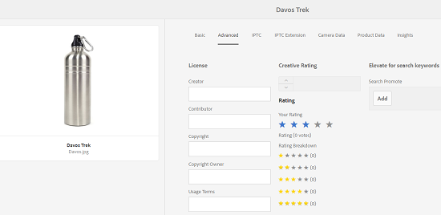
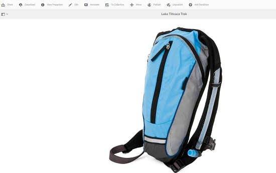
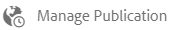
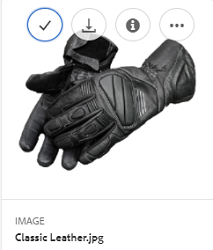
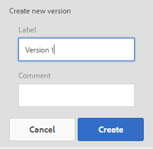

# Hantera era digitala resurser {#managing-assets-with-the-touch-optimized-ui}

Lär dig mer om olika resurshanterings- och redigeringsuppgifter som du kan utföra med det Touchoptimerade användargränssnittet i AEM Assets.

I den här artikeln beskrivs hur du hanterar och redigerar resurser med det Touch-optimerade användargränssnittet för Adobe Experience Manager (AEM) Assets. Mer information om användargränssnittet finns i [Grundläggande hantering av Touch-gränssnittet](/help/sites-authoring/basic-handling.md). Mer information om hur du hanterar innehållsfragment finns i [Hantera resurser för innehållsfragment](content-fragments-managing.md) .

## Skapa mappar {#create-folders}

När du organiserar en samling resurser, till exempel alla `Nature` bilder, kan du skapa mappar som håller ihop dem. Du kan använda mappar för att kategorisera och ordna dina resurser. AEM Resurser kräver inte att du ordnar resurser i mappar för att de ska fungera bättre.

>[!NOTE]
>
>Delning av en resursmapp av den typen `sling:OrderedFolder` stöds inte vid delning till Marketing Cloud. Om du vill dela en mapp ska du inte välja Ordnad när du skapar en mapp.

1. Navigera till den plats i mappen med digitala resurser där du vill skapa en ny mapp.
1. Klicka på **[!UICONTROL Skapa]** på menyn. Välj **[!UICONTROL Ny mapp]**.
1. Ange ett mappnamn i fältet **[!UICONTROL Titel]** . Som standard använder DAM den titel som du angav som mappnamn. När mappen har skapats kan du åsidosätta standardmappen och ange ett annat mappnamn.
1. Klicka på **[!UICONTROL Skapa]**. Mappen visas i mappen med digitala resurser.

Följande (blankstegsavgränsad lista med) tecken stöds inte:

* resursens filnamn får inte innehålla `* / : [ \ \ ] | # % { } ? &`
* resursmappens namn får inte innehålla `* / : [ \ \ ] | # % { } ? \" . ^ ; + & \t`

## Överför resurser {#uploading-assets}

Du kan överföra olika typer av resurser (inklusive bilder, PDF-filer, RAW-filer och så vidare) från den lokala mappen eller en nätverksenhet till AEM Resurser.

>[!NOTE]
>
>I läget Dynamic Media - Scene7 kan du bara överföra resurser vars filstorlek är 2 GB eller mindre.

Du kan välja att överföra resurser till mappar med eller utan en bearbetningsprofil tilldelad dem.

För mappar som har en tilldelad bearbetningsprofil visas profilnamnet på miniatyrbilden i kortvyn. I listvyn visas profilnamnet i kolumnen **[!UICONTROL Bearbeta profil]** . Se [Bearbeta profiler](processing-profiles.md).

Innan du överför en resurs måste du kontrollera att den har ett format som [stöds](assets-formats.md).

**Så här överför du resurser**:

1. Navigera till den plats där du vill lägga till digitala resurser i webbgränssnittet Resurser.
1. Gör något av följande om du vill överföra resurserna:

   * Tryck på ikonen **[!UICONTROL Skapa]** i verktygsfältet. Tryck sedan på **[!UICONTROL Filer]** på menyn. Du kan byta namn på filen i den dialogruta som visas om det behövs.
   * I en webbläsare som stöder HTML5 drar du resurserna direkt i gränssnittet. Dialogrutan för att byta namn på filen visas inte.
   

   Om du vill markera flera filer trycker du på Ctrl/Kommando och väljer resurserna i dialogrutan för filväljaren. Från en iPad kan du bara markera en fil i taget.

   Du kan pausa överföringen av stora resurser (större än 500 MB) och återuppta den senare från samma sida. Tryck på **[!UICONTROL pausikonen]** bredvid förloppsindikatorn som visas när överföringen startar.

   

   Den storlek över vilken en tillgång betraktas som en stor tillgång kan konfigureras. Du kan till exempel konfigurera systemet så att resurser över 1 000 MB (i stället för 500 MB) betraktas som stora resurser. I det här fallet visas knappen **[!UICONTROL Paus]** i förloppsindikatorn när resurser som är större än 1 000 MB överförs.

   Knappen **[!UICONTROL Paus]]**visas inte om en fil som är större än 1 000 MB överförs med en fil som är mindre än 1 000 MB. Om du avbryter filöverföringen på mindre än 1 000 MB visas knappen**[!UICONTROL Paus ]**.

   Om du vill ändra storleksgränsen konfigurerar du `chunkUploadMinFileSize` egenskapen för `fileupload`noden i CRX-databasen.

   När du klickar på **[!UICONTROL pausikonen]** växlar den till en **[!UICONTROL uppspelningsikon]** . Om du vill återuppta överföringen klickar du på **[!UICONTROL uppspelningsikonen]** .

   

   Om du vill avbryta en pågående överföring klickar du på `X` knappen bredvid förloppsindikatorn. När du avbryter överföringen tas den delvis överförda delen av resursen bort.

   Möjligheten att återuppta överföring är särskilt användbar i scenarier med låg bandbredd och nätverksfel, där det tar lång tid att överföra stora resurser. Du kan pausa överföringen och fortsätta senare när situationen förbättras. När du återupptar startar överföringen från den punkt där du pausade den.

   Under överföringen sparar AEM de delar av resursen som överförs som datablock i CRX-databasen. När överföringen är klar konsoliderar AEM dessa segment till ett enda datablock.

   Om du vill konfigurera rensningsaktiviteten för de oavslutade segmentöverföringsjobben går du till `https://[aem_server]:[port]/system/console/configMgr/org.apache.sling.servlets.post.impl.helper.ChunkCleanUpTask`.

   Om du överför en resurs med samma namn som en resurs som redan finns på den plats där du överför resursen visas en varningsdialogruta.

   Du kan välja att ersätta en befintlig resurs, skapa en annan version eller behålla båda genom att byta namn på den nya resursen som överförs. Om du ersätter en befintlig resurs tas metadata för resursen och eventuella tidigare ändringar och historik bort (till exempel anteckningar, beskärningar och så vidare). Om du väljer att behålla båda resurserna får den nya resursen ett nytt namn.

   

   >[!NOTE]
   >
   >När du väljer **[!UICONTROL Ersätt]** i dialogrutan **[!UICONTROL Namnkonflikt]** , genereras resurs-ID om för den nya resursen. Detta ID skiljer sig från ID:t för föregående resurs.
   >
   >Om **[!UICONTROL tillgångsinsikter]** har aktiverats för att spåra visningar/klick med Adobe Analytics, blir detta återskapade resurs-ID ogiltigt för de data som samlats in för resursen med Adobe Analytics.

   Om resursen som du överför finns i AEM Resurser visas en varning i dialogrutan **[!UICONTROL Duplicerar upptäckt]** om att du försöker överföra en dubblettresurs. Dialogrutan visas bara om kontrollsummevärdet SHA 1 för den befintliga resursens binära värde matchar kontrollsummevärdet för den resurs som du överför. I det här fallet är namnen på tillgångarna oväsentliga. Dialogrutan kan med andra ord även visas för resurser som har olika namn om SHA 1-värdena för deras binärfiler är desamma.

   >[!NOTE]
   >
   >Dialogrutan **[!UICONTROL Duplicera upptäckt]** visas bara när funktionen **[!UICONTROL Duplicera identifiering]** är aktiverad. Information om hur du aktiverar funktionen **[!UICONTROL Duplicera identifiering]** finns i [Aktivera dubblettidentifiering](duplicate-detection.md).

   

   Tryck på **[!UICONTROL Behåll]** för att behålla den duplicerade resursen i AEM Resurser. Tryck på **[!UICONTROL Ta bort]** för att ta bort den duplicerade resursen som du överförde.

   AEM Resurser förhindrar att du överför resurser med förbjudna tecken i filnamnen. Om du försöker överföra en resurs som innehåller otillåtna tecken visar AEM Resurser ett varningsmeddelande om att det finns otillåtna tecken i filnamnet och stoppar överföringen tills du tar bort dessa tecken eller överför med ett tillåtet namn.

   I dialogrutan **[!UICONTROL Överför resurser]** kan du ange långa namn för de filer som du överför, så att de passar organisationens specifika namnkonventioner.

   

   Följande (blankstegsavgränsad lista med) tecken stöds emellertid inte:
   * resursens filnamn får inte innehålla `* / : [ \ \ ] | # % { } ? &`
   * resursmappens namn får inte innehålla `* / : [ \ \ ] | # % { } ? \" . ^ ; + & \t`
   I gränssnittet Resurser visas dessutom den senaste resursen som du överför eller den mapp som du skapar först i alla vyer (**[!UICONTROL kortvyn]**, **[!UICONTROL listvyn]** och **[!UICONTROL kolumnvyn]**).

   När du överför stora resurser eller flera resurser samtidigt kan du ofta använda visuella indikatorer för att utvärdera förloppet. I dialogrutan **[!UICONTROL Överföringsförlopp]** visas antalet överförda filer och de filer som inte kunde överföras.

   

   Om du avbryter överföringen innan filerna har överförts slutar AEM Resurser att överföra den aktuella filen och uppdaterar innehållet. Filer som redan har överförts tas dock inte bort.

### Serieuppladdningar {#serial-uploads}

Vid överföring av flera resurser i grupp förbrukas betydande systemresurser, vilket kan påverka prestandan i din AEM-distribution negativt. Möjliga flaskhalsar kan vara din internetanslutning, läs- och skrivåtgärder på disk, webbläsarbegränsningar för antalet POST-begäranden vid samtidig överföring av resurser. En gruppöverföring kan misslyckas eller avslutas i förtid. Med andra ord kan AEM-resurser sakna vissa filer när en grupp filer importeras eller helt och hållet inte kan importera någon fil.

För att komma till rätta med denna situation importerar AEM Assets en resurs i taget (seriell överföring) under en gruppöverföring, i stället för att alla resurser hämtas samtidigt.

Seriell överföring av resurser är aktiverat som standard. Om du vill inaktivera funktionen och tillåta samtidig överföring ska du täcka över `fileupload` noden i CRXDe och ange värdet för `parallelUploads` egenskapen till `true`.

### Överför resurser med FTP {#uploading-assets-using-ftp}

Med Dynamic Media kan du batchöverföra resurser via FTP-servern. Om du tänker överföra stora resurser (>1 GB) eller överföra hela mappar och undermappar bör du använda FTP. Du kan till och med konfigurera FTP-överföring så att den sker regelbundet.

>[!NOTE]
>
>I läget Dynamic Media - Scene7 kan du bara överföra resurser vars filstorlek är 2 GB eller mindre.

>[!NOTE]
>
>Så här överför du resurser via FTP i Dynamic Media - Scene7-läget installerar funktionspaket 18912 på AEM-författaren. Kontakta Adobe Support för att få tillgång till FP-18912 och slutföra konfigurationen av ditt FTP-konto. Se [Installera funktionspaket 18912 för migrering](/help/assets/bulk-ingest-migrate.md)av gruppresurser.
Om du använder FTP för att överföra resurser ignoreras de överföringsinställningar som anges i AEM. I stället används filbearbetningsregler, enligt definition i Dynamic Media Classic,.

**Så här överför du resurser med FTP**

1. Logga in på FTP-servern med det FTP-användarnamn och lösenord som du fick från e-postmeddelandet om etablering. Överför filer eller mappar till FTP-servern i FTP-klienten.
1. [Logga in på Dynamic Media Classic](https://www.adobe.com/marketing-cloud/experience-manager/scene7-login.html) med hjälp av autentiseringsuppgifter från e-postmeddelandet om etablering. Tryck på **[!UICONTROL Överför]** i det globala navigeringsfältet.

1. Tryck på fliken **[!UICONTROL Via FTP]** på sidan **[!UICONTROL Överför]** , i det övre vänstra hörnet.
1. Välj en FTP-mapp att överföra filer från till vänster på sidan. till höger på sidan väljer du en målmapp.
1. I närheten av sidans nedre högra hörn trycker du på **[!UICONTROL Jobbalternativ]** och anger sedan önskade alternativ baserat på resurserna i den mapp du valde.

   Se [Överför jobbalternativ](#upload-job-options).

   >[!NOTE]
   >
   >När du överför resurser via FTP får de alternativ för överföringsjobb som du anger i Dynamic Media Classic (Scene7) företräde framför parametrar för resursbearbetning som angetts i AEM.

1. Tryck på **[!UICONTROL Spara]** i det nedre högra hörnet av dialogrutan **[!UICONTROL Överför jobbalternativ]**.
1. I det nedre högra hörnet på sidan **[!UICONTROL Överför]** trycker du på **[!UICONTROL Skicka överföring]**.

   Om du vill visa överföringsförloppet trycker du på **[!UICONTROL Jobb]** i det globala navigeringsfältet. På sidan **[!UICONTROL Jobb]** visas överföringsförloppet. Du kan när som helst fortsätta arbeta i AEM och gå tillbaka till jobbsidan i Dynamic Media Classic för att granska ett pågående jobb.

   Om du vill avbryta ett pågående överföringsjobb trycker du på **[!UICONTROL Avbryt]** bredvid **[!UICONTROL Varaktighet]** .

#### Alternativ för överföringsjobb {#upload-job-options}

| Överföringsalternativ | Delalternativ | Beskrivning |
|---|---|---|
| Jobbnamn |  | Standardnamnet som är förifyllt i textfältet innehåller den användardefinierade delen av namnet och datum- och tidsstämpeln. Du kan använda standardnamnet eller ange ett namn på ditt eget skapande för det här överföringsjobbet.  Jobbet och andra överförings- och publiceringsjobb registreras på sidan Jobs, där du kan kontrollera jobbens status. |
| Publicera efter överföring |  | Publicerar automatiskt de resurser som du överför. |
| Skriv över i valfri mapp, samma basresursnamn oavsett tillägg |  | Välj det här alternativet om du vill att de filer du överför ska ersätta befintliga filer med samma namn. Namnet på det här alternativet kan vara annorlunda beroende på inställningarna i **[!UICONTROL Programinställningar]** > **[!UICONTROL Allmänna inställningar]** > **[!UICONTROL Överför till program]** > **[!UICONTROL Skriv över bilder]**. |
| Dekomprimera ZIP- eller TAR-filer vid överföring |  |  |
| Jobbalternativ |  | Tryck/klicka på **[!UICONTROL jobbalternativ]** för att öppna dialogrutan [!UICONTROL Överför jobbalternativ] och välj alternativ som påverkar hela överföringsjobbet. De här alternativen är desamma för alla filtyper. Du kan välja standardalternativ för att överföra filer från sidan Allmänna inställningar i programmet. Öppna den här sidan genom att välja **[!UICONTROL Konfigurera]** > **[!UICONTROL Programinställningar]**. Tryck på knappen **[!UICONTROL Standardalternativ]** för överföring för att öppna dialogrutan [!UICONTROL Alternativ] för överföringsjobb. |
|  | När | Välj En gång eller Återkommande. Om du vill ställa in ett återkommande jobb väljer du alternativet Upprepa - varje dag, Varje vecka, Varje månad eller Anpassa - för att ange när du vill att FTP-överföringsjobbet ska återkomma. Ange sedan schemaläggningsalternativen efter behov. |
|  | Inkludera undermappar | Överför alla undermappar i mappen som du vill överföra. Namnen på mappen och dess undermappar som du överför anges automatiskt i AEM Resurser. |
|  | Beskärningsalternativ | Om du vill beskära manuellt från sidorna av en bild väljer du Beskär-menyn och sedan Manuell. Ange sedan antalet pixlar att beskära från en sida eller från varje sida av bilden. Hur mycket av bilden som beskärs beror på bildfilens ppi-inställning (pixlar per tum). Om bilden till exempel visar 150 ppi och du anger 75 i textrutorna Överkant, Höger, Underkant och Vänster beskärs en halv tum från varje sida.  Om du vill beskära pixlar med tomt utrymme automatiskt från en bild öppnar du menyn Beskär, väljer Manuell och anger pixelmått i fälten Överkant, Höger, Underkant och Vänster för att beskära från sidorna. Du kan också välja Trimma på menyn Beskär och välja följande alternativ:  **Trimma bort baserat på** <ul><li>**Färg** - Välj alternativet Färg. Välj sedan menyn Hörn och välj hörnet på bilden med den färg som bäst motsvarar den tomrumsfärg som du vill beskära.</li><li>**Genomskinlighet** - Välj alternativet Genomskinlighet.  **Tolerans** - Dra i skjutreglaget för att ange en tolerans mellan 0 och 1. Om du vill trimma baserat på färg anger du 0 för att beskära pixlar endast om de exakt matchar den färg du valde i hörnet av bilden. Nummer som ligger närmare 1 ger större färgskillnader. Om du vill trimma baserat på genomskinlighet anger du 0 så att pixlarna bara beskärs om de är genomskinliga. Siffror närmare 1 ger större genomskinlighet.</li></ul> Observera att dessa beskärningsalternativ är icke-förstörande. |
|  | Alternativ för färgprofil | Välj en färgkonvertering när du skapar optimerade filer som används för leverans:<ul><li>Standardfärgbevaring: Behåller källbildens färger när bilderna innehåller färgrymdsinformation. det inte finns någon färgkonvertering. Nästan alla bilder idag har rätt färgprofil inbäddad. Om en CMYK-källbild inte innehåller någon inbäddad färgprofil konverteras färgerna till sRGB-färgrymden (standard röd grön). sRGB är den rekommenderade färgrymden för visning av bilder på webbsidor.</li><li>Behåll ursprunglig färgrymd: Bevarar de ursprungliga färgerna utan någon färgkonvertering vid punkten. För bilder utan inbäddad färgprofil görs färgkonverteringen med de standardfärgprofiler som konfigurerats i publiceringsinställningarna. Färgprofilerna kanske inte justeras mot färgen i de filer som skapas med det här alternativet. Därför bör du använda alternativet Standardfärgbevaring.</li><li>Anpassad från > Till  öppnar menyer så att du kan välja färgmodellen Konvertera från och Konvertera till. Det här avancerade alternativet åsidosätter eventuell färginformation som är inbäddad i källfilen. Välj det här alternativet när alla bilder som du skickar in innehåller felaktiga eller saknade färgprofildata.</li></ul> |
|  | Bildredigeringsalternativ | Du kan bevara urklippsmaskerna i bilder och välja en färgprofil.  Se [Ange bildredigeringsalternativ vid överföring](#setting-image-editing-options-at-upload). |
|  | PostScript-alternativ | Du kan rastrera PostScript®-filer, beskära filer, behålla genomskinliga bakgrunder, välja en upplösning och välja en färgrymd.  Se [Ange överföringsalternativ](#setting-postscript-and-illustrator-upload-options)för PostScript och Illustrator. |
|  | Photoshop-alternativ | Du kan skapa mallar från Adobe® Photoshop®-filer, behålla lager, ange hur lager ska namnges, extrahera text och ange hur bilder ska förankras i mallar.  Observera att mallar inte stöds i AEM.  Se [Ange överföringsalternativ](#setting-photoshop-upload-options)för Photoshop. |
|  | PDF-alternativ | Du kan rastrera filerna, extrahera sökord och länkar, automatiskt generera en e-katalog, ange upplösningen och välja en färgrymd.  Observera att e-kataloger inte stöds i AEM.   Se [Ange överföringsalternativ](#setting-pdf-upload-options)för PDF. |
|  | Illustrator-alternativ | Du kan rastrera Adobe Illustrator®-filer, behålla genomskinliga bakgrunder, välja en upplösning och välja en färgrymd.  Se [Ange överföringsalternativ](#setting-postscript-and-illustrator-upload-options)för PostScript och Illustrator. |
|  | EVideoalternativ | Du kan omkoda en videofil genom att välja en videoförinställning.  Se [Ange alternativ](#setting-evideo-upload-options)för eVideo-överföring. |
|  | Förinställningar för gruppuppsättning | Om du vill skapa en bilduppsättning, eller en snurra uppsättning, från de överförda filerna klickar du på kolumnen Aktiv för den förinställning som du vill använda. Du kan markera flera förinställningar. Du skapar förinställningarna på sidan Programinställningar/Gruppinställningar i Dynamic Media Classic.  Mer information om hur du skapar förinställningar för gruppuppsättningar finns i [Konfigurera förinställningar för gruppuppsättningar för att automatiskt generera bilduppsättningar och](config-dms7.md#creating-batch-set-presets-to-auto-generate-image-sets-and-spin-sets) snurruppsättningar.  Se [Ställa in förinställningar för gruppuppsättning vid överföring](#setting-batch-set-presets-at-upload). |

#### Ange bildredigeringsalternativ vid överföring {#setting-image-editing-options-at-upload}

När du överför bildfiler, inklusive AI-, EPS- och PSD-filer, kan du utföra följande redigeringsåtgärder i dialogrutan **[!UICONTROL Överför jobbalternativ]** :

* Beskär tomt utrymme från bildens kant (se beskrivningen i tabellen ovan).
* Beskär manuellt från bildsidorna (se beskrivningen i tabellen ovan).
* Välj en färgprofil (se alternativbeskrivningen i tabellen ovan).
* Skapa en mask från en urklippsbana.
* Öka skärpan i bilder med oskarpa maskningsalternativ
* Blockera bakgrund

| Alternativ | Delalternativ | Beskrivning |
|---|---|---|
| Skapa mask från urklippsbana |  | Skapa en mask för bilden baserat på dess urklippsbaneinformation. Det här alternativet gäller bilder som skapats med bildredigeringsprogram där en urklippsbana har skapats. |
| Oskarp mask |  | Gör att du kan finjustera en skärpefiltereffekt i den slutliga nedsamplade bilden, styra intensiteten i effekten, radien för effekten (mätt i pixlar) och ett kontrasttröskelvärde som ignoreras.  Den här effekten använder samma alternativ som filtret Oskarp mask i Photoshop. Till skillnad från vad namnet antyder är Oskarp mask ett skärpefilter. Under Oskarp mask anger du önskade alternativ. Inställningsalternativen beskrivs i följande: |
|  | Belopp | Styr mängden kontrast som används på kantpixlar.  Tänk på det som intensiteten i effekten. Den största skillnaden mellan mängden oskarp mask i Dynamic Media och mängden värden i Adobe Photoshop är att Photoshop har ett intervall på 1 % till 500 %. I Dynamic Media är värdeintervallet 0,0 till 5,0. Värdet 5.0 motsvarar 500 % i Photoshop. värdet 0,9 motsvarar 90 % och så vidare. |
|  | Radie | Styr radien för effekten. Värdeintervallet är 0-250.  Effekten körs på alla pixlar i en bild och strålar ut från alla pixlar i alla riktningar. Radien mäts i pixlar. Om du till exempel vill få en liknande skärpeeffekt för en bild på 2 000 x 2 000 pixlar och en bild på 500 x 500 pixlar anger du en radie på två pixlar för bilden på 2 000 x 2 000 pixlar och ett radievärde på en pixel för bilden på 500 x 500 pixlar . Ett större värde används för en bild som har fler pixlar. |
|  | Tröskelvärde | Tröskelvärde är ett kontrastintervall som ignoreras när filtret Oskarp mask används. Det är viktigt så att inget &quot;brus&quot; uppstår i en bild när det här filtret används. Värdeintervallet är 0-255, vilket är antalet intensitetssteg i en gråskalebild. 0=svart, 128=50% grått och 255=vitt.  Ett tröskelvärde på 12 ignorerar t.ex. små variationer i hudtonens ljusstyrka för att undvika att lägga till brus, men ändå ger kantkontrast till kontrasterande områden, t.ex. där ögonfransarna möts av hud.  Om du t.ex. har ett foto av någons ansikte kommer Oskarp mask att påverka de kontrasterande delarna av bilden, t.ex. där ögonfransar och hud möts för att skapa ett tydligt kontrastområde, samt den utjämnade huden. Även den jämnaste huden uppvisar subtila förändringar i intensitetsvärden. Om du inte använder ett tröskelvärde framhäver filtret dessa subtila ändringar i hudpixlar. I sin tur skapas en högljudd och oönskad effekt medan kontrasten på ögonfransarna ökar, vilket ökar skärpan.  För att undvika det här problemet introduceras ett tröskelvärde som instruerar filtret att ignorera pixlar som inte förändrar kontrasten dramatiskt, som mjuk hud.  Lägg märke till texturen bredvid dragkedjan i zippargrafiken som visades tidigare. Bildbrus visas eftersom tröskelvärdena var för låga för att undertrycka bruset. |
|  | Monokrom | Markera för att få bildintensiteten oskarp mask (intensitet).  Avmarkera alternativet om du vill skapa en oskarp mask för varje färgkomponent separat. |
| Blockera bakgrund |  | Tar automatiskt bort bakgrunden i en bild när du överför den. Den här tekniken är användbar för att dra uppmärksamheten till ett visst objekt och få det att sticka ut från en rörig bakgrund. Välj om du vill aktivera eller aktivera funktionen Blockera bakgrund och följande underalternativ: |
|  | Hörn | Krävs.  Hörnet på bilden som används för att definiera bakgrundsfärgen som ska blockeras.  Du kan välja mellan **Övre vänster**, **Nedre vänster**, **Övre höger** eller **Nedre höger**. |
|  | Fyllningsmetod | Krävs.  Styr pixelgenomskinlighet från den hörnplats som du anger.  Du kan välja bland följande fyllningsmetoder: <ul><li>**Flood Fill** - gör alla pixlar genomskinliga som matchar det hörn du har angett och som är anslutet till det.</li><li>**Matcha pixlar** - gör alla matchande pixlar genomskinliga, oavsett var de finns i bilden.</li></ul> |
|  | Tolerans | valfritt.  Styr den tillåtna variationen i pixelfärgmatchning baserat på den hörnplats som du anger.  Använd värdet 0,0 om du vill matcha pixelfärgerna exakt, eller använd värdet 1,0 om du vill tillåta den största variationen. |

#### Ange överföringsalternativ för PostScript och Illustrator {#setting-postscript-and-illustrator-upload-options}

När du överför PostScript- (EPS) eller Illustrator-bildfiler (AI) kan du formatera dem på olika sätt. Du kan rastrera filerna, behålla den genomskinliga bakgrunden, välja en upplösning och välja en färgrymd. Alternativ för formatering av PostScript- och Illustrator-filer finns i dialogrutan Alternativ för överföringsjobb under PostScript-alternativ och Illustrator-alternativ.

| Alternativ | Delalternativ | Beskrivning |
|---|---|---|
| Bearbetar |  | Välj **[!UICONTROL Rastrera]** om du vill konvertera vektorgrafik i filen till bitmappsformat. |
| Bevara genomskinlig bakgrund i återgiven bild |  | Bevara filens genomskinlighet i bakgrunden. |
| Upplösning |  | Anger upplösningsinställningen. Den här inställningen avgör hur många pixlar som visas per tum i filen. |
| Färgrymd |  | Välj menyn Färgrymd och välj bland följande alternativ för färgrymd: |
|  | Identifiera automatiskt | Bevarar filens färgrymd. |
|  | Tvinga som RGB | Konverterar till RGB-färgmodellen. |
|  | Tvinga som CMYK | Konverterar till CMYK-färgmodellen. |
|  | Tvinga som gråskala | Konverterar till gråskalefärgrymden. |

#### Ange överföringsalternativ för Photoshop {#setting-photoshop-upload-options}

PSD-filer (Photoshop-dokument) används oftast för att skapa bildmallar. När du överför en PSD-fil kan du skapa en bildmall automatiskt från filen (välj alternativet Skapa mall på skärmen Överför).

Dynamic Media skapar flera bilder från en PSD-fil med lager om du använder filen för att skapa en mall; skapas en bild för varje lager.

Använd alternativen för **[!UICONTROL beskärningsalternativ]** och **[!UICONTROL Färgprofil]** som beskrivs ovan tillsammans med överföringsalternativen för Photoshop.

>[!NOTE]
>
>Mallar stöds inte i AEM.

| Alternativ | Delalternativ | Beskrivning |
|---|---|---|
| Behåll lager |  | Rippar lagren i PSD-filen, om det finns några, till enskilda resurser. Resurslagren förblir kopplade till PSD-filen. Du kan visa dem genom att öppna PSD-filen i detaljvyn och välja lagerpanelen. |
| Skapa mall |  | Skapar en mall från lagren i PSD-filen. |
| Extrahera text |  | Extraherar texten så att användare kan söka efter text i ett visningsprogram. |
| Utöka lager till bakgrundsstorlek |  | Utökar storleken på överlappade bildlager till storleken på bakgrundslagret. |
| Namnge lager |  | Lager i PSD-filen överförs som separata bilder. |
|  | Lagernamn | Namnger bilderna efter deras lagernamn i PSD-filen. Ett lager med namnet Price Tag i den ursprungliga PSD-filen blir till exempel en bild med namnet Price Tag. Om lagernamnen i PSD-filen är standardlagernamn för Photoshop (Bakgrund, Lager 1, Lager 2 och så vidare) får bilderna namn efter sina lagernummer i PSD-filen, inte efter deras standardlagernamn. |
|  | Photoshop och lagernummer | Namnger bilderna efter deras lagernummer i PSD-filen och ignorerar de ursprungliga lagernamnen. Bilder namnges med Photoshops filnamn och ett nummer på lagret som läggs till. Det andra lagret i en fil som heter Spring Ad.psd heter Spring Ad_2 även om det har ett icke-standardnamn i Photoshop. |
|  | Photoshop och lagernamn | Namnger bilderna efter PSD-filen följt av lagernamnet eller lagernumret. Lagernumret används om lagernamnen i PSD-filen är standardlagernamn i Photoshop. Ett lager med namnet Price Tag i en PSD-fil med namnet SpringAd får till exempel namnet Spring Ad_Price Tag. Ett lager med standardnamnet Lager2 kallas Spring Ad_2. |
| Fästpunkt |  | Ange hur bilder ska förankras i mallar som genereras från lagerkompositionen som skapas från PSD-filen. Som standard är ankarpunkten i mitten. Med en central ankarpunkt kan ersättningsbilder bäst fylla samma område, oavsett ersättningsbildens proportioner. Bilder med en annan aspekt som ersätter den här bilden upptar i själva verket samma utrymme när de refererar till mallen och använder parameterersättning. Ändra till en annan inställning om ditt program kräver att ersättningsbilderna fyller ut det tilldelade utrymmet i mallen. |

#### Ange överföringsalternativ för PDF {#setting-pdf-upload-options}

När du överför en PDF-fil kan du formatera den på olika sätt. Du beskär sidorna, extraherar sökord, anger en pixel per tum-upplösning och väljer en färgrymd. PDF-filer innehåller ofta en ytmarginal, skärmärken, passmärken och andra skrivarmärken. Du kan beskära dessa märken från sidorna när du överför en PDF-fil.

>[!NOTE]
>
>eCatalogs stöds inte i AEM.

Välj bland följande alternativ:

| Alternativ | Delalternativ | Beskrivning |
|---|---|---|
| Bearbetar | Rastrera | (Standard) Rippar ned sidorna i PDF-filen och konverterar vektorgrafik till bitmappsbilder. Välj det här alternativet om du vill skapa en e-katalog. |
| Extract | Sök efter ord | Extraherar ord från PDF-filen så att filen kan genomsökas efter nyckelord i en eCatalog Viewer. |
|  | Länkar | Extraherar länkar från PDF-filerna och konverterar dem till bildscheman som används i en eCatalog Viewer. |
| Generera eCatalog automatiskt från PDF med flera sidor |  | Skapar automatiskt en e-katalog från PDF-filen. eCatalog namnges efter den PDF-fil du överförde. (Det här alternativet är bara tillgängligt om du rastrerar PDF-filen när du överför den.) |
| Upplösning |  | Anger upplösningsinställningen. Den här inställningen avgör hur många pixlar som visas per tum i PDF-filen. Standardvärdet är 150. |
| Färgrymd |  | Välj menyn Färgrymd och välj en färgrymd för PDF-filen. De flesta PDF-filer har både RGB- och CMYK-färgbilder. RGB-färgmodellen är att föredra när du vill visa bilden online. |
|  | Identifiera automatiskt | Behåller PDF-filens färgrymd. |
|  | Tvinga som RGB | Konverterar till RGB-färgmodellen. |
|  | Tvinga som CMYK | Konverterar till CMYK-färgmodellen. |
|  | Tvinga som gråskala | Konverterar till gråskalefärgrymden. |

#### Ange överföringsalternativ för eVideo {#setting-evideo-upload-options}

Du kan omkoda en videofil genom att välja bland en mängd olika förinställningar för video.

| Alternativ | Delalternativ | Beskrivning |
|---|---|---|
| Adaptiv video |  | En enda förinställning för kodning som fungerar med alla proportioner för att skapa videor som ska skickas till mobilen, surfplattan och datorn. Överförda källvideor som är kodade med den här förinställningen har en fast höjd. Bredden skalas dock automatiskt så att videons proportioner bevaras.  Det bästa sättet är att använda adaptiv videokodning. |
| Förinställningar för enskild kodning | Sortera kodningsförinställningar | Välj Namn eller Storlek om du vill sortera kodningsförinställningarna under Skrivbord, Mobil och Surfplatta efter namn eller upplösningsstorlek. |
|  | Skrivbord | Skapa en MP4-fil för att leverera en direktuppspelad eller progressiv videoupplevelse till stationära datorer. Välj en eller flera proportioner med önskad upplösningsstorlek och måldatahastighet. |
|  | Mobil | Skapa en MP4-fil för leverans på iPhone- eller Android-mobilenheter. Välj en eller flera proportioner med önskad upplösning och datahastighet. |
|  | Tablet | Skapa en MP4-fil för leverans på iPad- eller Android-surfplattor. Välj en eller flera proportioner med önskad upplösning och datahastighet. |

#### Ange förinställningar för gruppuppsättning vid överföring {#setting-batch-set-presets-at-upload}

Om du automatiskt vill skapa en bilduppsättning eller en snurra uppsättning från överförda bilder klickar du på kolumnen **[!UICONTROL Aktiv** för den förinställning du vill använda. Du kan markera flera förinställningar.

 Mer information om hur du skapar förinställningar för gruppuppsättningar finns i [Konfigurera förinställningar för gruppuppsättningar för att automatiskt generera bilduppsättningar och](config-dms7.md#creating-batch-set-presets-to-auto-generate-image-sets-and-spin-sets) snurruppsättningar.

### Strömmade överföringar {#streamed-uploads}

Om du överför flera resurser ökar I/O-anropen till AEM-servern drastiskt, vilket minskar uppladdningseffektiviteten och till och med kan göra att den tar slut. AEM Assets stöder direktuppspelad överföring av resurser. Direktuppspelad överföring minskar I/O-disken under överföringen genom att undvika att lagra resurser i en tillfällig mapp på servern innan den kopieras till databasen. I stället överförs data direkt till databasen. På så sätt minskas tiden det tar att överföra stora resurser och möjligheten till timeout. Direktuppspelad överföring är aktiverat som standard i AEM Resurser.

Direktuppspelning är inaktiverat för AEM som körs på JEE-server med en servlet-api-version som är lägre än 3.1.

### Extrahera ZIP-arkiv som innehåller resurser {#extract-zip-archive-containing-assets}

Du kan överföra ZIP-arkiv precis som andra resurser som stöds. Samma filnamnsregler gäller för ZIP-filer. Med AEM kan du extrahera ett ZIP-arkiv till en DAM-plats.

Välj ett ZIP-arkiv i taget, klicka på **[!UICONTROL Extrahera arkiv]** och välj en målmapp. Välj ett alternativ för att hantera eventuella konflikter. Om resurserna i ZIP-filen redan finns i målmappen kan du välja något av följande alternativ: hoppa över extrahering, ersätta befintliga filer, behålla båda resurserna genom att byta namn eller skapa en ny version.

När extraheringen är klar meddelar AEM dig i meddelandefältet. Medan AEM extraherar ZIP kan du gå tillbaka till arbetet utan att avbryta extraheringen.

Vissa begränsningar för funktionen är:

* Om det finns en mapp med samma namn på målet extraheras resurserna från ZIP-filen i den befintliga mappen.

* Om du avbryter extraheringen tas de redan extraherade resurserna inte bort.

* Du kan inte markera två ZIP-filer samtidigt och extrahera dem. Du kan bara extrahera ett ZIP-arkiv åt gången.

## Förhandsgranska resurser {#previewing-assets}

Se även [Förhandsgranska dynamiska medieresurser.](previewing-assets.md)

**Så här förhandsgranskar du resurser**:

1. I resursgränssnittet navigerar du till platsen för resursen som du vill förhandsgranska.
1. Tryck på önskad resurs för att öppna den.

1. I förhandsgranskningsläget är zoomalternativ tillgängliga för bildtyper [som](assets-formats.md#supported-raster-image-formats) stöds (med interaktiv redigering).

   Om du vill zooma in på en resurs trycker du på **[!UICONTROL +]** (eller trycker på förstoringsglaset på resursen). Om du vill zooma ut trycker du **[!UICONTROL -]**. När du zoomar in kan du titta närmare på alla delar av bilden genom att panorera. Med **[!UICONTROL pilen Återställ zoom]** återgår du till den ursprungliga vyn.

   

   Tryck på knappen **[!UICONTROL Återställ]** för att återställa vyn till den ursprungliga storleken.

   

## Redigera egenskaper {#editing-properties}

1. Navigera till platsen för resursen vars metadata du vill redigera.

1. Markera resursen och tryck på **[!UICONTROL Egenskaper]** i verktygsfältet för att visa resursegenskaper. Du kan också välja snabbåtgärden **[!UICONTROL Egenskaper]** på resurskortet.

   

1. Redigera metadataegenskaperna under olika flikar på sidan **[!UICONTROL Egenskaper]** . Du kan till exempel redigera titeln, beskrivningen och så vidare på fliken **[!UICONTROL Grundläggande]** .

   Layouten på sidan **[!UICONTROL Egenskaper]** och de metadataegenskaper som är tillgängliga beror på det underliggande metadataschemat. Mer information om hur du ändrar layouten på sidan **[!UICONTROL Egenskaper]** finns i [Metadatamcheman](metadata-schemas.md).

1. Om du vill schemalägga ett visst datum/tid för aktiveringen av tillgången använder du datumväljaren bredvid fältet **[!UICONTROL I tid]** .

   

1. Om du vill inaktivera tillgången efter en viss tid väljer du datum och tid för inaktiveringen i datumväljaren bredvid fältet **[!UICONTROL Av tid]** .

   Inaktiveringsdatumet ska vara senare än aktiveringsdatumet för en tillgång. Efter [!UICONTROL Av-tid]är en resurs och dess återgivningar inte tillgängliga vare sig via webbgränssnittet Resurser eller via HTTP-API:t.

   

1. Markera en eller flera taggar i fältet **[!UICONTROL Taggar]** . Om du vill lägga till en egen tagg skriver du namnet på taggen i rutan och trycker på **[!UICONTROL Retur]**. Den nya taggen sparas i AEM.

   YouTube kräver att taggar ska publiceras och har en länk till YouTube (om en lämplig länk finns).
Om du vill skapa taggar måste du ha skrivbehörighet för `/content/cq:tags/default` i CRX-databasen.

1. Om du vill ge resursen en gradering trycker du på fliken **[!UICONTROL Avancerat]** och sedan på stjärnan vid rätt position för att tilldela den önskade graderingen.

   

   Värderingspoängen som du tilldelar resursen visas under **[!UICONTROL Dina klassificeringar]**. Det genomsnittliga omdöme som resursen fick från användare som värderade resursen visas under **[!UICONTROL Värdering]**. Dessutom visas uppdelningen av de omdömen som bidrar till det genomsnittliga omdömet under **[!UICONTROL Värderingsfördelning]**. Du kan söka efter resurser baserat på genomsnittliga poäng.

1. Om du vill visa användningsstatistik för resursen trycker du på fliken **[!UICONTROL Insikter]** .

   Användningsstatistik omfattar följande:

   * Antal gånger som resursen visats eller hämtats.
   * Kanaler/enheter som resursen användes genom.
   * Kreativa lösningar där resursen nyligen användes.
   Mer information finns i [Resursinsikter](touch-ui-asset-insights.md).

1. Tryck på **[!UICONTROL Spara och stäng]**.
1. Navigera till resursgränssnittet. De redigerade metadataegenskaperna, inklusive titel, beskrivning, omdömen och så vidare, visas på tillgångskortet i kortvyn och under relevanta kolumner i listvyn.

## Kopiera resurser {#copying-assets}

När du kopierar en resurs eller en mapp kopieras hela resursen eller mappen tillsammans med dess innehållsstruktur. En kopierad resurs eller en mapp dupliceras på målplatsen. Resursen på källplatsen ändras inte.

Några attribut som är unika för en viss kopia av en tillgång överförs inte. Några exempel är:

* Tillgångs-ID, datum och tid när de skapades samt versioner och versionshistorik. Vissa av dessa egenskaper indikeras av egenskaperna `jcr:uuid`, `jcr:created`och `cq:name`.

* Skapandetid och refererade sökvägar är unika för varje resurs och för varje återgivning.

Övriga egenskaper och metadatainformation behålls. Ingen del av kopian skapas när en resurs kopieras.

1. Välj en eller flera resurser i resursgränssnittet och tryck sedan på **[!UICONTROL ikonen Kopiera]** i verktygsfältet. Du kan också välja snabbåtgärden **[!UICONTROL Kopiera]** från resurskortet.

   

   >[!NOTE]
   >
   >Om du använder snabbåtgärden **[!UICONTROL Kopiera]** kan du bara kopiera en resurs åt gången.

1. Navigera till den plats där du vill kopiera resurserna.

   >[!NOTE]
   >
   >Om du kopierar en resurs på samma plats, genererar AEM automatiskt en variant av namnet. Om du till exempel kopierar en resurs med namnet Fyrkant, genererar AEM automatiskt titeln för kopian som Fyrkant1.

1. Tryck på ikonen **[!UICONTROL Klistra in]** resurs i verktygsfältet:

   

   Resurserna kopieras till den här platsen.

   >[!NOTE]
   >
   >Ikonen **[!UICONTROL Klistra in]** är tillgänglig i verktygsfältet tills inklistringen är klar.

### Flytta eller byta namn på resurser {#moving-or-renaming-assets}

1. Navigera till platsen för resursen som du vill flytta.

1. Markera resursen och tryck på ikonen **[!UICONTROL Flytta]** i verktygsfältet.

   

1. Gör något av följande i guiden **[!UICONTROL Flytta resurser]** :

   * Ange namnet på resursen när den har flyttats. Tryck sedan på **[!UICONTROL Nästa]** för att fortsätta.
   * Tryck på **[!UICONTROL Avbryt]** för att avbryta processen.
   >[!NOTE]
   >
   >Du kan ange samma namn för resursen om det inte finns någon resurs med det namnet på den nya platsen. Du bör emellertid använda ett annat namn om du flyttar resursen till en plats där det finns en resurs med samma namn. Om du använder samma namn genereras automatiskt en variant av namnet. Om resursen till exempel har namnet Fyrkant, genereras namnet Fyrkant1 för kopian.

   >[!NOTE]
   >
   >Följande (blankstegsavgränsad lista med) tecken stöds inte:
   >* resursens filnamn får inte innehålla `* / : [ \ \ ] | # % { } ? &`
   >* resursmappens namn får inte innehålla `* / : [ \ \ ] | # % { } ? \" . ^ ; + & \t`

1. Gör något av följande på sidan **[!UICONTROL Välj mål]** :

   * Navigera till den nya platsen för resurserna och tryck sedan på **[!UICONTROL Nästa]** för att fortsätta.
   * Tryck på **[!UICONTROL Bakåt]** för att återgå till sidan **[!UICONTROL Byt namn]** .

1. Om de resurser som flyttas har referenssidor, resurser eller samlingar visas fliken **[!UICONTROL Justera referenser]** bredvid fliken **[!UICONTROL Välj mål]** .

   Gör något av följande på sidan **[!UICONTROL Justera referenser]** :

   * Ange vilka referenser som ska justeras baserat på de nya detaljerna och tryck sedan på **[!UICONTROL Flytta]** för att fortsätta.
   * Markera eller avmarkera referenser till resurserna i kolumnen **[!UICONTROL Justera]** .
   * Tryck på **[!UICONTROL Bakåt]** för att gå tillbaka till sidan **[!UICONTROL Välj mål]** .
   * Tryck på **[!UICONTROL Avbryt]** för att avbryta flyttåtgärden.
   Om du inte uppdaterar referenser fortsätter de att peka på resursens tidigare sökväg. Om du justerar referenserna uppdateras de till den nya resurssökvägen.

## Hantera återgivningar {#managing-renditions}

1. Du kan lägga till eller ta bort återgivningar för en resurs, förutom originalet. Navigera till platsen för resursen som du vill lägga till eller ta bort återgivningar för.

1. Tryck på resursen för att öppna sidan för resursen.

   

1. Tryck på ikonen **[!UICONTROL Global navigering]** och välj **[!UICONTROL Återgivningar]** i listan.

   

1. På panelen **[!UICONTROL Återgivningar]** visas en lista över återgivningar som genererats för resursen.

   

   >[!NOTE]
   >
   >Som standard visas inte den ursprungliga återgivningen av resursen i förhandsgranskningsläget i AEM Resurser. Om du är administratör kan du använda övertäckningar för att konfigurera AEM Resurser så att de ursprungliga återgivningarna visas i förhandsgranskningsläget.

1. Välj en återgivning om du vill visa eller ta bort återgivningen.

   **Ta bort en återgivning**

   Välj en återgivning på panelen **[!UICONTROL Återgivningar]** och tryck sedan på ikonen **[!UICONTROL Ta bort återgivning]** i [verktygsfältet](/help/sites-authoring/basic-handling.md).

   

   **Överföra en ny återgivning**

   Navigera till resursinformationssidan för resursen och tryck på ikonen **[!UICONTROL Lägg till återgivning]** i verktygsfältet för att överföra en ny återgivning för resursen.

   

   >[!NOTE]
   >
   >Om du väljer en återgivning på panelen **[!UICONTROL Återgivningar]** ändras sammanhanget i verktygsfältet och endast de åtgärder som är relevanta för återgivningen visas. Alternativ som ikonen **[!UICONTROL Överför återgivning]** visas inte. Om du vill visa de här alternativen i verktygsfältet går du till informationssidan för resursen.

   Du kan konfigurera dimensionerna för den återgivning som du vill ska visas på informationssidan för en bild- eller videoresurs. Baserat på de dimensioner du anger visar AEM Resurser återgivningen med de exakta eller närmaste dimensionerna.

   Om du vill konfigurera återgivningsdimensioner för en bild på resursdetaljnivån ska du täcka över noden **[!UICONTROL återgivningsväljaren]** `libs/dam/gui/content/assets/assetpage/jcr:content/body/content/content/items/assetdetail/items/col1/items/assetview/renditionpicker` och konfigurera värdet för egenskapen width. Konfigurera egenskapsstorleken ( **[!UICONTROL Lång) i KB]** i stället för bredd för att anpassa återgivningen på resursdetaljsidan baserat på bildstorleken. För storleksbaserad anpassning tilldelar egenskapen **[!UICONTROL preferOriginal]** inställningen till originalet om storleken på den matchade återgivningen är större än originalet.

   På samma sätt kan du anpassa **[!UICONTROL anteckningssidans]** bild genom att lägga över `libs/dam/gui/content/assets/annotate/jcr:content/body/content/content/items/content/renditionpicker`.

   

   Om du vill konfigurera återgivningsdimensioner för en videoresurs navigerar du till **[!UICONTROL videoväljarnoden]** i CRX-databasen på platsen `/libs/dam/gui/content/assets/assetpage/jcr:content/body/content/content/items/assetdetail/items/col1/items/assetview/videopicker`, täcker över noden och redigerar sedan lämplig egenskap.

   >[!NOTE]
   >
   >Videoanteckningar stöds bara i webbläsare med HTML5-kompatibla videoformat. Beroende på webbläsaren stöds dessutom olika videoformat.

Mer information om delresurser finns i [Hantera delresurser](managing-linked-subassets.md).

## Ta bort resurser {#deleting-assets}

Om du vill lösa eller ta bort inkommande referenser från andra sidor uppdaterar du de relevanta referenserna innan du tar bort en resurs.

Du kan även inaktivera Tvinga borttagningsknappen med hjälp av en övertäckning, så att användare inte kan ta bort refererade resurser och lämna brutna länkar.

Du måste ha behörighet att ta bort en resurs för att den ska kunna tas bort. Om du bara har ändringsbehörighet kan du bara redigera metadata för resursen och lägga till anteckningar till resursen. Du kan dock inte ta bort resursen eller dess metadata.

**Så här tar du bort resurser**:

1. Navigera till platsen för de resurser som du vill ta bort.

1. Markera resursen och tryck på ikonen **[!UICONTROL Ta bort]** i verktygsfältet.

   

1. Tryck på följande i bekräftelsedialogrutan:

   * **[!UICONTROL Avbryt]** om du vill avbryta åtgärden
   * **[!UICONTROL Ta bort]** för att bekräfta åtgärden baserat på följande:

      * Om resursen inte har några referenser tas resursen bort.
      * Om resursen har referenser visas ett felmeddelande om att det finns referenser till **[!UICONTROL en eller flera resurser]**.  Du kan välja **[!UICONTROL Tvinga borttagning]** eller **[!UICONTROL Avbryt]**.
   >[!NOTE]
   >
   >Om du vill lösa eller ta bort inkommande referenser från andra sidor uppdaterar du de relevanta referenserna innan du tar bort en resurs.
   >
   >Inaktivera även knappen **[!UICONTROL Tvinga borttagning]** med en övertäckning så att användare inte kan ta bort refererade resurser och lämna brutna länkar.

## Hämta resurser {#downloading-assets}

See [Download assets from AEM](download-assets-from-aem.md)

## Publicera resurser {#publishing-assets}

Om du publicerar ett material som bearbetas publiceras bara det ursprungliga innehållet. Återgivningarna saknas. Vänta tills bearbetningen är klar och publicera sedan resursen eller publicera den igen när bearbetningen är klar.

Om mappen som du vill publicera innehåller en tom mapp publiceras inte den tomma mappen.

Mer information om Dynamic Media finns i [Publicera dynamiska medieresurser](publishing-dynamicmedia-assets.md).

**Så här publicerar du resurser**:

1. Navigera till platsen för resurserna/mappen som du vill publicera

1. Välj snabbåtgärden **[!UICONTROL Publicera]** från resurskortet eller markera resursen och tryck på ikonen **[!UICONTROL Snabbpublicering]** i verktygsfältet.
1. Om resursen refererar till andra resurser visas dess referenser i guiden. Endast referenser som antingen är opublicerade eller ändrade sedan de senast publicerades eller inte publicerades visas. Välj de referenser som du vill publicera.

   

1. Tryck på **[!UICONTROL Publicera]** för att bekräfta aktiveringen för resurserna.

## Avpublicera resurser {#unpublishing-assets}

När du avpublicerar en komplex resurs avpublicerar du bara resursen. Undvik att avpublicera referenserna eftersom andra publicerade resurser kan referera till dem.

**Så här avpublicerar du resurser**:

1. Navigera till platsen för resursen eller resursmappen som du vill ta bort från publiceringsmiljön (avpublicera).

1. Markera resursen eller mappen som ska avpubliceras och tryck på ikonen **[!UICONTROL Hantera publikation]** i verktygsfältet.

   

1. Välj åtgärden **[!UICONTROL Avpublicera]** i listan.

   

1. Om du vill avpublicera resursen senare väljer du **[!UICONTROL Avpublicera senare]** och väljer sedan ett datum för att avpublicera resursen.
1. Schemalägg ett datum då resursen inte ska vara tillgänglig från publiceringsmiljön.
1. Om resursen refererar till andra resurser väljer du de referenser du vill avpublicera. Tryck på **[!UICONTROL Avpublicera]**.
1. Gör något av följande i bekräftelsedialogrutan:

   * Tryck på **[!UICONTROL Avbryt]** för att avbryta åtgärden
   * Tryck på **[!UICONTROL Avpublicera]** för att bekräfta att resurserna är opublicerade (inte längre tillgängliga i publiceringsmiljön) vid det angivna datumet.

## Skapa en stängd användargrupp {#closed-user-group}

En CUG (Closed User Group) används för att begränsa åtkomsten till specifika resursmappar som publiceras från AEM. Om du skapar en CUG-fil för en mapp är åtkomsten till mappen (inklusive mappresurser och undermappar) begränsad till endast tilldelade medlemmar eller grupper. För att få åtkomst till mappen måste de logga in med sina inloggningsuppgifter.

CUG är ett extra sätt att begränsa åtkomsten till dina resurser. Du kan också konfigurera en inloggningssida för mappen.

**Så här skapar du en sluten användargrupp**:

1. Välj en mapp i resursgränssnittet och tryck på ikonen **[!UICONTROL Egenskaper]** i verktygsfältet för att visa egenskapssidan.
1. På fliken **[!UICONTROL Behörigheter]** lägger du till medlemmar eller grupper under **[!UICONTROL Stängd användargrupp]**.

   

1. Om du vill visa en inloggningsskärm när användare öppnar mappen väljer du alternativet **[!UICONTROL Aktivera]** . Välj sedan sökvägen till en inloggningssida i AEM och spara ändringarna.

   

   Om du inte anger sökvägen till en inloggningssida visar AEM standardinloggningssidan i publiceringsinstansen.

1. Publicera mappen och försök sedan komma åt den från publiceringsinstansen. En inloggningsskärm visas.
1. Om du är CUG-medlem anger du dina säkerhetsuppgifter. Mappen visas när du har autentiserats av AEM.

## Söka efter material {#searching-assets}

Grundläggande sökning finns i avsnittet [Sök och filtrera](/help/sites-authoring/search.md#search-and-filter) . Använd **[!UICONTROL sökpanelen]** för att söka efter resurser, taggar och metadata. Du kan söka efter delar av en sträng med hjälp av asterisk med jokertecken. Dessutom kan du anpassa **[!UICONTROL sökpanelen]** med [sökfunktioner](search-facets.md).

För nyligen överförda resurser är deras metadata (inklusive titlar, taggar och så vidare) inte direkt tillgängliga i listan med förslag som visas när du skriver i rutan Sök.

Detta beror på att AEM Resurser väntar tills en timeout-period har gått ut (1 timme som standard) innan ett bakgrundsjobb körs för att indexera metadata för alla nyligen överförda/uppdaterade resurser och lägga till dem i listan med förslag.

## Använd snabbåtgärder {#quick-actions}

Snabbåtgärdsikoner är tillgängliga för en enskild resurs i taget. Beroende på vilken enhet du använder utför du följande åtgärder för att visa snabbåtgärdsikonerna:

* Pekskärmar: Peka och håll. På en iPad kan du till exempel trycka och hålla ned en resurs så att snabbåtgärderna visas.
* Ej pekskärmar: Hovringspekare. På en stationär enhet visas t.ex. snabbåtgärdsfältet om du håller pekaren över miniatyrbilden för resursen.

### Navigera till och markera resurser {#navigating-and-selecting-assets}

Du kan visa, navigera genom och välja resurser med någon av de tillgängliga vyerna (kort, kolumn, lista) med hjälp av ikonen **[!UICONTROL Välj]** . **[!UICONTROL Välj]** visas som en snabbåtgärd i kortvyn.

I listvyn visas **[!UICONTROL Välj]** när du håller muspekaren över miniatyrbilden före namnen på resurserna/mappen i listan.

På samma sätt som i listvyn visas **[!UICONTROL Markera]** när du håller muspekaren över miniatyrbilden före namnen på resurserna eller mappen i kolumnvyn.

Mer information finns i [Visa och välja resurser](/help/sites-authoring/basic-handling.md#viewing-and-selecting-resources).

## Redigera bilder {#editing-images}

Med redigeringsverktygen i AEM Resurser-gränssnittet kan du utföra små redigeringsjobb på bildresurser. Du kan beskära, rotera, vända och utföra andra redigeringsjobb på bilder. Du kan också lägga till bildscheman till resurser.

Bildredigering stöds för filer som har följande format:

* BMP
* GIF
* PNG
* JPEG

För vissa komponenter finns det ytterligare alternativ i **[!UICONTROL helskärmsläge]** .

Om du vill redigera en TXT-fil anger du CQ Link Externalizer **[!UICONTROL Day]** i Configuration Manager.

Du kan också lägga till bildscheman med bildredigeraren. Mer information finns i [Lägga till bildscheman](image-maps.md).

**Så här redigerar du bilder**:

1. Gör något av följande om du vill öppna en resurs i redigeringsläge:

   * Markera resursen och klicka sedan på ikonen **[!UICONTROL Redigera]** i verktygsfältet.
   * Tryck på alternativet **[!UICONTROL Redigera]** som visas för en resurs i kortvyn.
   * Tryck på ikonen **[!UICONTROL Redigera]** i verktygsfältet på resurssidan.
   

1. Beskär bilden genom att trycka på **[!UICONTROL Beskär]**.

   

1. Välj önskat alternativ i listan. Beskärningsområdet visas på bilden baserat på det alternativ du väljer. Med alternativet **[!UICONTROL Free Hand]** kan du beskära bilden utan begränsningar för proportioner.

   

1. Markera området som ska beskäras och ändra storlek på det eller flytta det på bilden.
1. Använd alternativet **[!UICONTROL Slutför]** i det övre högra hörnet för att beskära bilden. När du trycker på **[!UICONTROL Slutför]** aktiveras även omgenereringen av återgivningar.

   

1. Använd ikonerna **[!UICONTROL Ångra]** och **[!UICONTROL Gör om]** i det övre högra hörnet om du vill återgå till den beskurna bilden eller behålla den beskurna bilden.

   

1. Tryck på motsvarande **[!UICONTROL roteringsikon]** om du vill rotera bilden medsols eller motsols.

   

1. Tryck på motsvarande **[!UICONTROL Flip]** -ikon för att vända bilden vågrätt eller lodrätt.

   

1. Tryck på ikonen **[!UICONTROL Slutför]** för att spara ändringarna.

   

## Använda tidslinjen {#timeline}

På **[!UICONTROL tidslinjen]** kan du visa olika händelser för ett markerat objekt, t.ex. aktiva arbetsflöden för en resurs, kommentarer, anteckningar, aktivitetsloggar och versioner.

I konsolen Samlingar innehåller listan **[!UICONTROL Visa alla]** alternativ som du bara kan använda för att visa kommentarer och arbetsflöden. Dessutom visas tidslinjen bara för samlingar på den översta nivån som visas i konsolen. Den visas inte om du navigerar i någon av samlingarna.

**[!UICONTROL Tidslinjen]** innehåller flera [alternativ som är specifika för innehållsfragment](content-fragments-managing.md#timeline-for-content-fragments); den här funktionen kräver [AEM 6.4 Service Pack 2 (6.4.2.0)](/help/release-notes/sp-release-notes.md) eller senare.

**Så här använder du tidslinjen**:

1. Öppna resurssidan för en resurs eller markera den i resursgränssnittet.
1. Tryck på ikonen **[!UICONTROL Global navigering]** och välj **Tidslinje]** i listan.

   

1. I listan som visas använder du listan **[!UICONTROL Visa alla]** för att filtrera resultaten baserat på kommentarer, versioner, arbetsflöden och aktiviteter.

   

## Lägg till anteckningar {#annotating}

Anteckningar är kommentarer eller förklarande kommentarer som läggs till i bilder eller videoklipp. Anteckningar ger marknadsförarna möjlighet att samarbeta och lämna feedback om resurser.

Videoanteckningar stöds bara i webbläsare med HTML5-kompatibla videoformat. Videoformat som AEM Assets stöder beror på webbläsaren.

För innehållsfragment skapas [anteckningar i redigeraren](content-fragments-variations.md#annotating-a-content-fragment). den här funktionen kräver [AEM 6.4 Service Pack 2 (6.4.2.0)](/help/release-notes/sp-release-notes.md) eller senare.

Du kan lägga till flera anteckningar innan du sparar dem.

Du kan lägga till anteckningar i videoresurser. När du kommenterar videoklipp pausas spelaren så att du kan anteckna i en bildruta. Mer information finns i [Hantera videomaterial](managing-video-assets.md).

Du kan också lägga till anteckningar i en samling. Men om en samling innehåller underordnade samlingar kan du bara lägga till anteckningar eller kommentarer i den överordnade samlingen. Alternativet **[!UICONTROL Anteckna]** är inte tillgängligt för underordnade samlingar.

**Så här lägger du till anteckningar**:

1. Navigera till platsen för resursen som du vill lägga till anteckningar i.
1. Tryck på **[!UICONTROL anteckningsikonen]** från något av följande:

   * [Snabbåtgärder](managing-assets-touch-ui.md#quick-actions)
   * Från verktygsfältet när du har valt resursen eller navigerat till resurssidan
   

1. Lägg till en kommentar i rutan **[!UICONTROL Kommentar]** längst ned på tidslinjen. Du kan också markera ett område i bilden och lägga till en anteckning i dialogrutan **[!UICONTROL Lägg till anteckning]** .

   

1. Om du vill meddela en användare om en anteckning anger du användarens e-postadress och lägger till kommentaren. Om du till exempel vill meddela Aaron McDonald om en anteckning anger du @aa. Tips för alla matchande användare visas i en lista. Välj Aaron e-postadress i listan för att tagga honom med kommentaren. På samma sätt kan du tagga fler användare var som helst i anteckningen eller före eller efter den.

   >[!NOTE]
   >
   >För användare som inte är administratörer visas endast förslag om användaren har läsbehörighet i CRXDE `/home` .

   

1. När du har lagt till anteckningen trycker du på **[!UICONTROL Lägg till]** för att spara den. Ett meddelande om anteckningen skickas till Aaron.

   

1. Tryck på **[!UICONTROL Stäng]** för att avsluta **[!UICONTROL anteckningsläget]** .
1. Om du vill visa meddelandet loggar du in på AEM Assets med Aaron MacDonalds inloggningsuppgifter och trycker på **[!UICONTROL meddelandeikonen]** för att visa meddelandet.

1. Om du vill välja en annan färg så att du kan skilja mellan användarna trycker du på **[!UICONTROL profilikonen]** och trycker på **[!UICONTROL Mina inställningar]**.

   

1. Ange önskad färg i rutan **[!UICONTROL Anteckningsfärg]** och tryck sedan på **[!UICONTROL Acceptera]**.

   

### Visa sparade anteckningar {#viewing-saved-annotations}

1. Om du vill visa sparade anteckningar för en resurs går du till resursens plats och öppnar resurssidan för resursen.

1. Tryck på ikonen **[!UICONTROL Global navigering]** och tryck på **[!UICONTROL Tidslinje]** i listan.

   

1. I listan **[!UICONTROL Visa alla]** på tidslinjen väljer du **[!UICONTROL Kommentarer]** för att filtrera resultatet baserat på kommentarer.

   

1. Tryck på en kommentar på panelen **[!UICONTROL Tidslinje]** för att visa motsvarande anteckning i bilden.

   

1. Tryck på **[!UICONTROL Ta bort]** för att ta bort en viss kommentar.

### Skriv ut anteckningar {#printing-annotations}

Om en resurs har anteckningar eller har genomgått ett granskningsarbetsflöde kan du skriva ut resursen tillsammans med anteckningar och granskningsstatus som en PDF-fil för offlinegranskning.

Du kan också välja att bara skriva ut anteckningarna eller granskningsstatusen.

Långa anteckningar kanske inte återges korrekt i PDF-filen. För optimal återgivning rekommenderar Adobe att du begränsar anteckningarna till 50 ord.

Om du vill skriva ut anteckningarna och granskningsstatusen trycker du på ikonen **[!UICONTROL Skriv ut]** och följer instruktionerna i guiden. Ikonen **[!UICONTROL Skriv ut]** visas bara i verktygsfältet när resursen har minst en antecknings- eller granskningsstatus tilldelad.

1. Öppna förhandsgranskningssidan för en resurs i resursgränssnittet.
1. Gör något av följande:

   * Om du vill skriva ut alla anteckningar och granskningsstatus går du till steg 4.
   * Om du vill skriva ut särskilda anteckningar och granskningsstatus öppnar du [tidslinjen](managing-assets-touch-ui.md#timeline) och fortsätter sedan till steg 3.

1. Om du vill skriva ut särskilda anteckningar markerar du anteckningarna på **[!UICONTROL tidslinjen]**.

   

   Om du bara vill skriva ut granskningsstatusen markerar du den på **[!UICONTROL tidslinjen]**.

   

1. Tryck på ikonen **[!UICONTROL Skriv ut]** i verktygsfältet.

   

1. I dialogrutan **[!UICONTROL Skriv ut]** väljer du den position du vill att anteckningarna eller granskningsstatusen ska visas i PDF-filen. Om du till exempel vill att anteckningarna eller statusen ska skrivas ut längst upp till höger på sidan som innehåller den utskrivna bilden använder du inställningen **[!UICONTROL Överst till vänster]** (standard).

   

   Du kan välja andra inställningar beroende på var du vill att anteckningarna eller statusen ska visas i den utskrivna PDF-filen. Om du vill att anteckningarna eller statusen ska visas på en sida som är skild från den utskrivna resursen väljer du **[!UICONTROL Nästa sida]**.

1. Tryck på **[!UICONTROL Skriv ut]**. Beroende på vilket alternativ du väljer i steg 2, visar den genererade PDF-filen anteckningarna eller statusen på den angivna positionen. Om du t.ex. väljer att skriva ut både anteckningar och granskningsstatus med inställningen **[!UICONTROL Överst till vänster]** , liknar de genererade utdata PDF-filen som återges här.

   

1. Hämta eller skriv ut PDF-filen med alternativen längst upp till höger.

   

   >[!NOTE]
   >
   >Om resursen har delresurser kan du skriva ut alla delresurser tillsammans med deras specifika sidvisa anteckningar.

   Om du vill ändra utseendet på den återgivna PDF-filen, t.ex. teckensnittsfärg, storlek och format, bakgrundsfärg för kommentarer och statusvärden, öppnar du PDF-konfigurationen **[!UICONTROL för]** anteckning från **[!UICONTROL Configuration Manager]** och ändrar önskade alternativ. Om du till exempel vill ändra visningsfärgen för den godkända statusen ändrar du färgkoden i motsvarande fält. Mer information om hur du ändrar teckenfärg i anteckningar finns i [Anteckningar](managing-assets-touch-ui.md#annotating).

   

   Återgå till den återgivna PDF-filen och uppdatera den. Den uppdaterade PDF-filen återspeglar de ändringar du har gjort.

**Så här skriver du ut anteckningar på främmande språk**:Om en resurs innehåller anteckningar på främmande språk (särskilt icke-latinska språk) måste du först konfigurera tjänsten CQ-DAM-Handler-Gibson Font Manager på AEM-servern så att den kan skriva ut anteckningarna. När du konfigurerar Font Manager-tjänsten CQ-DAM-Handler-Gibson anger du sökvägen till teckensnitten för de önskade språken.

1. Öppna konfigurationssidan för **[!UICONTROL CQ-DAM-Handler-Gibson Font Manager Service]** från URL: [https://&lt;server>:&lt;port>/system/console/configMgr/com.day.cq.dam.handler.gibson.fontmanager.impl.FontManagerServiceImpl](http://localhost:4502/system/console/configMgr/com.day.cq.dam.handler.gibson.fontmanager.impl.FontManagerServiceImpl).
1. Så här konfigurerar du **[!UICONTROL CQ-DAM-Handler-Gibson Font Manager-tjänsten]**:

   * Ange den fullständiga sökvägen till teckensnittskatalogen på datorn i **[!UICONTROL System Fonts]** -katalogen. Om du till exempel är Mac-användare kan du ange sökvägen som `/Library/Fonts` i **[!UICONTROL katalogalternativet Systemteckensnitt]** . AEM hämtar teckensnitten från den här katalogen.
   * Skapa en katalog med namnet **fonts** i mappen **[!UICONTROL crx-quickstart]** . **[!UICONTROL Font Manager-tjänsten]** CQ-DAM-Handler-Gibson hämtar teckensnitten automatiskt på platsen `crx-quickstart/fonts`. Du kan åsidosätta den här standardsökvägen inifrån **[!UICONTROL katalogalternativet Adobe Server Fonts]** .
   * Skapa en ny mapp för teckensnitt i datorn och lagra önskade teckensnitt i mappen. Ange sedan den fullständiga sökvägen till den mappen i **[!UICONTROL katalogalternativet Kundteckensnitt]** .

1. Öppna PDF-konfigurationen för **[!UICONTROL anteckningen]** från URL:en [https://&lt;server>:&lt;port>/system/console/configMgr/com.day.cq.dam.core.impl.annotation.pdf.AnnotationPdfConfig](http://localhost:4502/system/console/configMgr/com.day.cq.dam.core.impl.annotation.pdf.AnnotationPdfConfig).
1. Konfigurera **[!UICONTROL antecknings-PDF]** med rätt uppsättning av teckensnittsfamilj enligt följande:

   * Inkludera strängen `<font_family_name_of_custom_font, sans-serif>` i alternativet för teckensnittsfamilj. Om du till exempel vill skriva ut anteckningar i CJK (kinesiska, japanska och koreanska), inkluderar du strängen `Arial Unicode MS, Noto Sans, Noto Sans CJK JP, sans-serif` i alternativet för teckensnittsfamilj. Om du vill skriva ut anteckningar på hindi hämtar du lämpligt teckensnitt och konfigurerar teckensnittsfamiljen som Arial Unicode MS, Noto Sans, Noto Sans CJK JP, Noto Sans Devanagari, sans-serif.

1. Starta om AEM-instansen.

Följande är ett exempel på hur du konfigurerar AEM för att skriva ut anteckningar i CJK (kinesiska, japanska och koreanska):

1. Hämta Google Noto CJK-teckensnitt från följande länkar och lagra dem i den teckensnittskatalog som konfigurerats i teckensnittshanterartjänsten.

   * Allt i ett Super CJK-teckensnitt: [https://www.google.com/get/noto/help/cjk/](https://www.google.com/get/noto/help/cjk/)
   * Noto Sans (för europeiska språk): [https://www.google.com/get/noto/](https://www.google.com/get/noto/)
   * Teckensnitt för valfritt språk: [https://www.google.com/get/noto/](https://www.google.com/get/noto/)

1. Konfigurera PDF-filen med anteckningen genom att ange parametern font-family till `Arial Unicode MS, Noto Sans, Noto Sans CJK JP, sans-serif`. Den här konfigurationen är tillgänglig som standard och fungerar för alla europeiska språk och CJK-språk.
1. Om det språk du väljer skiljer sig från de språk som nämns i steg 2 lägger du till en lämplig (kommaavgränsad) post i standardteckensnittsfamiljen.

## Skapa resursversionshantering {#asset-versioning}

Versionshantering skapar en ögonblicksbild av digitala resurser vid en viss tidpunkt. Versionshantering hjälper till att återställa resurser till ett tidigare läge vid ett senare tillfälle. Om du till exempel vill ångra en ändring som du har gjort i en resurs återställer du den oredigerade versionen av resursen.

Här följer exempel där du skapar versioner:

* Du ändrar en bild i ett annat program och överför den till AEM Resurser. En version av bilden skapas så att originalbilden inte skrivs över.
* Du redigerar metadata för en resurs.
* Du använder AEM-datorprogrammet för att checka ut en befintlig resurs och spara ändringarna. En ny version skapas varje gång resursen sparas.

Du kan även aktivera automatisk versionshantering via ett arbetsflöde. När du skapar en version för en resurs sparas metadata och återgivningar tillsammans med versionen. Återgivningar är renderingsalternativ för samma bilder, till exempel en PNG-återgivning av en överförd JPEG-fil.

Versionsfunktionen gör följande:

* Skapa en version av en resurs.
* Visa aktuell revision för en tillgång.
* Återställ resursen till en tidigare version.

**Så här skapar du resursversionshantering**:

1. Navigera till platsen för resursen som du vill skapa en version för och öppna resursens sida genom att trycka på den.

1. Tryck på ikonen **[!UICONTROL Global navigering]** och välj **[!UICONTROL Tidslinje]** på menyn.

   

1. Tryck på ikonen **[!UICONTROL Åtgärder]** (pil) längst ned för att visa tillgängliga åtgärder som du kan utföra på resursen.

   

1. Tryck på **[!UICONTROL Spara som version]** för att skapa en version för resursen.

   

1. Lägg till en etikett och kommentar och tryck sedan på **[!UICONTROL Skapa]** för att skapa en version. Du kan också trycka på **[!UICONTROL Avbryt]** för att avsluta åtgärden.

   

1. Om du vill visa den nya versionen öppnar du listan **[!UICONTROL Visa alla]** på tidslinjen från sidan med tillgångsinformation eller gränssnittet Resurser och väljer **[!UICONTROL Versioner]**.

   

1. Välj en specifik version för resursen om du vill förhandsgranska den eller aktivera den för visning i resursgränssnittet.

   

   >[!NOTE]
   >
   >Du kan också välja resursen i [listvyn](/help/sites-authoring/basic-handling.md#viewing-and-selecting-resources) eller i [kolumnvyn](/help/sites-authoring/basic-handling.md#viewing-and-selecting-resources).

1. Lägg till en etikett och kommentar för versionen som ska återställas till den aktuella versionen i resursgränssnittet.

   

1. Om du vill generera en förhandsgranskning för versionen trycker du på **[!UICONTROL Förhandsgranska version]**.
1. Om du vill visa den här versionen i resursgränssnittet väljer du **[!UICONTROL Återställ till den här versionen]**.
1. Om du vill jämföra två versioner går du till resursens resurssida och trycker på den version du vill jämföra med den aktuella versionen.

   

1. Välj den version du vill jämföra på tidslinjen och dra reglaget åt vänster för att lägga den här versionen ovanpå den aktuella versionen och jämföra.

   

### Starta ett arbetsflöde för en resurs {#starting-a-workflow-on-an-asset}

1. Navigera till platsen för resursen som du vill starta ett arbetsflöde för och tryck på resursen för att öppna resurssidan.
1. Tryck på ikonen **[!UICONTROL Global navigering]** och välj **[!UICONTROL Tidslinje]** på menyn för att visa tidslinjen.

   

1. Tryck på ikonen **[!UICONTROL Åtgärder]** (pil) längst ned för att öppna listan med tillgängliga åtgärder för resursen.

   

1. Tryck på **[!UICONTROL Starta arbetsflöde]** i listan.

   

1. Välj en arbetsflödesmodell i listan i dialogrutan **[!UICONTROL Starta arbetsflöde]** .

   

1. (Valfritt) Ange en rubrik för arbetsflödet som kan användas som referens för arbetsflödesinstansen.

   

1. Tryck på **[!UICONTROL Start]** och sedan på **[!UICONTROL Fortsätt]** i dialogrutan för att bekräfta. Varje steg i arbetsflödet visas på tidslinjen som en händelse.

   

## Om samlingar {#collections}

En samling är en ordnad uppsättning med resurser. Använd samlingar för att dela resurser mellan användare.

* En samling kan innehålla resurser från olika platser eftersom de bara innehåller referenser till dessa resurser. Varje samling bevarar materialens referensintegritet.
* Du kan dela samlingar med flera användare med olika behörighetsnivåer, inklusive redigering, visning och så vidare.

En användare kan ha tillgång till flera samlingar. Samlingar är av följande typer, baserat på det sätt som de samlar resurser på:

* En samling med en **statisk referenslista** med resurser, mappar och andra samlingar.

* En samling som använder ett **sökvillkor** och fyller i resurser dynamiskt baserat på villkoret. Detta kallas en **smart samling**.

Mer information om samlingshantering finns i [Hantera samlingar](managing-collections-touch-ui.md) .

>[!NOTE]
>
>Du måste ha rätt åtkomsträttigheter för ditt konto för att kunna skapa eller redigera resurser.
