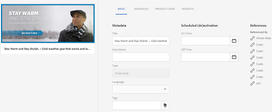

# Hantera sammansatta resurser med delresurser {#managing-compound-assets}

Adobe Experience Manager Assets kan identifiera om en överförd fil innehåller referenser till resurser som redan finns i databasen. Den här funktionen är endast tillgänglig för filformat som stöds. Om den överförda resursen innehåller referenser till [!DNL Experience Manager]-resurser skapas en dubbelriktad länk mellan de överförda och refererade resurserna.

Förutom att eliminera redundans förbättrar referensen till [!DNL Experience Manager]-resurser i Adobe Creative Cloud-program samarbetet och ökar användarnas effektivitet och produktivitet.

[!DNL Experience Manager] Resurser har stöd för  **dubbelriktade referenser**. Du kan hitta refererade resurser på sidan med tillgångsinformation i den överförda filen. Dessutom kan du visa de refererande filerna för [!DNL Experience Manager]-resurser på sidan med resursinformation för den refererade resursen.

Referenser tolkas utifrån sökväg, dokument-ID och instans-ID för de refererade resurserna.

## Adobe Illustrator: Lägga till resurser som referenser {#refai}

Du kan referera till befintliga [!DNL Experience Manager]-resurser inifrån en Adobe Illustrator-fil.

1. Använd [[!DNL Experience Manager] skrivbordsappen](https://helpx.adobe.com/experience-manager/desktop-app/aem-desktop-app.html) och montera [!DNL Experience Manager] resurskatalogen som en enhet på den lokala datorn. Navigera till platsen för resursen som du vill referera till i den monterade enheten.
1. Dra resursen från den monterade enheten till Illustrator-filen.
1. Spara Illustrator-filen på den monterade enheten eller [överför](managing-assets-touch-ui.md#uploading-assets) till [!DNL Experience Manager]-databasen.
1. När arbetsflödet är klart går du till sidan med resursinformation för resursen. Referenserna till befintliga [!DNL Experience Manager]-resurser visas under **[!UICONTROL Dependencies]** i kolumnen **[!UICONTROL References]**.

   

1. De refererade resurserna som visas under **[!UICONTROL Dependencies]** kan också refereras av andra filer än den aktuella. Om du vill visa en lista med refererande filer för en resurs klickar du på resursen i **[!UICONTROL Dependencies]**.

   

1. Klicka på ikonen **[!UICONTROL View Properties]** i verktygsfältet. På egenskapssidan visas listan med filer som refererar till den aktuella resursen under kolumnen **[!UICONTROL References]** på fliken **[!UICONTROL Basic]**.

   

## Adobe InDesign: Lägga till resurser som referenser {#add-aem-assets-as-references-in-adobe-indesign}

Om du vill referera till [!DNL Experience Manager]-resurser från en InDesign-fil drar du [!DNL Experience Manager]-resurser till InDesign-filen eller exporterar InDesign-filen som en ZIP-fil.

Refererade resurser finns redan i [!DNL Experience Manager] Resurser. Du kan extrahera delresurser genom att [konfigurera InDesign server](indesign.md). Inbäddade resurser i en InDesign-fil extraheras som delresurser.

>[!NOTE]
>
>Om InDesign-servern är proxibel bäddas förhandsvisningen in i InDesign-filernas XMP metadata. I det här fallet krävs inte extrahering av miniatyrer uttryckligen. Om InDesign-servern inte är proxyserver måste miniatyrbilder extraheras explicit för InDesign-filer.

När en INDD-fil överförs hämtas referenserna genom att resurser med egenskapen `xmpMM:InstanceID` och `xmpMM:DocumentID` hämtas i databasen.

### Skapa referenser genom att dra resurser {#create-references-by-dragging-aem-assets}

Den här proceduren liknar [Lägg till resurser som referenser i Adobe Illustrator](#refai).

### Skapa referenser till resurser genom att exportera en ZIP-fil {#create-references-to-aem-assets-by-exporting-a-zip-file}

1. Utför stegen i [Skapa arbetsflödesmodeller](/help/sites-developing/workflows-models.md) för att skapa ett nytt arbetsflöde.
1. Använd [paketeringsfunktionen i Adobe InDesign](https://helpx.adobe.com/indesign/how-to/indesign-package-files-for-handoff.html) för att exportera dokumentet. Adobe InDesign kan exportera ett dokument och de länkade resurserna som ett paket. I det här fallet innehåller den exporterade mappen en `Links`-mapp som innehåller underresurser i InDesign-filen. Mappen `Links` finns i samma mapp som INDD-filen.
1. Skapa en ZIP-fil och överför den till [!DNL Experience Manager]-databasen.
1. Starta arbetsflödet för Unarchiver.
1. När arbetsflödet är klart refereras referenserna i mappen Länkar automatiskt till underresurser. Om du vill visa en lista över refererade resurser går du till sidan med tillgångsinformation för resursen i InDesign och stänger [Rail](/help/sites-authoring/basic-handling.md#rail-selector).

## Adobe Photoshop: Lägga till resurser som referenser {#refps}

1. Använd en WebDav-klient och montera [!DNL Experience Manager]-resurser som en enhet.
1. Om du vill skapa referenser till [!DNL Experience Manager]-resurser i en Photoshop-fil navigerar du till motsvarande resurser på den monterade enheten med hjälp av funktionen Montera länkad i Photoshop.

   

1. Spara i Photoshop-fil till den monterade enheten eller [överför](managing-assets-touch-ui.md#uploading-assets) till [!DNL Experience Manager]-databasen.
1. När arbetsflödet är klart visas referenserna till befintliga [!DNL Experience Manager]-resurser på sidan med resursinformation.

   Om du vill visa de refererade resurserna stänger du [Rail](/help/sites-authoring/basic-handling.md#rail-selector) på sidan med resursinformation.

1. De refererade resurserna innehåller även en lista med resurser som de refereras till från. Om du vill visa en lista med refererade resurser går du till sidan med tillgångsinformation och stänger [listen](/help/sites-authoring/basic-handling.md#rail-selector).

>[!NOTE]
>
>Resurserna i sammansatta resurser kan också refereras baserat på deras dokument-ID och instans-ID. Den här funktionaliteten finns endast i Adobe Illustrator- och Adobe Photoshop-versionerna. För andra görs en referens på grundval av den relativa sökvägen för länkade tillgångar i den huvudsakliga sammansatta tillgången, som i tidigare versioner av AEM.

## Skapa delresurser {#generate-subassets}

För resurser som stöds i flersidiga format - PDF-filer, AI-filer, Microsoft PowerPoint- och Apple Keynote-filer samt Adobe InDesign-filer - kan [!DNL Experience Manager] generera delresurser som motsvarar varje enskild sida i den ursprungliga resursen. Dessa underresurser är länkade till *överordnad* resurs och underlättar flersidesvisning. I alla andra syften behandlas deltillgångarna som normala tillgångar i AEM.

Generering av delresurser är inaktiverat som standard. Så här aktiverar du generering av delresurser:

1. Logga in i Experience Manager som administratör. Öppna **[!UICONTROL Tools > Workflow > Models]**.
1. Välj **[!UICONTROL DAM Update Asset]**-arbetsflöde och klicka på **[!UICONTROL Edit]**.
1. Klicka på **[!UICONTROL Toggle Side Panel]** och leta upp steget **[!UICONTROL Create Sub Asset]**. Lägg till steget i arbetsflödet. Klicka på **[!UICONTROL Sync]**.

Gör något av följande om du vill generera delresurserna:

* Nya resurser: Arbetsflödet [!UICONTROL DAM Update Assets] körs på alla nya resurser som har överförts till AEM. Delresurser genereras automatiskt för nya flersidiga resurser.
* Befintliga flersidiga resurser: Kör arbetsflödet [!UICONTROL DAM Update Assets] manuellt enligt något av stegen:

   * Markera en resurs och klicka på [!UICONTROL Timeline] för att öppna den vänstra panelen. Du kan även använda kortkommandot `alt + 3`. Klicka på [!UICONTROL Start Workflow], välj [!UICONTROL DAM Update Asset], klicka på [!UICONTROL Start] och klicka på [!UICONTROL Proceed].
   * Markera en resurs och klicka på [!UICONTROL Create > Workflow] i verktygsfältet. Välj [!UICONTROL DAM Update Asset]-arbetsflöde i popup-dialogrutan, klicka på [!UICONTROL Start] och klicka på [!UICONTROL Proceed].

Kör arbetsflödet **[!UICONTROL DAM Parse Word Documents]** för Microsoft Word-dokument. Den genererar en `cq:Page`-komponent från innehållet i Microsoft Word-dokumentet. De bilder som extraheras från dokumentet refereras från `cq:Page`-komponenten. Dessa bilder extraheras även om generering av delresurser är inaktiverat.

## Visa delresurser {#viewing-subassets}

Delresurserna visas bara om delresurserna genereras och är tillgängliga för den valda flersidiga resursen. Om du vill visa de genererade delresurserna öppnar du flersidesresursen. Klicka på  i det övre vänstra området på sidan och klicka på **[!UICONTROL Subassets]** i listan. När du väljer **[!UICONTROL Subassets]** i listan. Du kan även använda kortkommandot `alt + 5`.

## Visa sidor i en flersidig fil {#view-pages-of-a-multi-page-file}

Du kan visa en flersidig fil, till exempel PDF-, INDD-, PPT-, PPTX- och AI-filer, med hjälp av funktionen för sidvisningsprogram i [!DNL Experience Manager]-resurser. Öppna en flersidig resurs och klicka på **[!UICONTROL View Pages]** i det övre vänstra hörnet på sidan. Sidvisningsprogrammet som öppnas visar sidorna för resursen och kontrollerna för att bläddra igenom och zooma varje sida.

För InDesign kan du extrahera sidor med hjälp av InDesign-servern. Om förhandsgranskningarna av sidorna sparas när du skapar InDesign-filer behövs inte InDesign Server för sidextraheringen.

Följande alternativ är tillgängliga i verktygsfältet, i den vänstra listen och i kontrollerna i sidvisningsprogrammet:

* **[!UICONTROL Desktop Actions]** för att öppna eller visa en viss underresurs med  [!DNL Experience Manager] skrivbordsappen. Se hur du [konfigurerar skrivbordsåtgärder](https://experienceleague.adobe.com/docs/experience-manager-desktop-app/using/using.html#desktopactions-v2) om du använder [!DNL Experience Manager]-datorprogrammet.

* **[!UICONTROL Properties]** öppnar  [!UICONTROL Properties] sidan för den specifika underresursen.

* **[!UICONTROL Annotate]** kan du göra anteckningar i den specifika underresursen. De anteckningar du använder på separata underresurser samlas in och visas tillsammans när den överordnade resursen öppnas för visning.

* **[!UICONTROL Page Overview]** visar alla delresurser samtidigt.

* **[!UICONTROL Timeline]** alternativet från den vänstra listen när du klickat på ikoner för   räl visas filens aktivitetsström.

## God praxis och begränsning {#best-practice-limitation-tips}

* Generering av delresurser kan vara mycket resurskrävande för alla Experience Manager-distributioner. Om du genererar delresurser när komplexa resurser överförs lägger du till steget i arbetsflödet DAM-uppdatering av resurser. Om du genererar delresurser on demand skapar du ett separat arbetsflöde för att generera delresurser. Med ett dedikerat arbetsflöde kan du hoppa över de andra stegen i arbetsflödet för DAM-uppdatering av resurser och spara beräkningsresurser.

>[!MORELIKETHIS]
>
>* [Använd Adobe Experience Manager datorprogram](https://experienceleague.adobe.com/docs/experience-manager-desktop-app/using/using.html)

