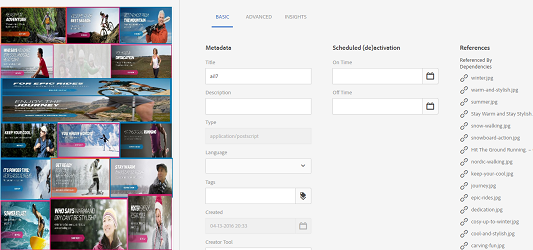

# Hantera sammansatta resurser med delresurser {#managing-compound-assets}

Adobe Experience Manager (AEM) Resurser kan identifiera om en överförd fil innehåller referenser till resurser som redan finns i databasen. Den här funktionen är endast tillgänglig för filformat som stöds. Om den överförda resursen innehåller referenser till AEM resurser skapas en dubbelriktad länk mellan den överförda och refererade resursen.

Förutom att eliminera redundans förbättrar referensen AEM resurser i Adobe Creative Cloud-program samarbetet och ökar användarnas effektivitet och produktivitet.

AEM Assets har stöd för **dubbelriktade referenser**. Du kan hitta refererade resurser på sidan med tillgångsinformation i den överförda filen. Dessutom kan du visa de refererande filerna för AEM resurser på sidan med resursinformation för den refererade resursen.

Referenser tolkas utifrån sökväg, dokument-ID och instans-ID för de refererade resurserna.

## Lägg till AEM Assets som referenser i Adobe Illustrator {#refai}

Du kan referera till befintliga AEM från en Adobe Illustrator-fil.

1. Använd [AEM datorprogram](https://helpx.adobe.com/experience-manager/desktop-app/aem-desktop-app.html)för att montera AEM Assets-databasen som en enhet på den lokala datorn. Navigera till platsen för resursen som du vill referera till i den monterade enheten.
1. Dra resursen från den monterade enheten till Illustrator-filen.
1. Spara Illustrator-filen på den monterade enheten eller [överför](managing-assets-touch-ui.md#uploading-assets) den till AEM.
1. När arbetsflödet är klart går du till sidan med tillgångsinformation för resursen. Referenserna till befintliga AEM resurser visas under **[!UICONTROL Dependencies]** i **[!UICONTROL References]** kolumnen.

   

1. De refererade resurserna som visas under **[!UICONTROL Dependencies]** kan också refereras till av andra filer än den aktuella. Om du vill visa en lista med refererande filer för en resurs klickar du på resursen i **[!UICONTROL Dependencies]** listan under.

   

1. Click the **[!UICONTROL View Properties]** icon from the toolbar. På egenskapssidan visas listan med filer som refererar till den aktuella resursen under **[!UICONTROL References]** kolumnen på **[!UICONTROL Basic]** fliken.

   

## Lägga till AEM som referenser i Adobe InDesign {#add-aem-assets-as-references-in-adobe-indesign}

Om du vill referera AEM resurser från en InDesign-fil drar du AEM resurser till InDesign-filen eller exporterar InDesign-filen som en ZIP-fil.

Referensresurser finns redan i AEM Assets. Du kan extrahera delresurser genom att [konfigurera InDesign-servern](indesign.md). Inbäddade resurser i en InDesign-fil extraheras som delresurser.

>[!NOTE]
>
>Om InDesign-servern är proxibel bäddas förhandsvisningen in i InDesign-filernas XMP metadata. I det här fallet krävs inte extrahering av miniatyrer uttryckligen. Om InDesign-servern inte är proxyserver måste miniatyrbilder extraheras explicit för InDesign-filer.

### Skapa referenser genom att dra AEM resurser {#create-references-by-dragging-aem-assets}

Den här proceduren liknar [Lägga till AEM resurser som referenser i Adobe Illustrator](#refai).

### Skapa referenser till AEM resurser genom att exportera en ZIP-fil {#create-references-to-aem-assets-by-exporting-a-zip-file}

1. Utför stegen i [Skapa arbetsflödesmodeller](/help/sites-developing/workflows-models.md) för att skapa ett nytt arbetsflöde.
1. Använd paketeringsfunktionen i Adobe InDesign för att exportera dokumentet.
Adobe InDesign kan exportera ett dokument och de länkade resurserna som ett paket. I det här fallet innehåller den exporterade mappen en länkmapp som innehåller underresurser i InDesign-filen.
1. Skapa en ZIP-fil och överför den till AEM.
1. Starta arbetsflödet för Unarchiver.
1. När arbetsflödet är klart refereras referenserna i mappen Länkar automatiskt till underresurser. Om du vill visa en lista över refererade resurser går du till sidan med tillgångsinformation för InDesign-resursen och stänger [Rail](/help/sites-authoring/basic-handling.md#rail-selector).

## Lägga till AEM som referenser i Adobe Photoshop {#refps}

1. Montera AEM Assets som en enhet med en WebDav-klient.
1. Om du vill skapa referenser till AEM resurser i en Photoshop-fil navigerar du till motsvarande resurser på den monterade enheten med hjälp av funktionen Montera länkad i Photoshop.

   

1. Spara som Photoshop-fil på den monterade enheten eller [överför](managing-assets-touch-ui.md#uploading-assets) till AEM.
1. När arbetsflödet är klart visas referenserna till befintliga AEM resurser på sidan med tillgångsinformation.

   Om du vill visa de refererade resurserna stänger du [Rail](/help/sites-authoring/basic-handling.md#rail-selector) på sidan med tillgångsinformation.

1. De refererade resurserna innehåller även en lista med resurser som de refereras till från. Om du vill visa en lista med refererade resurser går du till sidan med tillgångsinformation och stänger [listen](/help/sites-authoring/basic-handling.md#rail-selector).

>[!NOTE]
>
>Resurserna i sammansatta resurser kan också refereras baserat på deras dokument-ID och instans-ID. Den här funktionaliteten finns endast i Adobe Illustrator- och Adobe Photoshop-versionerna. För andra görs en referens på grundval av den relativa sökvägen för länkade tillgångar i den huvudsakliga sammansatta tillgången, som i tidigare versioner av AEM.

## Skapa delresurser {#generate-subassets}

För resurser som stöds i flersidiga format - PDF-filer, AI-filer, Microsoft PowerPoint- och Apple Keynote-filer samt Adobe InDesign-filer - kan AEM generera delresurser som motsvarar varje enskild sida i den ursprungliga resursen. Dessa delresurser är länkade till den *överordnade* resursen och underlättar flersidesvisning. I alla andra syften behandlas deltillgångarna som normala tillgångar i AEM.

Generering av delresurser är inaktiverat som standard. Så här aktiverar du generering av delresurser:

1. Logga in i Experience Manager som administratör. Öppna **[!UICONTROL Tools > Workflow > Models]**.
1. Select **[!UICONTROL DAM Update Asset]** workflow and click **[!UICONTROL Edit]**.
1. Klicka **[!UICONTROL Toggle Side Panel]** och leta upp **[!UICONTROL Create Sub Asset]** steget. Lägg till steget i arbetsflödet. Klicka på **[!UICONTROL Sync]**.

Gör något av följande om du vill generera delresurserna:

* Nya resurser: Arbetsflödet [!UICONTROL DAM Update Assets] körs på alla nya resurser som överförs till AEM. Delresurser genereras automatiskt för nya flersidiga resurser.
* Befintliga flersidiga resurser: Kör arbetsflödet manuellt [!UICONTROL DAM Update Assets] på något av följande sätt:

   * Markera en resurs och klicka på [!UICONTROL Timeline] för att öppna den vänstra panelen. Du kan också använda kortkommandot `alt + 3`. Klicka [!UICONTROL Start Workflow], markera [!UICONTROL DAM Update Asset], klicka [!UICONTROL Start]och klicka [!UICONTROL Proceed].
   * Select an asset and click [!UICONTROL Create > Workflow] from the toolbar. I popup-dialogrutan väljer du [!UICONTROL DAM Update Asset] arbetsflöde, klickar [!UICONTROL Start]och klickar på [!UICONTROL Proceed].

Kör arbetsflödet särskilt för Microsoft Word-dokument **[!UICONTROL DAM Parse Word Documents]** . Det genererar en `cq:Page` komponent från innehållet i Microsoft Word-dokumentet. De bilder som extraheras från dokumentet refereras från `cq:Page` komponenten. Dessa bilder extraheras även om generering av delresurser är inaktiverat.

## Visa delresurser {#viewing-subassets}

Delresurserna visas bara om delresurserna genereras och är tillgängliga för den valda flersidiga resursen. Om du vill visa de genererade delresurserna öppnar du flersidesresursen. Klicka på ikonen  vänsterspåret i det övre vänstra området på sidan och klicka på **[!UICONTROL Subassets]** i listan. När du väljer **[!UICONTROL Subassets]** från listan. Du kan också använda kortkommandot `alt + 5`.

## Visa sidor i en flersidig fil {#view-pages-of-a-multi-page-file}

Du kan visa en flersidig fil, till exempel PDF-, INDD-, PPT-, PPTX- och AI-filer, med hjälp av sidvisningsfunktionen i AEM Assets. Öppna en flersidig resurs och klicka **[!UICONTROL View Pages]** i det övre vänstra hörnet på sidan. Sidvisningsprogrammet som öppnas visar sidorna för resursen och kontrollerna för att bläddra igenom och zooma varje sida.

För InDesign kan du extrahera sidor med hjälp av InDesign-servern. Om förhandsgranskningarna av sidorna sparas när du skapar InDesign-filer behövs inte InDesign Server för sidextraheringen.

Följande alternativ är tillgängliga i verktygsfältet, i den vänstra listen och i kontrollerna i sidvisningsprogrammet:

* **[!UICONTROL Desktop Actions]** för att öppna eller visa en viss underresurs med AEM skrivbordsapp. Se hur du [konfigurerar skrivbordsåtgärder](https://docs.adobe.com/content/help/en/experience-manager-desktop-app/using/using.html#desktopactions-v2) om du använder AEM datorprogram.

* **[!UICONTROL Properties]** öppnar sidan [!UICONTROL Properties] för den specifika underresursen.

* **[!UICONTROL Annotate]** kan du göra anteckningar i den specifika underresursen. De anteckningar du använder på separata underresurser samlas in och visas tillsammans när den överordnade resursen öppnas för visning.

* **[!UICONTROL Page Overview]** visar alla delresurser samtidigt.

* **[!UICONTROL Timeline]** alternativet från vänster när du klickat på ikonen  vänster räl visas filens aktivitetsström.

## God praxis och begränsning {#best-practice-limitation-tips}

* Generering av delresurser kan vara mycket resurskrävande för alla Experience Manager-distributioner. Om du genererar delresurser när komplexa resurser överförs lägger du till steget i arbetsflödet DAM-uppdatering av resurser. Om du genererar delresurser on demand skapar du ett separat arbetsflöde för att generera delresurser. Med ett dedikerat arbetsflöde kan du hoppa över de andra stegen i arbetsflödet för DAM-uppdatering av resurser och spara beräkningsresurser.

>[!MORELIKETHIS]
>
>* [Använd Adobe Experience Manager datorprogram](https://docs.adobe.com/content/help/en/experience-manager-desktop-app/using/using.html)