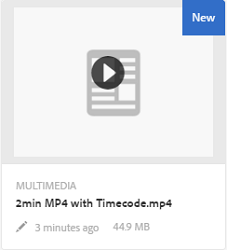

# Hantera videomaterial {#managing-video-assets}

Lär dig hur du hanterar och redigerar videoresurser i Adobe Experience Manager (AEM) Assets. Om du har licens att använda Dynamic Media läser du dokumentationen [för](video.md)Dynamic Media Video.

## Överföra och förhandsgranska videomaterial {#uploading-and-previewing-video-assets}

AEM Resurser genererar förhandsvisningar för videomaterial med filnamnstillägget MP4. Om resursens format inte är MP4 installerar du FFmpeg-paketet för att generera en förhandsvisning. FFmpeg skapar videoåtergivningar av typen OGG och MP4. Du kan förhandsgranska dessa återgivningar i användargränssnittet för AEM Resurser.

1. I mappen eller undermapparna Digital Assets navigerar du till den plats där du vill lägga till digitala resurser.
1. Om du vill överföra resursen klickar du på eller trycker på **[!UICONTROL Skapa]** i verktygsfältet och väljer sedan **[!UICONTROL Filer]**. Du kan också släppa det direkt i resursområdet. Mer information om överföring finns i [Överföra resurser](managing-assets-touch-ui.md#uploading-assets) .
1. Om du vill förhandsgranska en video i kortvyn trycker du på **[!UICONTROL uppspelningsknappen]** på videoresursen.

   

   Du kan bara pausa eller spela upp video i **[!UICONTROL kortvyn]** . Knappen Spela upp/Pausa är inte tillgänglig i **[!UICONTROL listvyn]** .

1. Tryck på ikonen **[!UICONTROL Redigera]** på kortet för att förhandsgranska videon i vyn **[!UICONTROL Detaljer]** .

   Videon spelas upp i webbläsarens inbyggda videospelare. Du kan spela upp, pausa, styra volymen och zooma videon till helskärm.

   

## Konfiguration för att överföra resurser som är större än 2 GB {#configuration-to-upload-video-assets-that-are-larger-than-gb}

Som standard kan du inte överföra resurser som är större än 2 GB på grund av en filstorleksgräns med AEM Resurser. Du kan dock skriva över den här gränsen genom att gå till CRXDE Lite och skapa en nod under `/apps` katalogen. Noden måste ha samma nodnamn, katalogstruktur och jämförbara nodegenskaper i ordningen.

Förutom AEM Assets-konfigurationen kan du ändra följande konfigurationer för att överföra stora resurser:

* Öka tokens förfallotid. Se [!UICONTROL Adobe Granite CSRF-server] i webbkonsolen på `https://[aem_server]:[port]/system/console/configMgr`. Mer information finns i [CSRF-skydd](/help/sites-developing/csrf-protection.md).
* Öka `receiveTimeout` i Dispatcher-konfigurationen. Mer information finns i [Experience Manager Dispatcher-konfiguration](https://docs.adobe.com/content/help/en/experience-manager-dispatcher/using/configuring/dispatcher-configuration.html#renders-options).

>[!NOTE]
>
>Användargränssnittet i AEM Classic har inte en begränsning av filstorleken på två gigabyte. Slutgiltigt arbetsflöde för stor video stöds inte heller helt.

Utför följande steg i `/apps` katalogen för att konfigurera en större filstorleksgräns.

1. I AEM trycker du på **[!UICONTROL Verktyg > Allmänt > CRXDE Lite]**.
1. Gå till **[!UICONTROL CRXDE Lite]** -sidan i katalogfönstret till vänster `/libs/dam/gui/content/assets/jcr:content/actions/secondary/create/items/fileupload`. Om du vill visa katalogfönstret trycker du på `>>` ikonen .
1. Tryck på **[!UICONTROL Overlay Node]** i verktygsfältet. Du kan också välja **[!UICONTROL Överläggsnod]** på snabbmenyn.
1. I dialogrutan **[!UICONTROL Overlay Node]** (Överläggningsnod) trycker du på **[!UICONTROL OK]**.

   

1. Uppdatera webbläsaren. Överläggsnoden `/jcr_root/apps/dam/gui/content/assets/jcr:content/actions/secondary/create/items/fileupload` är markerad.
1. På fliken **[!UICONTROL Egenskaper]** anger du ett värde i byte för att öka storleksgränsen till önskad storlek. Ange till exempel följande värde för att öka storleksgränsen till 30 GB:

   `{sizeLimit : "32212254720"}`

1. Tryck på **[!UICONTROL Spara alla]** i verktygsfältet.
1. I AEM trycker du på **[!UICONTROL Verktyg > Åtgärder > Webbkonsol]**.
1. På sidan **[!UICONTROL Adobe Experience Manager Web Console Bundles]** , under kolumnen **[!UICONTROL Namn]** i tabellen, letar du upp och trycker på **[!UICONTROL Adobe Granite Workflow External Process Job Handler]**.
1. På **[!UICONTROL Adobe Granite Workflow External Process Job Handler]** ställer du in sekunder för både **[!UICONTROL standardtidsgräns]** och **[!UICONTROL maximalt tidsgräns]** till `18000` (fem timmar).
1. Tryck på **[!UICONTROL Spara]**.
1. I AEM trycker du på **[!UICONTROL Verktyg > Arbetsflöde > Modeller]**.
1. På sidan **[!UICONTROL Arbetsflödesmodeller]** väljer du **[!UICONTROL Dynamic Media Encode Video]** och trycker sedan på **[!UICONTROL Edit]**.
1. Dubbeltryck på processkomponenten för **[!UICONTROL Dynamic Media Video Service på sidan]** Arbetsflöde **** .
1. Expandera **[!UICONTROL Avancerade inställningar]** under fliken **[!UICONTROL Allmänt]** i dialogrutan **[!UICONTROL Stegegenskaper]**.
1. I fältet **[!UICONTROL Timeout]** anger du värdet `18000`och trycker sedan på **[!UICONTROL OK]** för att återgå till arbetsflödessidan för **[!UICONTROL Dynamic Media Encode Video]** .
1. Långt upp på sidan, under sidrubriken **[!UICONTROL Dynamic Media Encode Video]** , trycker du på **[!UICONTROL Save]**.

## Publicera videomaterial {#publishing-video-assets}

När videomaterialet har publicerats kan du inkludera det på en webbsida via en URL eller genom att bädda in det på en webbsida. Se [Publicera resurser](publishing-dynamicmedia-assets.md).

## Kommentera videomaterial {#annotating-video-assets}

1. I resurskonsolen: tryck på ikonen **[!UICONTROL Redigera]** på resurskortet för att visa sidan med resursinformation.
1. Tryck på ikonen **[!UICONTROL Förhandsgranska]** för att spela upp videon.
1. Om du vill kommentera videon trycker du på knappen **[!UICONTROL Anteckna]** . En anteckning läggs till vid den angivna tidpunkten (bildrutan) i videon.

   När du gör anteckningar kan du rita på arbetsytan och ta med en kommentar med ritningen. Kommentarerna sparas automatiskt i Adobe Experience Manager Assets.

   

   Om du vill avsluta anteckningsguiden trycker du på **[!UICONTROL Stäng]**.

1. Om du vill hoppa till en viss punkt i videon anger du tiden i sekunder i textfältet och klickar på **[!UICONTROL Hoppa]**. Om du till exempel vill hoppa över de första 10 sekunderna av video anger du `20` i textfältet.

   

1. Klicka på en anteckning för att visa den på tidslinjen. Tryck på **[!UICONTROL Ta bort]** för att ta bort anteckningen från tidslinjen.

   
