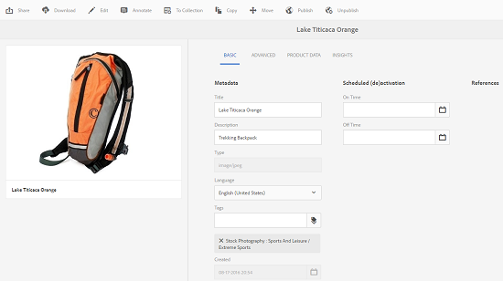

# Redigera eller lägga till metadata {#how-to-edit-or-add-metadata}

Metadata är ytterligare information om resursen som kan sökas igenom. Den extraheras automatiskt när du överför en bild. Du kan redigera befintliga metadata eller lägga till nya metadataegenskaper i befintliga fält (till exempel när ett metadatafält är tomt).

Eftersom företag behöver kontrollerade och tillförlitliga metadata-ordlistor tillåter inte AEM Assets att nya metadataegenskaper läggs till för hand. Även om författare inte kan lägga till nya metadatafält för resurser kan utvecklare göra det. Se [Skapa ny metadataegenskap för resurser](meta-edit.md#editing-metadata-schema).

## Redigera metadata för en resurs {#editing-metadata-for-an-asset}

Så här redigerar du metadata:

1. Gör något av följande:

   * I resursgränssnittet markerar du resursen och klickar/trycker på ikonen **[!UICONTROL View Properties]** i verktygsfältet.
   * Välj snabbåtgärden **[!UICONTROL View Properties]** från miniatyrbilden av resursen.
   * Klicka/tryck på ikonen **[!UICONTROL View Properties]**  från verktygsfältet på resurssida.

   Resurssidan visar alla metadata för resursen. Dessa metadata extraherades automatiskt när de överfördes (överfördes) till AEM Assets.

   

1. Redigera metadata på de olika flikarna efter behov och klicka/tryck sedan på **[!UICONTROL Save]** i verktygsfältet för att spara ändringarna. Klicka/tryck på **[!UICONTROL Close]** för att gå tillbaka till Assets-webbgränssnittet.

   >[!NOTE]
   >
   >Om ett textfält är tomt finns det ingen befintlig metadatauppsättning. Du kan ange ett värde i fältet och spara det för att lägga till metadataegenskapen.

Alla ändringar av metadata för en resurs skrivs tillbaka till den ursprungliga binärfilen som en del av dess XMP data. Detta görs via AEM för återskrivning av metadata. Ändringar som görs i befintliga egenskaper (till exempel `dc:title`) skrivs över och nya egenskaper (inklusive anpassade egenskaper som `cq:tags`) läggs till tillsammans med schemat.

XMP stöds och är aktiverat för de plattformar och filformat som beskrivs i [Tekniska krav.](/help/sites-deploying/technical-requirements.md)

## Redigerar metadataschema {#editing-metadata-schema}

Mer information om hur du redigerar metadataschemat finns i [Redigera metadataschemaformulär](metadata-schemas.md#editing-metadata-schema-forms).

## Registrera ett anpassat namnutrymme i AEM {#registering-a-custom-namespace-within-aem}

Du kan lägga till egna namnutrymmen i AEM. Precis som det finns fördefinierade namnutrymmen som cq, jcr och sling kan du ha ett namnutrymme för databasens metadata och XML-bearbetning.

1. Gå till administrationssidan för nodtypen `https://[AEM_server]:[port]/crx/explorer/nodetypes/index.jsp`.
1. Klicka eller tryck på **[!UICONTROL Namespaces]** överst på sidan. Namnutrymmesadministrationssidan visas i ett fönster.

1. Om du vill lägga till ett namnutrymme klickar eller trycker du på **[!UICONTROL New]** längst ned.
1. Ange ett anpassat namnutrymme i XML-namnutrymmeskonventionen (ange id:t i form av en URI och ett associerat prefix för id:t) och klicka eller tryck på **[!UICONTROL Save]**.

## Tips och begränsningar {#best-practices-limitations}

* Metadatauppdateringarna via Touch-UI ändrar metadataegenskaperna i namnutrymmet `dc`. Alla uppdateringar som görs via HTTP API ändrar metadataegenskaperna i namnutrymmet `jcr`. Se [hur du uppdaterar metadata med HTTP API](/help/assets/mac-api-assets.md#update-asset-metadata).

>[!MORELIKETHIS]
>
>* [Om metadata och dess behov i Assets](metadata.md)