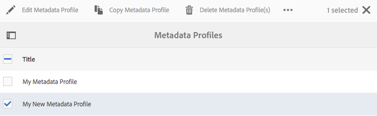
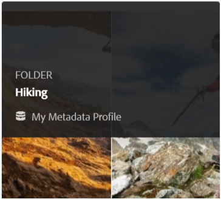
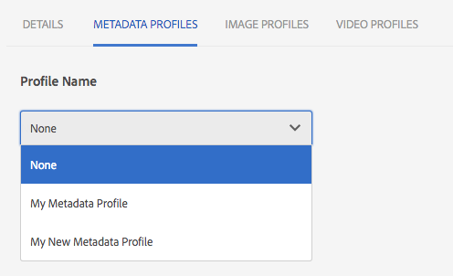

# Metadataprofiler {#metadata-profiles}

>[!CAUTION]
>
>AEM 6.4 har nått slutet på den utökade supporten och denna dokumentation är inte längre uppdaterad. Mer information finns i [teknisk supportperiod](https://helpx.adobe.com/support/programs/eol-matrix.html). Hitta de versioner som stöds [här](https://experienceleague.adobe.com/docs/).

Med en metadataprofil kan du använda standardmetadata för resurser i en mapp. Skapa en metadataprofil och tillämpa den på en mapp. Alla resurser som du sedan överför till mappen ärver de standardmetadata som du konfigurerade i metadataprofilen.

## Lägg till en metadataprofil {#adding-a-metadata-profile}

1. Tryck eller klicka på [!DNL Experience Manager] logotyp och navigera till **[!UICONTROL Tools > Assets > Metadata Profiles]** och sedan trycka **[!UICONTROL Create]**.
1. Ange en rubrik för metadataprofilen, till exempel Exempelmetadata, och klicka på **[!UICONTROL Submit]**. The **[!UICONTROL Edit Form]** för metadataprofilen visas.

   

1. Klicka på en komponent och konfigurera dess egenskaper i **[!UICONTROL Settings]** -fliken. Klicka till exempel på **[!UICONTROL Description]** och redigera dess egenskaper.

   

   Redigera följande egenskaper för **[!UICONTROL Description]** komponent:

   * **[!UICONTROL Field Label]**: Visningsnamnet för metadataegenskapen. Det är bara till för användarreferensen.
   * **[!UICONTROL Map to Property]**: Värdet för den här egenskapen anger den relativa sökvägen/namnet till resursnoden där den sparas i databasen. Värdet ska alltid börja med `./` eftersom det anger att sökvägen finns under objektets nod.

   

   Värdet som du anger för **[!UICONTROL Map to property]** lagras som en egenskap under objektets metadatanod. Om du till exempel anger . `/jcr:content/metadata/dc:desc` som namnet på **[!UICONTROL Map to property]**, [!DNL Experience Manager] Resurser lagrar värdet `dc:desc` på resursens metadatanod.

   * **[!UICONTROL Default Value]**: Använd den här egenskapen om du vill lägga till ett standardvärde för metadatakomponenten. Om du till exempel anger &quot;Min beskrivning&quot; tilldelas det här värdet till egenskapen `dc:desc` på resursens metadatanod.

   

   >[!NOTE]
   >
   >Lägga till ett standardvärde i en ny metadataegenskap (som inte redan finns i . `/jcr:content/metadata` nod) visar inte egenskapen och dess värde på resursens **[!UICONTROL Properties]** sida som standard. Så här visar du den nya egenskapen på [!UICONTROL Properties] ändra motsvarande schemaformulär.

1. (Valfritt) Lägg till fler komponenter i **[!UICONTROL Edit Form]** från **[!UICONTROL Build Form]** och konfigurera deras egenskaper i **[!UICONTROL Settings]** -fliken. Följande egenskaper är tillgängliga på fliken **[!UICONTROL Build Form]**:

| Komponent | Egenskaper |
|---|---|
| [!UICONTROL Section Header] | Fältetikett,   Beskrivning |
| [!UICONTROL Single Line Text] | Fältetikett,   Mappa till egenskap,   Standardvärde |
| [!UICONTROL Multi Value Text] | Fältetikett,   Mappa till egenskap,   Standardvärde |
| [!UICONTROL Number] | Fältetikett,   Mappa till egenskap,   Standardvärde |
| [!UICONTROL Date] | Fältetikett,   Mappa till egenskap,   Standardvärde |
| [!UICONTROL Standard Tags] | Fältetikett,   Mappa till egenskap,   Standardvärde,   Beskrivning |

1. Klicka på **[!UICONTROL Done]**. Metadataprofilen läggs till i listan över profiler i **[!UICONTROL Metadata Profiles]** sida.

   

## Kopiera en metadataprofil {#copying-a-metadata-profile}

1. Från **[!UICONTROL Metadata Profiles]** väljer du en profil för att göra en kopia av den.

   

1. Klicka på **[!UICONTROL Copy]** i verktygsfältet.
1. I **[!UICONTROL Copy Metadata Profile]** anger du en rubrik för den nya kopian av profilen.
1. Klicka på **[!UICONTROL Copy]**. En kopia av profilen visas i listan med profiler i **[!UICONTROL Metadata Profiles]** sida.

   

## Ta bort en metadataprofil {#deleting-a-metadata-profile}

1. Från **[!UICONTROL Metadata Profiles]** väljer du en profil att ta bort.

   

1. Klicka **[!UICONTROL Delete Metadata Profiles]** i verktygsfältet.
1. Klicka på **[!UICONTROL Delete]** för att bekräfta borttagningsåtgärden. Metadataprofilen tas bort från listan.

## Använda en metadataprofil för mappar {#applying-a-metadata-profile-to-folders}

När du tilldelar en metadataprofil till en mapp ärver alla undermappar automatiskt profilen från den överordnade mappen. Det innebär att du bara kan tilldela en metadataprofil till en mapp. Fundera därför noga över mappstrukturen för var du överför, lagrar, använder och arkiverar resurser.

Om du har tilldelat en annan metadataprofil till en mapp åsidosätter den nya profilen den tidigare profilen. De tidigare befintliga mappresurserna ändras inte. Den nya profilen används för resurser som läggs till i mappen senare.

Mappar som har tilldelats en profil visas i användargränssnittet med namnet på profilen som visas i kortnamnet.

Du kan tillämpa metadataprofiler på specifika mappar eller globalt på alla resurser.

### Använda metadataprofiler på specifika mappar {#applying-metadata-profiles-to-specific-folders}

Du kan använda en metadataprofil på en mapp från menyn **[!UICONTROL Tools]** eller, om du är i mappen, från **[!UICONTROL Properties]**. I det här avsnittet beskrivs hur du använder metadataprofiler på mappar på båda sätten.

För mappar som redan har tilldelats en profil visas profilens namn direkt under mappnamnet.

#### Använda metadataprofiler på mappar från användargränssnittet för profiler {#applying-metadata-profiles-to-folders-from-profiles-user-interface}

1. Tryck på [!DNL Experience Manager] logotyp och navigera till **[!UICONTROL Tools > Assets > Metadata Profiles]**.
1. Välj den metadataprofil som du vill använda för en eller flera mappar.

   

1. Tryck på **[!UICONTROL Apply Metadata Profile to Folder(s)]** och markera den eller de mappar som du vill ska ta emot de nyligen överförda resurserna och tryck sedan på **[!UICONTROL Done]**. För mappar som redan har tilldelats en profil visas profilens namn direkt under mappnamnet.

#### Använd metadataprofiler på mappar från Egenskaper {#applying-metadata-profiles-to-folders-from-properties}

1. Tryck på vänster spår **[!UICONTROL Assets]** navigera sedan till den mapp som du vill använda en metadataprofil på.
1. Markera mappen genom att trycka på bockmarkeringen och sedan trycka på  **[!UICONTROL Properties]**.

1. Välj fliken **[!UICONTROL Metadata Profiles]**, välj profilen i listrutan och klicka sedan på **[!UICONTROL Save]**.

   

   För mappar som redan har tilldelats en profil visas profilens namn direkt under mappnamnet.

### Använd en metadataprofil globalt {#applying-a-metadata-profile-globally}

Förutom att tillämpa en profil på en mapp kan du även tillämpa en profil globalt så att allt innehåll som överförs till [!DNL Experience Manager] resurser i alla mappar där den valda profilen används. Så här använder du en metadataprofil globalt:

1. Gör något av följande:

   * Navigera till `https://[aem_server]:[port]/mnt/overlay/dam/gui/content/assets/foldersharewizard.html/content/dam` och använda rätt profil och tryck eller klicka på **[!UICONTROL Save]**.

      

   * Navigera till CRXDE Lite till följande nod: `/content/dam/jcr:content`. Lägg till egenskapen `metadataProfile:/etc/dam/metadata/dynamicmedia/<name_of_metadata_profile>` och trycka **[!UICONTROL Save All]**.

      

## Ta bort en metadataprofil från mappar {#removing-a-metadata-profile-from-folders}

När du tar bort en metadataprofil från en mapp ärver alla undermappar automatiskt borttagningen av profilen från den överordnade mappen. All bearbetning av filer som har inträffat i mapparna förblir dock oförändrad.

Du kan ta bort en metadataprofil från en mapp i **[!UICONTROL Tools]** eller om du är i mappen, från **[!UICONTROL Properties]**. I det här avsnittet beskrivs hur du tar bort metadataprofiler från mappar på båda sätten.

### Ta bort metadataprofiler från mappar via användargränssnittet Profiler {#removing-metadata-profiles-from-folders-via-profiles-user-interface}

Så här tar du bort en metadataprofil från mappar via användargränssnittet för profiler:

1. Tryck på [!DNL Experience Manager] logotyp och navigera till **[!UICONTROL Tools > Assets > Metadata Profiles]**.
1. Markera den metadataprofil som du vill ta bort från en eller flera mappar.
1. Tryck **[!UICONTROL Remove Metadata Profile from Folder(s)]** och välj den eller de mappar som du vill ta bort en profil från och tryck sedan på **[!UICONTROL Done]**.

   Du kan bekräfta att metadataprofilen inte längre används för en mapp eftersom namnet inte längre visas under mappnamnet.

### Ta bort metadataprofiler från mappar via Egenskaper {#removing-metadata-profiles-from-folders-via-properties}

1. Tryck på [!DNL Experience Manager] logotyp och navigera **[!UICONTROL Assets]** och sedan till mappen som du vill ta bort en metadataprofil från.
1. Markera mappen genom att trycka på bockmarkeringen och sedan trycka på **[!UICONTROL Properties]**.
1. Välj **[!UICONTROL Metadata Profiles]** tabbtangenten och sedan **[!UICONTROL None]** i listrutan. Tryck på **[!UICONTROL Save]**.

För mappar som redan har tilldelats en profil visas profilens namn direkt under mappnamnet.
