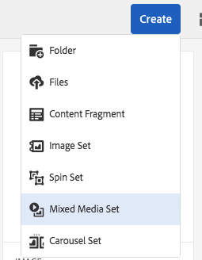

# Blandade medieuppsättningar {#mixed-media-sets}

Med blandade medieuppsättningar kan du kombinera bilder, bilduppsättningar, snurruppsättningar och videoklipp i en presentation.

Blandade medieuppsättningar definieras av en banderoll med ordet **[!UICONTROL MixedMediaSet]**. Om uppsättningen med blandade medier publiceras visas dessutom det publiceringsdatum som anges av ikonen **[!UICONTROL World]** på banderollen tillsammans med det senaste ändringsdatumet, som anges av ikonen **[!UICONTROL Pencil]**.

>[!NOTE]
>
>Mer information om användargränssnittet Resurser finns i [Hantera resurser med Touch-gränssnittet](managing-assets-touch-ui.md).

## Snabbstart: Blandade medieuppsättningar {#quick-start-mixed-media-sets}

Följ de här stegen för att komma igång snabbt med blandade medieuppsättningar:

1. [Överför dina resurser](#uploading-assets).

   Börja med att ladda upp bilder och videoklipp för uppsättningarna med blandade medier. Om det behövs kan du skapa [bilduppsättningar](image-sets.md) och [rotationsuppsättningar](spin-sets.md). Eftersom användare kan zooma in bilder i visningsprogrammet för uppsättningen med blandade medier bör du ta hänsyn till zoomningen när du väljer bilder. Se till att bilderna har minst 2 000 pixlar i den största dimensionen.

1. [Skapa blandade medieuppsättningar.](#creating-mixed-media-sets)

   Om du vill skapa en uppsättning med blandade media trycker du på **[!UICONTROL Assets]** på sidan **[!UICONTROL Create > Mixed Media Set]** och ger uppsättningen ett namn. Välj resurserna och välj den ordning som bilderna ska visas i.

   Se [Arbeta med väljare.](working-with-selectors.md)

1. Ställ in [förinställningar för blandad Media Viewer](managing-viewer-presets.md) efter behov.

   Administratörer kan skapa eller ändra visningsförinställningar för blandade medieuppsättningar. Om du vill visa de blandade medierna med en visningsförinställning väljer du uppsättningen med blandade medier och väljer sedan **[!UICONTROL Viewers]** i listrutan till vänster.

   Se **[!UICONTROL Tools > Assets > Viewer Presets]** om du vill skapa eller redigera visningsprogramförinställningar.

   Se [Lägga till och redigera visningsprogramförinställningar.](managing-viewer-presets.md)

1. [Förhandsgranska blandade medieuppsättningar.](#previewing-mixed-media-sets)

   Markera den blandade medieuppsättningen och du kan förhandsgranska den. Klicka på miniatyrbildikonerna för att undersöka den blandade medieuppsättningen i det valda visningsprogrammet. Du kan välja olika visningsprogram på menyn **[!UICONTROL Viewers]**, som finns i den vänstra listrutan.

1. [Publicera blandade medieuppsättningar.](#publishing-mixed-media-sets)

   När du publicerar en blandad medieuppsättning aktiveras URL-adressen och strängen Embed. Dessutom måste du [publicera visningsförinställningen](managing-viewer-presets.md#publishing-viewer-presets).

1. [Länka URL:er till webbprogrammet ](linking-urls-to-yourwebapplication.md) eller  [bädda in video- eller bildvisningsprogrammet](embed-code.md).

   AEM Assets skapar URL-anrop för blandade medieuppsättningar och aktiverar dem när du har publicerat de blandade medieuppsättningarna. Du kan kopiera dessa URL:er när du förhandsgranskar resurser. Du kan även bädda in dem på din webbplats.

   Välj den blandade medieuppsättningen och välj **[!UICONTROL Viewers]** i den vänstra listrutan.

   Se [Länka en uppsättning med blandade medier till en webbsida](linking-urls-to-yourwebapplication.md) och [Bädda in video- eller bildvisningsprogrammet](embed-code.md).

Om du behöver kan du redigera [blandade medieuppsättningar](#editing-mixed-media-sets). Dessutom kan du visa och ändra [egenskaper för den blandade medieuppsättningen](managing-assets-touch-ui.md#editing-properties).

>[!NOTE]
>
>Om du har problem med att skapa uppsättningar kan du läsa [Felsöka Dynamic Media - Scene7-läge](troubleshoot-dms7.md).

## Överför resurser {#uploading-assets}

Börja med att ladda upp bilder och videoklipp för uppsättningarna med blandade medier. Eftersom användare kan zooma in bilder i visningsprogrammet för den blandade medieuppsättningen måste du ta hänsyn till zoomningen när du väljer bilder. Se till att bilderna har minst 2 000 pixlar i den största dimensionen.

Om du dessutom vill lägga till snurrsuppsättningar eller bilduppsättningar i den blandade medieuppsättningen skapar du även dem.

## Skapar blandade medieuppsättningar {#creating-mixed-media-sets}

Du kan lägga till bilder, bilduppsättningar, snurruppsättningar och videoklipp i din uppsättning med blandade media. Se till att dina filer, bilduppsättningar och snurruppsättningar är klara att publiceras innan du lägger till dem i den blandade medieuppsättningen.

När du lägger till resurser i uppsättningen läggs de automatiskt till i alfanumerisk ordning. Du kan ändra ordning på eller sortera resurser manuellt när de har lagts till.

**Så här skapar du en blandad medieuppsättning**:

1. Navigera till den plats där du vill skapa en blandad medieuppsättning i Resurser, klicka på **Skapa** och välj **[!UICONTROL Mixed Media Set]**. Du kan också skapa uppsättningen inifrån en mapp som innehåller resurserna.

   

1. På sidan **[!UICONTROL Mixed Media Set Editor]**, på **[!UICONTROL Title]**, anger du ett namn för den blandade medieuppsättningen. Namnet visas i banderollen över den blandade medieuppsättningen. Du kan också ange en beskrivning.

   

   >[!NOTE]
   >
   >När du skapar den blandade medieuppsättningen kan du ändra miniatyrbilden för den blandade medieuppsättningen eller låta AEM välja miniatyrbilden automatiskt baserat på resurserna i den blandade medieuppsättningen. Om du vill välja en miniatyrbild klickar du på **[!UICONTROL Change thumbnail]** och väljer en bild (du kan navigera till andra mappar för att söka efter bilder också). Om du har valt en miniatyrbild och sedan vill AEM att du ska generera en från den blandade medieuppsättningen väljer du **[!UICONTROL Switch to Automatic thumbnail]**.

1. Tryck på **[!UICONTROL Asset Selector]** för att välja resurser som du vill inkludera i din uppsättning med blandade media. Markera dem och tryck på **[!UICONTROL Select]**.

   Med **[!UICONTROL Asset Selector]** kan du söka efter resurser genom att skriva ett nyckelord och trycka på **[!UICONTROL Return]**. Du kan också använda filter för att förfina sökresultatet. Du kan filtrera efter sökväg, samling, filtyp och tagg. Markera filtret och tryck sedan på ikonen **[!UICONTROL Filter]** i verktygsfältet. Ändra vyn genom att markera ikonen Visa och välja vyn **[!UICONTROL List]**, **[!UICONTROL Column]** eller **[!UICONTROL Card]**.

   Se [Arbeta med väljare](working-with-selectors.md).

   

1. Sortera om resurserna genom att dra dem uppåt eller nedåt i listan (måste markera ikonen för att ordna om), om det behövs.

   

   Om du vill lägga till miniatyrbilder klickar du på ikonen **[!UICONTROL +]** bredvid bilden och navigerar till den miniatyrbild du vill använda. När du är klar med att välja alla miniatyrbilder trycker du på **[!UICONTROL Save]**.

   >[!NOTE]
   >
   >Om du vill lägga till resurser trycker du på **[!UICONTROL Add Asset]**.

1. Om du vill ta bort en resurs markerar du motsvarande kryssruta och trycker på **[!UICONTROL Delete Asset]**.
1. Om du vill använda en förinställning trycker du på **[!UICONTROL Preset]** i det övre högra hörnet och väljer en förinställning som ska användas för resurserna.
1. Klicka på **[!UICONTROL Save]**. Den nya blandade medieuppsättningen visas i den mapp du skapade den i.

## Redigera blandade medieuppsättningar {#editing-mixed-media-sets}

Du kan utföra en mängd redigeringsåtgärder för resurser i blandade medieuppsättningar direkt i användargränssnittet [på samma sätt som för andra resurser i Resurser](managing-assets-touch-ui.md). Du kan även utföra följande åtgärder i Blandade medieuppsättningar:

* Lägg till resurser i den blandade medieuppsättningen.
* Ändra ordning på resurser i den blandade medieuppsättningen.
* Ta bort resurser i den blandade medieuppsättningen.
* Använd förinställningar för visningsprogram.
* Ändra standardminiatyrbilden.

**Så här redigerar du blandade medieuppsättningar**:

1. Gör något av följande:

   * Håll pekaren över en resurs i en blandad medieuppsättning och tryck sedan på **[!UICONTROL Edit]** (pennikon).
   * Håll pekaren över en resurs i en blandad medieuppsättning, tryck på **[!UICONTROL Select]** (bockmarkeringsikon) och tryck sedan på **[!UICONTROL Edit]** i verktygsfältet.
   * Tryck på en resurs i en blandad medieuppsättning och tryck sedan på **[!UICONTROL Edit]** (pennikon) i verktygsfältet.

1. Gör något av följande i redigeraren för den blandade medieuppsättningen:

   * Om du vill ordna om resurser trycker du på **[!UICONTROL Assets]** (bildikon) i den vänstra panelen och drar en resurs till en ny plats.
   * Om du vill lägga till resurser trycker du på **[!UICONTROL Add Asset]** i verktygsfältet. Navigera till resurserna. För varje resurs som du vill lägga till håller du pekaren över resursens bild (inte resursens namn) och trycker sedan på bockmarkeringsikonen. Tryck på **[!UICONTROL Select]** i det övre högra hörnet.
   * Om du vill ta bort en resurs trycker du på **[!UICONTROL Assets]** (bildikon) i den vänstra panelen och markerar sedan resursen. Tryck på **[!UICONTROL Delete Asset]** i verktygsfältet.
   * Om du vill sortera resurser efter namn i stigande eller fallande ordning trycker du på **[!UICONTROL Assets]** (bildikon) i den vänstra panelen. Till höger om rubriken **[!UICONTROL Assets]** trycker du på upp- eller nedknappsikonerna.

   >[!NOTE]
   >
   >* Om du vill ta bort en hel uppsättning med blandade media går du från valfritt visningsläge (till exempel **[!UICONTROL Card]**-vy eller **[!UICONTROL Column]**-vy) till den blandade medieuppsättningen. Håll pekaren över resursen och tryck på bocken för att markera den. Tryck på **[!UICONTROL Backspace]** på tangentbordet eller tryck på **[!UICONTROL More]** (tre punkter) i verktygsfältet och tryck sedan på **[!UICONTROL Delete]**.
   >* Du kan redigera resurserna i en uppsättning med blandade media genom att gå till uppsättningen, trycka på **[!UICONTROL Set Members]** i den vänstra listen och sedan trycka på ikonen **[!UICONTROL Pencil]** för en enskild resurs för att öppna redigeringsfönstret.

1. Tryck på **[!UICONTROL Save]** när du är klar med redigeringen.

   >[!NOTE]
   >
   >* Om du vill redigera resurserna i en uppsättning med blandade medier navigerar du till den blandade medieuppsättningen. Tryck på (markera inte) uppsättningen för att öppna den på sidan **[!UICONTROL Set Preview]** AEM. Tryck på nedåtpilen i den vänstra listen för att öppna listrutan och tryck sedan på **[!UICONTROL Set Members]**. Håll markören över en resurs på sidan **[!UICONTROL Set Members]** och tryck sedan på **[!UICONTROL Edit]** (pennikon) för att öppna redigeringssidan.
   >* Om du vill ta bort en hel uppsättning med blandade media - Från valfritt visningsläge (till exempel **[!UICONTROL Card]**-vy eller **[!UICONTROL Column]**-vy) går du till den blandade medieuppsättningen. Håll pekaren över uppsättningen och tryck sedan på **[!UICONTROL Select]** (bockmarkeringsikon). Tryck på **[!UICONTROL Backspace]** på tangentbordet eller tryck på **[!UICONTROL More]** (rad om tre punkter) och sedan på **[!UICONTROL Delete]**.

## Förhandsgranska blandade medieuppsättningar {#previewing-mixed-media-sets}

Se [Förhandsgranska resurser](previewing-assets.md) för mer information om hur du förhandsvisar blandade medieuppsättningar.

## Publicerar blandade medieuppsättningar {#publishing-mixed-media-sets}

Mer information om hur du publicerar blandade medieuppsättningar finns i [Publicera resurser](publishing-dynamicmedia-assets.md).

>[!NOTE]
>
>Om det blandade mediet inte hamnar helt i leveranstjänsten första gången du publicerar den, kan du behöva publicera den blandade medieuppsättningen en andra gång.
