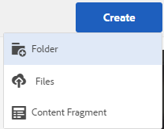

# Förbereder resurser för översättning {#preparing-assets-for-translation}

Flerspråkiga resurser innebär resurser med binärfiler, metadata och taggar på flera språk. I allmänhet finns binära filer, metadata och taggar för resurser på ett språk, som sedan översätts till andra språk för användning i flerspråkiga projekt.

I Adobe Experience Manager (AEM) Assets inkluderas flerspråkiga resurser i mappar, där varje mapp innehåller resurserna på ett annat språk.

Varje språkmapp kallas för en språkkopia. Rotmappen för en språkkopia, som kallas språkrot, identifierar språket för innehållet i språkkopian. Till exempel är */content/dam/it* den italienska språkroten för den italienska språkkopian. För språkkopior måste en [korrekt konfigurerad språkrot](preparing-assets-for-translation.md#creating-a-language-root) användas, så att rätt språk används när översättningar av källresurser utförs.

Språkkopian som du ursprungligen lade till resurser för är det primära språket. Språkets primära språk är källan som översätts till andra språk.

Exemplets mapphierarki innehåller flera språkrötter:

```java
/content
    /- dam
             |- en
             |- fr
             |- de
             |- es
             |- it
             |- ja
             |- zh
```

Utför följande steg för att förbereda dina resurser för översättning:

1. Skapa språkroten för det primära språket. Språkroten för den engelska språkkopian i exempelmapphierarkin är till exempel `/content/dam/en`. Kontrollera att språkroten är korrekt konfigurerad enligt informationen i [Skapa en språkrot](preparing-assets-for-translation.md#creating-a-language-root).

1. Lägg till resurser i ditt primära språk.
1. Skapa språkroten för varje målspråk som du behöver en språkkopia för.

## Skapa en språkrot {#creating-a-language-root}

Om du vill skapa språkroten skapar du en mapp och använder en ISO-språkkod som värde för egenskapen Namn. När du har skapat språkroten kan du skapa en språkkopia på valfri nivå i språkroten.

Rotsidan för den italienska språkkopian av exempelhierarkin har till exempel `it` egenskapen Namn. Egenskapen Namn används som namn på objektnoden i databasen och avgör därför sökvägen till resurserna. (`https://[AEM_server]:[port]/assets.html/content/dam/it/*`)

1. På Assets-konsolen klickar/trycker du på **[!UICONTROL Create]** och väljer **[!UICONTROL Folder]** på menyn.

   

1. I fältet Namn skriver du landskoden i formatet `<language-code>`.

   

1. Klicka eller tryck **[!UICONTROL Create]**. Språkroten skapas i resurskonsolen.

## Visa språkrot {#viewing-language-roots}

Det pekoptimerade användargränssnittet innehåller en referenspanel som visar en lista över språkrötter som har skapats i AEM Resurser.

1. I resurskonsolen väljer du det språk som är primärt för vilket du vill skapa språkkopior.
1. Klicka på eller tryck på ikonen GlobalNav och välj **[!UICONTROL References]** att öppna referensrutan.

   

1. Klicka eller tryck på **[!UICONTROL Language Copies]** referensrutan. På panelen Språkkopior visas språkkopiorna för resurserna.

   

