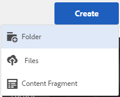

# Delning av privata mappar {#private-folder-sharing}

Du kan skapa en privat mapp i användargränssnittet för Adobe Experience Manager (AEM) Resurser som är exklusivt tillgänglig för dig. Du kan dela den här privata mappen med andra användare och tilldela olika behörigheter till dem. Beroende på vilken behörighetsnivå du tilldelar kan användare utföra olika åtgärder i mappen, till exempel visa resurser i mappen eller redigera resurserna.

1. I resurskonsolen trycker/klickar du på **[!UICONTROL Create]** i verktygsfältet och väljer sedan **[!UICONTROL Folder]** på menyn.

   

1. I dialogrutan **[!UICONTROL Add Folder]** anger du en rubrik och ett namn (valfritt) för mappen och väljer **[!UICONTROL Private]**.

   

1. Tryck/klicka på **[!UICONTROL Create]**. En privat mapp skapas i användargränssnittet.

   

1. Om du vill dela mappen med andra användare och tilldela behörigheter till dem markerar du mappen och klickar/trycker på ikonen **[!UICONTROL Properties]** i verktygsfältet.

   

   >[!NOTE]
   >
   >Mappen visas inte för andra användare förrän du delar den.

1. På sidan Mappegenskaper väljer du en användare i listan **[!UICONTROL Add User]**, tilldelar en roll till användaren i din privata mapp och klickar på **[!UICONTROL Add]**.

   

   >[!NOTE]
   >
   >Du kan tilldela olika roller, till exempel redigeraren, ägaren eller visningsprogrammet, till användaren som du delar mappen med. Om du tilldelar användaren en ägarroll har användaren redigeringsbehörighet för mappen. Dessutom kan användaren dela mappen med andra. Om du tilldelar en redigeringsroll kan användaren redigera resurserna i din privata mapp. Om du tilldelar en visningsprogramroll kan användaren bara visa resurserna i din privata mapp.

1. Klicka på **[!UICONTROL Save]**. Beroende på vilken roll du tilldelar tilldelas användaren en uppsättning behörigheter i din privata mapp när användaren loggar in på AEM Assets.
1. Klicka på **[!UICONTROL Ok]** för att stänga bekräftelsemeddelandet.
1. Användaren som du delar mappen med får ett delningsmeddelande. Logga in på AEM Assets med användarens inloggningsuppgifter för att visa meddelandet.

   

1. Tryck/klicka på meddelandeikonen för att öppna listan med meddelanden.

   

1. Klicka på/tryck på posten för den privata mappen som delas av administratören för att öppna mappen.

>[!NOTE]
>
>Om du vill kunna skapa en privat mapp måste du ha behörigheten Läs och Redigera åtkomstkontrollista för den överordnade mappen som du vill skapa en privat mapp i. Om du inte är administratör aktiveras dessa behörigheter inte som standard för */content/dam*. I så fall måste du först skaffa dessa behörigheter för ditt användar-ID/din grupp innan du försöker skapa privata mappar eller visa mappinställningar.
