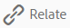
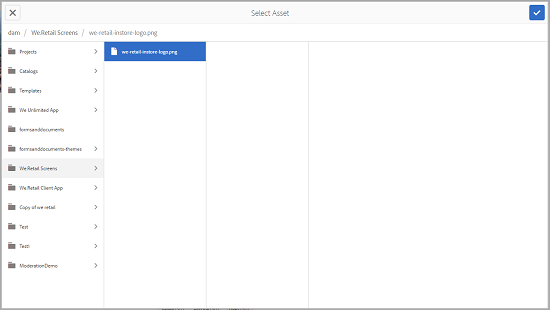

# Relaterade resurser {#related-assets}

Med Adobe Experience Manager (AEM) Assets kan du manuellt relatera resurser baserat på organisationens behov med hjälp av funktionen Relaterade resurser. Du kan till exempel relatera en licensfil till en resurs eller en bild/video på ett liknande ämne. Du kan relatera resurser som delar vissa gemensamma attribut. Du kan också använda funktionen för att skapa käll-/härledda relationer mellan resurser. Om du till exempel har en PDF-fil som genereras från en INDD-fil kan du koppla PDF-filen till dess INDD-källfil.

På så sätt kan du dela en lågupplöst fil (t.ex. PDF/JPG) till leverantörer/byråer och bara göra högupplösta filer (t.ex. INDD) tillgängliga på begäran.

## Relaterade resurser {#relating-assets}

1. I gränssnittet Resurser öppnar du egenskapssidan för en resurs som du vill relatera.

   

   Du kan också välja resursen i listvyn.

   

   Du kan också välja resursen från en samling.

   

1. Om du vill koppla en annan resurs till den valda resursen klickar/trycker du på ikonen **[!UICONTROL Relate]** i verktygsfältet.

   

1. Gör något av följande:

   * Om du vill relatera källfilen för resursen väljer du **[!UICONTROL Source]** i listan.
   * Om du vill relatera en härledd fil väljer du **[!UICONTROL Derived]** i listan.
   * Om du vill skapa en tvåvägsrelation mellan resurserna väljer du **[!UICONTROL Others]** i listan.

   

1. På skärmen **[!UICONTROL Select Asset]** navigerar du till platsen för resursen som du vill relatera och markerar den.

   

1. Klicka/tryck på ikonen **[!UICONTROL Confirm]**.
1. Klicka/tryck på **[!UICONTROL OK]** för att stänga dialogrutan. Beroende på vad du väljer för relation i steg 3 listas den relaterade resursen under en lämplig kategori i avsnittet **[!UICONTROL Related]**. Om den resurs du har relaterat är källfilen för den aktuella resursen visas den under **[!UICONTROL Source]**.

   

1. Om du vill ta bort kopplingen för en resurs klickar/trycker du på ikonen **[!UICONTROL Unrelate]** i verktygsfältet.

   

1. Markera de resurser som du vill ta bort kopplingen för i dialogrutan **[!UICONTROL Remove Relations]** och klicka/tryck på **[!UICONTROL Unrelate]**.

   

1. Klicka/tryck på **[!UICONTROL OK]** för att stänga dialogrutan. Resurserna som du har tagit bort relationer för tas bort från listan över relaterade resurser under avsnittet **[!UICONTROL Related]**.

## Översätter relaterade resurser {#translating-related-assets}

Det är också praktiskt att skapa käll-/härledda relationer mellan resurser med hjälp av funktionen Relaterade resurser i översättningsarbetsflöden. När du kör ett översättningsarbetsflöde på en härledd resurs hämtar AEM Assets automatiskt alla resurser som källfilen refererar till och inkluderar dem för översättning. På så sätt översätts den resurs som källresursen refererar till tillsammans med källresursen och de härledda resurserna. Tänk dig till exempel ett scenario där den engelska språkkopian innehåller en härledd resurs och dess källfil som visas.

Om källfilen är relaterad till en annan resurs hämtar AEM Assets den refererade resursen och inkluderar den för översättning.

1. Översätt resurserna i källmappen till ett målspråk genom att följa stegen i [Skapa ett nytt översättningsprojekt](translation-projects.md#create-a-new-translation-project). I det här fallet kan du till exempel översätta dina resurser till franska.
1. Öppna översättningsmappen på sidan Projekt.

   

1. Klicka/tryck på projektpanelen för att öppna informationssidan.

   

1. Klicka på/tryck på ellipserna under översättningsjobbkortet för att visa översättningsstatusen.

   

1. Markera resursen och klicka/tryck sedan på **[!UICONTROL Reveal in Assets]** i verktygsfältet för att visa översättningsstatusen för resursen.

   

1. Om du vill kontrollera om de resurser som är relaterade till källan har översatts klickar/trycker du på källresursen.

   

1. Välj den resurs som är relaterad till källan och klicka/tryck sedan på **[!UICONTROL Reveal in Assets]**. Den översatta relaterade resursen visas.

   
