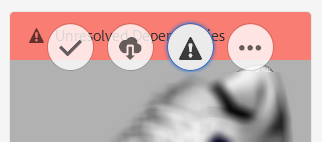

# Lösa filberoenden {#resolving-file-dependencies}

Primära 3D-modellfilberoenden, som texturschemafiler, löses automatiskt där det är möjligt. Den här funktionaliteten åstadkoms genom att AEM i närliggande resursmappar söka efter filer med samma namn som finns i 3D-filen. Om ett eller flera beroenden inte kan lösas under förgranskningsfasen visas följande röda banderollmeddelande på resurskortet i **[!UICONTROL Card View]**:

**Så här löser du filberoenden**:

1. Håll pekaren över **[!UICONTROL Card View]** banderollmeddelandet på kortet **[!UICONTROL Unresolved Dependencies]** och tryck sedan på **[!UICONTROL Exclamation Point]** -ikonen.

   

1. Tryck på **[!UICONTROL Metadata Properties]** fliken på **[!UICONTROL Dependencies]** sidan.

   De filer som AEM inte kunde matcha automatiskt visas under **[!UICONTROL Original Paths]** kolumnen i rött.

1. Gör något av följande:

   * **Bläddra till och välj beroenden**. (Det här alternativet förutsätter att du redan har överfört beroendefilerna.

      1. Tryck på **[!UICONTROL File Browse]** ikonen till vänster om den röda banan.
      1. På **[!UICONTROL Select Content]** sidan navigerar du till den saknade filen och markerar den genom att trycka på filens kort.
      1. I det övre vänstra hörnet av **[!UICONTROL Select Content]** sidan trycker du på **[!UICONTROL Close]** (X-ikonen) för att gå tillbaka till **[!UICONTROL View Properties]** sidan.
   * **Överför beroenden**. (Det här alternativet förutsätter att du ännu inte har överfört de saknade filerna.)

      1. Observera de saknade sökvägarna och filnamnen.
      1. Near the upper-right corner of the properties page, tap **[!UICONTROL Close]**.

   När filerna har överförts går du tillbaka till **[!UICONTROL View Properties > Dependencies]** sidan. Den nyligen överförda resursen visas nu korrekt som refererade resurser.

   * **Ignorera beroenden**.

      Om ett beroende som saknas inte längre behövs skriver du under kolumnen till vänster om den saknade filen i textfältet, **[!UICONTROL Referenced Asset]** `n/a` så att AEM 3D ignorerar filen.

1. Near the upper-right corner of the **[!UICONTROL View Properties]** page, tap **[!UICONTROL Save]**.
1. Tryck **[!UICONTROL Close]** för att gå tillbaka till **[!UICONTROL Card View]**.

   Resursen bearbetas automatiskt om med de nyligen lösta beroendena.

