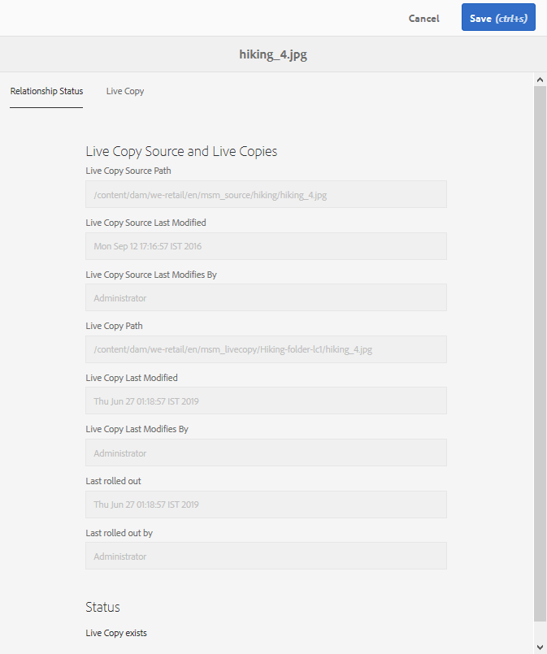

# Återanvänd resurser med MSM för [!DNL Assets] {#reuse-assets-using-msm-for-assets}

>[!CAUTION]
>
>AEM 6.4 har nått slutet på den utökade supporten och denna dokumentation är inte längre uppdaterad. Mer information finns i [teknisk supportperiod](https://helpx.adobe.com/support/programs/eol-matrix.html). Hitta de versioner som stöds [här](https://experienceleague.adobe.com/docs/).

MSM-funktionalitet (Multi Site Manager) i [!DNL Adobe Experience Manager] gör att användare kan återanvända innehåll som har skapats en gång och återanvänds på flera olika platser. Samma sak gäller för digitala resurser som MSM för [!DNL Assets] funktionalitet. Använda MSM för [!DNL Assets]kan du:

* Skapa resurser en gång och gör sedan kopior av dessa resurser för återanvändning i andra delar av webbplatsen.
* Håll flera kopior synkroniserade och uppdatera originalkopian en gång för att överföra ändringarna till de underordnade kopiorna.
* Gör lokala ändringar genom att tillfälligt eller permanent avbryta länkningen mellan överordnade och underordnade resurser.

## Förutsättningar {#msm-prerequisites}

Använd MSM för [!DNL Assets], installera minst [!DNL Experience Manager] 6.4 Service Pack 5. Mer information finns i [versionsinformation om det senaste Service Pack-meddelandet](/help/release-notes/sp-release-notes.md).

## Förstå fördelarna och begreppen {#understand-benefits-concepts}

### Så fungerar det och fördelarna {#how-it-works-the-benefits}

Om du vill veta mer om användningsscenarierna för återanvändning av samma innehåll (text och resurser) på flera webbplatser kan du läsa [möjliga MSM-scenarier](/help/sites-administering/msm.md). [!DNL Experience Manager] behåller en länk mellan den ursprungliga resursen och dess länkade kopior, som kallas live-kopior. Tack vare den bevarade länken kan centraliserade ändringar skickas till många aktiva kopior. Detta ger snabbare uppdateringar och eliminerar samtidigt begränsningarna med att hantera duplicerade kopior. Spridningen av ändringar är felfri och centraliserad. Funktionen ger utrymme för uppdateringar som är begränsade till valda kopior. Användare kan koppla loss länken, d.v.s. bryta arv, och göra lokala redigeringar som inte skrivs över nästa gång den primära kopian uppdateras och ändringarna introduceras. Frånkopplingen kan göras för ett fåtal metadatafält eller för en hel resurs. Det ger flexibilitet att lokalt uppdatera resurser som ursprungligen ärvts från en primär kopia.

MSM upprätthåller en aktiv relation mellan källresursen och dess livekopior så att:

* Ändringar av källresurserna tillämpas (utlöses) även på live-kopior, det vill säga de live-kopior som synkroniseras med källan.

* Du kan uppdatera live-kopiorna genom att avbryta direktrelationen eller ta bort arvet för några få begränsade fält. Ändringarna i källan tillämpas inte längre på den aktiva kopian.

### Ordlista för villkoren för MSM for Assets {#glossary-msm-for-assets}

* **Källa:** De ursprungliga resurserna eller mapparna. Primär kopia som live-kopior härleds från.

* **Live copy:** Kopian av källresurserna/källmapparna som är synkroniserad med källan. Live-kopior kan vara en källa till fler live-kopior. Se [hur du skapar LC:er](#create-live-copy-asset).

* **Arv:** En länk/referens mellan en resurs/mapp för en live-kopia och dess källa som systemet använder för att komma ihåg var uppdateringarna ska skickas. Arv finns på detaljnivå för metadatafält. Arv kan tas bort för selektiva metadatafält samtidigt som den aktiva relationen mellan källan och dess aktiva kopia bevaras.

* **Utrullning**: En åtgärd som knuffar ändringar som gjorts i källan nedåt till dess aktiva kopior. Det går att uppdatera en eller flera live-kopior på en gång med en utrullningsåtgärd. Se [utrullning](#rollout-action).

* **Konfiguration för utrullning:** Regler som bestämmer vilka egenskaper som ska synkroniseras, hur och när. Dessa konfigurationer används när live-kopior skapas. kan redigeras senare; och ett underordnat objekt kan ärva utrullningskonfigurationen från sin överordnade resurs. För MSM för [!DNL Assets]använder du bara standardkonfigurationen. Övriga utrullningskonfigurationer är inte tillgängliga för MSM för [!DNL Assets].

* **Synkronisera:** En annan åtgärd, förutom utrullning, är att skapa paritet mellan källan och dess livekopia genom att skicka uppdateringarna från källan till livekopior. En synkronisering initieras för en viss live-kopia och åtgärden hämtar ändringarna från källan. Om du använder den här åtgärden kan du bara uppdatera en av live-kopiorna. Se [synkroniseringsåtgärd](#about-synchronize-action).

* **Gör uppehåll:** Ta tillfälligt bort den aktiva relationen mellan en live-kopia och dess källresurs/mapp. Du kan återuppta relationen. Se [pausa åtgärd](#suspend-and-resume-relationship).

* **Återuppta:** Återuppta direktrelationen så att en live-kopia får uppdateringarna från källan igen. Se [återuppta åtgärd](#suspend-and-resume-relationship).

* **Återställ:** Återställ-åtgärden gör live-kopian en gång till till en replik av källan genom att alla lokala ändringar skrivs över. Den tar också bort arvsannulleringar och återställer arv i alla metadatafält. Om du vill göra lokala ändringar i framtiden måste du ångra arvet av specifika fält. Se [lokala ändringar i LC](#make-local-modifications-to-live-copy).

* **Koppla loss:** Ta oåterkalleligt bort den aktiva relationen mellan en resurs/mapp för en live-kopia. Efter att ha frigjort en åtgärd kan live-kopiorna aldrig få uppdateringar från källan och de slutar vara en live-kopia längre. Se [ta bort relation](#remove-live-relationship).

## Skapa en live-kopia av en resurs {#create-live-copy-asset}

Om du vill skapa en live-kopia av en eller flera källresurser eller mappar gör du något av följande:

* **Metod 1**: Välj källresurserna och klicka på **[!UICONTROL Create]** > **[!UICONTROL Live Copy]** i verktygsfältet högst upp.
* **Metod 2**: I [!DNL Experience Manager] användargränssnitt, klicka **[!UICONTROL Create > Live Copy]** i gränssnittets övre högra hörn.

Du kan skapa live-kopior av en resurs eller en mapp åt gången. Du kan skapa live-kopior som är härledda från en resurs eller en mapp som är en live-kopia.

Content Fragments (CF) stöds inte för användningsfallet. När de försöker skapa sina live-kopior kopieras CF-filer som de är utan någon relation. De kopierade CF:erna är en ögonblicksbild i tid och uppdateras inte när ursprungliga CF:er uppdateras.

Så här skapar du live-kopior med den första metoden:

1. Välj källmaterial eller mappar. Klicka på **[!UICONTROL Create > Live Copy]** i verktygsfältet.
   ![Skapa live-kopia från [!DNL Experience Manager] gränssnitt](assets/lc_create1.png)
1. Välj källresurs eller källmapp. Klicka på **[!UICONTROL Next]**.
1. Ange titel och namn. Resurserna har inga underordnade. När du skapar en live-kopia av mappar kan du välja att ta med eller exkludera underordnade.
1. Välj en utrullningskonfiguration. Klicka på **[!UICONTROL Create]**.

Så här skapar du live-kopior med den andra metoden:

1. I [!DNL Experience Manager] gränssnitt, från det övre högra hörnet, klicka **[!UICONTROL Create > Live Copy]**.
   ![Skapa live-kopia från [!DNL Experience Manager] gränssnitt](assets/lc_create2.png)
1. Välj källresurs eller källmapp. Klicka på **[!UICONTROL Next]**.
1. Välj målmapp. Klicka på **[!UICONTROL Next]**.
1. Ange titel och namn. Resurserna har inga underordnade. När du skapar en live-kopia av mappar kan du välja att ta med eller exkludera underordnade.
1. Välj en utrullningskonfiguration. Klicka på **[!UICONTROL Create]**.

>[!NOTE]
>
>När en källa eller en live-kopia flyttas behålls relationerna. När en live-kopia tas bort tas relationerna bort.

## Visa olika egenskaper och statusvärden för käll- och livekopia {#view-properties-statuses-source-and-lc}

Du kan visa information och MSM-relaterade statusar för en live-kopia som relation, synkronisering, rollouts med mera från de olika områdena i [!DNL Experience Manager] användargränssnitt. Följande två metoder fungerar för resurser och mappar:

* Välj en live-kopia och hitta informationen i den **[!UICONTROL Properties]** sida.
* Välj källmapp och hitta detaljerad information om varje live-kopia på menyn **[!UICONTROL Live Copy Console]**.

>[!TIP]
>
>Om du vill kontrollera status för några separata live-kopior använder du den första metoden för att kontrollera **[!UICONTROL Properties]** sida. Om du vill kontrollera status för många live-kopior använder du den andra metoden för att kontrollera **[!UICONTROL Relationship Status]** sida.

### Information om och status för en live-kopia {#information-status-of-one-lc}

Följ de här stegen för att kontrollera information och status för en live-kopia-resurs eller en mapp.

1. Välj en live-kopia eller en mapp. Klicka på **[!UICONTROL Properties]** i verktygsfältet. Du kan även använda kortkommandot `p`.
1. Klicka på **[!UICONTROL Live Copy]**. Du kan kontrollera sökvägen till källan, avbrottsstatus, synkroniseringsstatus, det senaste utrullningsdatumet och den användare som gjorde den senaste utrullningen.
   
1. Du kan aktivera eller inaktivera om underordnade resurser lånar konfigurationen för live-kopia.
1. Du kan välja att live-kopian ska ärva utrullningskonfigurationen från den överordnade kopian eller ändra konfigurationen.

### Information om och status för alla live-kopior av en mapp {#information-status-of-all-lcs-of-folder}

[!DNL Experience Manager] innehåller en konsol för att kontrollera status för alla live-kopior av en källmapp. Den här konsolen visar status för alla underordnade resurser.

1. Välj en källmapp. Klicka på **[!UICONTROL Properties]** i verktygsfältet. Du kan även använda kortkommandot `p`.
1. Klicka på **[!UICONTROL Live Copy Source]**. Klicka på **[!UICONTROL Live Copy Overview]** för att öppna konsolen. På den här kontrollpanelen visas status på den översta nivån för alla underordnade resurser.
   
1. Om du vill visa detaljerad information om alla resurser i mappen med live-kopian markerar du en resurs och klickar på **[!UICONTROL Relationship Status]** i verktygsfältet.
   

>[!TIP]
>
>Du kan snabbt se status för live-kopior av andra mappar utan att behöva bläddra för mycket. Ändra mappen från den övre mittersta delen av **[!UICONTROL Live Copy Overview]** gränssnitt.

### Snabbåtgärder från referensfältet för källan {#quick-actions-from-references-rail-for-source}

För en källresurs eller källmapp kan du se följande information och utföra följande åtgärder direkt från referensfältet:

* Se sökvägarna för live-kopior.
* Öppna eller visa en viss live-kopia i [!DNL Experience Manager] användargränssnitt.
* Synkronisera uppdateringarna till en specifik live-kopia.
* Pausa relationen eller ändra utrullningskonfiguration för en specifik live-kopia.
* Få åtkomst till översiktskonsolen för live-kopian.

Välj källresurs eller källmapp, öppna den vänstra listen och klicka på **[!UICONTROL References]**. Du kan också markera en resurs eller mapp och använda kortkommandot `Alt + 4`.

För en viss live-kopia klickar du på **[!UICONTROL Edit Live Copy]** om du vill göra uppehåll i relationen eller ändra utrullningskonfiguration.

### Snabbåtgärder från referensfältet för live-kopia {#quick-actions-from-references-rail-for-live-copy}

För en resurs eller mapp för en live-kopia kan du se följande information och utföra följande åtgärder direkt från referenslisten:

* Se källans sökväg.
* Öppna eller visa en viss live-kopia i [!DNL Experience Manager] användargränssnitt.
* Fyll i uppdateringarna.

Välj en resurs eller mapp med en live-kopia, öppna den vänstra rutan och klicka på **[!UICONTROL References]**. Du kan också markera en resurs eller mapp och använda kortkommandot `Alt + 4`.

## Sprid ändringar från källa till live-kopior {#propagate-modifications-from-source-to-live-copies}

När en källa har ändrats kan ändringarna spridas till live-kopiorna med antingen en synkroniseringsåtgärd eller en utrullningsåtgärd. Mer information om skillnaden mellan de båda åtgärderna finns i [ordlista](#glossary-msm-for-assets).

### Åtgärd för utrullning {#rollout-action}

Du kan initiera en utrullningsåtgärd från källresursen och uppdatera alla eller några utvalda live-kopior.

1. Välj en live-kopia eller en mapp. Klicka på **[!UICONTROL Properties]** i verktygsfältet. Du kan även använda kortkommandot `p`.
1. Klicka på **[!UICONTROL Live Copy Source]**. Klicka på **[!UICONTROL Rollout]** i verktygsfältet.
1. Markera de live-kopior som du vill uppdatera. Klicka på **[!UICONTROL Rollout]**.
1. Om du vill ta med uppdateringarna som gjorts för de underordnade resurserna väljer du **[!UICONTROL Rollout Source and all Children]**.
   

>[!NOTE]
>
>Ändringar som görs i en källresurs rullas endast ut till direkt relaterade live-kopior. Om en live-kopia kommer från en annan live-kopia, rullas inte ändringarna ut till den härledda live-kopian.

Du kan även initiera en utrullningsåtgärd från [!UICONTROL References] när du har valt en specifik live-kopia. Mer information finns i [Snabbåtgärder från referensfältet för live-kopia](#quick-actions-from-references-rail-for-live-copy). I den här metoden för utrullning uppdateras endast den markerade live-kopian och eventuellt dess underordnade.

### Om synkroniseringsåtgärd {#about-synchronize-action}

Med en synkroniseringsåtgärd hämtas ändringarna från en källa endast till den markerade Live-kopian. Synkroniseringsåtgärden respekterar och underhåller lokala ändringar som gjorts efter att arv har annullerats. De lokala ändringarna skrivs inte över och arvet som avbryts återupprättas inte. Du kan initiera en synkroniseringsåtgärd på tre sätt.

| Var finns [!DNL Experience Manager] gränssnitt | När och varför ska du använda | Så här använder du |
|---|---|---|
| [!UICONTROL References] järnväg | Synkronisera snabbt när du redan har markerat källan. | Se [Snabbåtgärder från referensfältet för källan](#quick-actions-from-references-rail-for-source) |
| Verktygsfältet i [!UICONTROL Properties] page | Starta en synkronisering när du redan har live-kopieringsegenskaperna öppna. | Se [Synkronisera en live-kopia](#synchronize-live-copy) |
| [!UICONTROL Live Copy Overview] konsol | Synkronisera snabbt flera resurser (inte nödvändigtvis alla) när källmappen är markerad eller [!UICONTROL Live Copy Overview] konsolen är redan öppen. Synkroniseringsåtgärden initieras för en resurs i taget men är ett snabbare sätt att synkronisera flera resurser på en gång. | Se [Åtgärder för många resurser i en dynamisk kopiamapp](#take-actions-on-many-assets-in-lcfolder) |

### Synkronisera en live-kopia {#synchronize-live-copy}

Om du vill starta en synkroniseringsåtgärd öppnar du sidan **[!UICONTROL Properties]** för en live-kopia, klickar på **[!UICONTROL Live Copy]** och klickar sedan på önskad åtgärd i verktygsfältet.

Om du vill se status och information om en synkroniseringsåtgärd går du till [Information om och status för alla live-kopior av en mapp](#information-status-of-all-lcs-of-folder).

>[!NOTE]
>
>Om relationen är inaktiverad är synkroniseringsåtgärden inte tillgänglig i verktygsfältet. Åtgärden Synkronisera är tillgänglig i [!UICONTROL References] på järnväg sprids inte ändringarna ens när de har slutförts.

## Pausa och återuppta relation {#suspend-and-resume-relationship}

Du kan tillfälligt inaktivera relationen för att förhindra att en live-kopia tar emot ändringar som gjorts i källresursen eller källmappen. Relationen kan även återupptas för live-kopiering för att börja ta emot ändringarna från källan.

Om du vill pausa eller återuppta öppnar du sidan **[!UICONTROL Properties]** för en live-kopia, klickar på **[!UICONTROL Live Copy]** och klickar sedan på önskad åtgärd i verktygsfältet.

Du kan också snabbt pausa eller återuppta relationer för flera resurser i en mapp med live-kopior på konsolen **[!UICONTROL Live Copy Overview]**. Se [Utföra åtgärder för många resurser i mappar med live-kopior](#take-actions-on-many-assets-in-lcfolder).

## Göra lokala ändringar i en live-kopia {#make-local-modifications-to-live-copy}

En live-kopia är en kopia av den ursprungliga källan när den skapas. Metadatavärdena för en live-kopia ärvs från källan. Metadatafälten behåller enskilt arv med respektive fält i källresursen.

Du kan dock göra lokala ändringar i en live-kopia för att ändra vissa egenskaper. Om du vill göra lokala ändringar avbryter du arvet av den önskade egenskapen. När arvet efter ett eller flera metadatafält avbryts behålls resursens live-relation och arvet efter de andra metadatafälten. Synkronisering eller utrullning skriver inte över lokala ändringar. Öppna **[!UICONTROL Properties]** sidan med en live-kopia klickar du på **[!UICONTROL cancel inheritance]** bredvid ett metadatafält.

Du kan ångra alla lokala ändringar och återställa resursen till källans läge. Återställ åtgärd oåterkalleligt och omedelbart åsidosätter alla lokala ändringar och återupprättar arv på alla metadatafält. Om du vill återgå går du till **[!UICONTROL Properties]** sidan med en live-kopia, klicka på **[!UICONTROL Reset]** i verktygsfältet.

## Ta bort direktrelation {#remove-live-relationship}

Du kan ta bort relationen mellan en källa och en live-kopia helt med åtgärden Koppla loss. Den aktiva kopian blir en fristående resurs eller mapp när den har kopplats loss. Den visas som en ny resurs i [!DNL Experience Manager] -gränssnittet, omedelbart efter frånkoppling. Följ de här stegen för att koppla loss en live-kopia från källan.

1. Välj en resurs eller mapp för en live-kopia. Klicka på **[!UICONTROL Properties]** i verktygsfältet. Du kan även använda kortkommandot `p`.
1. Klicka på **[!UICONTROL Live Copy]**. Klicka **[!UICONTROL Detach]** i verktygsfältet. Klicka **[!UICONTROL Detach]** i den dialogruta som visas.
   

>[!CAUTION]
>
>Relationen tas bort omedelbart när du klickar [!UICONTROL Detach] i dialogrutan. Du kan inte ångra den genom att klicka på [!UICONTROL Cancel] på sidan Egenskaper.

Du kan också snabbt frigöra flera resurser i en live-kopieringsmapp från **[!UICONTROL Live Copy Overview]** konsol. Se [Utföra åtgärder för många resurser i mappar med live-kopior](#take-actions-on-many-assets-in-lcfolder).

## Vidta åtgärder för många resurser i en mapp för live-kopior {#take-actions-on-many-assets-in-lcfolder}

Om du har flera resurser i en live-kopieringsmapp kan initieringsåtgärder för varje resurs vara långsamma. Du kan snabbt initiera grundläggande åtgärder för många resurser från Live Copy Console. Ovanstående metoder fortsätter att fungera för enskilda resurser.

1. Välj en källmapp. Klicka på **[!UICONTROL Properties]** i verktygsfältet. Du kan också använda kortkommandot p.
1. Klicka på Live Copy Source. Klicka på **[!UICONTROL Live Copy Overview]** för att öppna konsolen.
1. På den här kontrollpanelen väljer du en live-resurs från en live-mapp. Klicka på önskade åtgärder i verktygsfältet. Tillgängliga åtgärder är **[!UICONTROL Edit]**, **[!UICONTROL Synchronize]**, **[!UICONTROL Reset]**, **[!UICONTROL Suspend]** och **[!UICONTROL Detach]**. Du kan snabbt initiera dessa åtgärder för alla resurser i valfritt antal kopiamappar som finns i en direktrelation med den valda källmappen.
   

## Utöka MSM för resurser {#extend-msm-for-assets}

[!DNL Experience Manager] Med kan du utöka funktionaliteten med MSM Java API:er. För Assets fungerar utökningen på samma sätt som för MSM för Site. Mer information finns i [Utöka MSM](../sites-developing/extending-msm.md) och följande avsnitt för information om specifika uppgifter:

* [Översikt över API:er](../sites-developing/extending-msm.md#overview-of-the-java-api)
* [Skapa en ny synkroniseringsåtgärd](../sites-developing/extending-msm.md#creating-a-new-synchronization-action)
* [Skapa en ny utrullningskonfiguration](../sites-developing/extending-msm.md#creating-a-new-rollout-configuration)
* [Skapa och använda en enkel LiveActionFactory-klass](../sites-developing/extending-msm.md#creating-and-using-a-simple-liveactionfactory-class)

>[!NOTE]
>
>* Blueprint in MSM for Site kallas Live Copy-källa i MSM for Assets.
>* Det går inte att ta bort kapitelsteget i guiden Skapa plats i MSM for Assets.
>* Det går inte att konfigurera MSM-lås för sidegenskaper (Touch-aktiverat gränssnitt) i MSM för Assets.

## Effekter av tillgångshanteringsåtgärder på live-kopior {#impact-of-asset-management-tasks-on-live-copies}

Live-kopior och källor är resurser eller mappar som i viss utsträckning kan hanteras som digitala resurser. Vissa resurshanteringsuppgifter i [!DNL Experience Manager] har en specifik inverkan på live-kopiorna.

* När du kopierar en live-kopia skapas en live-kopia med samma källa som den första live-kopian.
* När du flyttar en källa eller dess aktiva kopia behålls den aktiva relationen.
* Redigeringsåtgärden fungerar inte för live-kopieringsresurser.
* Utcheckningsåtgärden är inte tillgänglig för livekopieringsresurser.
* För källmappen är alternativet att skapa granskningsåtgärder tillgängligt.
* När du visar resursexemplet i listvyn och kolumnvyn visas live-kopia av en resurs eller mapp. På så sätt kan du enkelt identifiera live-kopior i en mapp.

## Jämför MSM för resurser och platser {#compare-msm-for-assets-and-sites}

I fler scenarier matchar MSM for Assets beteendet hos MSM for Sites-funktionen. Några viktiga skillnader är:

* I Sites kan du jämföra en plan och dess live-kopia, men det är inte möjligt i Assets att jämföra en källa med dess live-kopia.
* Webbplatser har vanligtvis underordnade, men det har inte Assets. Alternativet att inkludera eller exkludera underordnade objekt finns inte när du skapar direktkopior av enskilda resurser.
* Det går inte att ta bort kapitelsteget i guiden Skapa plats i MSM for Assets.
* Det går inte att konfigurera MSM-lås för sidegenskaper (Touch-aktiverat gränssnitt) i MSM för Assets.
* Använd bara standardkonfigurationen för utrullning för MSM for Assets. De andra rollout-konfigurationerna är inte tillgängliga för MSM för Assets.

## Begränsningar för MSM för Assets {#limitations-of-msm-for-assets}

Följande begränsningar gäller för MSM för Assets.

* Content Fragments (CF) stöds inte för användningsfallet. När de försöker skapa sina live-kopior kopieras CF-filer som de är utan någon relation. De kopierade CF:erna är en ögonblicksbild i tid och uppdateras inte när ursprungliga CF:er uppdateras.

* MSM fungerar inte när återkoppling av metadata är aktiverat. Vid tillbakaskrivning avbryts arvet.
