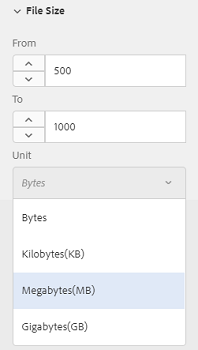

# Sök resurser i [!DNL Experience Manager] {#search-assets-in-aem}

>[!CAUTION]
>
>AEM 6.4 har nått slutet på den utökade supporten och denna dokumentation är inte längre uppdaterad. Mer information finns i [teknisk supportperiod](https://helpx.adobe.com/support/programs/eol-matrix.html). Hitta de versioner som stöds [här](https://experienceleague.adobe.com/docs/).

Lär dig hur du hittar de resurser du behöver i [!DNL Experience Manager] genom att använda panelen Filter och hur du använder resurser som visas i sökningen.

Använd panelen Filter för att söka efter resurser, mappar, taggar och metadata. Du kan söka efter delar av en sträng med hjälp av asterisk med jokertecken.

På panelen Filter finns olika alternativ för att söka efter resurser och mappar på flera sätt i stället för i en allmän taxonisk ordning.

Du kan söka baserat på följande alternativ (prediktiv):

* Filtyp
* Filstorlek
* Fältnamn
* Senast ändrad
* Status
* Orientering
* Stil
* Insikter

<!-- TBD keystroke 65 article and port applicable changes here. This content goes. -->

Du kan anpassa panelen Filter och lägga till/ta bort sökpredikatorn med [sökfack](search-facets.md). Så här visar du panelen Filter:

1. Tryck/klicka på i Assets-användargränssnittet  i verktygsfältet för att visa rutan Omsök.
1. Ange söktermen och tryck på Retur. Du kan också trycka på Retur utan att ange något sökord. Ange inga inledande blanksteg, annars fungerar inte sökningen.

1. Tryck/klicka på ikonen GlobalNav. Panelen Filter visas.

   

   Beroende på vilken typ av objekt du söker efter visas antalet träffar högst upp i sökresultatet.

   

## Sök efter filtyper {#search-for-file-types}

Med panelen Filter kan du göra sökningen mer detaljerad och sökfunktionen mer flexibel. Du kan enkelt gå ned till önskad detaljnivå.

Om du till exempel söker efter en bild använder du **[!UICONTROL File Type]** kan du välja om du vill ha en bitmappsbild eller vektorbild.

Du kan begränsa sökningen ytterligare genom att ange bildens MIME-typ.

På samma sätt kan du ange formatet när du söker efter dokument, till exempel PDF eller MS Word.

## Sök baserat på filstorlek {#search-based-on-file-size}

Använd **Filstorlek** förutsäga att söka efter resurser baserat på deras storlek. Du kan ange de nedre och övre gränserna för storleksintervallet för att begränsa sökningen. Du kan också ange måttenhet, till exempel kB, megabyte och så vidare.

## Sökning baserad på när resurser senast ändrades {#search-based-on-when-assets-are-last-modified}

Om du hanterar resurser som är under arbete eller övervakar ett granskningsarbetsflöde kan du söka efter när en resurs senast ändrades baserat på korrekta tidsstämplar. Ange till exempel datum före eller efter vilka resurser ändrades.

Du kan också använda följande alternativ för att få en högre detaljnivå i sökningen:

## Sök baserat på status {#search-based-on-status}

Använd **Status** predikera för att söka efter resurser baserat på olika typer av status, som Publicera, Godkännande, Utcheckning och Förfallotid.

När du övervakar publicering av resurser kan du till exempel använda lämpligt alternativ för att söka efter vilka resurser som publiceras.

När du övervakar granskningsstatusen för resurser ska du använda lämpligt alternativ för att hitta vilka resurser som är godkända eller vilka resurser som väntar på godkännande.

## Sök baserat på Insights-data {#search-based-on-insights-data}

Använd **Insikter** förutsäga att söka efter resurser baserat på användningsstatistik från olika Creative-program. Användningsdata grupperas under följande kategorier:

* Användningspoäng
* Impressions
* Klickningar
* Mediekanaler där resurserna visas

