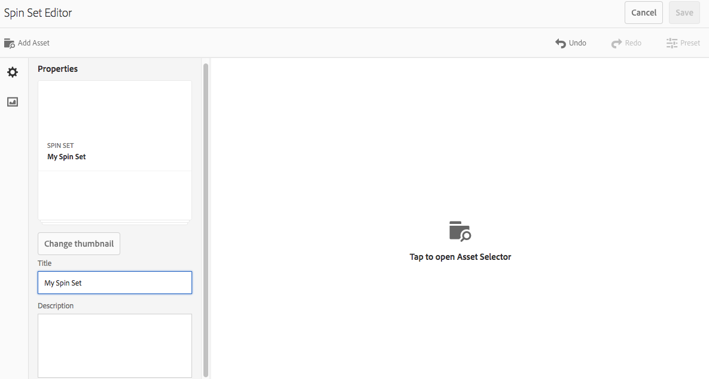

# Snurrande uppsättningar {#spin-sets}

Med en snurra uppsättning kan du simulera hur det ser ut när du vrider ett objekt för att undersöka det. Med snurra uppsättningar kan du visa objekt från vilken vinkel som helst och få fram de viktigaste visuella detaljerna från vilken vinkel som helst.

Med en snurra uppsättning simuleras en 360-graders visningsupplevelse. Dynamic Media har en enda axelsnurra där tittarna kan rotera ett objekt. Dessutom kan man zooma och panorera med några enkla musklick. På så sätt kan användare undersöka ett objekt närmare från en viss betraktningsvinkel.

Snurra uppsättningar definieras av en banderoll med ordet **[!UICONTROL SPINSET]**. Om snurruppsättningen dessutom är publicerad är det publiceringsdatum som anges av **[!UICONTROL World]** -ikonen på banderollen tillsammans med det senaste ändringsdatumet, som anges av **[!UICONTROL pennikonen]** .

>[!NOTE]
>
>Mer information om användargränssnittet Resurser finns i [Hantera resurser med Touch-gränssnittet](managing-assets-touch-ui.md).

## Snabbstart: Snurra uppsättningar {#quick-start-spin-sets}

Så här kommer du igång snabbt med Spin Sets:

1. [Ladda upp bilderna för flera vyer.](#uploading-assets-for-spin-sets)

   Du behöver minst 8-12 tagningar av ett objekt för en endimensionell snurra och 16-24 för en tvådimensionell snurra uppsättning. Fotografierna måste tas med jämna mellanrum för att ge intryck av att objektet roteras och vändas. Om en endimensionell snurra t.ex. innehåller 12 tagningar roterar du objektet 30 grader (360/12) för varje tagning.

1. [Skapa snurruppsättningar.](#creating-spin-sets)

   Om du vill skapa en snurra uppsättning väljer du **[!UICONTROL Skapa > Snurra uppsättning]** och ger sedan uppsättningen ett namn, väljer resurserna och sorterar bilderna i den ordning som de ska visas.

   See [Working with Selectors](working-with-selectors.md).

   >[!NOTE]
   >
   >Du kan också skapa snurra uppsättningar automatiskt med hjälp av [gruppuppsättningsförinställningar](/help/assets/config-dms7.md#creating-batch-set-presets-to-auto-generate-image-sets-and-spin-sets).
   *Batchuppsättningar skapas av IPS (Image Production System) som en del av tillgångsintag och är endast tillgängliga i läget* Dynamic Media - Scene7.

1. Ställ in [förinställningar](managing-viewer-presets.md)för Snurra Ställ in visningsprogram efter behov.

   Administratörer kan skapa eller ändra förinställningar för Spin Set Viewer. Om du vill visa din snurruppsättning med en visningsförinställning väljer du snurra uppsättning och väljer **[!UICONTROL Visare]** i den vänstra listrutan.

   Se **[!UICONTROL Verktyg > Resurser > Visningsförinställningar]** för att skapa eller redigera visningsprogramförinställningar.

   Se [Lägga till och redigera visningsförinställningar.](managing-viewer-presets.md)

1. [Visar snurruppsättningar](#viewing-spin-sets).

   Du kan visa och komma åt uppsättningar som skapats med hjälp av gruppuppsättningsförinställningar på tre olika sätt. (Uppsättningar som skapats med gruppuppsättningsförinställningar visas *inte* i användargränssnittet.)

1. [Förhandsgranska snurra uppsättningar.](previewing-assets.md)

   Markera rotationsuppsättningen så kan du förhandsgranska den. Rotera snurrsuppsättningen. Du kan välja olika visningsprogram på menyn **[!UICONTROL Visare]** , som finns i den vänstra listrutan.

1. [Publicera snurruppsättningar.](publishing-dynamicmedia-assets.md)

   När du publicerar en snurrsuppsättning aktiveras den ordning i vilken bilderna visas i en snurra. Se till att ordna dem så att snurret blir en jämn 360-gradersvy.**[!UICONTROL URL]** och **[!UICONTROL Embed]** -sträng. Dessutom måste du [publicera visningsförinställningen](managing-viewer-presets.md).

1. [Länka URL:er till webbprogrammet](linking-urls-to-yourwebapplication.md) eller [bädda in video- eller bildvisningsprogrammet](embed-code.md).

   AEM Resurser skapar URL-anrop för Spin Sets och aktiverar dem när du har publicerat Spin Sets. Du kan kopiera dessa URL:er när du förhandsgranskar resurser. Du kan även bädda in dem på din webbplats.

   Välj rotationsuppsättningen och välj sedan **[!UICONTROL Visare]** i den vänstra listrutan.

   Se [Länka en snurrsuppsättning till en webbsida](linking-urls-to-yourwebapplication.md) och [Bädda in video- eller bildvisningsprogrammet](embed-code.md).

Om du behöver kan du [redigera snurra uppsättningar](#editing-spin-sets). Dessutom kan du visa och redigera egenskaper [för](managing-assets-touch-ui.md#editing-properties)snurra uppsättningar.

## Överför resurser för snurpuppsättningar {#uploading-assets-for-spin-sets}

Du behöver minst 8-12 tagningar av ett objekt för en endimensionell snurra och 16-24 för en tvådimensionell snurra uppsättning. Fotografierna måste tas med jämna mellanrum för att ge intryck av att objektet roteras och vändas. Om en endimensionell snurra t.ex. innehåller 12 tagningar roterar du objektet 30 grader (360/12) för varje tagning.

Du kan överföra bilder för Snurra uppsättningar på samma sätt som du [överför andra resurser i AEM Resurser](managing-assets-touch-ui.md).

### Riktlinjer för fotografering av snurra uppsättningsbilder {#guidelines-for-shooting-spin-set-images}

Nedan följer några tips om hur du använder snurra uppsättningsbilder. Ju fler bilder du har i en snurrfunktion, desto bättre blir effekten av att snurra. Om du inkluderar många bilder i uppsättningen ökar dock tiden det tar för bilderna att läsas in. AEM rekommenderar följande riktlinjer för fotografering av bilder för användning i snurra uppsättningar:

* Använd minst 8-12 bilder i en endimensionell snurra och 16-24 bilder i en tvådimensionell snurra. Minst 8 bilder krävs för att kunna vridas 360 grader. Endimensionella snurruppsättningar är vanligare eftersom tvådimensionella snurruppsättningar är arbetsintensiva.
* Använd ett förlustfritt format, TIFF och PNG rekommenderas.
* Maskera alla bilder så att objektet visas på en helt vit eller annan bakgrund med hög kontrast. Du kan också lägga till skuggor.
* Se till att produktinformationen är väl belyst och i fokus.
* Ta snurra bilder till modekläder med mannequin eller modell. Ofta är mannequin antingen helt maskerat (med hjälp av en glasmannequin) eller en stiliserad mannequin/form visas i bilden. Du kan skapa en omformningsrotation genom att definiera antalet vinklar. Markera varje vinkel med band på golvet för att vägleda modellen till steg och titta i riktningen för varje tagning.

## Skapa snurruppsättningar {#creating-spin-sets}

Den ordning i vilken bilderna visas i en snurrfunktion. Se till att ordna dem så att snurret blir en jämn 360-gradersvy.

>[!NOTE]
>
>Du kan också skapa snurra uppsättningar automatiskt med hjälp av [gruppuppsättningsförinställningar](/help/assets/config-dms7.md#creating-batch-set-presets-to-auto-generate-image-sets-and-spin-sets).
 Batchuppsättningar skapas av IPS (Image Production System) som en del av tillgångsintag och är endast tillgängliga i läget Dynamic Media - Scene7.
>
>Se&quot;Skapa gruppuppsättningsförinställningar för automatisk generering av bilduppsättningar och snurruppsättningar&quot; i [Konfigurera dynamiska media - Scene7-läge](/help/assets/config-dms7.md#creating-batch-set-presets-to-auto-generate-image-sets-and-spin-sets).

**Så här skapar du snurruppsättningar:**

1. I Resurser navigerar du till den plats där du vill skapa en snurruppsättning, trycker på **[!UICONTROL Skapa]** och väljer **[!UICONTROL Spin Set**. Du kan också skapa uppsättningen inifrån en mapp som innehåller dina resurser.

   

1. På sidan **[!UICONTROL Snurra uppsättningsredigerare]** anger du ett namn för snurra uppsättningar i fältet **[!UICONTROL Titel]** . Namnet visas i banderollen över snurruppsättningen. Du kan också ange en beskrivning.

   

   När du skapar rotationsuppsättningen kan du ändra miniatyrbilden för rotationsuppsättningen eller tillåta att AEM väljer miniatyrbilden automatiskt baserat på resurserna i rotationsuppsättningen. Om du vill välja en miniatyrbild trycker du på **[!UICONTROL Ändra miniatyrbild]**. Markera en bild (du kan navigera till andra mappar om du även vill söka efter bilder). Om du har valt en miniatyrbild och sedan bestämmer dig för att du vill att AEM ska generera en miniatyrbild från rotationsuppsättningen väljer du **[!UICONTROL Växla till automatisk miniatyrbild]**.

1. Gör något av följande:

   * I närheten av det övre vänstra hörnet på **[!UICONTROL sidan för redigeraren]** för sned uppsättning trycker du på **[!UICONTROL Lägg till resurs]**.
   * I mitten av sidan **[!UICONTROL Snurra uppsättningsredigerare]** trycker du på **[!UICONTROL Tryck för att öppna resursväljaren]**.
   Tryck för att välja resurser som du vill inkludera i din snurruppsättning. De markerade resurserna har en bockmarkeringsikon. När du är klar trycker du på **[!UICONTROL Välj]** i det övre högra hörnet på sidan.

   Med resursväljaren kan du söka efter resurser genom att skriva ett nyckelord och trycka på **[!UICONTROL Retur]**. Du kan också använda filter för att förfina sökresultaten. Du kan filtrera efter sökväg, samling, filtyp och tagg. Markera filtret och tryck sedan på **[!UICONTROL Filtrera]** -ikonen i verktygsfältet. Om du vill ändra vyn trycker du på ikonen **[!UICONTROL Visa]** i det övre högra hörnet av sidan och sedan på **[!UICONTROL Kolumnvy]**, **[!UICONTROL Kortvy]** eller **[!UICONTROL Listvy]**.

   See [Working with Selectors](working-with-selectors.md).

   

1. När du lägger till resurser i uppsättningen läggs de automatiskt till i alfanumerisk ordning. Du kan sortera om eller sortera resurser manuellt när du har lagt till dem. Om det behövs kan du dra ikonen **[!UICONTROL Ändra ordning]** för en resurs till höger om resursens filnamn för att ordna om bilderna uppåt eller nedåt i uppsättningslistan.

   

1. (Valfritt) Gör något av följande:

   * Om du vill ta bort en bild markerar du bilden och trycker sedan på **[!UICONTROL Ta bort resurs]**.
   * Om du vill använda en förinställning i det övre högra hörnet av sidan trycker du på **[!UICONTROL Förinställning]** och väljer sedan en förinställning som ska användas på alla resurser samtidigt.

1. Tryck på **[!UICONTROL Spara]**. Den nyligen skapade rotationsuppsättningen visas i den mapp som du skapade den i.

## Visa snurruppsättningar {#viewing-spin-sets}

Du kan skapa snurruppsättningar antingen i användargränssnittet eller automatiskt med hjälp av [gruppuppsättningsförinställningar](/help/assets/config-dms7.md#creating-batch-set-presets-to-auto-generate-image-sets-and-spin-sets). Uppsättningar som skapats med gruppuppsättningsförinställningar visas *inte* i användargränssnittet. Du kan komma åt uppsättningar som skapats med hjälp av gruppuppsättningsförinställningar på tre olika sätt. (De här metoderna är tillgängliga även om du har skapat snurruppsättningarna i användargränssnittet).

Du kan också visa uppsättningar via användargränssnittet enligt beskrivningen i [Redigera snurruppsättningar](#editing-spin-sets).

**Så här visar du snurruppsättningar:**

1. När egenskaperna för en enskild resurs öppnas. Egenskaper anger vad som ställer in den valda resursen som medlem av (under **[!UICONTROL Medlem i uppsättningar]**). Tryck på uppsättningens namn för att visa hela uppsättningen.

   

1. Från en medlemsbild av en uppsättning. Välj menyn **[!UICONTROL Uppsättningar]** för att visa de uppsättningar som resursen är medlem i.

   

1. I sökningen kan du välja **[!UICONTROL Filter]**, sedan expandera **[!UICONTROL Dynamiska media]** och sedan välja **[!UICONTROL uppsättningar]**.

   Sökningen returnerar matchande uppsättningar som skapats manuellt i användargränssnittet eller automatiskt skapats med gruppuppsättningsförinställningar. För automatiska uppsättningar utförs sökfrågan med **[!UICONTROL Börjar med]** sökvillkor som skiljer sig från AEM-sökning, som baseras på **[!UICONTROL Innehåller]** sökvillkor. Det enda sättet att söka efter automatiska uppsättningar är att ställa in filtret på **[!UICONTROL uppsättningar]** .

   

## Redigera snurruppsättningar {#editing-spin-sets}

Du kan utföra en mängd redigeringsåtgärder på snurra uppsättningar, till exempel:

* Lägg till bilder i rotationsrutan.
* Ändra ordning på bilderna i rotationsrutan.
* Ta bort resurser i rotationsuppsättningen.
* Använd förinställningar för visningsprogram.
* Ta bort rotationsrutan.

**Så här redigerar du en snurra:**

1. Gör något av följande:

   * Håll pekaren över en resurs i en snurruppsättning och tryck sedan på **[!UICONTROL Redigera]** (pennikon).
   * Håll muspekaren över en resurs i en snurruppsättning, tryck på **[!UICONTROL Markera]** (bockmarkeringsikon) och sedan på **[!UICONTROL Redigera]** i verktygsfältet.
   * Tryck på en snurra uppsättningsresurs och tryck sedan på **[!UICONTROL Redigera]** (pennikon) i verktygsfältet.

1. Gör något av följande om du vill redigera rotationsuppsättningen:

   * Om du vill ändra ordning på bilderna drar du en bild till en ny plats (markera ikonen för att ändra ordning för att flytta objekt).
   * Om du vill sortera objekt i stigande eller fallande ordning trycker du på kolumnrubriken.
   * Om du vill lägga till en resurs eller uppdatera en befintlig resurs trycker du på **[!UICONTROL Lägg till resurs]**. Navigera till en resurs, markera den och tryck sedan på **[!UICONTROL Välj]** i det övre högra hörnet.
Om du tar bort den bild som AEM använder som miniatyrbild genom att ersätta den med en annan bild, visas fortfarande originalresursen.
   * Om du vill ta bort en resurs markerar du den och trycker på **[!UICONTROL Ta bort resurs]**.
   * Om du vill använda en förinställning trycker du på **[!UICONTROL förinställningsikonen]** och väljer en förinställning.
   * Om du vill ta bort en hel snurruppsättning går du till snurpuppsättningen, markerar den och väljer **[!UICONTROL Ta bort]**

      >[!NOTE]
      >* Du kan redigera bilderna i en snurruppsättning genom att gå till uppsättningen, trycka på **[!UICONTROL Ange medlemmar]** i den vänstra listen och sedan på ikonen **[!UICONTROL Redigera]** (pennikon) på en enskild resurs för att öppna redigeringsfönstret.

1. Klicka på **[!UICONTROL Spara]** när redigeringen är klar.

## Förhandsgranska snurra uppsättningar {#previewing-spin-sets}

Se [Förhandsgranska resurser](previewing-assets.md).

## Publicera snurruppsättningar {#publishing-spin-sets}

Se [Publicera resurser](publishing-dynamicmedia-assets.md).
