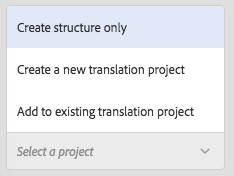
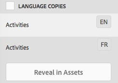
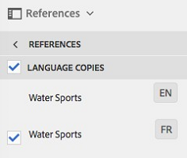

# Skapa översättningsprojekt {#creating-translation-projects}

Om du vill skapa en språkkopia aktiverar du ett av följande språkkopieringsarbetsflöden som finns under referenspunkterna i resursgränssnittet:

**Skapa och översätta**

I det här arbetsflödet kopieras resurser som ska översättas till språkroten för det språk som du vill översätta till. Beroende på vilka alternativ du väljer skapas dessutom ett översättningsprojekt för resurserna i projektkonsolen. Beroende på inställningarna kan översättningsprojektet startas manuellt eller köras automatiskt så fort översättningsprojektet skapas.

**Uppdatera språkkopior**

Du kör det här arbetsflödet för att översätta ytterligare en grupp resurser och inkludera den i en språkkopia för en viss språkinställning. I det här fallet läggs de översatta resurserna till i målmappen som redan innehåller tidigare översatta resurser.

>[!NOTE]
>
>Resursbinärfiler översätts bara om översättningstjänsten stöder översättning av binärfiler.

>[!NOTE]
>
>Om du startar ett översättningsarbetsflöde för komplexa resurser, som PDF-filer och InDesign-filer, skickas inte delresurserna eller återgivningarna (om sådana finns) för översättning.

## Skapa och översätta arbetsflöde {#create-and-translate-workflow}

Du använder arbetsflödet Skapa och översätt för att generera språkkopior för ett visst språk för första gången. Arbetsflödet innehåller följande alternativ:

* Skapa endast struktur
* Skapa ett nytt översättningsprojekt
* Lägg till i befintligt översättningsprojekt

### Skapa endast struktur {#create-structure-only}

Använd alternativet **Skapa endast** struktur om du vill skapa en målmappshierarki inom målspråkets rot för att matcha källmappens hierarki inom källspråkets rot. I det här fallet kopieras källresurserna till målmappen. Inget översättningsprojekt genereras emellertid.

1. I resursgränssnittet väljer du den källmapp som du vill skapa en struktur för i målspråkets rot.
1. Öppna rutan **[!UICONTROL Referenser]** och klicka/tryck på **[!UICONTROL Språkkopior]** under **[!UICONTROL Kopior]**.

   

1. Klicka/tryck på **[!UICONTROL Skapa och översätt]** längst ned.

   

1. I listan **[!UICONTROL Målspråk]** väljer du det språk som du vill skapa en mappstruktur för.

   

1. I **[!UICONTROL projektlistan]** väljer du bara **** Skapa struktur.

   

1. Klicka/tryck på **[!UICONTROL Skapa]**. Den nya strukturen för målspråket listas under **[!UICONTROL Språkkopior]**.

   

1. Klicka på/tryck på strukturen i listan och klicka/tryck sedan på **[!UICONTROL Visa i resurser]** för att navigera till mappstrukturen i målspråket.

   

### Skapa ett nytt översättningsprojekt {#create-a-new-translation-project}

Om du använder det här alternativet kopieras resurser som ska översättas till språkroten för det språk som du vill översätta till. Beroende på vilka alternativ du väljer skapas ett översättningsprojekt för resurserna i projektkonsolen. Beroende på inställningarna kan översättningsprojektet startas manuellt eller automatiskt så snart översättningsprojektet skapas.

1. I resursgränssnittet väljer du den källmapp som du vill skapa en språkkopia för.
1. Öppna rutan **[!UICONTROL Referenser]** och klicka/tryck på **[!UICONTROL Språkkopior]** under **[!UICONTROL Kopior]**.

   

1. Klicka/tryck på **[!UICONTROL Skapa och översätt]** längst ned.

   

1. I listan **[!UICONTROL Målspråk]** väljer du det eller de språk som du vill skapa en mappstruktur för.

   

1. Välj **[!UICONTROL Skapa ett nytt översättningsprojekt]** i listan **[!UICONTROL Projekt]**.

   

1. Ange en rubrik för projektet i fältet **[!UICONTROL Projektnamn]** .

   

1. Klicka/tryck på **[!UICONTROL Skapa]**. Resurser från källmappen kopieras till målmapparna för de språkinställningar du valde i steg 4.

   

1. Om du vill navigera till mappen markerar du språkkopian och klickar på **[!UICONTROL Visa i Resurser]**.

   

1. Navigera till projektkonsolen. Översättningsmappen kopieras till projektkonsolen.

   

1. Öppna mappen för att visa översättningsprojektet.

   

1. Klicka/tryck på projektet för att öppna informationssidan.

   

1. Om du vill visa översättningsjobbets status klickar du på ellipsen längst ned i rutan **[!UICONTROL Översättningsjobb]** .

   

   Mer information om jobbstatus finns i [Övervaka status för ett översättningsjobb](/help/sites-administering/tc-manage.md#monitoring-the-status-of-a-translation-job).

1. Navigera till resursgränssnittet och öppna sidan Egenskaper för var och en av de översatta resurserna för att visa översatta metadata.

   

   >[!NOTE]
   >
   >Den här funktionen är tillgänglig både för resurser och mappar. När en resurs väljs i stället för en mapp kopieras hela mapphierarkin upp till språkroten för att skapa en språkkopia för resursen.

### Lägg till i befintligt översättningsprojekt {#add-to-existing-translation-project}

Om du använder det här alternativet körs översättningsarbetsflödet för resurser som du lägger till i källmappen efter att ha kört ett tidigare arbetsflöde för översättning. Endast resurser som nyligen lagts till kopieras till målmappen som innehåller tidigare översatta resurser. Inget nytt översättningsprojekt skapas i det här fallet.

1. Navigera till källmappen som innehåller oöversatta resurser i resursgränssnittet.
1. Markera en resurs som du vill översätta och öppna **[!UICONTROL referensrutan]**. Under **[!UICONTROL Språkkopior]** visas antalet översättningskopior som är tillgängliga.
1. Klicka/tryck på **[!UICONTROL Språkkopior]** under **[!UICONTROL Kopior]**. En lista över tillgängliga översättningskopior visas.
1. Klicka/tryck på **[!UICONTROL Skapa och översätt]** längst ned.

   

1. I listan **[!UICONTROL Målspråk]** väljer du det eller de språk som du vill skapa en mappstruktur för.

   

1. I listan **[!UICONTROL Projekt]** väljer du **[!UICONTROL Lägg till i befintligt översättningsprojekt]** för att köra översättningsarbetsflödet i mappen.

   

   >[!NOTE]
   >
   >Om du väljer alternativet **[!UICONTROL Lägg till i befintligt översättningsprojekt]** läggs ditt översättningsprojekt till i ett befintligt projekt endast om dina projektinställningar exakt matchar inställningarna för det befintliga projektet. Annars skapas ett nytt projekt.

1. I listan **[!UICONTROL Befintliga översättningsprojekt]** väljer du ett projekt som du vill lägga till resursen för översättning.

   

1. Klicka/tryck på **[!UICONTROL Skapa]**. Resurserna som ska översättas läggs till i målmappen. Den uppdaterade mappen listas under **[!UICONTROL Språkkopior]** .

   

1. Navigera till projektkonsolen och öppna det befintliga översättningsprojektet som du har lagt till i.
1. Klicka/tryck på sidan med projektinformation för översättning.

   

1. Klicka på/tryck på ellipsen längst ned i rutan **Översättningsjobb** för att visa resurserna i översättningsarbetsflödet. I översättningsjobblistan visas även poster för metadata och taggar för resurser. Dessa poster anger att metadata och taggar för resurserna också översätts.

   >[!NOTE]
   >
   >Om du tar bort posten för taggar eller metadata översätts inga taggar eller metadata för resurserna.

   >[!NOTE]
   >
   >Om du använder maskinöversättning översätts inte resursens binärfiler.

   >[!NOTE]
   >
   >Om den resurs som du lägger till i översättningsjobbet innehåller delresurser, markerar du delresurserna och tar bort dem för översättningen för att fortsätta utan några fel.

1. Om du vill starta översättningen av resurserna klickar/trycker du på pilen på **[!UICONTROL översättningsjobbpanelen]** och väljer **[!UICONTROL Start]** i listan.

   

   Ett meddelande meddelar när översättningsjobbet påbörjas.

   

1. Om du vill visa översättningsjobbets status klickar/trycker du på ellipsen längst ned i rutan **[!UICONTROL Översättningsjobb]** .

   

   Mer information finns i [Övervaka status för ett översättningsjobb](/help/sites-administering/tc-manage.md#monitoring-the-status-of-a-translation-job).

1. När översättningen är klar ändras statusen till Klart för granskning. Navigera till resursgränssnittet och öppna sidan Egenskaper för var och en av de översatta resurserna för att visa översatta metadata.

## Uppdatera språkkopior {#update-language-copies}

Kör det här arbetsflödet för att översätta alla ytterligare resurser och inkludera dem i en språkkopia för en viss språkinställning. I det här fallet läggs de översatta resurserna till i målmappen som redan innehåller tidigare översatta resurser. Beroende på vilka alternativ du väljer skapas ett översättningsprojekt eller så uppdateras ett befintligt översättningsprojekt för de nya resurserna. Arbetsflödet för att uppdatera språkkopior innehåller följande alternativ:

* Skapa ett nytt översättningsprojekt
* Lägg till i befintligt översättningsprojekt

### Skapa ett nytt översättningsprojekt {#create-a-new-translation-project-1}

Om du använder det här alternativet skapas ett översättningsprojekt för den resursuppsättning som du vill uppdatera en språkkopia för.

1. I resursgränssnittet väljer du den källmapp där du lade till en resurs.
1. Öppna rutan **[!UICONTROL Referenser]** och klicka/tryck på **[!UICONTROL Språkkopior]** under **[!UICONTROL Kopior]** för att visa listan med språkkopior.
1. Markera kryssrutan före **[!UICONTROL Språkkopior]** och välj sedan den målmapp som motsvarar rätt språkinställning.

   

1. Klicka/tryck på **[!UICONTROL Uppdatera språkkopior]** längst ned.

   

1. Välj **[!UICONTROL Skapa ett nytt översättningsprojekt]** i listan **[!UICONTROL Projekt]**.

   

1. Ange en rubrik för projektet i fältet **[!UICONTROL Projektnamn]** .

   

1. Klicka/tryck på **[!UICONTROL Start]**.
1. Navigera till projektkonsolen. Översättningsmappen kopieras till projektkonsolen.

   

1. Öppna mappen för att visa översättningsprojektet.

   

1. Klicka/tryck på projektet för att öppna informationssidan.

   

1. Om du vill starta översättningen av resurserna klickar du på pilen på **[!UICONTROL översättningsjobbpanelen]** och väljer **[!UICONTROL Start]** i listan.

   

   Ett meddelande meddelar när översättningsjobbet påbörjas.

   

1. Om du vill visa översättningsjobbets status klickar/trycker du på ellipsen längst ned i rutan **[!UICONTROL Översättningsjobb]** .

   

   Mer information om jobbstatus finns i [Övervaka status för ett översättningsjobb](../sites-administering/tc-manage.md#monitoring-the-status-of-a-translation-job).

1. Navigera till resursgränssnittet och öppna sidan Egenskaper för var och en av de översatta resurserna för att visa översatta metadata.

### Lägg till i befintligt översättningsprojekt {#add-to-existing-translation-project-1}

Om du använder det här alternativet läggs resursuppsättningen till i ett befintligt översättningsprojekt för att uppdatera språkkopian för det språkområde du väljer.

1. I resursgränssnittet väljer du den källmapp där du lade till en resursmapp.
1. Öppna rutan **** Referenser och klicka/tryck på **[!UICONTROL Språkkopior]** under **[!UICONTROL Kopior]** för att visa listan med språkkopior.

   

1. Markera kryssrutan före **[!UICONTROL Språkkopior]**, där alla språkkopior markeras. Avmarkera andra kopior än den språkkopia (kopior) som motsvarar det eller de språk som du vill översätta till.

   

1. Klicka/tryck på **[!UICONTROL Uppdatera språkkopior]** längst ned.

   

1. Välj **[!UICONTROL Lägg till i befintligt översättningsprojekt]** i listan **[!UICONTROL Projekt]**.

   

1. I listan **[!UICONTROL Befintliga översättningsprojekt]** väljer du ett projekt som du vill lägga till resursen för översättning.

   

1. Klicka/tryck på **[!UICONTROL Start]**.
1. Se steg 9-14 i [Lägg till i befintligt översättningsprojekt](translation-projects.md#add-to-existing-translation-project) för att slutföra resten av proceduren.

## Skapa tillfälliga språkkopior {#creating-temporary-language-copies}

När du kör ett översättningsarbetsflöde för att uppdatera en språkkopia med redigerade versioner av originalresurser bevaras den befintliga språkkopian tills du godkänner översatta resurser. AEM Resurser lagrar de nyligen översatta resurserna på en tillfällig plats och uppdaterar den befintliga språkkopian när du uttryckligen har godkänt resurserna. Om du avvisar resurserna ändras inte språkkopian.

1. Klicka/tryck på källrotmappen under **[!UICONTROL Språkkopior]** som du redan har skapat en språkkopia för och klicka/tryck sedan på **[!UICONTROL Visa i resurser]** för att öppna mappen i AEM Resurser.

   

1. I resursgränssnittet markerar du en resurs som du redan har översatt och klickar/trycker på **[!UICONTROL redigeringsikonen]** i verktygsfältet för att öppna resursen i redigeringsläge.

   

1. Redigera resursen och spara sedan ändringarna.
1. Uppdatera språkkopian genom att utföra steg 2-14 i proceduren [Lägg till i befintligt översättningsprojekt](#add-to-existing-translation-project) .
1. Klicka på/tryck på ellipsen längst ned i rutan **[!UICONTROL Översättningsjobb]** . I listan över resurser på sidan **[!UICONTROL Översättningsjobb]** kan du tydligt visa den tillfälliga plats där den översatta versionen av resursen lagras.

   

1. Markera kryssrutan bredvid **[!UICONTROL Titel]**.
1. Klicka/tryck på **[!UICONTROL Acceptera översättning]** i verktygsfältet och klicka/tryck sedan på **[!UICONTROL Acceptera]** i dialogrutan för att skriva över den översatta resursen i målmappen med den översatta versionen av den redigerade resursen.

   

   >[!NOTE]
   >
   >Om du vill att översättningsarbetsflödet ska kunna uppdatera målresurserna, godkänner du både resursen och metadata.

   Klicka/tryck på **[!UICONTROL Avvisa översättning]** om du vill behålla den ursprungligen översatta versionen av resursen i målspråkets rot och avvisa den redigerade versionen.

   

1. Navigera till resurskonsolen och öppna sidan Egenskaper för var och en av de översatta resurserna för att visa översatta metadata.

Tips om hur du översätter metadata för resurser effektivt finns i [5 steg för effektiv översättning av metadata](https://blogs.adobe.com/experiencedelivers/experience-management/translate_aemassets_metadata/).
