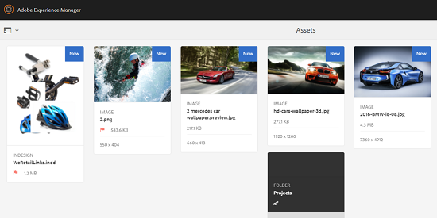
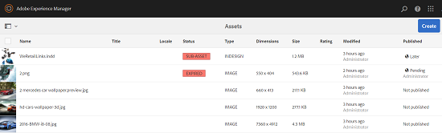
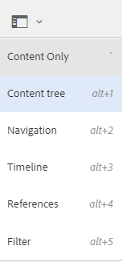

# Förbättringar av användarupplevelsen i Assets {#user-experience-enhancements-in-assets}

AEM 6.4 Assets innehåller flera förbättringar av användbarheten som ger en smidig användarupplevelse och ökar produktiviteten. Den snabba hastigheten med vilken ni kan skapa/hantera ert marknadsmaterial ökar företagets innehållshastighet.

Gränssnittet är mer responsivt, vilket hjälper dig att hantera en stor portfölj med resurser på ett effektivt sätt. Du kan snabbt söka, visa, sortera och smidigt bläddra igenom en lång lista med objekt.

Du kan anpassa de olika vyerna - kort-, lista- och kolumnvyer. Du kan till exempel konfigurera storleken på miniatyrbilder som du vill visa i kortvyn. I listvyn kan du konfigurera den detaljnivå som du vill visa för resurser i listan. AEM 6.4 Assets innehåller en ny trädvy där du bekvämt kan navigera i resurskatalogen och hitta dina resurser.

## Lazy loading {#lazy-loading}

När du bläddrar bland/söker efter resurser i AEM 6.4-resurser visas upp till 200 resurser i taget. Du kan bläddra igenom resultaten snabbare, vilket är särskilt användbart när du bläddrar igenom en lång lista med resultat. Eftersom ett stort antal resurser läses in samtidigt blir webbläsarupplevelsen smidig.

Om du trycker/klickar på en resurs för att granska dess informationssida kan du gå tillbaka till resultatsidan genom att trycka/klicka på knappen Bakåt i verktygsfältet.

## Förbättringar i kortvyn {#card-view-improvements}

Beroende på vilken enhet du använder och hur detaljerad du behöver kan du ändra storlek på miniatyrbilderna för resursen i kortvyn. På så sätt kan du anpassa visningen och styra antalet miniatyrbilder som visas.

Så här ändrar du storlek på miniatyrbilder i kortvyn:

1. Tryck/klicka på layoutikonen i verktygsfältet och välj sedan alternativet **[!UICONTROL Visa inställningar]** .

   

1. Välj önskad miniatyrstorlek i dialogrutan **[!UICONTROL Vyinställningar]** och tryck/klicka sedan på **[!UICONTROL Uppdatera]**.

   

1. Granska miniatyrbilderna som visas i vald storlek.

   

Rutan i kortvyn visar nu ytterligare information, till exempel publiceringsstatus.

## Förbättrade listvyer {#list-view-improvements}

I listvyn visar den första kolumnen nu filnamnen på resurserna som standard. Ytterligare information, som publicerings- och bearbetningsstatus samt språkområde, visas också.

Du kan välja att konfigurera hur mycket information du vill visa. Tryck/klicka på layoutikonen, välj alternativet **[!UICONTROL Visningsinställningar]** och ange de kolumner som du vill visa i dialogrutan **[!UICONTROL Visningsinställningar]** .

## Förbättrad kolumnvy {#column-view-improvements}

Förutom kort- och listvyer kan du nu navigera till informationssidan för en resurs från kolumnvyn. Välj en resurs i kolumnvyn och tryck/klicka sedan på **[!UICONTROL Mer information]** under ögonblicksbilden av resursen.

## Trädvy {#tree-view}

AEM 6.4 Resurser innehåller en trädvy där du enkelt kan bläddra i resurshierarkin och navigera till önskad resurs eller mapp.

Om du vill öppna trädvyn trycker/klickar du på ikonen GlobalNav i `Assets UI`och väljer **[!UICONTROL Innehållsträdet]** på menyn.

Navigera från innehållshierarkin till önskad resurs.

## Navigera i resursinformation {#navigating-asset-details}

Sidan med resursinformation innehåller nu knapparna Föregående och Nästa i verktygsfältet så att du kan visa alla bilder i en mapp i följd.

Beroende på vilken enhet du använder kan du även svepa eller använda piltangenterna på tangentbordet för att gå fram och tillbaka mellan bilderna.

Beroende på den valda layouten kan du öppna informationssidan för en resurs på följande sätt:

| **Visa** | **Öppna sidan med resursinformation** |
|---|---|
| [!UICONTROL Kortvy] | Tryck/klicka på resurspanelen. |
| [!UICONTROL Listvy] | Tryck/klicka på radposten för resursen i listan. |
| [!UICONTROL Kolumnvy] | Tryck/klicka på knappen **[!UICONTROL Mer information]** i ögonblicksbilden av resursen. |

Använd knapparna Föregående/Nästa för att gå fram och tillbaka mellan resurserna.

