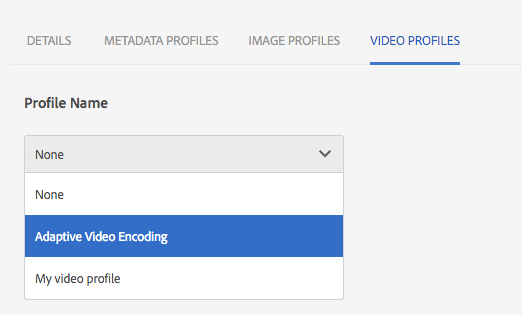

# Dynamic Media video profiles {#video-profiles}

Dynamic Media har redan en fördefinierad adaptiv videokodningsprofil. Inställningarna i den här färdiga profilen är optimerade för att ge kunderna bästa möjliga visningsupplevelse. När du kodar dina huvudvideor med den adaptiva videokodningsprofilen justeras videospelaren automatiskt i videoströmmens kvalitet under uppspelningen baserat på internetanslutningshastigheten hos dina kunder. Detta kallas adaptiv strömning.

Följande är andra faktorer som avgör kvaliteten på videoklipp:

* **Upplösning för den överförda huvudvideon**

   Om MP4-videon spelades in med en lägre upplösning, till exempel 240p eller 360p, kan den inte direktuppspelas i HD.

* **Videospelarens storlek**

   Som standard är **[!UICONTROL Bredd]** i profilen Adaptiv videokodning inställd på **[!UICONTROL Auto]**. Under uppspelningen används återigen den bästa kvaliteten baserat på spelarens storlek.

Se även [Bästa metoder för videokodning](video.md#best-practices-for-encoding-videos).

>[!NOTE]
>
>Om du vill generera videons metadata och tillhörande videobildminiatyrer måste själva videon gå igenom kodningsprocessen i Dynamic Media. I AEM kodar arbetsflödet **[!UICONTROL Dynamic Media Encode Video]** om du har aktiverat dynamiska media och konfigurerat videolmolntjänster. Det här arbetsflödet innehåller information om arbetsflödets processhistorik och fel.
>
>Se [Övervaka videokodning och Publiceringsförloppet](video.md#monitoring-video-encoding-and-youtube-publishing-progress)på YouTube. Om du har aktiverat Dynamic Media och konfigurerat videomolntjänster börjar arbetsflödet **[!UICONTROL Dynamic Media Encode Video]** automatiskt att gälla när du överför en video. (Om du inte använder dynamiska medier träder arbetsflödet för **[!UICONTROL DAM-uppdatering av resurser]** i kraft.)
>
>Metadata är användbara när du söker efter resurser. Miniatyrbilderna är statiska videobilder som genereras under kodningen. De krävs av AEM-systemet och används i användargränssnittet för att visuellt identifiera videor i **[!UICONTROL kortvyn]**, **[!UICONTROL sökresultatvyn]** och vyn **[!UICONTROL Resurslista]** . Du kan se de genererade miniatyrbilderna när du trycker på ikonen **[!UICONTROL Återgivningar]** (en målarpalett) för en kodad video.

När du har skapat videoprofilen använder du den på en mapp eller flera mappar. Se [Använda en videoprofil för mappar.](#applying-a-video-profile-to-folders)

Mer information om hur du definierar avancerade bearbetningsparametrar för andra resurstyper finns i [Konfigurera tillgångsbearbetning](config-dms7.md#configuring-asset-processing).

## Förinställningar för adaptiv videokodning {#adaptive-video-encoding-presets}

I följande tabell visas kodningsprofiler med bästa praxis för adaptiv videoströmning till mobiler, surfplattor och stationära datorer. Du kan använda de här förinställningarna för video med alla proportioner.

<table> 
 <tbody> 
  <tr> 
   <td><strong>Videoformatkodek</strong></td> 
   <td><strong>Videostorlek - bredd (px)</strong></td> 
   <td><strong>Videostorlek - höjd (px)</strong></td> 
   <td><strong>Behåll proportioner?</strong></td> 
   <td><strong>Videobithastighet (kbit/s)</strong></td> 
   <td><strong>Bildrutefrekvens för video (fps)</strong></td> 
   <td><strong>Ljudkodek</strong></td> 
   <td><strong>Ljudbithastighet (kbit/s)</strong></td> 
  </tr> 
  <tr> 
   <td>
MP4 H.264 (mp4)
 </td> 
   <td>autom.</td> 
   <td>360</td> 
   <td>Ja</td> 
   <td>730</td> 
   <td>30</td> 
   <td>Dolby HE-AAC</td> 
   <td>128</td> 
  </tr> 
  <tr> 
   <td>
MP4 H.264 (mp4)
 </td> 
   <td>autom.</td> 
   <td>540</td> 
   <td>Ja</td> 
   <td>2000  </td> 
   <td>30</td> 
   <td>Dolby HE-AAC</td> 
   <td>128</td> 
  </tr> 
  <tr> 
   <td>
MP4 H.264 (mp4)
 </td> 
   <td>autom.</td> 
   <td>720  </td> 
   <td>Ja</td> 
   <td>3000  </td> 
   <td>30</td> 
   <td>Dolby HE-AAC</td> 
   <td>128</td> 
  </tr> 
 </tbody> 
</table>

## Skapa en videokodningsprofil för dynamiska media för adaptiv strömning {#creating-a-video-encoding-profile-for-adaptive-streaming}

Dynamic Media har redan en fördefinierad Adaptive Video Encoding-profil - en grupp inställningar för videoöverföring för MP4 H.264 - som är optimerade för den bästa tittarupplevelsen. Du kan använda den här profilen när du överför videoklipp.

Om den här fördefinierade profilen inte uppfyller dina behov kan du välja att skapa en egen adaptiv videokodningsprofil. När du använder inställningen **[!UICONTROL Koda för adaptiv direktuppspelning]**-*en bra metod*- valideras alla kodningsförinställningar som du lägger till i profilen så att alla videoklipp har samma proportioner. Dessutom hanteras de kodade videoklippen som en uppsättning med flera bithastigheter för direktuppspelning.

När du skapar videokodningsprofilen ser du att de flesta kodningsalternativen är förifyllda med rekommenderade standardinställningar. Om du väljer ett annat värde än det rekommenderade standardvärdet bör du vara medveten om att det kan leda till sämre videokvalitet under uppspelning och andra prestandaproblem.

För alla kodningsförinställningar för MP4 H.264-video i profilen valideras följande värden för att säkerställa att de är desamma i alla enskilda kodningsförinställningar i profilen, vilket gör adaptiv strömning möjlig:

* Videoformatkodek - MP4 H.264 (.mp4)
* Ljudkodek
* Bithastighet för ljud
* Behåll proportioner
* Kodning i två omgångar
* Konstant bithastighet
* H264-profil
* Samplingsfrekvens för ljud

Om värdena inte är desamma kan du fortsätta skapa profilen som den är. Tänk dock på att adaptiv strömning inte kommer att vara möjlig. I stället får användarna direktuppspelning med en bithastighet. Vi rekommenderar att du redigerar kodningsinställningarna så att samma värden används för de enskilda kodningsförinställningarna i profilen. (Observera att videoprofilen/förinställningsredigeraren bör tillämpa paritet för de adaptiva videokodningsinställningarna om **[!UICONTROL Koda för adaptiv strömning]** är aktiverat.)

Se även [Skapa en videokodningsprofil för progressiv direktuppspelning](#creating-a-video-encoding-profile-for-progressive-streaming).

Se även [Bästa metoder för videokodning](video.md#best-practices-for-encoding-videos).

Mer information om hur du definierar avancerade bearbetningsparametrar för andra resurstyper finns i [Konfigurera tillgångsbearbetning](config-dms7.md#configuring-asset-processing).

När du har skapat videoprofilen kan du använda den på en eller flera mappar.

**Så här skapar du en videokodningsprofil för dynamiska media för adaptiv strömning**:

1. Tryck eller klicka på AEM-logotypen och navigera till **[!UICONTROL Verktyg > Resurser > Videoprofiler]**.
1. Tryck på **[!UICONTROL Skapa]** för att lägga till en ny videoprofil.

1. Ange ett namn och en beskrivning för profilen.
1. Kontrollera att **[!UICONTROL Koda för adaptiv direktuppspelning]** är markerat (standard).
1. Tryck på **[!UICONTROL Lägg till förinställning]** för videokodning.
1. På fliken **[!UICONTROL Grundläggande]** anger du video- och ljudalternativen.

   Tryck på informationsikonen bredvid varje alternativ för ytterligare beskrivningar eller rekommenderade inställningar baserat på den valda videoformatkodeken.

1. Kontrollera att alternativet **[!UICONTROL Behåll proportioner]** är markerat under rubriken Videostorlek.
1. Ställ in videobildrutans upplösning i pixlar. Använd värdet **[!UICONTROL Auto]** för att automatiskt skala så att det matchar källproportionerna (bredd-/höjdförhållandet). Exempel: Auto x 480 eller 640 x Auto.

   Gör något av följande:

   * I fältet **[!UICONTROL Bredd]** anger du **[!UICONTROL auto]**. Ange ett värde i pixlar i fältet **[!UICONTROL Höjd]** .
   * Om du vill få hjälp med att visualisera storleken på videon trycker du på ikonen **[!UICONTROL Information]** (i) till höger om **[!UICONTROL Höjd]** för att öppna sidan **[!UICONTROL Storlekskalkylator]** . Använd **[!UICONTROL Storlekskalkylator]** för att ange videodimensionerna (som representeras av den blå rutan) som du vill använda. Tryck på **[!UICONTROL X]** i det övre högra hörnet när du är klar.

1. (Valfritt) Tryck på fliken **[!UICONTROL Avancerat]** och kontrollera att kryssrutan **[!UICONTROL Använd standardvärden]** är markerad (rekommenderas). Du kan också ändra avancerade video- och ljudinställningar.
1. Tryck på **[!UICONTROL Spara]** i det övre högra hörnet av sidan för att spara förinställningen.
1. Gör något av följande:

   * Upprepa steg 5-10 för att skapa ytterligare kodningsförinställningar. (Adaptiv videoströmning kräver mer än en videoförinställning.)
   * Tryck på **[!UICONTROL Spara]** igen i det övre högra hörnet av sidan för att spara profilen.

## Övervaka kodningsjobbets förlopp {#monitoring-the-progress-of-an-encoding-job}

En bearbetningsindikator (eller förloppsindikator) visas så att du visuellt kan övervaka förloppet för ett videokodningsjobb.

Du kan också visa filen för att övervaka `error.log` förloppet för ett kodningsjobb, för att se om kodningen är klar eller för att se eventuella jobbfel. Innehållet `error.log` finns i den `logs` mapp där din instans av AEM är installerad.

## Skapa en videokodningsprofil för Dynamic Media för progressiv strömning {#creating-a-video-encoding-profile-for-progressive-streaming}

Om du väljer att inte använda alternativet **[!UICONTROL Koda för adaptiv direktuppspelning]** ska du tänka på att alla kodningsförinställningar som du lägger till i profilen behandlas som enskilda videoåtergivningar för direktuppspelad video med en bithastighet eller progressiv leverans. Dessutom finns det ingen validering som säkerställer att alla videoåtergivningar har samma proportioner.

Beroende på vilket läge du använder är videoformatets kodekar följande:

* Dynamic Media-Scene7-läge: H.264 (.mp4)
* Dynamiskt mediaphybridläge: H.264 (.mp4), WebM

Se även [Skapa en videokodningsprofil för adaptiv direktuppspelning](#creating-a-video-encoding-profile-for-adaptive-streaming).

Se även [Bästa metoder för videokodning](video.md#best-practices-for-encoding-videos).

Mer information om hur du definierar avancerade bearbetningsparametrar för andra resurstyper finns i [Konfigurera tillgångsbearbetning](config-dms7.md#configuring-asset-processing).

När du har skapat videoprofilen kan du använda den på en eller flera mappar.

**Så här skapar du en videokodningsprofil för Dynamic Media för progressiv direktuppspelning:**

1. Tryck på AEM-logotypen och navigera till **[!UICONTROL Verktyg > Resurser > Videoprofiler]**.
1. Tryck på **[!UICONTROL Skapa]** för att lägga till en ny videoprofil.
1. Ange ett namn och en beskrivning för profilen.
1. Avmarkera kryssrutan **[!UICONTROL Koda för adaptiv strömning]** .
1. Tryck på **[!UICONTROL Lägg till förinställning]** för videokodning.
1. På fliken **[!UICONTROL Grundläggande]** anger du video- och ljudalternativen.

   Tryck på **[!UICONTROL informationsikonen]** bredvid varje alternativ om du vill ha ytterligare beskrivningar eller rekommenderade inställningar baserade på den valda videoformatkodeken.

1. (Valfritt) Avmarkera **Behåll proportioner** under rubriken **[!UICONTROL Videostorlek]**.
1. I fältet **[!UICONTROL Bredd]** anger du **[!UICONTROL auto]**; till höger om fältet **[!UICONTROL Höjd]** trycker du på ikonen **[!UICONTROL Information]** . Använd sidan **[!UICONTROL Storlekskalkylator]** för att ytterligare ange videodimensionen (den blå rutan) som du vill ha den. Tryck på **[!UICONTROL X]** när du är klar.
1. (Valfritt) Gör något av följande:

   * Tryck på fliken **[!UICONTROL Avancerat]** och kontrollera att kryssrutan **[!UICONTROL Använd standardvärden]** är markerad (rekommenderas).
   * Avmarkera kryssrutan **[!UICONTROL Använd standardvärden]** och ange önskade videoinställningar och ljudinställningar.

      Tryck på **[!UICONTROL informationsikonen]** bredvid varje alternativ om du vill ha ytterligare beskrivningar eller rekommenderade inställningar baserade på den valda videoformatkodeken.

1. Tryck på **[!UICONTROL Spara]** i det övre högra hörnet av sidan för att spara förinställningen.
1. Gör något av följande:

   * Upprepa steg 5-10 för att skapa ytterligare kodningsförinställningar.
   * Tryck på **[!UICONTROL Spara]** i det övre högra hörnet av sidan för att spara profilen.

## Använda egna parametrar för videokodning {#using-custom-added-video-encoding-parameters}

Du kan redigera en befintlig videokodningsprofil för att dra nytta av avancerade videokodningsparametrar som inte finns i användargränssnittet när du skapar eller redigerar en videoprofil i AEM. Du kan lägga till en eller flera avancerade parametrar, till exempel **[!UICONTROL minBitrate]** och **[!UICONTROL maxBitrate]**, i den befintliga profilen.

**Så här använder du anpassade kodningsparametrar** för video:

1. Tryck på AEM-logotypen och navigera sedan till **[!UICONTROL Verktyg > Allmänt > CRXDE Lite]**.
1. Gå till följande på **[!UICONTROL CRXDE Lite]** -sidan i **[!UICONTROL Utforskaren]** till vänster:

   `/conf/global/settings/dam/dm/presets/video/*name_of_video_encoding_profile_to_edit*`

1. På panelen längst ned till höger på sidan på fliken **[!UICONTROL Egenskaper]** anger du **[!UICONTROL Namn]**, **[!UICONTROL Typ]** och **[!UICONTROL Värde]** för parametern som du vill använda.

   Följande avancerade parametrar är tillgängliga:

   <table> 
    <tbody> 
    <tr> 
    <td><strong>Namn</strong></td> 
    <td><strong>Beskrivning</strong>  </td> 
    <td><strong>Typ</strong>  </td> 
    <td><strong>Värde</strong></td> 
    </tr> 
    <tr> 
    <td><code>h264Level</code></td> 
    <td>H.264-nivå som ska användas för kodning. Normalt bestäms detta automatiskt utifrån de kodningsinställningar som du använder.</td> 
    <td><code>String</code></td> 
    <td>
10 * h264 nivå
 
3.0 = 30, 1.3 = 13)
 
Inget standardvärde.
 </td> 
    </tr> 
    <tr> 
    <td><code>keyframe</code></td> 
    <td>Målantalet bildrutor mellan nyckelbildrutor. Beräkna det här värdet för att generera en nyckelbildruta var 2:10:e sekund. Exempel: vid 30 bildrutor per sekund ska nyckelbildruteintervallet vara 60-300.  Med   lägre intervall för nyckelrutor förbättras strömsöknings- och strömbrytningsbeteendet för adaptiv videokodning och kvaliteten kan även förbättras för videoklipp som har mycket rörelse. Men eftersom nyckelrutor ökar filstorleken resulterar ett lägre nyckelruteintervall vanligtvis i en lägre total videokvalitet med en viss bithastighet.</td> 
    <td><code>String</code></td> 
    <td>
Positivt nummer.
 
Standardvärdet är 300.
 
Rekommenderat värde för HLS (HTTP Live Streaming) är 60-90.
 </td> 
    </tr> 
    <tr> 
    <td><code>minBitrate</code></td> 
    <td>
Minsta bithastighet som tillåter variabel bithastighetskodning, i kbit/s (kilobit per sekund).
 
Den här parametern gäller bara när<strong> Använd konstant bithastighet</strong> är avmarkerat på fliken Avancerat när du skapar eller redigerar en videokodningsprofil.
 
Se även <a href="/help/assets/video.md#bitrate">Bithastighet</a>.
 </td> 
    <td><code>String</code></td> 
    <td>
Positivt tal i kbit/s.
 
Inget standardvärde.
 </td> 
    </tr> 
    <tr> 
    <td><code>maxBitrate</code></td> 
    <td>
Maximal bithastighet som tillåter variabel bithastighetskodning, i kbit/s.
 
Den här parametern gäller bara när<strong> Använd konstant bithastighet</strong> är avmarkerat på fliken Avancerat när du skapar eller redigerar en videokodningsprofil.
 
Se även <a href="/help/assets/video.md#bitrate">Bithastighet</a>.
 </td> 
    <td><code>String</code></td> 
    <td>
Positivt tal i kbit/s.
 
Inget standardvärde. Det rekommenderade värdet är dock upp till två gånger högre än kodningsbithastigheten.
 </td> 
    </tr> 
    <tr> 
    <td><code>audioBitrateCustom</code></td> 
    <td>Ange ett värde som <code>true</code> ska framtvinga en konstant bithastighet för ljudströmmen, om det stöds av ljudkodeken.</td> 
    <td><code>String</code></td> 
    <td>
<code>true</code>/<code>false</code>
 
Standardvärdet är <code>false</code>.
 
Rekommenderat värde för HLS (HTTP Live Streaming) är <code>false</code>.
 
 
 </td> 
    </tr> 
    </tbody> 
   </table>

   

1. I det nedre högra hörnet av sidan trycker du på **[!UICONTROL Lägg till]**.
1. Gör något av följande:

   * Upprepa steg 3 och 4 för att lägga till ytterligare en parameter i videokodningsprofilen.
   * I det övre vänstra hörnet av sidan trycker du på **[!UICONTROL Spara alla]**.

1. I det övre vänstra hörnet på **[!UICONTROL CRXDE Lite]** -sidan trycker du på ikonen **[!UICONTROL Bakåt]** för att gå tillbaka till AEM.

### Redigera en videokodningsprofil för dynamiska media {#editing-a-video-encoding-profile}

Du kan redigera alla videokodningsprofiler som du har skapat för att lägga till, redigera eller ta bort förinställningar för video i den profilen.

Som standard kan du inte redigera den fördefinierade, körklara **[!UICONTROL adaptiva videokodningsprofilen]** som medföljer Dynamic Media. I stället kan du enkelt kopiera profilen och spara den med ett nytt namn. Du kan sedan redigera de önskade förinställningarna i den kopierade profilen.

Se även [Bästa metoder för videokodning](video.md#best-practices-for-encoding-videos).

Mer information om hur du definierar avancerade bearbetningsparametrar för andra resurstyper finns i [Konfigurera tillgångsbearbetning](config-dms7.md#configuring-asset-processing).

**Så här redigerar du en videokodningsprofil** för Dynamic Media:

1. Tryck på AEM-logotypen och navigera till **[!UICONTROL Verktyg > Resurser > Videoprofiler]**.
1. Markera ett namn på en videoprofil på sidan **[!UICONTROL Videoprofiler]** .
1. Tryck på **[!UICONTROL Redigera]** i verktygsfältet.
1. Redigera namn och beskrivning efter behov på sidan **[!UICONTROL Videokodningsprofil]** .
1. Du bör kontrollera att kryssrutan **[!UICONTROL Koda för adaptiv direktuppspelning]** är markerad.

   Tryck på informationsikonen om du vill se en beskrivning av adaptiv direktuppspelning. (Om du redigerar en progressiv videoprofil ska du inte markera den här kryssrutan.)

1. Under rubriken **[!UICONTROL Förinställningar]** för videokodning lägger du till, redigerar eller tar bort förinställningar för videokodning som utgör profilen.

   Tryck på **[!UICONTROL informationsikonen]** bredvid varje alternativ på flikarna **[!UICONTROL Grundläggande]** och **[!UICONTROL Avancerat]** för ytterligare beskrivningar eller rekommenderade inställningar baserat på den valda videoformatkodeken.

1. Tryck på **[!UICONTROL Spara]** i det övre högra hörnet på sidan.

### Kopiera en videokodningsprofil för Dynamic Media {#copying-a-video-encoding-profile}

1. Tryck på AEM-logotypen och navigera till **[!UICONTROL Verktyg > Resurser > Videoprofiler]**.
1. Markera ett namn på en videoprofil på sidan **[!UICONTROL Videoprofiler]** .
1. Tryck på **[!UICONTROL Kopiera]** i verktygsfältet.
1. Ange ett nytt namn för profilen på sidan **[!UICONTROL Videokodningsprofil]** .
1. Du bör kontrollera att kryssrutan **[!UICONTROL Koda för adaptiv direktuppspelning]** är markerad. Tryck på informationsikonen om du vill se en beskrivning av adaptiv direktuppspelning. (Om du kopierar en progressiv videoprofil ska du inte markera kryssrutan.)

   I Dynamic Media - hybrid-läge, om en WebM-videoförinställning är en del av videoprofilen, är **[!UICONTROL kodning för adaptiv direktuppspelning]** inte möjlig eftersom alla förinställningar måste vara MP4.
1. Under rubriken **[!UICONTROL Förinställningar]** för videokodning lägger du till, redigerar eller tar bort förinställningar för videokodning som utgör profilen.

   Tryck på ikonen **[!UICONTROL Information]** bredvid varje alternativ på flikarna **[!UICONTROL Grundläggande]** och **[!UICONTROL Avancerat]** för rekommenderade inställningar och beskrivningar.

1. Tryck på **[!UICONTROL Spara]** i det övre högra hörnet på sidan.

### Ta bort en videokodningsprofil för dynamiska media {#deleting-a-video-encoding-profile}

1. Tryck på AEM-logotypen och navigera till **[!UICONTROL Verktyg > Resurser > Videoprofiler]**.
1. På sidan **[!UICONTROL Videoprofiler]** markerar du ett eller flera videoprofilnamn.
1. Tryck på **[!UICONTROL Delete]** i verktygsfältet.
1. Tryck på **[!UICONTROL OK]**.

## Använda en videoprofil för dynamiska media på mappar {#applying-a-video-profile-to-folders}

När du tilldelar en videoprofil till en mapp ärver alla undermappar automatiskt profilen från den överordnade mappen. Det innebär att du bara kan tilldela en videoprofil till en mapp. Fundera därför noga över mappstrukturen för var du överför, lagrar, använder och arkiverar resurser.

Om du har tilldelat en annan videoprofil till en mapp åsidosätter den nya profilen den tidigare profilen. De tidigare befintliga mappresurserna ändras inte. Den nya profilen används för resurser som läggs till i mappen senare.

Mappar som har tilldelats en profil visas i användargränssnittet med namnet på profilen som visas i kortnamnet.

Du kan tillämpa videoprofiler på specifika mappar eller globalt på alla resurser.

### Tillämpa videoprofiler på specifika mappar {#applying-video-profiles-to-specific-folders}

Du kan tillämpa en videoprofil på en mapp från **[!UICONTROL Verktyg]** -menyn eller, om du är i mappen, från **[!UICONTROL Egenskaper]**. I det här avsnittet beskrivs hur du använder videoprofiler på mappar på båda sätten.

Mappar som redan har tilldelats en profil visas genom att profilens namn visas direkt under mappnamnet.

#### Använda videoprofiler för dynamiska media i mappar från användargränssnittet för profiler {#applying-video-profiles-to-folders-from-profiles-user-interface}

1. Tryck på AEM-logotypen och navigera till **[!UICONTROL Verktyg > Resurser > Videoprofiler]**.
1. Välj den videoprofil som du vill använda för en eller flera mappar.
1. Tryck på **[!UICONTROL Använd profil för mappar]** och markera den eller de mappar som du vill använda för att ta emot de nyligen överförda resurserna. Tryck sedan på **[!UICONTROL Använd]**. Mappar som redan har tilldelats en profil visas genom att profilens namn visas direkt under mappnamnet.

#### Använda videoprofiler för dynamiska media på mappar från Egenskaper {#applying-video-profiles-to-folders-from-properties}

1. Tryck på AEM-logotypen, navigera till **[!UICONTROL Resurser]** och sedan till den mapp där du vill tillämpa en videoprofil.
1. Markera mappen genom att trycka på bockmarkeringen och sedan på **[!UICONTROL Egenskaper]**.
1. Välj fliken **[!UICONTROL Videoprofiler]** och välj profilen i listrutan och tryck på **[!UICONTROL Spara och stäng]**. Mappar som redan har tilldelats en profil visas genom att profilens namn visas direkt under mappnamnet.

   

### Använda en dynamisk medievideoprofil globalt {#applying-a-video-profile-globally}

Förutom att tillämpa en profil på en mapp kan du även tillämpa en profil globalt så att allt innehåll som överförs till AEM-resurser i en mapp har den valda profilen.

**Så här använder du en dynamisk medievideoprofil globalt**:

1. Navigera till CRXDE Lite till följande nod: `/content/dam/jcr:content`.
1. Lägg till egenskapen **[!UICONTROL videoProfile]**: `/etc/dam/video/dynamicmedia/<name_of_video_encoding_profile>`
1. Tryck på **[!UICONTROL Spara alla]**.

## Ta bort en videoprofil för dynamiska media från mappar {#removing-a-video-profile-from-folders}

När du tar bort en videoprofil från en mapp ärver alla undermappar automatiskt borttagningen av profilen från den överordnade mappen. All bearbetning av filer som har inträffat i mapparna förblir dock oförändrad.

Du kan ta bort en videoprofil från en mapp från **[!UICONTROL Verktyg]** -menyn eller, om du är i mappen, från **[!UICONTROL Mappinställningar]**. I det här avsnittet beskrivs hur du tar bort videoprofiler från mappar på båda sätten.

### Ta bort dynamiska medievideoprofiler från mappar via användargränssnittet Profiles {#removing-video-profiles-from-folders-via-profiles-user-interface}

1. Tryck på AEM-logotypen och navigera till **[!UICONTROL Verktyg > Resurser > Videoprofiler]**.
1. Markera den videoprofil som du vill ta bort från en eller flera mappar.
1. Tryck på **[!UICONTROL Ta bort profil från]** mapp(ar) och markera den eller de mappar du vill ta bort profilen från och tryck sedan på **[!UICONTROL Ta bort]**.

   Du kan bekräfta att videoprofilen inte längre används för en mapp eftersom namnet inte längre visas under mappnamnet.

### Ta bort dynamiska medievideoprofiler från mappar via Egenskaper {#removing-video-profiles-from-folders-via-properties}

1. Tryck på AEM-logotypen, navigera till **[!UICONTROL Resurser]** och sedan till den mapp du vill ta bort en videoprofil från.
1. Markera mappen genom att trycka på bockmarkeringen och sedan på **[!UICONTROL Egenskaper]**.
1. Välj fliken **[!UICONTROL Videoprofiler]** och välj **[!UICONTROL Ingen]** i listrutan och tryck på **[!UICONTROL Spara och stäng]**. Mappar som redan har tilldelats en profil visas genom att profilens namn visas direkt under mappnamnet.

