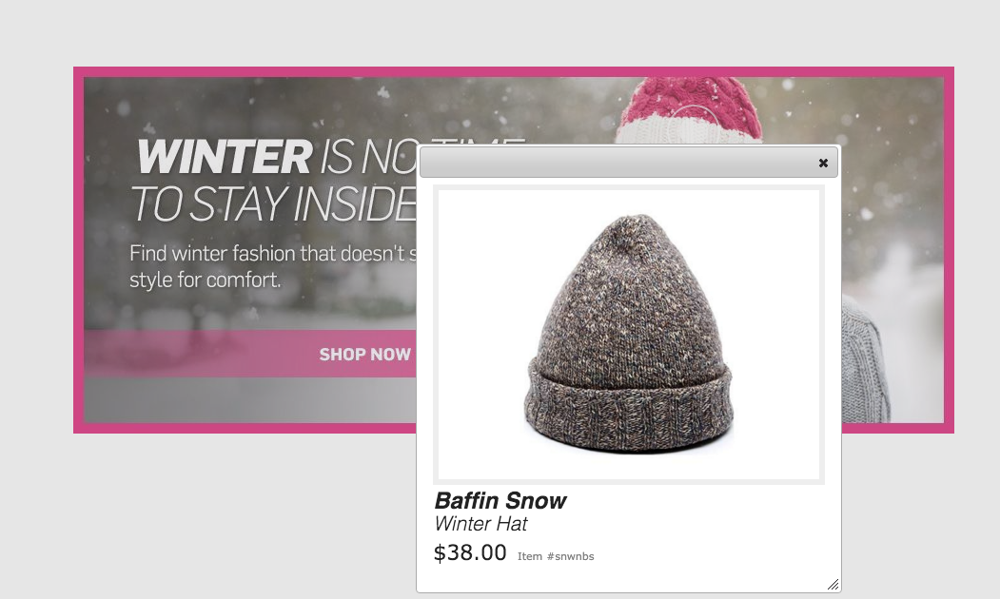

# Arbeta med väljare {#working-with-selectors}

>[!CAUTION]
>
>AEM 6.4 har nått slutet på den utökade supporten och denna dokumentation är inte längre uppdaterad. Mer information finns i [teknisk supportperiod](https://helpx.adobe.com/support/programs/eol-matrix.html). Hitta de versioner som stöds [här](https://experienceleague.adobe.com/docs/).

När du arbetar med en interaktiv bild, interaktiv video eller Carousel Banner väljer du resurser och väljer webbplatser och produkter för aktiveringspunkter och bildscheman att länka till. När du arbetar med bilduppsättningar, snurruppsättningar och multimedieuppsättningar väljer du också resurser med resursväljaren.

Det här avsnittet handlar om hur du använder väljarna Produkt, Plats och Resurser, inklusive möjligheten att bläddra, filtrera och sortera i väljarna.

Du kommer åt väljarna när du skapar karuselluppsättningar, lägger till aktiveringspunkter och bildscheman, skapar interaktiva videor och bilder.

I den här Carousel-banderollen använder du produktväljaren om du länkar en hotspot eller bildschema till en QuickView-sida; använda platsväljaren om du länkar en hotspot eller ett bildschema till en hyperlänk, använder du resursväljaren när du skapar en ny bildruta.

När du väljer (i stället för att ange manuellt) vart hotspot-områden eller bildscheman ska gå, använder du väljaren. Webbplatsväljaren fungerar bara om du är AEM Sites-kund. Produktväljaren kräver också AEM.

## Välja produkter {#selecting-products}

Använd produktväljaren för att välja en produkt när du vill ha en aktiveringspunkt eller bildschema för att ge en snabbvy till en viss produkt i produktkatalogen.

1. Navigera till karuselluppsättningen, den interaktiva bilden eller den interaktiva videon och tryck på fliken **[!UICONTROL Actions]** (endast tillgänglig om du har definierat ett hotspot-område eller bildschema).

   Produktväljaren finns i **[!UICONTROL Action Type]** område.

   

1. Tryck på **[!UICONTROL Product Selector]** ikon (förstoringsglas) och navigera till en produkt i katalogen.

   

   Du kan också filtrera efter nyckelord eller tagg genom att trycka på **[!UICONTROL Filter]** och ange nyckelord, markera taggar eller båda.

   

   Du kan ändra var AEM bläddrar efter produktdata genom att trycka på **[!UICONTROL Browse]** och navigera till en annan mapp.

   

   Tryck **[!UICONTROL Sort]** genom att ändra om AEM sorterar efter senaste till äldsta eller äldsta till nyaste.

   

   Tryck på **[!UICONTROL View as]** för att ändra hur produkter visas, antingen i **[!UICONTROL List View]** eller **[!UICONTROL Card View]**.

   

1. När produkten har valts fylls fältet i med produktminiatyrbilden och namnet.

   

1. När **[!UICONTROL Preview]** kan du trycka på hotspot eller bildschema och se hur snabbvyn ser ut.

   

## Välja platser {#selecting-sites}

Använd webbplatsväljaren för att välja en webbsida när du vill att ett hotspot- eller bildschema ska länka till en webbsida som hanteras AEM webbplatser.

1. Navigera till karuselluppsättningen, den interaktiva bilden eller den interaktiva videon och tryck på fliken **[!UICONTROL Actions]** (endast tillgänglig om du har definierat ett hotspot-område eller bildschema).

   Platsväljaren finns i avsnittet **[!UICONTROL Action Type]**.

   

1. Tryck på ikonen **[!UICONTROL Site Selector]** (mapp med förstoringsglas) och navigera till en sida på era AEM-webbplatser som du vill länka hotspot-området eller bildschemat till.

   

1. När platsen har valts fylls fältet i med sökvägen.

   

1. När **[!UICONTROL Preview]** om du trycker på hotspot eller bildschema navigerar du till den AEM webbplatssidan du angav.

## Välja resurser {#selecting-assets}

Använd den här väljaren för att välja bilder som ska användas i en Carousel Banner, en interaktiv video, bilduppsättningar, blandade medieuppsättningar och snurruppsättningar. I interaktiv video är resursväljaren tillgänglig när du trycker på **[!UICONTROL Select Assets]** i **[!UICONTROL Content]** -fliken. I Carousel Sets är resursväljaren tillgänglig när du skapar en ny bildruta. I Bilduppsättningar, Blandade medieuppsättningar och Snurra uppsättningar är resursväljaren tillgänglig när du skapar en ny bilduppsättning, blandad medieuppsättning eller snurra uppsättning.

Se även [Resursväljaren](asset-selector.md) för mer information.

1. Navigera till Carousel Set och skapa en ny bild. Eller navigera till Interactive Video, gå till **[!UICONTROL Content]** och välja resurser. Du kan också skapa en uppsättning med blandade media, bilduppsättning eller snurra.
1. Tryck på ikonen **[!UICONTROL Asset Selector]** (mapp med förstoringsglas) och navigera till en resurs.

   

   Du kan också filtrera efter nyckelord eller tagg genom att trycka på **[!UICONTROL Filter]** och ange nyckelord, eller lägga till villkor, eller båda.

   

   Du kan ändra var AEM bläddrar efter resurser genom att navigera till en annan mapp i **[!UICONTROL Path]** fält.

   Tryck **[!UICONTROL Collection]** om du bara vill söka efter resurser i samlingar.

   

   Tryck på **[!UICONTROL View as]** för att ändra hur produkter visas, antingen i **[!UICONTROL List View]**, **[!UICONTROL Column View]** eller **[!UICONTROL Card View]**.

   

1. Tryck på bockmarkeringen för att markera resursen. Resursen visas.

   
