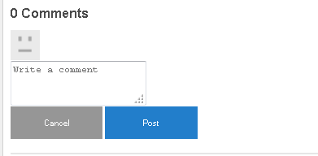

# Lägg till klienter {#add-clientlibs}

>[!CAUTION]
>
>AEM 6.4 har nått slutet på den utökade supporten och denna dokumentation är inte längre uppdaterad. Mer information finns i [teknisk supportperiod](https://helpx.adobe.com/support/programs/eol-matrix.html). Hitta de versioner som stöds [här](https://experienceleague.adobe.com/docs/).

## Lägg till en ClientLibraryFolder (clientlibs) {#add-a-clientlibraryfolder-clientlibs}

Skapa en ClientLibraryFolder med namnet `clientlibs`som kommer att innehålla den JS och CSS som används för att återge platsens sidor.

The `categories`det egenskapsvärde som anges för det här klientbiblioteket är den identifierare som används för att direkt ta med klienten från en innehållssida eller för att bädda in den i andra klienter.

1. Använda **[!UICONTROL CRXDE Lite]**, expandera `/etc/designs`

1. Högerklicka på `an-scf-sandbox` och markera `Create Node`

   * Namn: `clientlibs`
   * Typ: `cq:ClientLibraryFolder`

1. Klicka på **[!UICONTROL OK]**


I **[!UICONTROL Properties]** för den nya `clientlibs` nod, ange **`categories`** egenskap:

* Namn: **[!UICONTROL categories]**
* Typ: **[!UICONTROL String]**
* Värde: **[!UICONTROL apps.an-scf-sandbox]**
* Klicka på **[!UICONTROL Add]**
* Klicka på **[!UICONTROL Save All]**

Obs! för att visa kategorivärdet med appar. är en konvention som identifierar att det ägande programmet finns i /apps-mappen, inte /libs.  VIKTIGT! Lägg till platshållare `js.txt` och `css.txt` filer. (Det är inte officiellt en cq:ClientLibraryFolder utan dem.)


1. Högerklicka på **`/etc/designs/an-scf-sandbox/clientlibs`**
1. Välj **[!UICONTROL Create File...]**
1. Retur **[!UICONTROL Name]**: `css.txt`

1. Välj **[!UICONTROL Create File...]**
1. Retur **[!UICONTROL Name]**: `js.txt`

1. Klicka på **[!UICONTROL Save All]**


Den första raden i css.txt och js.txt identifierar den basplats från vilken följande fillistor ska hittas.

Försök att ange innehållet i css.txt till:

```
#base=.
 style.css
```

Skapa sedan en fil under clientlibs med namnet style.css och ställ in innehållet på:

`body {`

`background-color: #b0c4de;`

`}`

## Bädda in SCF-klienter {#embed-scf-clientlibs}

I **[!UICONTROL Properties]** -fliken för `clientlibs` node, enter the multi-value String property **[!UICONTROL embed]**. Detta bäddar in de nödvändiga [klientbibliotek (klientlibs) för SCF-komponenter](client-customize.md#clientlibs-for-scf). I den här självstudiekursen ska vi lägga till många av de klientlibs som behövs för webbkomponenterna.

**Anteckning** att detta kan vara det önskade tillvägagångssättet för en produktionsplats, eftersom det finns praktiska överväganden jämfört med storleken/hastigheten för de klienter som laddas ned för varje sida.

Om du bara använder en funktion på en sida kan du inkludera den funktionens fullständiga klientlib direkt på sidan, t.ex. &lt;% ui:includeClientLib categories=cq.social.hbs.forum&quot; %>

I det här fallet tar vi med alla, och föredrar därför de mer grundläggande SCF-klientlibs som är författarens klientlibs:

* Namn: **`embed`**
* Typ: **`String`**

* Klicka på **`Multi`**
* Värde: **`cq.social.scf`**

   *&lt;enter> öppnar en dialogruta*

   *Klicka **[+]**efter varje post för att lägga till följande clientlib-kategorier:*

   * **`cq.ckeditor`**
   * **`cq.social.author.hbs.comments`**
   * **`cq.social.author.hbs.forum`**
   * **`cq.social.author.hbs.rating`**
   * **`cq.social.author.hbs.reviews`**
   * **`cq.social.author.hbs.voting`**
   * Klicka på **[!UICONTROL OK]**

* Klicka på **[!UICONTROL Save All]**


Så här är det `/etc/designs/an-scf-sandbox/clientlibs` ska nu visas i databasen:


## Inkludera klienter i PlayPage-mallen {#include-clientlibs-in-playpage-template}

Utan att inkludera `apps.an-scf-sandbox` Kategorin ClientLibraryFolder på sidan. SCF-komponenterna kommer inte att fungera eller formateras eftersom de Javascript och format som behövs inte kommer att vara tillgängliga.

Utan att ta med clientlibs ser SCF-kommentarskomponenten till exempel formaterad ut:


När clientlibs för apps.an-scf-sandbox ingår formateras SCF-kommentarskomponenten:



Programsatsen include tillhör `<head>` i `<html>` skript. Standardvärdet **`foundation head.jsp`** innehåller ett skript som kan överlappas: **`headlibs.jsp`**.

**Copy headlibs.jsp and include clientlibs:**

1. Använda **[!UICONTROL CRXDE Lite]**, markera **`/libs/foundation/components/page/headlibs.jsp`**
1. Högerklicka och välj **[!UICONTROL Copy]** (eller välj Kopiera från verktygsfältet)
1. Välj **`/apps/an-scf-sandbox/components/playpage`**
1. Högerklicka och välj **[!UICONTROL Paste]** (eller välj Klistra in i verktygsfältet)
1. Dubbelklicka på **`headlibs.jsp`** för att öppna den
1. Lägg till följande rad i slutet av filen

   **`<ui:includeClientLib categories="apps.an-scf-sandbox"/>`**

1. Klicka på **[!UICONTROL Save All]**


```xml
<%@ page session="false" %><%
%><%@include file="/libs/foundation/global.jsp" %><%
%><ui:includeClientLib categories="cq.foundation-main"/><%
%>
<cq:include script="/libs/cq/cloudserviceconfigs/components/servicelibs/servicelibs.jsp"/>
<% currentDesign.writeCssIncludes(pageContext); %>
<ui:includeClientLib categories="apps.an-scf-sandbox"/>
```

Läs in webbplatsen i webbläsaren och se om bakgrunden inte är en blå nyans.

[http://localhost:4502/content/an-scf-sandbox/en/play.html](http://localhost:4502/content/an-scf-sandbox/en/play.html)


## Spara ditt arbete hittills {#saving-your-work-so-far}

Nu finns det en minimalistisk sandlåda, och det kan vara värt att spara som ett paket så att du, när du spelar upp, kan aktivera servern om din databas blir skadad och du vill börja om, stänga av servern, byta namn på eller ta bort mappen crx-quickstart/, aktivera servern, ladda upp och installera det här sparade paketet och inte behöver upprepa dessa mest grundläggande steg.

Det här paketet finns på [Skapa en exempelsida](create-sample-page.md) självstudiekurs för dem som inte bara vill hoppa in och börja spela!..

Så här skapar du ett paket:


* Från **[!UICONTROL CRXDE Lite]** klickar du på [Paketikon](http://localhost:4502/crx/packmgr/)
* Klicka på **[!UICONTROL Create Package]**

   * Paketnamn: `an-scf-sandbox-minimal-pkg`
   * Version: `0.1`
   * Grupp: &lt;leave as=&quot;&quot; default=&quot;&quot;>
   * Klicka på **[!UICONTROL OK]**

* Klicka på **[!UICONTROL Edit]**

   * Välj **[!UICONTROL Filters]** tab

      * Klicka på **[!UICONTROL Add filter]**
      * Rotsökväg: &lt;browse to=&quot;&quot; span=&quot;&quot; id=&quot;0&quot; translate=&quot;no&quot; />>`/apps/an-scf-sandbox`
      * Klicka på **[!UICONTROL Done]**
      * Klicka på **[!UICONTROL Add filter]**
      * Rotsökväg: &lt;browse to=&quot;&quot; span=&quot;&quot; id=&quot;0&quot; translate=&quot;no&quot; />>`/etc/designs/an-scf-sandbox`
      * Klicka på **[!UICONTROL Done]**
      * Klicka på **[!UICONTROL Add filter]**
      * Rotsökväg: &lt;browse to=&quot;&quot; span=&quot;&quot; id=&quot;0&quot; translate=&quot;no&quot; />>`/content/an-scf-sandbox`
      * Klicka på **[!UICONTROL Done]**
   * Klicka på **[!UICONTROL Save]**


* Klicka på **[!UICONTROL Build]**

Nu kan du välja **[!UICONTROL Download]** för att spara den på disk och **[!UICONTROL Upload Package]** andra, samt markera **[!UICONTROL More > Replicate]** för att överföra sandlådan till en lokal värdpubliceringsinstans för att utöka sandlådans sfär.
