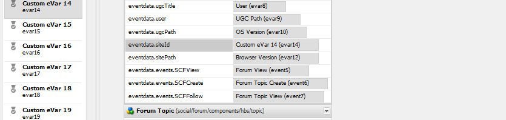

# Analytics Configuration for Communities - funktioner {#analytics-configuration-for-communities-features}

## Översikt {#overview}

Adobe Analytics och Adobe Experience Manager (AEM) är båda lösningar för Adobe Marketing Cloud.

Adobe Analytics kan konfigureras för AEM Communities så att händelser skickas till Adobe Analytics från vilka rapporter genereras när en medlem interagerar med funktioner som stöds.

När en medlem på en community-webbplats för aktivering till exempel visar en videoresurs som tilldelats dem, skickar resursspelaren händelser till Analytics, inklusive data om hjärtslag för video. Från communitywebbplatsen kan administratörer se olika rapporter om videouppspelningen.

Dessutom krävs analyser för att

* I publiceringsmiljön:

   * Rapportering om [communitytrender](trends.md)
   * Tillåt besökare att sortera efter&quot;mest visade&quot;,&quot;mest aktiva&quot; eller&quot;mest gillade&quot;
   * Visa antal i UGC-listor

* I redigeringsmiljön:

   * Visning av deltagardata i [medlemmarnas administrationskonsol](members.md) (vyer, inlägg, följare, gilla-markeringar)
   * Trend summary, video heartbeat and video device for enable resource [reports](reports.md)

Funktioner som stöds för Communities är:

* [Aktivera resurser](resources.md)
* [Forum](forum.md)
* [QnA](working-with-qna.md)
* [Blogg](blog-feature.md)
* [Filbibliotek](file-library.md)
* [Kalender](calendar.md)

I det här avsnittet av dokumentationen beskrivs hur du ansluter en Analytics-rapportsserie med webbgruppsfunktioner. De grundläggande stegen är:

1. [Replikera krypteringsnyckeln](#replicate-the-crypto-key) för att säkerställa att kryptering/dekryptering sker korrekt på alla AEM-instanser
1. Förbered en Adobe Analytics- [rapportsserie](#adobe-analytics-report-suite-for-video-reporting)
1. Skapa en AEM Analytics [molntjänst](#aem-analytics-cloud-service-configuration) och ett [ramverk](#aem-analytics-framework-configuration)
1. [Aktivera Analytics](#enable-analytics-for-a-community-site) för en community-webbplats
1. [Verifiera](#verify-analytics-to-aem-variable-mapping) variabelmappning från Analytics till AEM
1. Identifiera [primär utgivare](#primary-publisher)
1. [Publicera](#publish-community-site-and-analytics-cloud-service) communitywebbplatsen
1. Konfigurera [import av rapportdata](#obtaining-reports-from-analytics) från Adobe Analytics till communitywebbplatsen

## Förutsättningar {#prerequisites}

Om du vill konfigurera funktionerna i Analytics for Communities måste du samarbeta med din kontorepresentant för att skapa ett Adobe Analytics-konto och en [rapportserie](#adobe-analytics-report-suite-for-video-reporting). När den är etablerad ska följande information finnas tillgänglig:

* Företag

   Det företag som är associerat med Adobe Analytics-kontot
* Användarnamn

   Inloggningsanvändarnamnet för den användare som har behörighet att hantera Analytics-kontot

   (Bör inkludera behörighet för webbtjänståtkomst)

* Lösenord

   Inloggningslösenordet för den behöriga användaren

* Analytics Data Center

   URL:en för Analytics datacenter för kontot

* Report Suite

   Namnet på den Analytics-rapportsserie som ska användas

## Adobe Analytics Report Suite for Video Reporting {#adobe-analytics-report-suite-for-video-reporting}

Med Adobe Marketing Cloud [Report Suite Manager](https://docs.adobe.com/content/help/en/analytics/admin/manage-report-suites/new-report-suite/new-report-suite.html)kan Analytics rapportsviter konfigureras så att en communitywebbplats kan aktiveras för att tillhandahålla rapporter för communityfunktioner.

Genom att logga in på [Adobe Marketing Cloud](https://docs.adobe.com/content/help/en/analytics/analyze/analysis-workspace/home.html) med [företagsnamn och användarnamn](analytics.md#prerequisites)kan du konfigurera en ny eller befintlig rapportserie så att den har:

* [11 Konverteringsvariabler](https://docs.adobe.com/content/help/en/analytics/admin/admin-tools/conversion-variables/conversion-var-admin.html) (evar)

   * **`evar1`** via **`evar11`** aktiverad
   * Kan återanvända (byta namn på) befintliga objekt eller skapa nya som kan användas för webbgruppsfunktioner

* [7 Success Events](https://docs.adobe.com/content/help/en/analytics/admin/admin-tools/success-events/success-event.html) (events)

   * **`event1`** via **`event7`** aktiverad
   * Typ **`Counter`**

      * not **`Counter (no subrelations)`**
   * Kan återanvända (byta namn på) befintliga händelser eller skapa nya som kan användas för communityfunktioner


* [Videohantering](https://docs.adobe.com/content/help/en/media-analytics/using/media-overview.html)

   * Videorapportkonsol

      * Aktivera `Video Core`
      * Välj Spara
   * Mätkonsol för videokärna

      * Välj `Use Solution Variables`
      * Välj Spara


Om du använder en **ny rapportserie** bör du vara medveten om att en ny rapportserie bara kan ha 4 variabler och 6 händelsvariabler, medan 11 variabler och 7 händelsvariabler krävs för Communities.

Om du använder en **befintlig rapportserie** kan det vara nödvändigt att [ändra variabelmappningen](#modifying-analytics-variable-mapping) innan du aktiverar Analytics-ramverket för en communitywebbplats. Kontakta din kontorepresentant om du har några frågor om de variabler som är dedikerade till Communities.

>[!CAUTION]
>
>**Om du använder en befintlig rapportserie som redan använder variabler i**
>
>* **`evar1`** via **`evar11`**
>* **`event1`** via **`event7`**

>
>
**Innan communitywebbplatsen publiceras är det** viktigt att återställa den befintliga mappningen genom att flytta AEM-variablerna som automatiskt mappades till Analytics-variabler när Analytics aktiverades för en community-webbplats.
>
>Om du vill återställa den befintliga mappningen och flytta AEM-variabler till andra Analytics-variabler läser du avsnittet [Ändra Analytics-variabelmappning](#modifying-analytics-variable-mapping).
>
>Om detta inte görs kan data gå förlorade.

### Analytics Heartbeat {#video-heartbeat-analytics}

När Video Heartbeat Analytics är licensierat `Marketing Cloud Org Id` tilldelas ett videomaterial.

Så här aktiverar du rapportering av pulsslag i videomaterial efter [att du har konfigurerat Analytics rapportsvit för videorapportering](#adobe-analytics-report-suite-for-video-reporting):

* Skapa en molntjänst från [Analytics](#aem-analytics-cloud-service-configuration)
* Aktivera [Analytics för en communitywebbplats](#enable-analytics-for-a-community-site)
* Associera webbplatsen `Marketing Cloud Org Id` med communityn

Du kan `Marketing Cloud Org Id` ange detta när en [community-webbplats skapas](sites-console.md#enablement) eller senare genom att [ändra](sites-console.md#modifying-site-properties) egenskaperna för communitywebbplatsen. [](#aem-analytics-cloud-service-configuration)


När Video Heartbeat Analytics är aktiverat instansierar JavaScript-koden (JS) för videospelaren bibliotekskoden för pulsslag (även i JS), som hanterar all logik för att skicka videostatusuppdateringar till Analytics videospårningsservrar var 10:e sekund (inte konfigurerbar) och slutligen skickar en kumulativ rapport av videosessionen till Analytics huvudservrar.

Om det inte är aktiverat instansieras aldrig videons hjärtslagskod och endast videoförloppet och återupptagningspositionsspårning sparas i SRP för rapportering.

## Konfiguration av AEM Analytics Cloud Service {#aem-analytics-cloud-service-configuration}

Så här skapar du en ny Analytics-integrering, som integrerar Adobe Analytics med AEM-communityn, med standardgränssnittet i författarinstansen:

* Från global navigering: **[!UICONTROL Tools > Deployment > Cloud Services]**
* Bläddra nedåt till **[!UICONTROL Adobe Analytics]**
* Välj antingen **[!UICONTROL Configure Now]** eller **[!UICONTROL Show Configurations]**


### Dialogrutan Skapa konfiguration {#create-configuration-dialog}

* Välj `[+]` ikon bredvid **[!UICONTROL Available Configurations]** för att skapa en ny konfiguration

I dialogrutan Skapa konfiguration anger de värden som ska anges konfigurationen.


* **[!UICONTROL Title]**

   (Obligatoriskt) En visningsrubrik för konfigurationen.

   Ange t.ex. Analytics *för aktivering*

* **[!UICONTROL Name]**

   (Valfritt) Om inget anges används som standard ett giltigt nodnamn som härleds från titeln.

   For example, enter *communities*


* **[!UICONTROL Template]**

   Välj `Adobe Analytics Configuration`

* Välj **[!UICONTROL Create]**
   * Öppnar konfigurationssidan och öppnar `Analytics Settings` dialogruta

### Dialogrutan Analytics-inställningar {#analytics-settings-dialog}

När du skapar en ny Analytics-konfiguration första gången visas konfigurationen och en ny dialogruta där du kan ange Analytics-inställningarna. Den här dialogrutan kräver den [nödvändiga kontoinformationen](#prerequisites) från kontoombudet.


* **[!UICONTROL Company]**

   Det företag som är associerat med Adobe Analytics-kontot

* **[!UICONTROL Username]**

   Inloggningsanvändarnamnet för den användare som har behörighet att hantera Analytics-kontot

* **[!UICONTROL Password]**

   Inloggningslösenordet för den behöriga användaren

* **[!UICONTROL Data Center]**

   Välj det Analytics datacenter som är värd för rapportsviten

* **[!UICONTROL Do not add tracking tag to page]**

   Låt vara som standard (avmarkerat)

* **[!UICONTROL Use AppMeasurement]**

   Låt vara som standard (avmarkerat)

* **[!UICONTROL Do not import page impressions nightly (author)]**

   Låt vara som standard (avmarkerat)

* **[!UICONTROL Do not import page impressions nightly (publish)]**

   Lämna som standard (markerad)

Så här sparar du inställningarna:


* Välj **[!UICONTROL Connect to Analytics]**

   * Om det inte lyckas

      * Verifiera att posterna inte innehåller inledande blanksteg
      * Testa ett annat datacenter
      * Kontakta din kontorepresentant

* Välj **[!UICONTROL OK]**


### Skapa ramverk {#create-framework}

När du har konfigurerat den grundläggande anslutningen till Adobe Analytics måste du skapa eller redigera ett ramverk för communitywebbplatsen. Syftet med ramverket är att mappa AEM-variabler (Communities feature) till Analytics-variabler (report suite).

* Välj `[+]` ikon bredvid **[!UICONTROL Available Frameworks]** för att skapa ett nytt ramverk


* **[!UICONTROL Title]**

   (Obligatoriskt) En visningsrubrik för ramverket

   Ange t.ex. *Community Framework*

* **[!UICONTROL Name]**

   (Valfritt) Om inget anges används som standard ett giltigt nodnamn som härleds från titeln.

   For example, enter *communities*

* **[!UICONTROL Template]**

   Välj `Adobe Analytics Framework`

* Välj **[!UICONTROL Create]**

När du skapar Analytics Framework öppnas ramverket för konfiguration.

## Konfiguration av AEM Analytics Framework {#aem-analytics-framework-configuration}

Syftet med ramverket är att mappa AEM-variabler till Analytics-variabler (variabler och händelser). De Analytics-variabler som är tillgängliga för mappning [definieras i rapportsviten](#adobe-analytics-report-suite-for-video-reporting).


### Välj Report Suite {#select-report-suite}

Välj den rapportsvit som har konfigurerats för videorapportering.

Om en rapportsvit ännu inte har skapats eller inte har konfigurerats på rätt sätt, se föregående avsnitt:\
[Adobe Analytics Report Suite for Video Reporting](#adobe-analytics-report-suite-for-video-reporting)

Den idekiske behövs inte och kan minimeras så att den inte förhindrar åtkomst till inställningarna för Report Suites.

#### Dialogrutan Rapportsviter före och efter alternativet Lägg till objekt {#report-suites-dialog-before-and-after-selecting-add-item}


1. Välj **[!UICONTROL Add Item +]** två listrutor
1. Välj en rapportsvit `Report suite` som är kopplad till företagskontot som ska vara tillgänglig för urval
1. Välj **[!UICONTROL Yes]** i dialogrutan som öppnas: ```Load default server settings? Do you want to load the default server settings and overwrite current values in the Server section?```
1. Välj en `Run Mode`\
   Choose **[!UICONTROL publish]**


Molntjänsten och ramverket för Analytics är nu färdiga. Mappningarna definieras när en community-webbplats har skapats med den här Analytics-tjänsten aktiverad.

## Aktivera Analytics för en communitywebbplats {#enable-analytics-for-a-community-site}

### Aktivera för ny community-plats {#enable-for-new-community-site}

Så här lägger du till Analytics molntjänst när du [skapar en ny community-webbplats](sites-console.md):


* I steg 3
* Under fliken [](sites-console.md#analytics)ANALYTICS:

   * Markera **[!UICONTROL Enable Analytics]** kryssrutan
   * Välj ramverket i listrutan

* Du kan även gå tillbaka till Analytics Framework-konfigurationen för att justera variabelmappningarna.

### Aktivera för befintlig communitywebbplats {#enable-for-existing-community-site}

Så här lägger du till Analytics molntjänst på en [befintlig community-webbplats](sites-console.md#modifying-site-properties):


* Navigate to the **[!UICONTROL Communities > Sites]** console
* Välj ikonen Redigera webbplats för communitywebbplatsen
* Välj INSTÄLLNINGAR
* I avsnittet Analytics:

   * Markera **[!UICONTROL Enable Analytics]** kryssrutan
   * Välj ramverket i listrutan


* Du kan även gå tillbaka till Analytics Framework-konfigurationen för att justera variabelmappningarna.

### Aktivera för anpassade platser {#enable-for-customized-sites}

För att Analytics tracking och import ska fungera korrekt för en community-webbplats måste det finnas ett sidelement med attributen `scf-js-site-title` class och href. Det får bara finnas ett sådant element på sidan, t.ex. i ett oförändrat `sitepage.hbs` skript för en communitywebbplats. Värdet för `siteUrl` extraheras och skickas till Adobe Analytics som *webbplatssökväg*.

```xml
# present in default sitepage.hbs
# only one scf-js-site-title class should be included
# this example sets it to be hidden as it serves no visual purpose
<div
    class="navbar-brand scf-js-site-title"
    href="{{siteUrl}}.html"
    style="visibility: hidden;"
>
</div>
```

Om du vill ha en **anpassad communitywebbplats** som täcker över `sitepage.hbs` skriptet kontrollerar du att elementet finns. Variabeln `siteUrl`ställs in när den återges på servern innan den skickas till klienten.

För en **allmän AEM-webbplats** som innehåller webbgruppskomponenter, men som inte har skapats med guiden [Skapa](sites-console.md)webbplats, måste du lägga till elementet. Värdet för href bör vara sökvägen till platsen. Om till exempel platssökvägen är `/content/my/company/en`använder du:

```xml
<div
    class="navbar-brand scf-js-site-title"
    href="/content/my/company/en.html"
    style="visibility: hidden;"
>
</div>
```

## Analytics for Communities - funktioner {#analytics-for-communities-features}

Analytics används automatiskt för flera webbgruppsfunktioner.

Författarmiljöns [OSGi-konfiguration](../../help/sites-deploying/configuring-osgi.md), `AEM Communities Analytics Component Configuration`innehåller en lista över de komponenter som har instrumenterats för Analytics. Den automatiska mappningen av variabler bestäms av komponenterna i listan.

Om nya anpassade komponenter skapas som är instrumenterade för Analytics bör de läggas till i den här listan med konfigurerade komponenter.

### Komponentkonfiguration {#component-configuration}


Obs! komponenterna används för att implementera bloggfunktionen `journal` .

### Mappat Analytics till AEM-variabler {#mapped-analytics-to-aem-variables}

När communitywebbplatsen har sparats med Analytics aktiverat och molnkonfigurationsramverket valt mappas AEM-variablerna automatiskt till Analytics-variabler och händelser som börjar med var1 respektive event1, och ökar med 1.

Om du använder en befintlig rapportserie som mappade någon av variablerna inom var1 till var11 och event1 till och med event7, måste du [mappa om AEM-variablerna](#modifying-analytics-variable-mapping) och återställa den ursprungliga mappningen.

Här följer ett exempel på standardmappningar efter att du har följt självstudiekursen [](getting-started-enablement.md)Komma igång:


#### Karta över eVars som skickas med varje händelse {#map-of-evars-sent-with-each-event}

|  | Typ av aktiveringsresurs | Platsrubrik | Funktionstyp | Grupptitel | Gruppsökväg | UGC-typ | UGC-titel | Användare (medlem) | UGC-sökväg | Platssökväg |
|------------------------|------------------------|-----------|--------------|------------|-----------|---------|----------|--------------|---------|----------|
|  | **eVar1** | **eVar2** | **eVar3** | **eVar4** | **eVar5** | **eVar6** | **eVar7** | **eVar8** | **eVar9** | **eVar10** |
| event1Resurs - uppspelning | (en) | - | - | - | - | - | - | - | (i) | - |
| event2SCFView | (en) | b) | (c) | (d) | (e) | (f) | (g) | (h) | (i) | (j) |
| event3SCFCreate (Post) | - | b) | (c) | (d) | (e) | (f) | (g) | (h) | (i) | (j) |
| event4SCFFollow | - | b) | (c) | (d) | (e) | (f) | (g) | (h) | (i) | (j) |
| event5SCFVoteUp | - | b) | (c) | (d) | (e) | (f) | (g) | (h) | (i) | (j) |
| event6SCFVoteDown | - | b) | (c) | (d) | (e) | (f) | (g) | (h) | (i) | (j) |
| event7SCFRate | - | b) | (c) | (d) | (e) | (f) | (g) | (h) | (i) | (j) |

**Exempel för eVar-värden:**

* [MIME-typ](https://www.iana.org/assignments/media-types): video/mp4
* [Webbplatsens namn](sites-console.md#step13asitetemplate): Geometrixx Communities
* [Namn på](functions.md)communityfunktion: Forum
* [Gruppnamn](creating-groups.md#creating-a-new-group): Vattna
* Sökväg till communitygruppsinnehåll: /content/sites/communities/en/groups/hiking
* [Resurstyp](essentials.md)för UGC-komponent: social/forum/komponenter/hbs/topic
* UGC-komponenttitel: Hiking Topics
* Inloggning (auktoriseringsbart ID): aaron.mcdonald@mailinator.com
* SRP-sökväg till UGC: /content/usergenerated/asi/.../forum/jmtz-topic3 eller *komponentens sökväg som ska följas*: /content/sites/communities/en/jcr:content/content/primary/forum
* Sökväg till innehåll på communitywebbplatsen: /content/sites/community/en

### Ändra Analytics-variabelmappning {#modifying-analytics-variable-mapping}

Mappningen av Analytics-variabler och händelser till AEM-variabler visas i ramverkskonfigurationen när Analytics har aktiverats för en community-webbplats.

När Analytics har aktiverats och innan communitywebbplatsen publiceras, kan mappningen ändras i ramverket genom att dra den Analytics-evar eller -händelse som du vill använda från den vänstra listen och släppa den på den relevanta raden i mappningstabellen.

För att undvika dubblettmappningar måste du se till att ta bort den ersatta Analytics-händelsen eller händelsen från raden genom att hålla muspekaren över den och välja &quot;X&quot; som visas till höger om variabelelementet i Analytics.

Om webbgrupper och händelser skriver över mappningar som fanns tidigare i rapportsviten tilldelar du AEM-variablerna för webbgruppsfunktioner till andra Analytics-variabler och/eller -händelser och återställer de ursprungliga mappningarna.

>[!CAUTION]
>
>Det är viktigt att du fortsätter innan communitywebbplatsen [publiceras](#publishing-the-community-site) med Analytics aktiverat, annars finns det risk för dataförlust.

#### Exempelsteg 1: Dra Analytics evar14 till mappningstabellen {#example-step-dragging-analytics-evar-into-mapping-table}


#### Exempelsteg 2: Välja &#39;x&#39; för att ta bort ersatt evar11 {#example-step-selecting-x-to-remove-replaced-evar}


#### Exempelsteg 3: AEM var eventdata.siteId mappas om till Analytics evar14 {#example-step-aem-var-eventdata-siteid-remapped-to-analytics-evar}



## Publicera communitywebbplatsen {#publishing-the-community-site}

### Verifiera Analytics till AEM-variabelmappning {#verify-analytics-to-aem-variable-mapping}

Du bör kontrollera variabelmappningen innan du publicerar communitywebbplatsen, som även publicerar Analytics molntjänst och ramverk.

Se avsnitt:

* [Mappat Analytics till AEM-variabler](#mapped-analytics-to-aem-variables)
* [Ändra Analytics-variabelmappning](#modifying-analytics-variable-mapping)

>[!CAUTION]
>
>**Om du använder en befintlig rapportserie som redan använder variabler i**
>
>* **`evar1`** via **`evar11`**
>* **`event1`** via **`event7`**

>
>
**Innan communitywebbplatsen publiceras är det** viktigt att återställa den befintliga mappningen och flytta de Communities AEM-variabler som automatiskt mappades (när Analytics aktiverades för communitywebbplatsen) till andra Analytics-variabler. Den här ommappningen bör vara konsekvent för alla webbgruppskomponenter.
>
>Om detta inte görs kan data gå förlorade.

### Primär utgivare {#primary-publisher}

När den valda distributionen är en [publiceringsgrupp](topologies.md#tarmk-publish-farm)måste en AEM-publiceringsinstans identifieras som primär utgivare för att avfråga Adobe Analytics för rapportdata som ska skrivas till [SRP](working-with-srp.md).

Som standard identifierar `AEM Communities Publisher Configuration` OSGi-konfigurationen sin publiceringsinstans som primär utgivare, så att alla publiceringsinstanser i en publiceringsgrupp identifierar sig själva som primär.

Det är därför nödvändigt att redigera konfigurationen för alla sekundära publiceringsinstanser för att avmarkera kryssrutan **Primär utgivare** .

Specifika anvisningar finns i den primära utgivardelen i [Distribuera communities](deploy-communities.md#primary-publisher).

>[!CAUTION]
>
>Det är viktigt att den primära utgivaren är konfigurerad för att förhindra avsökning från flera publiceringsinstanser.

### Replikera krypteringsnyckeln {#replicate-the-crypto-key}

Adobe Analytics-autentiseringsuppgifterna är krypterade. För att underlätta replikering eller överföring av krypterade analysreferenser mellan författare och utgivare måste alla AEM-instanser dela samma primära krypteringsnyckel.

Följ instruktionerna på [Replikera krypteringsnyckeln](deploy-communities.md#replicate-the-crypto-key).

### Publicera communitywebbplats och Analytics-Cloud Service {#publish-community-site-and-analytics-cloud-service}

När Analytics molntjänst har aktiverats för en communitywebbplats och, om det behövs, [mappningen av Analytics till AEM-variabler har justerats](#mapped-analytics-to-aem-variables), måste konfigurationen replikeras till publiceringsmiljön genom [att publicera communitywebbplatsen](sites-console.md#publishing-the-site)på nytt.

## Få rapporter från Analytics {#obtaining-reports-from-analytics}

### Rapporthantering {#report-management}

Författaren och den primära utgivarens [OSGi-konfiguration](../../help/sites-deploying/configuring-osgi.md), `AEM Communities Analytics Report Management`, används för att fråga Analytics.

Frågorna gäller för realtidsrapporter.

På den primära utgivaren används frågorna för att tillhandahålla information som förberedelse för Report-importerarens Analytics-dataimport.

Frågeintervallet är som standard 10 sekunder.

### Rapportimporteraren {#report-importer}

När en Analytics-aktiverad communitywebbplats har publicerats kan den primära utgivarens [OSGi-konfiguration](../../help/sites-deploying/configuring-osgi.md)`AEM Communities Analytics Report Importer`konfigureras att ange standardavsökningsintervallet för de konfigurationer som inte konfigureras individuellt i CRXDE.

Avsökningsintervallet styr hur ofta Adobe Analytics begär data som ska hämtas och sparas i [SRP](working-with-srp.md).

När data kan kategoriseras som&quot;big data&quot; kan en mer frekvent undersökning innebära en stor belastning på communitywebbplatsen.

Standardavsökningsintervallet **för** import är 12 timmar.


### Anpassning av komponentrapport {#component-report-customization}

För att anpassa mätvärdena för att spåra skapas för närvarande noder i databasen som definierar tidsperioder för vilka en rapport om mätvärdena ska genereras.

Forum-ämnet är för närvarande det enda exemplet på den här anpassningen:

* På den primära utgivaren
* Logga in med administratörsbehörighet
* Navigera till [CRXDE Lite](../../help/sites-developing/developing-with-crxde-lite.md)

   * Till exempel [http://localhost:4503/crx/de](http://localhost:4503/crx/de)

* Under `jcr:content` noden i språkroten

   * Till exempel, `/content/sites/engage/en/jcr:content`

* Navigera till komponenten som konfigurerats för Analytics-rapportering

   * Till exempel, `analytics/reportConfigs/social_forum_components_hbs_topic`

* Lägg märke till de skapade tidsperioderna

   * `last30Days`
   * `last90Days`
   * `thisYear`

* Lägg märke till `total`noden

   * Om du ändrar `interval` egenskapen åsidosätts intervallet för rapportimporteraren
   * Värdet anges i sekunder och är inställt på 4 timmar (1 400 sekunder)


## Hantera användardata i Analytics {#manage-user-data-in-analytics}

Adobe Analytics innehåller API:er som gör att du kan komma åt, exportera och ta bort användardata. Mer information finns i [Skicka begäran](https://docs.adobe.com/content/help/en/analytics/admin/data-governance/gdpr-submit-access-delete.html)om åtkomst och borttagning.

## Resurser {#resources}

* Adobe Marketing Cloud: [Analytics - hjälp och referens](https://docs.adobe.com/content/help/en/analytics/landing/home.html)
* AEM: [Integrating with Adobe Analytics](../../help/sites-administering/adobeanalytics.md)
* AEM: [Analytics med externa leverantörer](../../help/sites-administering/external-providers.md)

