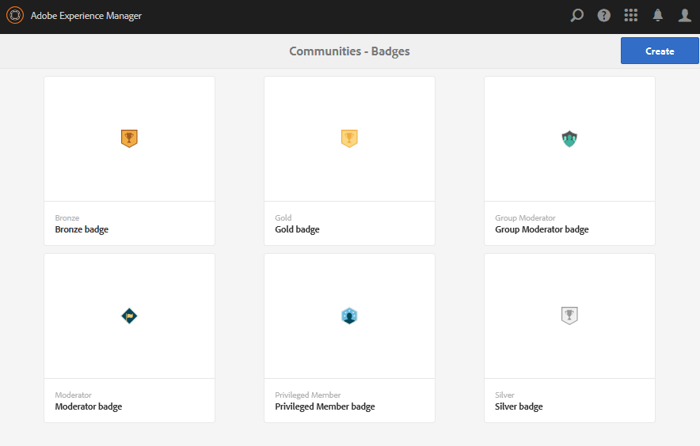

# Badges Console {#badges-console}

## Om Badges {#about-badges}

Konsolen Communities Badges innehåller funktioner för att lägga till egna emblem som kan visas för en medlem när den har tjänats in (tilldelats) eller när de har en specifik roll i communityn (tilldelats).

### Synlighet för emblem {#badge-visibility}

För närvarande visas emblem som en medlem i communityn får eller tilldelas tillsammans med sitt namn och avatar på följande platser:

* Profiler
* [Forum](forum.md)
* [QnA](working-with-qna.md)
* [Ledartavlor](enabling-leaderboard.md)
* [Ideation](ideation-feature.md)

För att nå Badges-konsolen i redigeringsmiljön

* Från global navigering: **[!UICONTROL Verktyg > Communities > Badges]**

Den här konsolen visar de emblem som är tillgängliga för tillfället och från vilka nya emblem kan läggas till.

## Skapa märke {#create-badge}

Ett märke skapas genom att en lämplig liten bild (72 dpi med en höjd på mellan 26 och 32 pixlar) överförs och ett namn anges. Badge-bilden lagras i databasen på `/etc/community/badging/images` och replikeras automatiskt till publiceringsmiljön.

Om publiceringsmiljön är en grupp utgivare måste du konfigurera [användarsynkronisering](sync.md).

* **[!UICONTROL Överför bild]**

   (*Obligatoriskt*) En badge-bild med en rekommenderad storlek på 32 x 32 pixlar vid 72 dpi i antingen JPEG- eller PNG-format.

* **[!UICONTROL Namn]**

   (*Obligatoriskt*) Namnet på märket. Det är standardnodnamnet `Display Name` och databasnodnamnet. Om `Name` databasen inte är ett giltigt databasnodnamn ändras det.

* **[!UICONTROL Visningsnamn]**

   (*Valfritt*) Namnet som ska visas för märket i användargränssnittet. Standard är den oförändrade text som anges för `Name`.

* **[!UICONTROL Beskrivning]**

   (*Valfritt*) En beskrivning av märket.

## Additional Information {#additional-information}

Mer information om hur du ställer in regler för poängsättning och märkning finns i [Betygsättning och emblem](implementing-scoring.md).

Information om hur du hanterar emblem för medlemmar finns i [Medlemskonsolen](members.md).
