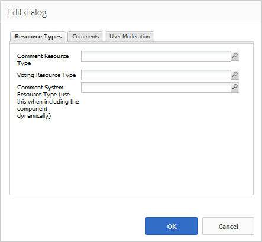

# Använda kommentarer {#using-comments}

## Introduktion {#introduction}

Kommentarsfunktionen används för att låta besökare (medlemmar) på den inloggade webbplatsen dela med sig av sina åsikter och kunskaper om innehållet på webbplatsen. Den här funktionen finns ofta redan i andra funktioner, men kan läggas till på alla webbplatser.

Detta avsnitt i dokumentationen beskriver

* Lägga `Comments`till på en sida
* Konfigurationsinställningar för `Comments`komponenten

>[!NOTE]
>
>Anonym publicering av en kommentar stöds inte. Besökare måste registrera sig (bli medlem) och logga in för att kunna delta.

## Lägga till kommentarer på en sida {#adding-comments-to-a-page}

Om du vill lägga till en `Comments`komponent på en sida i redigeringsläge använder du komponentwebbläsaren för att leta reda på

* `Communities / Comments`

och dra den till rätt plats på en sida, t.ex. en position i förhållande till funktionen som användarna kan kommentera på, eller helt enkelt längst ned på sidan.

Mer information finns i Grunderna för [communitykomponenter](basics.md).

När de [nödvändiga klientbiblioteken](essentials-comments.md#essentials-for-client-side) inkluderas visas `Comments`komponenten så här.

>[!NOTE]
>
>Det får bara finnas en `Comments`komponent på en sida. Observera att flera communityfunktioner redan innehåller kommentarer, t.ex. en blogg, kalender, forum, QnA och recensioner.

## Konfigurera kommentarer {#configuring-comments}

Markera den monterade `Comments` komponent som du vill öppna och välj den `Configure` ikon som öppnar redigeringsdialogrutan.

 

### Fliken Kommentarer {#comments-tab}

Under fliken **[!UICONTROL Kommentarer]** anger du hur besökare ska ange kommentarer.

* **[!UICONTROL Tillåt svar]**

   Om det här alternativet är markerat kan medlemmarna svara på befintliga kommentarer. Standard är avmarkerat.

* **[!UICONTROL Kommentarer per sida]**

   Begränsar antalet kommentarer som visas per sida samt antalet svar som visas. Standardvärdet är 10.

* **[!UICONTROL Tillåt filöverföringar]**

   Om du markerar det här alternativet visas textrutan för alternativet att överföra en fil. Standard är avmarkerat.

* **[!UICONTROL Maximal filstorlek]**

   Endast relevant om Tillåt filöverföringar är markerat. Det här värdet begränsar storleken på den överförda filen. Standardgränsen är 10 MB.

* **[!UICONTROL Maximal meddelandelängd]**

   Maximalt antal tecken som kan anges i textrutan. Standardvärdet är 4 096 tecken.

* **[!UICONTROL Tillåtna filtyper]**

   Endast relevant om Tillåt filöverföringar är markerat. En kommaavgränsad lista med filtillägg med punktavgränsaren. Till exempel: .jpg, .jpeg, .png, .doc, .docx, .pdf. Om någon filtyp anges tillåts inte den som inte anges. Ingen standard har angetts så att alla filtyper tillåts.

* **[!UICONTROL RTF-redigerare]**

   Om det här alternativet är markerat kan kommentarer skrivas in med markeringar. Standard är avmarkerat.

* **[!UICONTROL Tillåt röstning]**

   Om det här alternativet är markerat visas textrutan med alternativet att rösta upp eller ned. Standard är avmarkerat.

* **[!UICONTROL Tillåt följande]**

   Om det här alternativet är markerat kan medlemmarna följa kommentarerna. Standard är avmarkerat.

* **[!UICONTROL Visa emblem]**

   Om du markerar det här alternativet tillåts visning av färdiga och tilldelade märken. Standard är avmarkerat.

### Fliken Användarmoderering {#user-moderation-tab}

På fliken **[!UICONTROL Användarmoderering]** anger du hur de skickade kommentarerna ska hanteras. Mer information finns i [Hantera användargenererat innehåll](moderate-ugc.md).

* **[!UICONTROL Före moderering]**

   Om det här alternativet är markerat måste kommentarerna godkännas innan de visas på en publiceringsplats. Standard är avmarkerat.

* **[!UICONTROL Ta bort kommentarer]**

   Om det här alternativet är markerat kan den medlem som publicerade kommentaren ta bort den. Standard är avmarkerat.

* **[!UICONTROL Neka kommentarer]**

   Om det här alternativet är markerat tillåter du moderatorerna att neka kommentarer. Standard är avmarkerat.

* **[!UICONTROL Stäng/öppna kommentarer igen]**

   Om det här alternativet är markerat kan moderatorerna stänga och öppna kommentarerna igen. Standard är avmarkerat.

* **[!UICONTROL Flagga kommentarer]**

   Om alternativet är markerat kan medlemmarna flagga kommentarer som olämpliga. Standard är avmarkerat.

* **[!UICONTROL Flaggorsakslista]**

   Om det här alternativet är markerat kan medlemmarna i en nedrullningsbar lista välja orsaken till att en kommentar flaggas som olämplig. Standard är avmarkerat.

* **[!UICONTROL Anledning till anpassad flagga]**

   Om det här alternativet är markerat kan medlemmarna ange en egen orsak till att en kommentar flaggas som olämplig. Standard är avmarkerat.

* **[!UICONTROL Modereringströskel]**

   Ange hur många gånger en kommentar måste flaggas av medlemmar innan moderatorerna meddelas. Standard är en gång (1).

* **[!UICONTROL Flaggningsgräns]**

   Ange hur många gånger en kommentar måste flaggas innan den döljs för den offentliga vyn. Talet måste vara större än eller lika med **[!UICONTROL modereringströskeln]**. Standardvärdet är 5.

### Fliken Sorteringsinställningar {#sort-settings-tab}

På fliken **[!UICONTROL Sorteringsinställningar]** anger du hur de skickade kommentarerna ska sorteras när de visas.

* **[!UICONTROL Sorteringsfält]**

   Dra nedåt för att välja ett av `Newest, Oldest, Last Updated, Most Viewed, Most Active, Most Followed`eller `Most Liked`.

* **[!UICONTROL Sorteringsordning]**

   Dra nedåt för att välja ett av `Ascending` eller `Descending`.

### Ändra till en anpassad kommentarstyp {#changing-to-a-custom-comment-type}

Genom att ändra kommentarsresurstypen kommer kommentarsystemet inte längre att generera en instans av en kommentar med standardinställningen, utan en som har anpassats (utökats) av utvecklarna.

När de anpassade resurstyperna är kända går du till [designläge](../../help/sites-authoring/default-components-designmode.md) och dubbelklickar på den monterade `Comments` komponenten för att öppna en dialogruta med en extra flik.

Under fliken **[!UICONTROL Resurstyper]** anger du anpassad resourceType för nya instanser av `Comments or Voting`komponenterna:

* **[!UICONTROL Resurstyp för kommentar]**

   Navigera till resourceType för en utökad `comment`komponent (en kommentar) i /apps. Exempel, `/apps/social/commons/components/hbs/comments/comment`

   Den här resursen identifierar den resourceType för den UGC som skapas när en besökare publicerar en kommentar.

* **[!UICONTROL Typ av röstningsresurs]**

   Navigera till resourceType för en utökad `voting`komponent i /apps. Exempel, `/apps/social/components/hbs/voting`

   Den här resursen identifierar resurstypen för användargenererat innehåll som skapas när en besökare publicerar en röst.

* **[!UICONTROL Resurstyp för kommentarsystem]**

   Navigera till resourceType för en utökad `comments`komponent (kommentarsystemet) i /apps. Lämna tomt om inte sidmallen [dynamiskt inkluderar](scf.md#add-or-include-a-communities-component) kommentarsystemet i det underliggande skriptet i stället för att läggas till på sidan som en resurs (kommentarsnod). Läs mer om [{{include}}-hjälpen](handlebars-helpers.md#include).

## Site Visitor Experience {#site-visitor-experience}

### Styrelsemedlemmar och administratörer {#moderators-and-administrators}

När den inloggade användaren har moderator- eller administratörsbehörighet kan de utföra de modereringsåtgärder som tillåts av komponentens konfiguration, oavsett vem som skapade kommentaren.

### Medlemmar {#members}

När besökaren är inloggad, beroende på konfigurationen, kan de

* Publicera en ny kommentar
* Redigera en egen kommentar
* Ta bort en egen kommentar
* Flagga andras kommentarer

### Anonym {#anonymous}

Besökare som inte är inloggade kan endast läsa publicerade kommentarer, översätta dem om de stöds, men kan inte lägga till en kommentar eller flagga andras kommentarer.

## Additional Information {#additional-information}

Mer information finns på sidan [Comments Essentials](essentials-comments.md) för utvecklare.

Mer information om moderering av publicerade kommentarer finns i [Hantera användargenererat innehåll](moderate-ugc.md).

Information om översättning av bokförda kommentarer finns i [Översätta användargenererat innehåll](translate-ugc.md).
