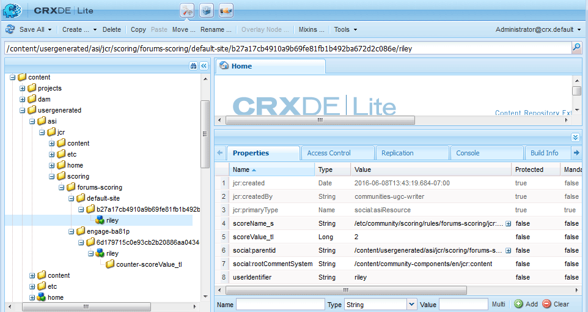

# Grundläggande om poäng och emblem {#scoring-and-badges-essentials}

>[!CAUTION]
>
>AEM 6.4 har nått slutet på den utökade supporten och denna dokumentation är inte längre uppdaterad. Mer information finns i [teknisk supportperiod](https://helpx.adobe.com/support/programs/eol-matrix.html). Hitta de versioner som stöds [här](https://experienceleague.adobe.com/docs/).

AEM Communities poäng och badges ger möjlighet att identifiera och belöna communitymedlemmar.

Information om hur du konfigurerar funktionen finns i

* [Communities Scoring and Badges](implementing-scoring.md)

Den här sidan innehåller ytterligare teknisk information:

* Så här gör du [visa ett märke](#displaying-badges) som bild eller text
* Så här aktiverar du [felsökningsloggning](#debug-log-for-scoring-and-badging)
* Så här gör du [åtkomst till UGC](#ugc-for-scoring-and-badging) relaterat till poängsättning och märkning

>[!CAUTION]
>
>Den implementeringsstruktur som visas i CRXDE Lite kan komma att ändras.

## Visar emblem {#displaying-badges}

Om ett märke visas som text eller bild styrs på klientsidan i HBS-mallen.

Sök till exempel efter `this.isAssigned` in `/libs/social/forum/components/hbs/topic/list-item.hbs`,:

```
{{#each author.badges}}

  {{#if this.isAssigned}}

    <div class="scf-badge-text">

      {{this.title}}

    </div>

  {{/if}}

{{/each}}

{{#each author.badges}}

  {{#unless this.isAssigned}}

    

  {{/unless}}

{{/each}}
```

Om värdet är true anger isAssigned att märket har tilldelats en roll och att märket ska visas som text.

Om värdet är false anges märket Tilldelad att märket tilldelats för ett upparbetat resultat och att märket ska visas som en bild.

Alla ändringar av detta beteende bör göras i ett anpassat skript (antingen åsidosätt eller övertäckning). Se [Anpassning på klientsidan](client-customize.md).

## Felsökningslogg för poängsättning och märkning {#debug-log-for-scoring-and-badging}

En anpassad loggfil kan konfigureras för felsökning av poängsättning och badging. Innehållet i loggfilen kan sedan tillhandahållas kundsupporten om problem uppstår med funktionen.

Detaljerade instruktioner finns på [Skapa en anpassad loggfil](../../help/sites-deploying/monitoring-and-maintaining.md#create-a-custom-log-file).

Så här konfigurerar du snabbt en slinglog-fil:

1. Öppna **[!UICONTROL Adobe Experience Manager Web Console Log Support]**, till exempel

   * http://localhost:4502/system/console/slinglog

1. Välj **[!UICONTROL Add new logger]**

   1. Välj `DEBUG` for **[!UICONTROL Log Level]**
   1. Ange ett namn för **[!UICONTROL Log File]**, till exempel

      * logs/scoring-debug.log
   1. Ange två **[!UICONTROL Logger]** (class)-poster (använda `+` ikon)

      * `com.adobe.cq.social.scoring`
      * `com.adobe.cq.social.badging`
   1. Välj **[!UICONTROL Save]**


Så här visar du loggposter:

* Från webbkonsolen

   * Under **[!UICONTROL Status]** meny
   * Välj **[!UICONTROL Log Files]**
   * Sök efter loggfilens namn, till exempel `scoring-debug`

* På serverns lokala disk

   * Loggfilen är på &lt;*server-install-dir*>/crx-quickstart/logs/&lt;*log-file-name*>.log
   * Till exempel, `.../crx-quickstart/logs/scoring-debug.log`


## UGC för poängsättning och märkning {#ugc-for-scoring-and-badging}

Det går att visa användargenererat innehåll som är relaterat till poängsättning och märkning när den valda SRP är antingen JSRP eller MSRP, men inte ASRP. (Om du inte känner till dessa termer kan du läsa [Community-innehåll](working-with-srp.md) och [Översikt över lagringsresursprovider](srp.md).)

Beskrivningarna för att komma åt betygs- och badging-data använder JSRP, eftersom användargenererat innehåll är lätt att komma åt med [CRXDE Lite](../../help/sites-developing/developing-with-crxde-lite.md).

**JSRP on author**: när du experimenterar i redigeringsmiljön resulterar det i användargenererat innehåll som bara är synligt från författarmiljön.

**JSRP vid publicering**: På samma sätt måste du, om du testar i publiceringsmiljön, ha administratörsbehörighet för en publiceringsinstans i CRXDE Lite. Om publiceringsinstansen körs i [produktionsläge](../../help/sites-administering/production-ready.md) (nosampling content runmode), måste du [enable CRXDE Lite](../../help/sites-administering/enabling-crxde-lite.md).

Basplatsen för UGC på JSRP är `/content/usergenerated/asi/jcr/`.

### API:er för klassificering och märkning {#scoring-and-badging-apis}

Följande API:er kan användas:

* [com.adobe.cq.social.scoring.api](https://docs.adobe.com/content/docs/en/aem/6-3/develop/ref/javadoc/com/adobe/cq/social/scoring/api/package-summary.html)
* [com.adobe.cq.social.badging.api](https://docs.adobe.com/content/docs/en/aem/6-3/develop/ref/javadoc/com/adobe/cq/social/badging/api/package-summary.html)

De senaste Javadocs-filerna för den installerade [releaser](deploy-communities.md#LatestReleases) är tillgängliga för utvecklare från Adobe-databasen. Se [Använda Maven for Communities: Javadocs](maven.md#javadocs).

**Platsen och formatet för användargenererat innehåll i databasen kan ändras utan förvarning**.

### Exempelinställningar {#example-setup}

Skärmbilderna av databasdata kommer från hur du ställer in poängsättning och märkning för ett forum på två olika AEM:

1. En AEM webbplats med ett unikt ID (communitywebbplats skapad med guide):

   * Använda självstudiekursen Komma igång (engagera) som skapats under [komma igång, självstudiekurs](getting-started.md)
   * Hitta forumsidnoden

      * `/content/sites/engage/en/forum/jcr:content`
   * Lägga till egenskaper för poängsättning och märkning

      * `scoringRules = [/etc/community/scoring/rules/comments-scoring,`

         `/etc/community/scoring/rules/forums-scoring]`
      * `badgingRules =[/etc/community/badging/rules/comments-scoring,`

         `/etc/community/badging/rules/forums-scoring]`
   * Hitta forumkomponentnoden

      * `/content/sites/engage/en/forum/jcr:content/content/primary/forum`

         ( `sling:resourceType = social/forum/components/hbs/forum`)
   * Lägg till egenskap för att visa emblem

      * `allowBadges = true`
   * En användare loggar in, skapar ett forumämne och tilldelas ett bronze-märke


1. En AEM *utan* ett unikt ID:

   * Använda [Community Components Guide](components-guide.md)
   * Hitta forumsidnoden

      * `/content/community-components/en/forum/jcr:content`
   * Lägga till egenskaper för poängsättning och märkning

      ```
      scoringRules = [/etc/community/scoring/rules/comments-scoring,
      /etc/community/scoring/rules/forums-scoring]
      ```

      ```
      badgingRules =[/etc/community/badging/rules/comments-scoring,
      /etc/community/badging/rules/forums-scoring]
      ```

   * Hitta forumkomponentnoden

      * `/content/community-components/en/forum/jcr:content/content/forum`

         ( `sling:resourceType = social/forum/components/hbs/forum`)
   * Lägg till egenskap för att visa emblem

      * `allowBadges = true`
   * En användare loggar in, skapar ett forumämne och tilldelas ett bronze-märke


1. En användare tilldelas ett moderatormärke med cURL:

```shell
curl -i -X POST -H "Accept:application/json" -u admin:admin -F ":operation=social:assignBadge" -F "badgeContentPath=/etc/community/badging/images/moderator/jcr:content/moderator.png" http://localhost:4503/home/users/community/w271OOup2Z4DjnOQrviv/profile.social.json
```

När en användare har fått två bronze-märken och tilldelats ett moderatormärke visas detta på det sätt som användaren använder sin forumpost:


>[!NOTE]
>
>Det här exemplet följer inte följande metodtips:
>
>* Poängregelnamnen ska vara globalt unika. de ska inte sluta med samma namn.\
   >  Ett exempel på vad *not* att göra:\
   >  /etc/community/scoring/rules/site1/forums-scoring\
   >  /etc/community/scoring/rules/site2/forums-scoring
>
>* skapa unika märkesbilder för olika AEM
>


### UGC för åtkomstbedömning {#access-scoring-ugc}

Användning av [API:er](#scoring-and-badging-apis) är att föredra.

I undersökningssyfte, till exempel med JSRP, är baskamappen som innehåller poäng

* `/content/usergenerated/asi/jcr/scoring`

Den underordnade noden för `scoring`är resultatregelns namn. Det bästa sättet är alltså att betygsregelnamn på en server är globalt unika.

För webbplatsen Geometrixx Engage finns användaren och poängen i en sökväg som är konstruerad med namnet på bedömningsregeln, webbplatsens webbplats-ID ( `engage-ba81p`), ett unikt id och användarens id:

* `.../scoring/forums-scoring/engage-ba81p/6d179715c0e93cb2b20886aa0434ca9b5a540401/riley`

För stödwebbplatsen för Community Components finns användaren och poängen i en sökväg som konstruerats med namnet på bedömningsregeln, ett standard-ID ( `default-site`), ett unikt id och användarens id:

* `.../scoring/forums-scoring/default-site/b27a17cb4910a9b69fe81fb1b492ba672d2c086e/riley`

Ljudspåret lagras i egenskapen `scoreValue_tl` som bara kan innehålla ett värde eller indirekt referera till en atomicCounter.



### Access Badging UGC {#access-badging-ugc}

Användning av [API:er](#scoring-and-badging-apis) är att föredra.

I undersökningssyfte, till exempel med JSRP, är baskappen som innehåller information om tilldelade eller tilldelade märken

* /content/usergenerated/asi/jcr

Följs av sökvägen till användarens profil och avslutas i en badges-mapp, till exempel

* /home/users/community/w271Oup2Z4DjnOQrviv/profile/badges

#### Tilldelad bricka {#awarded-badge}


#### tilldelat märke {#assigned-badge}


## Ytterligare information {#additional-information}

Så här visar du en sorterad lista med medlemmar baserat på punkter:

* [Ledningsfunktion](functions.md#leaderboard-function) för att ingå i en community-webbplats eller gruppmall.
* [Ledarpanelskomponent](enabling-leaderboard.md), den komponent som finns i Leaderboard-funktionen för att skapa sidor.
