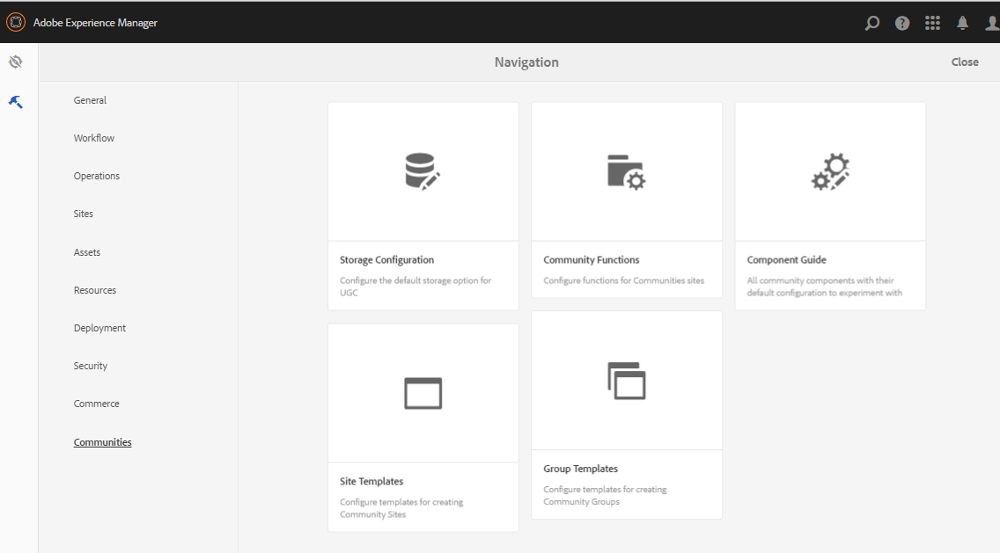

# Skapa en exempelsida {#create-a-sample-page}

>[!CAUTION]
>
>AEM 6.4 har nått slutet på den utökade supporten och denna dokumentation är inte längre uppdaterad. Mer information finns i [teknisk supportperiod](https://helpx.adobe.com/support/programs/eol-matrix.html). Hitta de versioner som stöds [här](https://experienceleague.adobe.com/docs/).

Från och med AEM 6.1 Communities är det enklaste sättet att skapa en exempelsida att skapa en enkel communitywebbplats som består av en sidfunktion.

Detta inkluderar en parsykomponent så att du kan [aktivera komponenter för utveckling](basics.md#accessing-communities-components).

Ett annat alternativ för att utforska exempelkomponenter är att använda funktionerna i [Community Components Guide](components-guide.md).

## Skapa en communitywebbplats {#create-a-community-site}

Det här liknar mycket att skapa en ny webbplats som beskrivs i [Komma igång med AEM Communities](getting-started.md).

Den största skillnaden är att den här självstudiekursen kommer att skapa en ny mall för en community-webbplats som bara innehåller [Sidfunktion](functions.md#page-function) för att skapa en enkel communitysajt som är fri från andra funktioner (andra än förkabelfunktioner som är grundläggande för alla communitysajter).

### Skapa ny platsmall {#create-new-site-template}

Skapa en enkel [mall för communitywebbplats](sites.md).

Från global navigering i en författarinstans väljer du **[!UICONTROL Tools > Communities > Site Templates]**.

* Välj `Create button`
* GRUNDLÄGGANDE INFORMATION

   * `Name`: Enkelsidig mall
   * `Description`: En mall som består av en enda sidfunktion.
   * välj `Enabled`

* STRUKTUR

   * Dra en `Page` funktionen till Template Builder
   * Ange information om konfigurationsfunktionen

      * `Title`: En sida
      * `URL`: page

* Välj **`Save`** för konfigurationen
* Välj **`Save`** för webbplatsmallen

### Skapa ny community-webbplats {#create-new-community-site}

Skapa nu en ny communitywebbplats som bygger på den enkla webbplatsmallen.

När du har skapat webbplatsmallen väljer du från global navigering **[!UICONTROL Communities > Sites]**.

* Välj **`Create`** icon

* Steg `1 - Site Template`

   * `Title`: Enkel communitywebbplats
   * `Description`: En communitywebbplats som består av en enda sida för experiment.
   * `Community Site Root: (leave blank)`
   * `Community Site Base Language: English`
   * `Name`: exempel

      * url = http://localhost:4502/content/sites/sample
   * `Template`: välj `Single Page Template`

* Välj `Next`
* Steg `2 - Design`

   * Välj en design

* Välj `Next`
* Välj `Next`

   (Acceptera alla standardinställningar)

* Välj `Create`

## Publicera webbplatsen {#publish-the-site}

Från [community sites console](sites-console.md), väljer du publiceringsikonen för att publicera webbplatsen, som standard http://localhost:4503.

## Öppna webbplatsen på författaren i redigeringsläge {#open-the-site-on-author-in-edit-mode}

Välj ikonen Öppna plats om du vill visa webbplatsen i redigeringsläge.

URL:en blir [http://localhost:4502/editor.html/content/sites/sample/en.html](http://localhost:4502/editor.html/content/sites/sample/en.html)

På den enkla startsidan är det möjligt att se vad som är förkopplat via communityfunktionerna och -mallarna, och att leka med att lägga till och konfigurera communitykomponenter.

## Visa webbplats vid publicering {#view-site-on-publish}

Öppna sidan på sidan när du har publicerat sidan [publiceringsinstans](http://localhost:4503/content/sites/sample/en.html) för att experimentera med funktionerna som anonym besökare, inloggad medlem eller administratör. Administrationslänken som visas i författarmiljön visas inte i publiceringsmiljön om inte en administratör loggar in.
